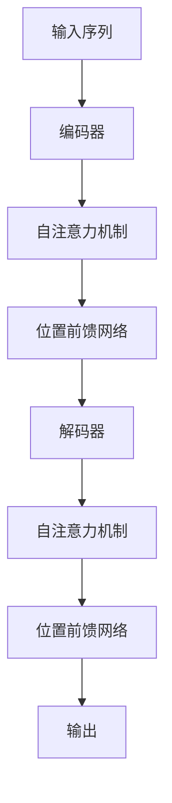
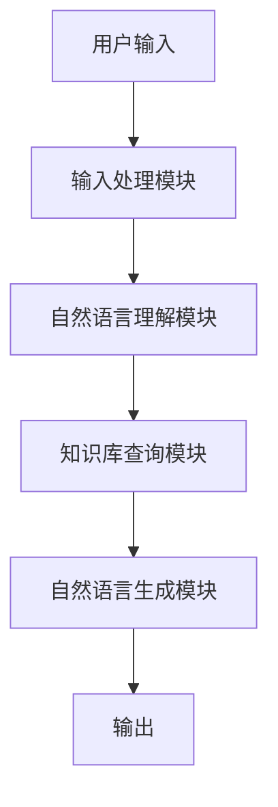
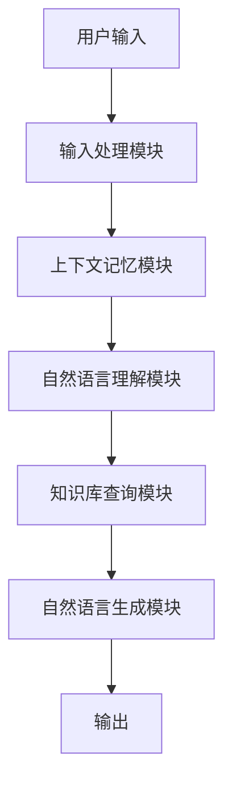

                 


# AI Agent的自然语言生成技术

---

## 关键词  
AI Agent, 自然语言生成, 人工智能, 机器学习, 深度学习, 对话系统

---

## 摘要  
本文详细探讨了AI Agent在自然语言生成技术中的应用，从核心概念到算法原理，再到系统设计与项目实战，全面分析了如何通过自然语言生成技术赋能AI Agent，使其能够更自然、更智能地与人类进行交互。文章结合实际案例，深入讲解了自然语言生成的关键算法、系统架构以及优化策略，为读者提供了一套完整的理论与实践指导。

---

## 第一部分: AI Agent与自然语言生成技术概述

### 第1章: AI Agent的背景与概念

#### 1.1 AI Agent的基本定义  
AI Agent（人工智能代理）是指能够感知环境并采取行动以实现目标的智能实体。它可以是一个软件程序，也可以是一个物理设备，通过与环境交互来完成特定任务。AI Agent的核心特征包括自主性、反应性、目标导向性和社交能力。  

| **AI Agent特征** | **具体描述** |
|--------------------|--------------|
| 自主性              | 能够独立决策和行动，无需外部干预。 |
| 反应性              | 能够感知环境并实时响应。 |
| 目标导向性          | 通过行动实现预设目标。 |
| 社交能力            | 能够与人类或其他系统进行交互。 |

#### 1.2 自然语言生成技术的基本概念  
自然语言生成（Natural Language Generation, NLG）是指将结构化数据转换为人类可读的自然语言文本的技术。它广泛应用于对话系统、内容生成、机器翻译等领域。自然语言生成的关键技术包括语言模型、文本生成算法和上下文理解。  

#### 1.3 AI Agent与自然语言生成的关系  
AI Agent通过自然语言生成技术实现与人类的自然交互。自然语言生成为AI Agent提供了生成文本的能力，使其能够以更自然的方式与用户沟通。两者的结合使得AI Agent在教育、客服、医疗等领域展现出强大的应用潜力。

---

### 第2章: 自然语言生成技术的核心原理  

#### 2.1 自然语言生成的流程  
自然语言生成的过程可以分为三个主要阶段：数据输入、模型处理和结果输出。  

- **数据输入**：包括结构化数据（如数据库中的记录）或非结构化数据（如用户输入的查询）。  
- **模型处理**：通过语言模型对输入数据进行理解和处理，生成中间表示。  
- **结果输出**：将中间表示转换为自然语言文本，并输出给用户。  

#### 2.2 自然语言生成的关键技术  
- **语言模型**：语言模型通过概率统计方法预测下一个词，常用模型包括n-gram模型和Transformer模型。  
- **文本生成算法**：包括基于规则的生成算法和基于深度学习的生成算法。  
- **上下文理解**：通过上下文感知模型（如BERT）理解文本的语境和意图。  

---

## 第二部分: 自然语言生成技术的核心算法与实现  

### 第5章: 自然语言生成的算法原理  

#### 5.1 传统生成算法  
传统生成算法主要基于规则和统计方法，虽然简单，但生成的文本缺乏多样性和自然性。  

- **基于模板的生成算法**：通过预定义模板生成文本，适用于简单的场景，如天气预报。  
- **基于规则的生成算法**：通过语法规则生成文本，适用于特定领域的文本生成。  

#### 5.2 现代生成算法  
现代生成算法主要基于深度学习技术，具有生成文本多样化、自然性强的特点。  

- **Transformer模型**：由Vaswesky等人提出，通过自注意力机制捕捉文本中的长距离依赖关系。  

**Transformer模型流程图（Mermaid）：**



**Python代码示例：**

```python
import tensorflow as tf
from tensorflow.keras.layers import Dense, Dropout, MultiHeadAttention

def transformer_model():
    inputs = tf.keras.Input(shape=(None, 100))
    attention = MultiHeadAttention(heads=8, dim_head=50)(inputs, inputs)
    attention_dropout = Dropout(0.1)(attention)
    dense_layer = Dense(50, activation='relu')(attention_dropout)
    outputs = Dropout(0.1)(dense_layer)
    return tf.keras.Model(inputs=inputs, outputs=outputs)

model = transformer_model()
model.summary()
```

---

### 第6章: 基于Transformer的自然语言生成模型  

#### 6.1 Transformer模型的数学公式  
Transformer模型的核心在于自注意力机制，其数学公式如下：  

$$
\text{Attention}(Q, K, V) = \text{softmax}\left(\frac{QK^T}{\sqrt{d_k}}\right)V
$$  

其中，$Q$、$K$、$V$分别是查询、键和值向量，$d_k$是键的维度。  

---

## 第三部分: AI Agent中的自然语言生成系统设计  

### 第7章: AI Agent对话系统的架构设计  

#### 7.1 对话系统的功能模块  
AI Agent对话系统通常包含以下功能模块：  

- **输入处理模块**：接收用户的输入并进行预处理。  
- **自然语言理解模块**：理解用户的意图和需求。  
- **知识库查询模块**：基于理解的结果查询相关知识。  
- **自然语言生成模块**：生成符合用户需求的回复。  

**AI Agent对话系统架构图（Mermaid）：**



---

### 第8章: 多轮对话系统的实现  

#### 8.1 多轮对话的特点  
多轮对话系统能够保持上下文的记忆，理解用户的意图，并根据历史对话内容生成连贯的回复。  

**多轮对话流程图（Mermaid）：**



---

## 第四部分: 项目实战与优化策略  

### 第9章: 智能客服对话系统的实现  

#### 9.1 项目背景  
智能客服对话系统是一种典型的AI Agent应用，能够为用户提供24/7的在线客服支持。  

#### 9.2 系统实现  
以下是智能客服对话系统的实现步骤：  

1. **环境搭建**：安装必要的库，如TensorFlow、Keras和Hugging Face的Transformers库。  
2. **数据准备**：收集和整理客服对话数据。  
3. **模型训练**：使用预训练的Transformer模型进行微调。  
4. **系统集成**：将模型集成到客服系统中，并进行测试和优化。  

**Python代码示例：**

```python
from transformers import TFGPT2LMHeadModel, GPT2Tokenizer

tokenizer = GPT2Tokenizer.from_pretrained('gpt2')
model = TFGPT2LMHeadModel.from_pretrained('gpt2')

def generate_response(prompt):
    inputs = tokenizer(prompt, return_tensors='tf')
    outputs = model.generate(inputs.input_ids, max_length=50, temperature=0.7)
    response = tokenizer.decode(outputs[0], skip_special_tokens=True)
    return response

print(generate_response("What is AI Agent?"))
```

---

### 第10章: 系统优化与扩展  

#### 10.1 系统优化策略  
- **提升模型的准确率**：通过增加训练数据和优化模型参数。  
- **优化对话流程**：引入领域知识库，提升对话的准确性和相关性。  

#### 10.2 系统扩展方向  
- **多语言支持**：扩展系统支持多种语言。  
- **情感分析**：结合情感分析技术，提升对话的温度感。  

---

## 第五部分: 总结与展望  

### 第11章: 总结与展望  

#### 11.1 总结  
本文详细探讨了AI Agent在自然语言生成技术中的应用，从算法原理到系统设计，再到项目实战，全面分析了如何通过自然语言生成技术赋能AI Agent。  

#### 11.2 展望  
随着深度学习技术的不断发展，AI Agent的自然语言生成技术将更加智能化和人性化。未来的研究方向包括多模态对话、实时推理和情感计算等。

---

## 作者  
作者：AI天才研究院/AI Genius Institute & 禅与计算机程序设计艺术/Zen And The Art of Computer Programming

