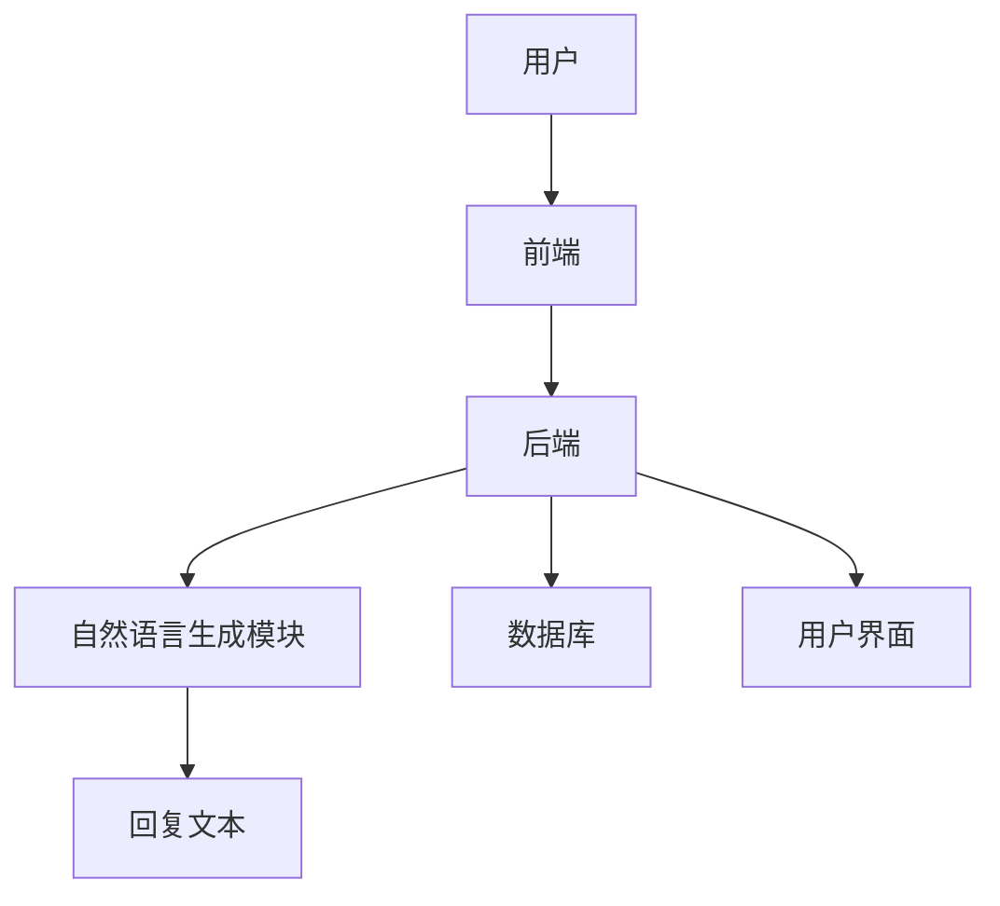

                 


# AI Agent的自然语言生成能力开发

> 关键词：AI Agent，自然语言生成，生成模型，深度学习，系统架构

> 摘要：本文系统性地探讨了AI Agent的自然语言生成能力开发的关键技术与实现方法。从AI Agent的基本概念到自然语言生成的核心算法，再到系统架构设计与项目实战，本文为读者提供了一条从理论到实践的学习路径。通过详细的技术分析和具体案例，本文旨在帮助读者深入理解AI Agent的自然语言生成能力，并掌握实际开发中的关键技能。

---

## 第一部分：AI Agent与自然语言生成的背景介绍

### 第1章：AI Agent的基本概念

#### 1.1 AI Agent的定义与类型

AI Agent（人工智能代理）是指能够感知环境、自主决策并执行任务的智能实体。它可以是一个软件程序、一个机器人，甚至是嵌入在设备中的智能模块。AI Agent的核心目标是通过感知和行动，帮助人类完成复杂任务或提供智能化服务。

- **定义**：AI Agent是一种能够感知环境、自主决策、执行任务的智能系统。
- **类型**：
  - **反应式AI Agent**：基于当前环境输入做出实时反应，不具备记忆能力。
  - **认知式AI Agent**：具备记忆、推理和规划能力，能够根据历史信息做出决策。
  - **协作式AI Agent**：能够与其他AI Agent或人类进行协作，完成复杂任务。
- **核心特征**：
  - **自主性**：能够在没有外部干预的情况下独立运行。
  - **反应性**：能够根据环境变化实时调整行为。
  - **目标导向性**：通过设定目标来驱动决策和行动。

---

#### 1.2 自然语言生成的背景与重要性

自然语言生成（Natural Language Generation, NLG）是人工智能领域的重要技术，旨在让计算机能够生成符合人类语言习惯的文本。随着深度学习技术的快速发展，NLG在聊天机器人、智能客服、内容生成等领域得到了广泛应用。

- **定义**：自然语言生成是指将结构化数据或信息转化为自然语言文本的过程。
- **应用场景**：
  - 聊天机器人：通过自然语言生成与用户进行对话。
  - 智能客服：生成回复文本解决用户问题。
  - 内容生成：自动生成新闻、摘要等文本。
- **重要性**：
  - 提升人机交互的自然性。
  - 降低人工内容生成的成本。
  - 扩展AI Agent的应用场景。

---

#### 1.3 AI Agent与自然语言生成的结合

AI Agent的自然语言生成能力使其能够更贴近人类的交流方式，从而提升用户体验和任务执行效率。

- **AI Agent需要自然语言生成的原因**：
  - 提供更自然的交互方式。
  - 增强用户信任感。
  - 提高任务执行的效率。
- **自然语言生成在AI Agent中的作用**：
  - 提供个性化的回复。
  - 支持多轮对话。
  - 实现复杂任务的分解与执行。

---

## 第二部分：AI Agent自然语言生成的核心概念与联系

### 第2章：AI Agent自然语言生成的核心概念

#### 2.1 AI Agent的自然语言生成能力

AI Agent的自然语言生成能力是指其能够根据输入的信息生成符合语法规则和语义逻辑的自然语言文本的能力。

- **输入输出模型**：
  - 输入：结构化数据、关键词、用户意图。
  - 输出：自然语言文本。
- **关键技术**：
  - 语言模型：用于生成符合语法规则的文本。
  - 对话管理：用于处理多轮对话中的上下文关系。
  - 文本优化：用于提升生成文本的可读性和准确性。
- **评估指标**：
  - **准确性**：生成文本是否符合语义逻辑。
  - **流畅性**：生成文本是否自然流畅。
  - **相关性**：生成文本是否与输入信息相关。

---

#### 2.2 自然语言生成的算法原理

自然语言生成的算法经历了从基于规则到基于统计，再到基于深度学习的转变。当前主流的生成模型主要基于Transformer架构。

- **生成模型的分类**：
  - **基于规则的生成方法**：通过预定义的语法规则生成文本。
  - **基于统计的生成方法**：通过概率模型生成文本。
  - **基于深度学习的生成方法**：通过神经网络生成文本。
- **基于Transformer的生成模型**：
  - **编码器**：将输入序列编码为固定长度的向量。
  - **解码器**：根据编码器的输出生成目标序列。
  - **注意力机制**：在解码过程中引入注意力机制，提升生成文本的质量。

---

## 第三部分：AI Agent自然语言生成的算法原理

### 第3章：自然语言生成的算法原理

#### 3.1 基于Transformer的生成模型

基于Transformer的生成模型在自然语言生成领域取得了突破性进展。其核心思想是通过自注意力机制捕捉输入序列中的全局关系，并通过解码器生成目标序列。

- **基本结构**：
  - **编码器**：由多个自注意力层组成，用于捕获输入序列中的长距离依赖关系。
  - **解码器**：由自注意力层和交叉注意力层组成，用于生成目标序列。
  - **全连接层**：用于对编码器和解码器的输出进行线性变换。
- **自注意力机制**：
  - 通过计算输入序列中每个位置的查询、键和值向量，生成注意力权重。
  - 根据注意力权重对输入序列进行加权求和，得到最终的表示向量。
- **解码过程**：
  - 从解码器的初始位置开始，逐步生成目标序列的每个位置。
  - 在每一步生成一个词，直到生成完整的序列。

---

### 3.2 Transformer模型的代码实现

以下是基于Transformer模型的自然语言生成代码示例：

```python
import torch
import torch.nn as nn
import torch.nn.functional as F

class TransformerModel(nn.Module):
    def __init__(self, d_model=512, nhead=8, num_encoder_layers=3, num_decoder_layers=3):
        super(TransformerModel, self).__init__()
        self.encoder = nn.TransformerEncoder(
            nn.Embedding(d_model, d_model),
            num_encoder_layers,
            nn.MultiheadAttention(nhead, d_model//nhead)
        )
        self.decoder = nn.TransformerDecoder(
            nn.Embedding(d_model, d_model),
            num_decoder_layers,
            nn.MultiheadAttention(nhead, d_model//nhead)
        )

    def forward(self, src, tgt):
        encoded = self.encoder(src)
        decoded = self.decoder(tgt, encoded)
        return decoded
```

---

#### 3.3 注意力机制的作用

注意力机制通过计算输入序列中每个位置的权重，能够更好地捕捉输入序列中的关键信息。

- **注意力权重的计算**：
  - 通过查询（query）、键（key）、值（value）向量的点积计算注意力权重。
  - 使用Softmax函数对权重进行归一化处理。
- **注意力权重的应用**：
  - 根据注意力权重对值向量进行加权求和，得到最终的表示向量。

---

## 第四部分：AI Agent自然语言生成的系统分析与架构设计

### 第4章：系统分析与架构设计方案

#### 4.1 项目背景

本项目旨在开发一个具备自然语言生成能力的AI Agent，用于智能客服系统。通过自然语言生成技术，AI Agent能够自动回复用户的问题，提升用户体验。

- **项目目标**：
  - 实现AI Agent的自然语言生成能力。
  - 提供高效的用户交互体验。
  - 支持多轮对话功能。

---

#### 4.2 系统功能设计

- **领域模型设计**：
  - **用户输入**：用户的查询或请求。
  - **意图识别**：识别用户的意图。
  - **生成回复**：根据意图生成回复文本。
  - **交互历史**：记录用户的多轮对话历史。

- **系统架构设计**：
  - **前端**：用户与AI Agent的交互界面。
  - **后端**：AI Agent的核心逻辑和自然语言生成模块。
  - **数据库**：存储用户信息和对话历史。

---

#### 4.3 系统架构图

以下是一个简单的系统架构图：



---

## 第五部分：AI Agent自然语言生成的项目实战

### 第5章：项目实战

#### 5.1 环境安装

以下是一个简单的项目环境安装示例：

```bash
pip install torch transformers
```

---

#### 5.2 代码实现

以下是AI Agent自然语言生成模块的代码实现：

```python
from transformers import AutoTokenizer, AutoModelForSeq2Seq
import torch

tokenizer = AutoTokenizer.from_pretrained("t5-base")
model = AutoModelForSeq2Seq.from_pretrained("t5-base")

def generate_response(input_text):
    inputs = tokenizer(input_text, return_tensors="pt")
    outputs = model.generate(inputs["input_ids"], max_length=50)
    response = tokenizer.decode(outputs[0], skip_special_tokens=True)
    return response
```

---

#### 5.3 代码解读与分析

- **输入处理**：
  - 使用Tokenizer对输入文本进行编码。
- **模型推理**：
  - 使用预训练的T5模型生成回复文本。
- **输出处理**：
  - 使用Tokenizer对生成的文本进行解码，得到最终的回复文本。

---

## 第六部分：总结与展望

### 第6章：总结与展望

#### 6.1 本章总结

本文系统性地探讨了AI Agent的自然语言生成能力开发的关键技术与实现方法。从AI Agent的基本概念到自然语言生成的核心算法，再到系统架构设计与项目实战，本文为读者提供了一条从理论到实践的学习路径。

---

#### 6.2 最佳实践 tips

- 在实际开发中，建议使用预训练的生成模型，如GPT、T5等。
- 在多轮对话中，需要记录用户的交互历史，以提升生成回复的相关性。
- 在实际应用中，需要根据具体场景调整生成模型的超参数。

---

#### 6.3 未来展望

随着深度学习技术的不断发展，AI Agent的自然语言生成能力将更加智能化和个性化。未来的研究方向包括：

- 更高效的生成算法。
- 更准确的意图识别。
- 更个性化的回复生成。

---

作者：AI天才研究院/AI Genius Institute & 禅与计算机程序设计艺术 /Zen And The Art of Computer Programming

