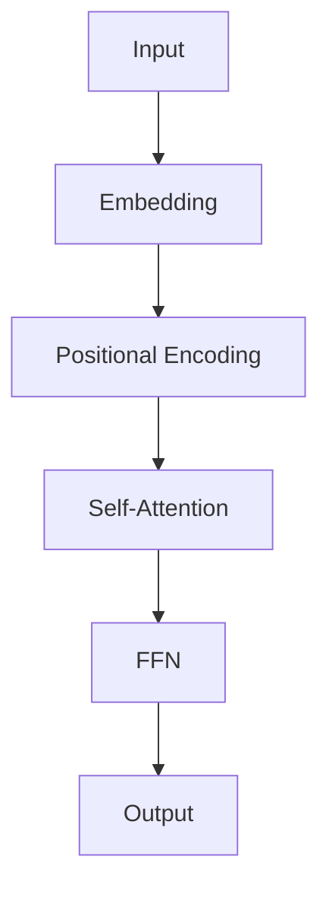
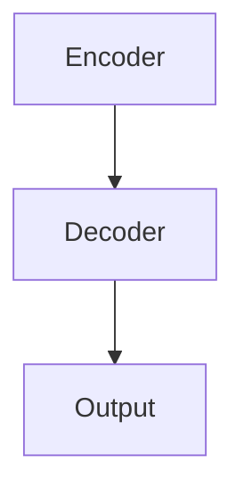
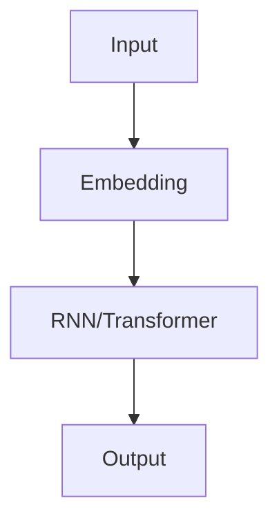
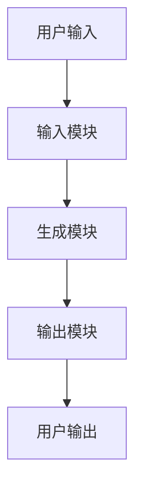
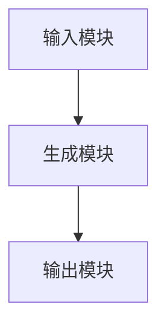

                 

# AI Agent的自然语言生成（NLG）技术应用

> 关键词：AI Agent，自然语言生成，生成模型，深度学习，自然语言处理，机器学习，对话系统

> 摘要：自然语言生成（NLG）作为人工智能（AI）领域的重要技术，是实现AI Agent与人类交互的核心能力之一。本文从AI Agent的基本概念出发，详细探讨了NLG的核心技术、主流模型及其在AI Agent中的应用。通过分析生成模型的原理、优化策略以及质量评估方法，本文为读者提供了系统化的知识体系，帮助读者全面理解AI Agent的自然语言生成技术。

---

# 第1章: AI Agent与自然语言生成（NLG）概述

## 1.1 AI Agent的基本概念

### 1.1.1 AI Agent的定义

AI Agent（人工智能代理）是指能够感知环境、自主决策并执行任务的智能体。AI Agent具备以下核心特征：

1. **自主性**：能够在没有外部干预的情况下独立运行。
2. **反应性**：能够感知环境并实时调整行为。
3. **目标导向**：基于目标驱动行为，优化决策过程。
4. **社交能力**：能够与其他AI Agent或人类进行交互。

### 1.1.2 AI Agent的核心特征

AI Agent的核心特征包括：

- **环境感知**：通过传感器或数据输入感知外部环境。
- **目标驱动**：基于设定的目标进行决策和行动。
- **自主决策**：能够在复杂环境中自主选择最优策略。
- **人机交互**：通过自然语言处理技术与人类进行有效沟通。

### 1.1.3 AI Agent的应用场景

AI Agent广泛应用于多个领域：

- **智能家居**：通过与用户的对话交互，实现家电控制。
- **智能助手**：如Siri、Alexa等，帮助用户完成日常任务。
- **智能客服**：通过自然语言处理技术，提供高效的客户服务。
- **自动驾驶**：通过环境感知和决策系统，实现自动驾驶功能。

## 1.2 自然语言生成（NLG）的基本概念

### 1.2.1 自然语言生成的定义

自然语言生成（NLG）是指将结构化数据（如数据库中的信息）转换为自然语言文本的过程。NLG的核心目标是让计算机能够生成与人类语言习惯相符的文本。

### 1.2.2 自然语言生成的关键技术

NLG的关键技术包括：

- **文本规划**：确定生成文本的内容和结构。
- **句法生成**：生成符合语法的句子。
- **文本优化**：优化生成文本的流畅性和可读性。

### 1.2.3 自然语言生成的应用领域

NLG技术广泛应用于以下领域：

- **机器翻译**：将一种语言翻译成另一种语言。
- **对话系统**：实现人机对话的自然语言生成。
- **文本摘要**：从长文本中提取关键信息并生成摘要。
- **内容生成**：自动生成新闻、文章等文本内容。

## 1.3 AI Agent与自然语言生成的结合

### 1.3.1 AI Agent中自然语言生成的作用

在AI Agent中，NLG技术主要用于实现人机交互中的自然语言输出。例如，智能助手通过NLG技术生成自然语言回应用户的问题。

### 1.3.2 自然语言生成在AI Agent中的优势

- **提升用户体验**：通过生成自然流畅的文本，增强用户与AI Agent的交互体验。
- **增强智能性**：通过NLG技术，AI Agent能够更好地理解用户需求并生成相应的回应。
- **灵活性与可扩展性**：NLG技术使得AI Agent能够适应不同的语言和文化背景。

### 1.3.3 自然语言生成的挑战与未来方向

NLG技术在AI Agent中的应用面临以下挑战：

- **生成文本的质量控制**：如何生成高质量、符合语境的文本是NLG技术的核心挑战。
- **多语言支持**：实现多语言自然语言生成需要克服语言间的差异和文化差异。
- **实时性与效率**：在实时交互场景中，如何保证生成速度和质量是一个重要问题。

未来，随着深度学习和大语言模型的发展，NLG技术在AI Agent中的应用将更加广泛和智能。

## 1.4 本章小结

本章从AI Agent的基本概念出发，介绍了自然语言生成（NLG）的核心概念及其在AI Agent中的应用。通过分析AI Agent与NLG的关系，明确了NLG在AI Agent中的重要性及其面临的挑战。接下来的章节将详细探讨NLG的核心技术和主流模型。

---

# 第2章: 自然语言生成（NLG）的核心技术

## 2.1 生成模型的基本原理

### 2.1.1 生成模型的分类

生成模型主要分为以下几类：

- **基于规则的生成模型**：通过预定义的语法规则生成文本。
- **基于统计的生成模型**：基于数据分布概率生成文本。
- **基于深度学习的生成模型**：利用神经网络结构生成文本。

### 2.1.2 基于规则的生成方法

基于规则的生成方法通过预定义的语法规则生成文本。其优点是生成文本的准确性较高，但缺点是难以处理复杂语境和语义理解。

### 2.1.3 基于统计模型与深度学习模型的对比

| 特性               | 基于统计模型          | 基于深度学习模型        |
|--------------------|-----------------------|-------------------------|
| 数据需求           | 需要大量标注数据      | 需要大量未标注数据      |
| 计算复杂度         | 较低                  | 较高                    |
| 生成效果           | 较差                  | 更优                    |
| 应用场景           | 适用于简单任务        | 适用于复杂任务          |

---

## 2.2 变体模型与优化策略

### 2.2.1 基于Transformer的生成模型

基于Transformer的生成模型通过自注意力机制捕捉文本中的长距离依赖关系，从而生成更自然的文本。

#### 使用Mermaid绘制Transformer结构图

### 2.2.2 解码器与编码器的结合

解码器与编码器的结合是基于Transformer的生成模型的核心结构。编码器负责将输入文本编码为上下文表示，解码器基于编码结果生成输出文本。

#### 使用Mermaid绘制解码器与编码器结合图

### 2.2.3 模型的调优与优化

模型的调优与优化是提升生成质量的关键。常用的技术包括：

- **学习率调整**：通过调整学习率优化模型收敛速度。
- **正则化技术**：如Dropout，防止模型过拟合。
- **多任务学习**：通过多任务训练提升模型的泛化能力。

#### 生成模型的数学公式示例

生成模型的损失函数通常采用交叉熵损失函数：

$$ L = -\frac{1}{N}\sum_{i=1}^{N} \sum_{j=1}^{M} y_{i,j} \log(p(y_{i,j}|x_i)) $$

其中，$N$是训练样本的数量，$M$是每个样本的词数，$y_{i,j}$是目标概率分布，$p(y_{i,j}|x_i)$是模型生成的概率。

---

## 2.3 自然语言生成的质量评估

### 2.3.1 生成文本的质量评估指标

生成文本的质量评估指标包括：

- **BLEU**：基于n-gram的精确率。
- **ROUGE**：基于召回率的评估指标。
- **METEOR**：综合考虑生成文本的流畅性和准确性。

### 2.3.2 基于人工评估的方法

人工评估是评估生成质量的重要方法，但成本较高，适用于小规模评估。

### 2.3.3 基于自动评估的方法

自动评估方法通过数学公式计算生成文本与参考文本的相似度，如BLEU、ROUGE等。

---

## 2.4 本章小结

本章详细介绍了生成模型的基本原理、变体模型与优化策略，以及自然语言生成的质量评估方法。通过对比不同模型的优缺点，明确了基于深度学习的生成模型在NLG中的优势。接下来的章节将探讨NLG的主流模型及其在AI Agent中的应用。

---

# 第3章: 自然语言生成（NLG）的主流模型

## 3.1 基于规则的生成模型

### 3.1.1 基于规则的生成模型的优缺点

基于规则的生成模型的优缺点如下：

| 优点               | 缺点               |
|--------------------|-------------------|
| 简单易实现           | 难以处理复杂语境     |
| 生成结果准确           | 缺乏灵活性           |

### 3.1.2 基于规则的生成模型的实现原理

基于规则的生成模型通过预定义的语法规则生成文本。例如，生成一个简单的句子“猫坐在沙发上”，模型会根据规则选择适当的词汇和句式。

## 3.2 基于统计的生成模型

### 3.2.1 统计模型的基本原理

基于统计的生成模型通过计算词语之间的概率分布生成文本。例如，计算每个词语在特定上下文中出现的概率，生成最可能的句子。

### 3.2.2 基于统计模型的生成过程

基于统计模型的生成过程包括以下步骤：

1. **训练数据准备**：收集和标注训练数据。
2. **模型训练**：基于训练数据计算词语的概率分布。
3. **文本生成**：根据概率分布生成文本。

## 3.3 基于深度学习的生成模型

### 3.3.1 基于深度学习的生成模型的实现原理

基于深度学习的生成模型利用神经网络结构生成文本。例如，使用循环神经网络（RNN）或Transformer模型生成文本。

#### 使用Mermaid绘制基于深度学习的生成模型图

### 3.3.2 基于深度学习的生成模型的优缺点

| 优点               | 缺点               |
|--------------------|-------------------|
| 生成质量高           | 计算资源消耗大     |
| 处理复杂语境能力强     | 需要大量训练数据     |

---

## 3.4 本章小结

本章介绍了自然语言生成的主流模型，包括基于规则的生成模型、基于统计的生成模型和基于深度学习的生成模型。通过对比不同模型的优缺点，明确了基于深度学习的生成模型在NLG中的优势。接下来的章节将探讨AI Agent的自然语言生成技术在实际项目中的应用。

---

# 第4章: AI Agent的自然语言生成技术应用

## 4.1 项目背景与目标

### 4.1.1 项目背景

随着AI技术的发展，AI Agent在各个领域的应用越来越广泛。自然语言生成技术是实现AI Agent与人类交互的核心技术之一。

### 4.1.2 项目目标

本项目旨在开发一个基于AI Agent的自然语言生成系统，实现与用户的自然语言交互。

## 4.2 系统功能设计

### 4.2.1 系统功能模块

系统功能模块包括：

- **输入模块**：接收用户的输入。
- **生成模块**：基于输入生成自然语言文本。
- **输出模块**：将生成的文本输出给用户。

### 4.2.2 系统功能流程图

## 4.3 系统架构设计

### 4.3.1 系统架构图

## 4.4 本章小结

本章通过一个具体的项目案例，详细介绍了AI Agent自然语言生成技术的应用。通过系统功能设计和架构设计，明确了生成模型在实际项目中的重要性。

---

# 第5章: 自然语言生成技术的优化与未来展望

## 5.1 生成模型的优化策略

### 5.1.1 模型调优

通过调整模型参数和优化算法提升生成质量。

### 5.1.2 多语言支持

通过多语言模型实现对多种语言的支持。

## 5.2 生成技术的未来方向

### 5.2.1 大语言模型的应用

随着大语言模型的发展，生成技术将更加智能化和多样化。

### 5.2.2 实时生成技术的发展

未来，实时生成技术将更加重要，应用场景包括实时聊天和实时翻译等。

## 5.3 本章小结

本章从生成模型的优化策略出发，探讨了自然语言生成技术的未来发展方向。通过分析大语言模型和实时生成技术，明确了生成技术在AI Agent中的重要性。

---

# 第6章: 总结与展望

## 6.1 本章总结

本文从AI Agent的基本概念出发，详细探讨了自然语言生成技术的核心技术和主流模型。通过分析生成模型的原理和优化策略，明确了生成技术在AI Agent中的重要性。

## 6.2 未来展望

未来，随着深度学习和大语言模型的发展，自然语言生成技术在AI Agent中的应用将更加广泛和智能。生成技术将更加注重生成质量、实时性和多语言支持。

---

# 作者：AI天才研究院 & 禅与计算机程序设计艺术

---

以上是完整的文章目录结构，具体内容可根据需要进一步扩展和详细阐述每个部分。

