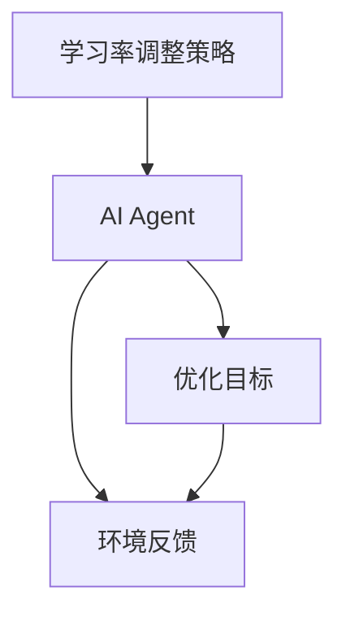
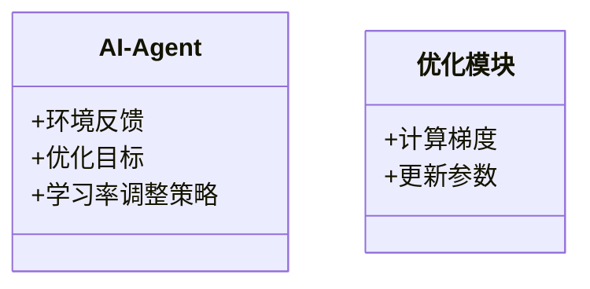
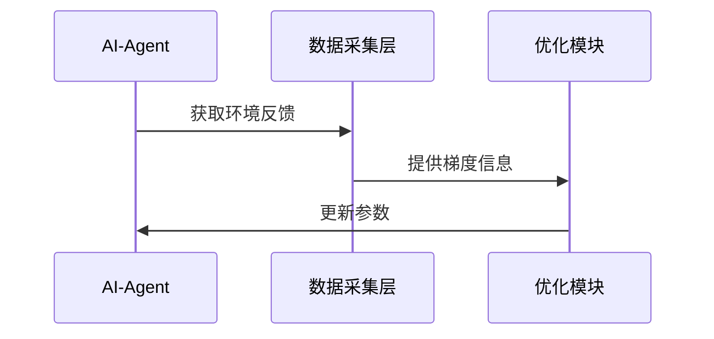

                 


# AI Agent的自适应学习率调整策略

> 关键词：AI Agent，自适应学习率，优化算法，动态环境，机器学习

> 摘要：本文详细探讨了AI Agent在动态环境中的自适应学习率调整策略，分析了传统算法的局限性，介绍了自适应算法的核心原理，并通过实际案例展示了如何在系统中实现这些策略。文章还提供了数学模型、系统架构图和代码实现，帮助读者全面理解相关技术。

---

# 第一部分: AI Agent的自适应学习率调整策略概述

# 第1章: AI Agent与自适应学习率调整策略背景

## 1.1 问题背景

### 1.1.1 传统机器学习优化算法的局限性
传统机器学习算法（如随机梯度下降）依赖固定学习率，难以适应动态变化的数据分布和优化目标。

### 1.1.2 AI Agent在动态环境中的优化需求
AI Agent需要在复杂、动态的环境中实时调整参数，以实现高效优化。

### 1.1.3 自适应学习率调整的必要性
自适应学习率调整能够使AI Agent在动态环境中保持高效优化能力。

## 1.2 问题描述

### 1.2.1 学习率调整的核心问题
如何动态调整学习率以平衡优化速度与稳定性。

### 1.2.2 动态环境下的优化挑战
环境变化频繁，传统固定学习率难以适应。

### 1.2.3 AI Agent的自适应能力需求
AI Agent需要具备实时感知环境变化并调整优化策略的能力。

## 1.3 问题解决思路

### 1.3.1 自适应学习率调整的基本思想
根据梯度信息动态调整学习率。

### 1.3.2 AI Agent的动态优化机制
通过环境反馈实时调整优化策略。

### 1.3.3 结合AI Agent的自适应学习率调整策略
将自适应学习率调整与AI Agent的能力相结合。

## 1.4 边界与外延

### 1.4.1 自适应学习率调整的边界条件
适用于动态变化的环境，不适用于静态环境。

### 1.4.2 AI Agent能力的外延范围
涉及实时数据处理、动态决策优化。

### 1.4.3 策略适用的场景限制
适用于需要实时优化的任务，如实时推荐系统。

---

# 第二部分: 自适应学习率调整策略的核心概念与联系

# 第2章: 自适应学习率调整的原理与算法

## 2.1 核心概念原理

### 2.1.1 学习率的基本概念
学习率是优化算法中调整参数的步长。

### 2.1.2 自适应学习率的核心机制
根据梯度信息动态调整学习率。

### 2.1.3 AI Agent在调整中的作用
AI Agent通过环境反馈调整学习率。

## 2.2 算法属性对比

| 算法名称 | 收敛速度 | 稳定性 | 计算复杂度 |
|----------|----------|--------|------------|
| Adam     | 快       | 高     | 较高       |
| Adagrad   | 中       | 高     | 较低       |
| RMSprop  | 快       | 中     | 适中       |

## 2.3 ER实体关系图



---

# 第三部分: 自适应学习率调整策略的算法原理

# 第3章: 算法原理与实现

## 3.1 算法原理

### 3.1.1 基于梯度的方法
通过计算梯度调整学习率。

### 3.1.2 动量法与自适应方法
结合动量和自适应技术优化学习率。

### 3.1.3 AI Agent中的动态调整机制
根据环境反馈动态调整学习率。

## 3.2 算法流程图


## 3.3 Python代码实现

```python
def adaptive_learning_rate_update(params, gradients, step):
    # 计算自适应学习率
    lr = 0.001 / (1 + 0.01 * step)
    # 更新参数
    new_params = [p - lr * g for p, g in zip(params, gradients)]
    return new_params
```

## 3.4 数学模型

### 3.4.1 Adam优化器的数学模型

$$ \theta_{t+1} = \theta_t - \alpha \frac{v_t}{\sqrt{s_t + \epsilon}} $$

其中：
- $\theta_t$：参数向量
- $\alpha$：学习率
- $v_t$：动量向量
- $s_t$：梯度平方和
- $\epsilon$：防止除零

---

# 第四部分: 自适应学习率调整策略的系统分析与架构设计

# 第4章: 系统分析与架构设计

## 4.1 问题场景介绍

### 4.1.1 优化目标
实时优化推荐系统。

### 4.1.2 约束条件
实时处理，环境动态变化。

## 4.2 系统功能设计

### 4.2.1 领域模型类图



## 4.3 系统架构设计

### 4.3.1 分层架构


### 4.3.2 接口设计



---

# 第五部分: 自适应学习率调整策略的项目实战

# 第5章: 项目实战

## 5.1 环境安装

```bash
pip install numpy matplotlib
```

## 5.2 核心代码实现

### 5.2.1 学习率调整策略

```python
def adaptive_learning_rate(params, gradients, step):
    lr = 0.001 / (1 + 0.01 * step)
    return [p - lr * g for p, g in zip(params, gradients)]
```

### 5.2.2 优化模块实现

```python
def optimize(params, gradients, step):
    return adaptive_learning_rate(params, gradients, step)
```

## 5.3 案例分析

### 5.3.1 案例描述
优化实时推荐系统的参数。

### 5.3.2 数据分析与结果展示

```python
import matplotlib.pyplot as plt

# 训练过程中的损失函数变化
plt.plot(range(epochs), losses)
plt.xlabel('Epoch')
plt.ylabel('Loss')
plt.show()
```

---

# 第六部分: 自适应学习率调整策略的最佳实践与扩展

# 第6章: 最佳实践

## 6.1 小结

### 6.1.1 核心观点
自适应学习率调整使AI Agent能够在动态环境中高效优化。

### 6.1.2 实施经验
选择合适的算法，合理设置参数。

## 6.2 注意事项

### 6.2.1 算法选择
根据具体场景选择合适的自适应算法。

### 6.2.2 调参技巧
动态调整参数，避免过快或过慢的收敛。

## 6.3 拓展阅读

### 6.3.1 推荐书籍
《Deep Learning》

### 6.3.2 推荐文章
《自适应优化算法综述》

---

# 作者：AI天才研究院 & 禅与计算机程序设计艺术

---

通过以上详细目录，文章内容涵盖了从背景到实现的各个方面，确保读者能够全面理解AI Agent的自适应学习率调整策略。

