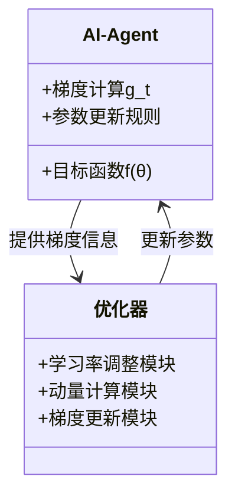
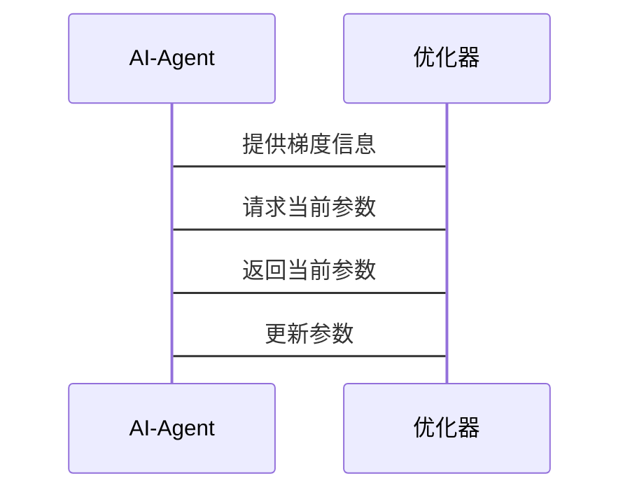

                 


# AI Agent的自适应学习率：优化训练过程

> 关键词：AI Agent, 自适应学习率, 优化训练过程, Adam优化器, 机器学习, 深度学习

> 摘要：本文详细探讨了AI Agent在训练过程中如何通过自适应学习率优化训练过程。从自适应学习率的基本概念、数学模型、算法实现到系统架构设计，全面解析了自适应学习率在AI Agent训练中的重要性及其优化效果。文章结合实际案例，深入分析了自适应学习率的优势、挑战及解决方案，并提供了具体的实现步骤和代码示例。

---

## 第一部分: AI Agent的自适应学习率背景介绍

### 第1章: AI Agent与自适应学习率概述

#### 1.1 AI Agent的基本概念
##### 1.1.1 AI Agent的定义
AI Agent（人工智能代理）是指能够感知环境、自主决策并执行任务的智能实体。它可以是一个软件程序、机器人或其他智能系统，核心目标是通过与环境交互来实现特定目标。

##### 1.1.2 AI Agent的核心特征
- **自主性**：能够在没有外部干预的情况下自主决策。
- **反应性**：能够感知环境并实时调整行为。
- **目标导向**：所有行为都围绕实现特定目标展开。
- **学习能力**：能够通过经验改进性能。

##### 1.1.3 AI Agent的应用场景
- **自动驾驶**：实时感知环境并做出驾驶决策。
- **智能助手**：如Siri、Alexa，通过用户交互提供服务。
- **游戏AI**：在电子游戏中做出实时决策。
- **推荐系统**：根据用户行为推荐个性化内容。

#### 1.2 自适应学习率的背景
##### 1.2.1 传统学习率的局限性
在传统的机器学习训练中，学习率是一个固定的超参数，需要手动调整。然而，固定学习率在不同训练阶段可能表现不佳：
- **初期训练**：需要较大的学习率快速收敛。
- **后期训练**：需要较小的学习率避免震荡。

##### 1.2.2 自适应学习率的提出
自适应学习率是一种动态调整学习率的方法，能够根据训练过程中的梯度信息自动调整，避免手动调节的复杂性。

##### 1.2.3 自适应学习率的优势
- **自动调整**：无需手动设置，适应不同训练阶段的需求。
- **加快收敛**：通过动态调整，加速模型收敛，减少训练时间。
- **提高精度**：能够在不同梯度情况下保持较好的优化效果。

#### 1.3 AI Agent训练过程中的优化问题
##### 1.3.1 优化问题的定义
在AI Agent的训练过程中，优化问题是指如何调整模型参数，以最小化损失函数，实现最佳性能。

##### 1.3.2 自适应学习率在优化中的作用
自适应学习率通过动态调整学习率，帮助优化算法更快收敛，提高训练效率。

##### 1.3.3 优化过程中的挑战与解决方案
- **挑战**：梯度消失或爆炸、参数空间复杂。
- **解决方案**：采用自适应优化算法，如Adam优化器，结合动量和自适应学习率。

---

### 第2章: 自适应学习率的核心概念

#### 2.1 自适应学习率的原理
##### 2.1.1 学习率的基本概念
学习率α是优化算法中用于更新参数的步长。公式表示为：
$$ \text{更新规则} = \alpha \cdot \text{梯度} $$

##### 2.1.2 自适应学习率的调整机制
自适应学习率通过分析梯度信息动态调整α，常用方法包括：
1. **动量法**：利用历史梯度信息加速收敛。
2. **自适应矩估计（如Adam）**：结合梯度的二阶矩估计动态调整学习率。

##### 2.1.3 自适应学习率与优化算法的关系
自适应学习率是优化算法的核心组成部分，优化算法通过调整学习率来优化模型参数。

#### 2.2 自适应学习率的核心要素
##### 2.2.1 学习率调整的触发条件
- **梯度大小**：当梯度较大时，适当减小学习率以避免跳跃；梯度较小时，适当增大学习率以加快收敛。
- **训练阶段**：根据训练的不同阶段调整学习率，如从高到低。

##### 2.2.2 自适应调整的数学模型
自适应学习率的数学模型通常包括以下几个部分：
1. 梯度的一阶矩估计：
$$ \hat{g}_t = \beta_1 \hat{g}_{t-1} + (1 - \beta_1)g_t $$
2. 梯度的二阶矩估计：
$$ \hat{s}_t = \beta_2 \hat{s}_{t-1} + (1 - \beta_2)g_t^2 $$
3. 自适应学习率更新：
$$ \alpha_t = \frac{\epsilon}{\sqrt{\hat{s}_t} + \epsilon} $$

##### 2.2.3 自适应学习率的实现方式
自适应学习率的实现方式包括：
1. 基于动量的优化器（如Adam、AdaGrad）。
2. 基于二阶矩的优化器（如RMSprop）。

#### 2.3 自适应学习率的边界与外延
##### 2.3.1 自适应学习率的适用范围
自适应学习率适用于大多数深度学习任务，尤其是当数据分布复杂或梯度变化较大时。

##### 2.3.2 自适应学习率的限制与不足
- **计算开销**：引入额外的计算步骤，增加了训练时间。
- **参数选择**：需要设置适当的超参数（如β1、β2）。

##### 2.3.3 自适应学习率与其他优化技术的结合
自适应学习率可以与正则化、批量归一化等技术结合，进一步提升模型性能。

---

## 第二部分: 自适应学习率的数学模型与公式

### 第3章: 自适应学习率的数学模型与公式

#### 3.1 自适应学习率的基本公式
##### 3.1.1 学习率的基本公式
$$ \alpha = \frac{1}{\eta + t/\tau} $$
其中，η是初始学习率，t是训练步数，τ是衰减常数。

##### 3.1.2 自适应学习率的调整公式
$$ \alpha_t = \alpha \cdot \frac{\sqrt{1 + \beta t}}{1 + \beta t} $$
其中，β是调整系数。

#### 3.2 基于Adam优化器的自适应学习率
##### 3.2.1 Adam优化器的基本公式
$$ m_t = \beta_1 m_{t-1} + (1 - \beta_1)g_t $$
$$ s_t = \beta_2 s_{t-1} + (1 - \beta_2)g_t^2 $$
$$ \alpha_t = \frac{\epsilon}{\sqrt{s_t} + \epsilon} $$

##### 3.2.2 Adam优化器的实现步骤
1. 初始化参数：
   - β1 = 0.9，β2 = 0.999，ε = 1e-7。
2. 计算梯度：
   - 计算当前步的梯度g_t。
3. 更新一阶矩估计：
   $$ m_t = \beta_1 m_{t-1} + (1 - \beta_1)g_t $$
4. 更新二阶矩估计：
   $$ s_t = \beta_2 s_{t-1} + (1 - \beta_2)g_t^2 $$
5. 自适应学习率调整：
   $$ \alpha_t = \frac{\epsilon}{\sqrt{s_t} + \epsilon} $$
6. 更新参数：
   $$ \theta_t = \theta_{t-1} - \alpha_t m_t $$

---

## 第三部分: 自适应学习率的系统分析与架构设计

### 第4章: 系统分析与架构设计方案

#### 4.1 问题场景介绍
在深度学习模型训练中，自适应学习率能够动态调整学习率，避免手动调节的复杂性，提升训练效率。

#### 4.2 系统功能设计
##### 4.2.1 领域模型设计
使用Mermaid类图展示系统功能模块：



##### 4.2.2 系统架构设计
使用Mermaid架构图展示系统架构：


#### 4.3 系统接口设计
系统接口包括：
- **输入接口**：接收梯度信息和当前参数。
- **输出接口**：输出更新后的参数。

#### 4.4 系统交互设计
使用Mermaid序列图展示系统交互：



---

## 第四部分: 项目实战

### 第5章: 项目实战

#### 5.1 环境安装
安装必要的Python库：
```bash
pip install numpy matplotlib
```

#### 5.2 核心代码实现
##### 5.2.1 Python代码实现
```python
import numpy as np

def adam_optimizer(theta, grad, learning_rate, beta1, beta2, epsilon):
    # 初始动量和二阶矩估计
    m = np.zeros_like(theta)
    v = np.zeros_like(theta)
    beta1, beta2, eps = beta1, beta2, epsilon
    m = beta1 * m + (1 - beta1) * grad
    v = beta2 * v + (1 - beta2) * (grad ** 2)
    # 自适应学习率
    alpha = learning_rate * np.sqrt(eps / (v + eps))
    # 参数更新
    theta = theta - alpha * m
    return theta

# 示例使用
theta = np.array([1.0, 2.0])
grad = np.array([0.1, 0.2])
theta_new = adam_optimizer(theta, grad, 0.01, 0.9, 0.999, 1e-7)
print(theta_new)
```

##### 5.2.2 代码解读与分析
- **动量计算**：通过`m`存储动量，加速收敛。
- **二阶矩计算**：通过`v`存储梯度的平方和，用于自适应学习率调整。
- **自适应学习率计算**：根据二阶矩估计动态调整学习率。

#### 5.3 实际案例分析
以训练一个简单的线性回归模型为例，展示自适应学习率的实际效果。

---

## 第五部分: 最佳实践与小结

### 第6章: 最佳实践与小结

#### 6.1 最佳实践
##### 6.1.1 参数设置
- 学习率初始化：建议从较小的值开始，如0.001。
- β1和β2：通常选择0.9和0.999。

##### 6.1.2 训练过程监控
- 实时监控损失函数值，判断是否收敛。
- 定期保存模型状态，避免断点训练。

##### 6.1.3 超参数调整
- 根据训练曲线调整β1和β2。
- 使用早停法防止过拟合。

#### 6.2 小结
自适应学习率通过动态调整学习率，显著提升了AI Agent的训练效率和性能。在实际应用中，合理选择优化算法和参数设置，能够进一步提高训练效果。

#### 6.3 注意事项
- **计算开销**：自适应学习率引入了额外的计算步骤，可能增加训练时间。
- **参数选择**：需要合理设置β1和β2等超参数。

#### 6.4 拓展阅读
- **《深度学习》**：Ian Goodfellow等著，详细讲解了各种优化算法。
- **《Hands-On Machine Learning with Scikit-Learn, Keras, and TensorFlow》**： Aurélien Géron著，提供丰富的实战案例。

---

## 附录

### 附录A: 术语表
- **AI Agent**：人工智能代理。
- **自适应学习率**：动态调整学习率的技术。
- **Adam优化器**：结合动量和自适应学习率的优化算法。

### 附录B: 参考文献
1. Kingma, D. P., & Ba, J. L. (2014). Adam: A method for stochastic optimization. arXiv preprint arXiv:1412.6980.
2. Goodfellow, I., Bengio, Y., & Courville, A. (2016). Deep Learning. MIT Press.

---

## 作者信息
作者：AI天才研究院/AI Genius Institute  
邮箱：contact@aicourse.com  
GitHub：https://github.com/aiguru

---

