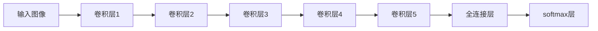
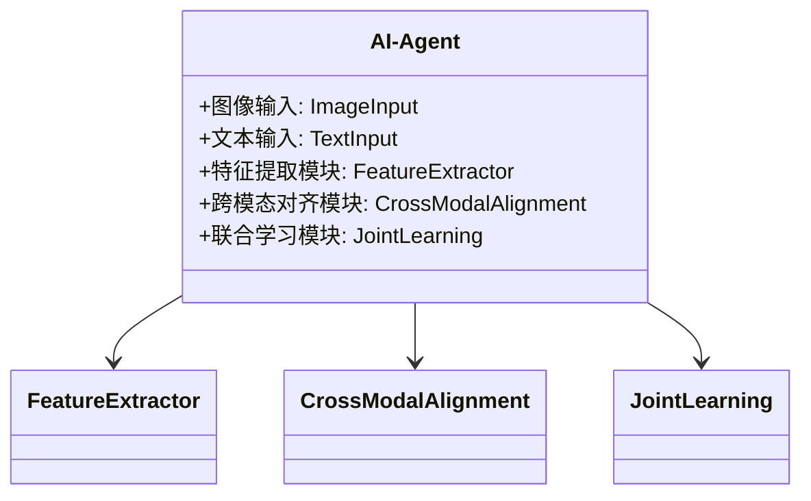
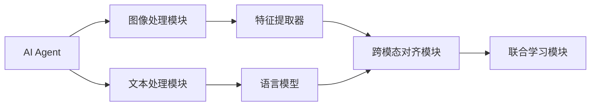
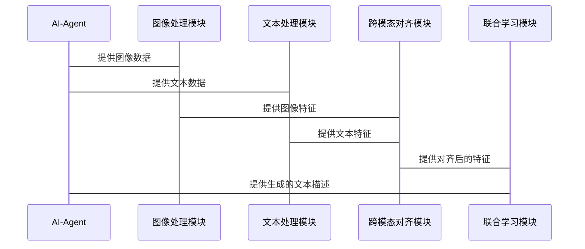

                 


# AI Agent的视觉-语言联合学习实现

## 关键词：AI Agent、视觉-语言联合学习、多模态学习、深度学习、跨模态对齐

## 摘要：本文详细探讨了AI Agent在视觉-语言联合学习中的实现方法，涵盖了多模态数据的特征分析、模型架构设计、算法实现、系统架构以及实际应用案例。通过理论分析与实践结合，深入解析了视觉-语言联合学习的核心原理和应用价值。

---

# 第1章: 引言

## 1.1 AI Agent的基本概念

AI Agent（智能体）是指在计算机系统中，能够感知环境、自主决策并执行任务的实体。它能够通过传感器获取信息，利用计算能力进行分析和推理，并通过执行器与环境交互。AI Agent的核心特征包括自主性、反应性、目标导向性和学习能力。

## 1.2 视觉-语言联合学习的背景

视觉和语言是人类认知世界的重要方式。随着人工智能技术的发展，单纯依赖单一模态的信息处理已经难以满足复杂场景的需求。视觉-语言联合学习通过结合图像和文本信息，能够实现更强大的理解和推理能力，为AI Agent提供了更丰富的感知和决策能力。

## 1.3 本文的研究目标与结构

本文旨在探讨AI Agent在视觉-语言联合学习中的实现方法，内容包括多模态数据的特征分析、模型架构设计、算法实现、系统架构以及实际应用案例。通过理论与实践结合，深入解析视觉-语言联合学习的核心原理和应用价值。

---

# 第2章: 多模态学习的基本原理

## 2.1 多模态数据的特征分析

多模态数据指的是来自不同感知渠道的信息，例如图像、文本、语音等。视觉数据具有丰富的空间信息，而语言数据则包含语义信息。多模态数据的融合能够提升模型的表达能力和泛化能力。

| 特征类型 | 视觉数据 | 语言数据 |
|----------|----------|----------|
| 空间性   | 高       | 低       |
| 语义性   | 低       | 高       |
| 可变性   | 高       | 中       |

## 2.2 视觉-语言模型的工作原理

视觉-语言模型通过将图像和文本信息进行对齐，实现跨模态的理解和生成。模型通常包括以下步骤：

1. **视觉特征提取**：利用卷积神经网络（CNN）提取图像的视觉特征。
2. **语言特征提取**：利用循环神经网络（RNN）或变换器（Transformer）提取文本的语义特征。
3. **跨模态对齐**：通过注意力机制等方法，将视觉和语言特征进行对齐。
4. **联合学习**：在对齐的基础上，进行跨模态的联合学习，实现图像描述生成、图像问答等任务。

### 2.2.1 视觉特征提取

视觉特征提取通常使用CNN，例如VGG、ResNet等。以ResNet为例，其网络结构如下：



## 2.3 多模态学习的挑战与解决方案

多模态学习的挑战主要体现在数据异构性和跨模态对齐的困难。为了解决这些问题，提出了以下解决方案：

1. **数据对齐**：通过数据增强和预处理，减少模态间的差异。
2. **注意力机制**：利用注意力机制进行跨模态对齐。
3. **联合优化**：在训练过程中同时优化视觉和语言任务，提升模型的泛化能力。

---

# 第3章: 视觉-语言联合学习的算法原理

## 3.1 多模态模型的基本架构

多模态模型通常由编码器和解码器组成。编码器负责将图像和文本信息分别编码为特征向量，解码器则利用这些特征生成目标输出。

### 3.1.1 编码器设计

编码器可以是视觉编码器和语言编码器的组合。视觉编码器通常使用CNN提取图像特征，语言编码器则使用Transformer提取文本特征。

### 3.1.2 解码器设计

解码器负责将编码后的特征生成目标输出，例如图像描述生成任务中，解码器需要将图像和文本特征生成描述文本。

## 3.2 视觉-语言联合学习算法

视觉-语言联合学习算法通常包括以下几个步骤：

1. **数据预处理**：将图像和文本数据进行归一化处理。
2. **特征提取**：利用CNN和Transformer分别提取图像和文本特征。
3. **跨模态对齐**：通过注意力机制对齐视觉和语言特征。
4. **联合训练**：在对齐的基础上，进行端到端的联合训练，优化模型参数。

### 3.2.1 注意力机制

注意力机制是一种用于跨模态对齐的有效方法。在视觉-语言联合学习中，注意力机制可以用于确定图像和文本之间的关联关系。

$$ \text{注意力权重} = \text{softmax}(\frac{\text{query} \cdot \text{key}}{\text{temperature}}) $$

---

# 第4章: 系统架构与设计

## 4.1 系统功能设计

系统功能设计包括以下几个模块：

1. **数据输入模块**：接收图像和文本数据。
2. **特征提取模块**：提取图像和文本特征。
3. **跨模态对齐模块**：对齐视觉和语言特征。
4. **联合学习模块**：进行视觉-语言联合学习，生成目标输出。

### 4.1.1 领域模型设计

领域模型设计需要考虑系统的各个模块之间的关系。以下是一个简单的领域模型类图：



## 4.2 系统架构设计

系统架构设计需要考虑系统的可扩展性和可维护性。以下是一个可能的系统架构图：



## 4.3 系统接口设计

系统接口设计需要考虑系统的输入和输出接口。以下是一个可能的系统接口设计：

- 输入接口：图像输入接口和文本输入接口。
- 输出接口：生成文本描述输出接口。

## 4.4 系统交互设计

系统交互设计需要考虑系统的各个模块之间的交互流程。以下是一个可能的系统交互流程图：



---

# 第5章: 项目实战

## 5.1 环境搭建

项目实战需要首先搭建开发环境。以下是一个可能的环境搭建步骤：

1. **安装Python**：安装Python 3.8或更高版本。
2. **安装深度学习框架**：安装TensorFlow或PyTorch。
3. **安装其他依赖**：安装必要的库，例如Pillow、numpy、matplotlib等。

## 5.2 核心代码实现

以下是视觉-语言联合学习模型的核心代码实现示例：

```python
import torch
import torch.nn as nn

class VisualLanguageModel(nn.Module):
    def __init__(self, visual_dim, language_dim):
        super(VisualLanguageModel, self).__init__()
        self.visual_encoder = nn.Linear(visual_dim, 512)
        self.language_encoder = nn.Linear(language_dim, 512)
        self.attention = nn.MultiheadAttention(512, 8)
        self.decoder = nn.Linear(512, 512)

    def forward(self, visual_features, language_features):
        visual_embed = self.visual_encoder(visual_features)
        language_embed = self.language_encoder(language_features)
        aligned_features = self.attention(visual_embed, language_embed)
        output = self.decoder(aligned_features)
        return output
```

## 5.3 案例分析与总结

通过实际案例分析，可以验证模型的性能和效果。以下是一个可能的案例分析：

- **任务**：图像描述生成。
- **输入**：一张图像和对应的文本描述。
- **输出**：生成的图像描述。

通过实验，可以发现模型在视觉-语言联合学习中的表现，进一步优化模型的参数和结构。

---

# 第6章: 最佳实践与注意事项

## 6.1 最佳实践

1. **数据预处理**：确保图像和文本数据的预处理一致性。
2. **模型调优**：通过网格搜索或随机搜索优化模型参数。
3. **跨模态对齐**：选择合适的注意力机制或对齐方法。
4. **系统架构**：设计合理的系统架构，确保系统的可扩展性和可维护性。

## 6.2 小结

本文详细探讨了AI Agent在视觉-语言联合学习中的实现方法，从理论到实践，系统地介绍了多模态数据的特征分析、模型架构设计、算法实现、系统架构以及实际应用案例。通过本文的学习，读者可以全面掌握视觉-语言联合学习的核心原理和应用价值。

## 6.3 注意事项

- 数据质量：确保数据的多样性和代表性。
- 模型选择：根据具体任务选择合适的模型架构。
- 跨模态对齐：注意模态之间的差异，选择合适的对齐方法。
- 系统优化：优化系统的性能和可扩展性。

## 6.4 拓展阅读

- 视觉-语言联合学习的最新研究进展。
- 其他多模态学习任务的实现方法。
- 深度学习框架的优化技巧。

---

# 作者信息

作者：AI天才研究院/AI Genius Institute & 禅与计算机程序设计艺术 /Zen And The Art of Computer Programming

