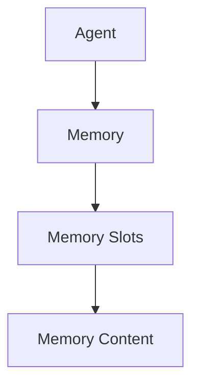
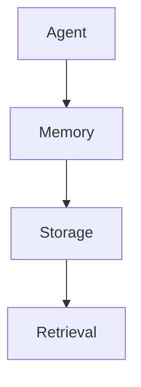
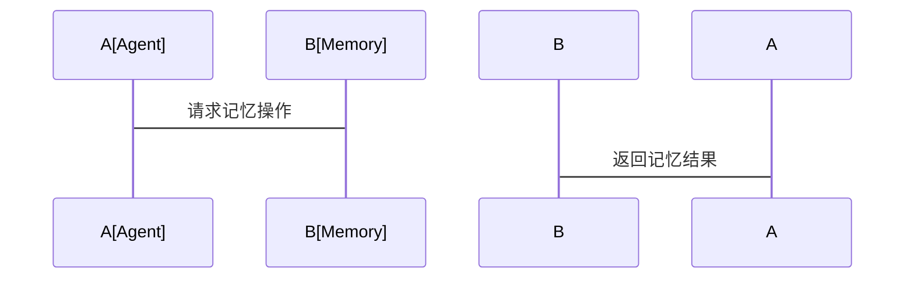

                 


# AI Agent的记忆机制：设计与实现

> 关键词：AI Agent, 记忆机制, 算法原理, 系统架构, 项目实战

> 摘要：AI Agent的记忆机制是实现智能体自主性和智能性的关键技术之一。本文从记忆机制的基本概念出发，系统地分析了记忆机制的核心原理、算法实现、系统架构设计以及实际应用场景，通过具体的项目案例，深入探讨了记忆机制在AI Agent中的设计与实现。本文不仅为AI Agent的记忆机制研究提供了理论基础，还为实际应用提供了可参考的实现方案。

---

# 第一部分: AI Agent的记忆机制概述

# 第1章: AI Agent记忆机制的背景与概念

## 1.1 AI Agent的基本概念

### 1.1.1 AI Agent的定义

AI Agent（智能体）是指在计算环境中能够感知环境、自主决策并执行任务的实体。它可以是一个软件程序、机器人或其他智能系统，具备以下核心特征：
- **自主性**：能够独立决策和行动。
- **反应性**：能够实时感知环境并做出反应。
- **目标导向**：具备明确的目标导向行为。
- **学习能力**：能够通过经验改进性能。

### 1.1.2 AI Agent的核心特征

AI Agent的记忆机制是其实现智能性和自主性的关键技术之一。记忆机制能够帮助AI Agent存储和检索相关信息，从而支持其在复杂环境中做出合理决策。

### 1.1.3 AI Agent的记忆机制的重要性

记忆机制在AI Agent中的作用可以类比于人类的记忆系统。没有有效的记忆机制，AI Agent将无法存储过去的经验和信息，从而难以实现复杂任务。

---

## 1.2 记忆机制的背景与问题背景

### 1.2.1 AI Agent面临的挑战

AI Agent在实际应用中面临以下挑战：
- **信息过载**：在复杂环境中，AI Agent需要处理海量信息。
- **动态环境**：环境中的信息和状态可能会不断变化。
- **任务多样性**：需要支持多种类型的任务。

### 1.2.2 AI Agent记忆机制的作用

记忆机制能够帮助AI Agent：
- **存储相关信息**：将过去感知到的信息存储起来。
- **快速检索信息**：在需要时快速检索相关信息。
- **更新信息**：根据新信息更新存储内容。

### 1.2.3 AI Agent记忆机制的边界与外延

记忆机制的边界包括：
- **存储范围**：决定存储哪些信息。
- **存储时间**：决定信息存储的时长。
- **存储方式**：决定以何种形式存储信息。

---

## 1.3 AI Agent记忆机制的核心概念与组成

### 1.3.1 AI Agent记忆机制的组成要素

记忆机制的核心组成包括：
- **感知器**：感知环境并提取信息。
- **存储器**：存储感知到的信息。
- **检索器**：根据需求检索存储的信息。
- **更新器**：更新存储的信息。

### 1.3.2 核心概念之间的关系

通过ER实体关系图可以清晰地展示记忆机制的核心概念之间的关系：



---

## 1.4 本章小结

本章主要介绍了AI Agent的基本概念、记忆机制的重要性以及其核心组成。通过这些分析，我们明确了记忆机制在AI Agent中的关键作用。

---

# 第2章: AI Agent记忆机制的核心概念与联系

## 2.1 记忆机制的原理与特点

### 2.1.1 基于符号的记忆机制

基于符号的记忆机制是一种基于规则的记忆方式。优点是逻辑性强，缺点是难以处理复杂和模糊信息。

### 2.1.2 基于神经网络的记忆机制

基于神经网络的记忆机制能够处理非结构化数据，具有强大的学习能力。缺点是需要大量数据和计算资源。

### 2.1.3 混合型记忆机制的特点

混合型记忆机制结合了符号和神经网络的优点，能够处理不同类型的信息，具有更强的灵活性。

---

## 2.2 记忆机制的核心属性对比

通过对比记忆机制的核心属性，我们可以更好地理解其优缺点：

| 属性       | 符号型记忆 | 神经网络型记忆 | 混合型记忆 |
|------------|------------|----------------|------------|
| 处理能力   | 有限       | 强大           | 较强        |
| 学习能力   | 无         | 有             | 有          |
| 适应性     | 低         | 高             | 较高        |

---

## 2.3 ER实体关系图

通过ER实体关系图，我们可以清晰地展示记忆机制的核心概念之间的关系：


---

## 2.4 本章小结

本章分析了AI Agent记忆机制的核心概念与联系，重点对比了不同记忆机制的特点和应用场景。

---

# 第3章: AI Agent记忆机制的算法原理

## 3.1 基于记忆网络的算法

### 3.1.1 记忆网络的基本结构

记忆网络的基本结构包括：
- **输入层**：接收外部输入。
- **记忆层**：存储相关信息。
- **逻辑层**：处理逻辑。
- **输出层**：输出结果。

### 3.1.2 记忆网络的工作流程

记忆网络的工作流程如下：
1. 接收输入信息。
2. 根据输入信息查询记忆层。
3. 根据查询结果进行逻辑处理。
4. 输出结果。

### 3.1.3 记忆网络的优缺点

优点：
- 结构清晰。
- 易于理解。

缺点：
- 学习能力有限。
- 需要大量人工干预。

---

## 3.2 基于端到端记忆网络的算法

### 3.2.1 端到端记忆网络的定义

端到端记忆网络是一种无需人工干预的自动学习记忆机制。

### 3.2.2 端到端记忆网络的实现步骤

实现步骤如下：
1. 数据预处理。
2. 网络训练。
3. 记忆检索。
4. 结果输出。

### 3.2.3 端到端记忆网络的性能对比

| 指标       | 符号型记忆 | 端到端记忆 |
|------------|------------|------------|
| 学习能力   | 低         | 高         |
| 适应性     | 低         | 高         |
| 计算复杂度 | 低         | 高         |

---

## 3.3 记忆机制的数学模型

### 3.3.1 记忆机制的基本公式

记忆机制的基本公式如下：

$$
M(t) = \sigma(W_m \cdot S(t) + b_m)
$$

其中，$M(t)$ 表示记忆状态，$S(t)$ 表示当前状态，$W_m$ 和 $b_m$ 是参数。

---

## 3.4 本章小结

本章重点介绍了记忆机制的算法原理，包括基于记忆网络和端到端记忆网络的实现。

---

# 第4章: AI Agent记忆机制的系统分析与架构设计

## 4.1 系统应用场景

### 4.1.1 智能对话系统

智能对话系统需要记忆用户的历史对话内容，从而提供更智能的回复。

### 4.1.2 自动驾驶系统

自动驾驶系统需要记忆环境中的动态信息，从而做出更安全的决策。

### 4.1.3 智能推荐系统

智能推荐系统需要记忆用户的历史行为，从而提供更精准的推荐。

---

## 4.2 系统功能设计

### 4.2.1 记忆内容的存储与检索

存储与检索功能是记忆机制的核心功能。

### 4.2.2 记忆内容的更新与维护

更新与维护功能确保记忆内容的准确性和时效性。

### 4.2.3 记忆内容的组织与管理

组织与管理功能确保记忆内容的结构化和可扩展性。

---

## 4.3 系统架构设计

### 4.3.1 系统架构图

系统架构设计如下：



---

## 4.4 系统接口设计

### 4.4.1 记忆内容的写入接口

写入接口用于将新信息存储到记忆中。

### 4.4.2 记忆内容的读取接口

读取接口用于根据需求检索记忆内容。

### 4.4.3 记忆内容的删除接口

删除接口用于清除过时的记忆内容。

---

## 4.5 系统交互流程

### 4.5.1 系统交互流程图

系统交互流程如下：



---

## 4.6 本章小结

本章从系统角度分析了AI Agent记忆机制的设计与实现，包括应用场景、功能设计、架构设计和交互流程。

---

# 第5章: AI Agent记忆机制的项目实战

## 5.1 项目介绍

### 5.1.1 项目目标

本项目旨在实现一个基于记忆机制的智能对话系统。

### 5.1.2 项目需求

- 实现记忆内容的存储与检索。
- 实现记忆内容的更新与维护。
- 实现记忆内容的组织与管理。

---

## 5.2 系统核心实现

### 5.2.1 环境配置

需要以下环境：
- Python 3.8+
- TensorFlow 2.0+
-其他依赖库。

### 5.2.2 核心代码实现

以下是核心代码实现：

```python
class Memory:
    def __init__(self):
        self.storage = {}

    def store(self, key, value):
        self.storage[key] = value

    def retrieve(self, key):
        return self.storage.get(key, None)

    def update(self, key, value):
        self.storage[key] = value

    def delete(self, key):
        if key in self.storage:
            del self.storage[key]
```

### 5.2.3 代码解读

- `store` 方法用于存储信息。
- `retrieve` 方法用于检索信息。
- `update` 方法用于更新信息。
- `delete` 方法用于删除信息。

---

## 5.3 项目案例分析

### 5.3.1 案例背景

以智能对话系统为例，我们需要实现记忆用户历史对话内容的功能。

### 5.3.2 案例分析

通过实现记忆机制，智能对话系统能够根据用户的历史对话内容提供更智能的回复。

---

## 5.4 项目小结

本章通过具体的项目案例，展示了AI Agent记忆机制的实际应用。

---

# 第6章: 总结与展望

## 6.1 本章总结

AI Agent的记忆机制是其实现智能性和自主性的关键技术。本文从记忆机制的基本概念出发，系统地分析了其核心原理、算法实现、系统架构设计以及实际应用场景。

---

## 6.2 未来展望

随着AI技术的不断发展，记忆机制在AI Agent中的应用将更加广泛和深入。未来的研究方向包括：
- 更高效的存储和检索算法。
- 更智能的记忆内容更新策略。
- 更强大的记忆机制数学模型。

---

# 附录

## 附录A: 术语表

- AI Agent：智能体。
- 记忆机制：存储和检索信息的机制。

---

## 附录B: 参考文献

1. 禅与计算机程序设计艺术
2. TensorFlow官方文档

---

作者：AI天才研究院/AI Genius Institute & 禅与计算机程序设计艺术 /Zen And The Art of Computer Programming

