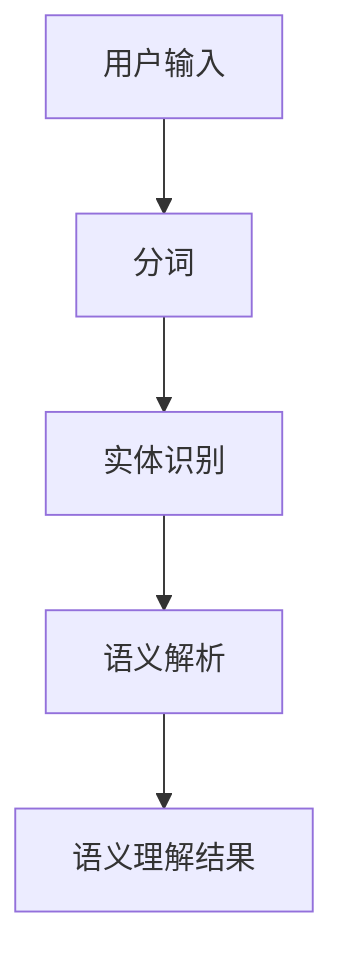
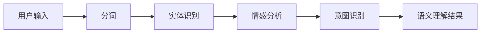
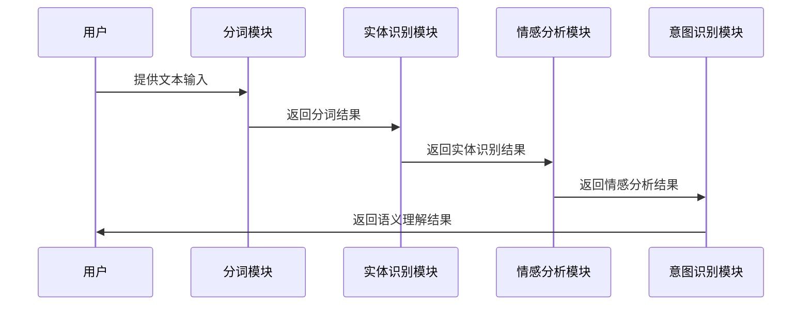

                 


# AI Agent的语义理解：超越关键词匹配

> 关键词：AI Agent、语义理解、关键词匹配、自然语言处理、深度学习

> 摘要：AI Agent的语义理解是实现智能交互的核心技术，超越传统的关键词匹配，通过上下文理解、实体识别和情感分析等技术，结合深度学习模型和系统架构设计，构建更智能的语义理解系统。本文将详细探讨AI Agent语义理解的核心概念、算法原理、系统架构和项目实战，为读者提供全面的理论和实践指导。

---

## 第一部分：引言

### 第1章：AI Agent与语义理解概述

#### 1.1 问题背景

- **1.1.1 当前自然语言处理的局限性**  
  当前的自然语言处理（NLP）技术虽然在词法分析、句法解析等方面取得了显著进展，但仍然难以准确理解用户的意图。传统的关键词匹配方法仅能处理简单的查询，无法应对复杂的语义需求。

- **1.1.2 语义理解的重要性**  
  语义理解（Semantic Understanding）是实现智能交互的关键技术。通过理解用户输入的深层含义，AI Agent能够提供更精准的服务，提升用户体验。

- **1.1.3 AI Agent的核心目标**  
  AI Agent的目标是通过语义理解技术，实现与用户的自然交互，理解用户的意图，并提供相应的服务或反馈。

#### 1.2 问题描述

- **1.2.1 关键词匹配的不足**  
  传统的关键词匹配方法仅依赖于关键词的出现频率，无法理解语境和意图。例如，用户输入“猫狗大战”，关键词匹配可能将其归类为“猫”和“狗”的信息，而无法理解用户可能是在寻找娱乐内容或新闻报道。

- **1.2.2 语义理解的定义与范围**  
  语义理解是指通过对文本的上下文、实体关系和情感倾向的分析，准确理解用户输入的深层含义。它不仅关注表面的关键词，还注重语义的关联性和逻辑性。

- **1.2.3 AI Agent语义理解的目标**  
  AI Agent的语义理解目标是通过分析用户输入的文本，提取出用户的意图、实体和情感倾向，从而提供更精准的响应。

#### 1.3 问题解决

- **1.3.1 从关键词匹配到语义理解的转变**  
  通过引入自然语言处理技术，如词嵌入（Word Embedding）、句法分析和语义网络，逐步实现从关键词匹配到语义理解的转变。

- **1.3.2 AI Agent语义理解的核心方法**  
  使用深度学习模型，如循环神经网络（RNN）和Transformer，构建语义理解模型，能够捕捉文本的上下文信息和语义关联。

- **1.3.3 语义理解的实现路径**  
  通过训练大规模的语料库，构建语义表示模型，实现对用户输入的语义理解和意图识别。

#### 1.4 边界与外延

- **1.4.1 语义理解的边界**  
  语义理解的边界在于如何在不同语境下准确理解用户意图。例如，在医疗领域和娱乐领域，相同的词语可能具有不同的含义。

- **1.4.2 与相关领域的区别**  
  语义理解与传统信息检索的区别在于，前者注重语义的深度分析，而后者仅关注关键词的匹配。

- **1.4.3 语义理解的未来发展**  
  随着AI技术的进步，语义理解将更加智能化，能够处理更复杂的语义关系和情感分析。

#### 1.5 概念结构与核心要素

- **1.5.1 核心概念的组成**  
  语义理解的核心概念包括：意图识别、实体识别、情感分析和上下文理解。

- **1.5.2 概念之间的关系**  
  意图识别依赖于实体识别和情感分析的结果，而实体识别又依赖于上下文理解。

- **1.5.3 核心要素的详细说明**  
  - **意图识别**：通过分析用户的输入，识别用户的意图，如查询、预订或投诉。
  - **实体识别**：从文本中提取出关键实体，如人名、地名和组织名。
  - **情感分析**：分析文本中的情感倾向，如积极、消极或中性。
  - **上下文理解**：分析文本的上下文关系，理解语义的关联性。

---

## 第二部分：语义理解的核心概念

### 第2章：语义理解的核心原理

#### 2.1 核心概念原理

- **2.1.1 语义理解的基本原理**  
  语义理解通过分析文本的上下文、实体关系和情感倾向，提取出用户的深层意图。这需要结合词嵌入、句法分析和语义网络等技术。

- **2.1.2 AI Agent的语义理解机制**  
  AI Agent通过自然语言处理技术，将用户的输入转化为结构化的语义表示，进而识别用户的意图。

- **2.1.3 语义理解的数学模型**  
  语义理解可以基于向量空间模型（Vector Space Model）或图模型（Graph Model）进行实现。例如，使用词嵌入技术将词语映射到高维向量空间，通过向量运算计算语义相似性。

#### 2.2 核心概念属性特征对比

- **2.2.1 关键词匹配与语义理解的对比**  
  | 对比维度 | 关键词匹配 | 语义理解 |
  |----------|------------|----------|
  | 理解深度 | 表面匹配 | 深层理解 |
  | 计算复杂度 | 低 | 高 |
  | 应用场景 | 简单查询 | 复杂语义需求 |

- **2.2.2 不同语义理解方法的特征**  
  | 方法 | 基于规则 | 统计学习 | 深度学习 |
  |------|-----------|----------|----------|
  | 特点 | 易实现，但灵活性差 | 基于数据统计，结果稳定 | 需大量数据，结果更准确 |

- **2.2.3 核心概念的属性分析**  
  - **意图识别**：基于语义理解，识别用户的意图，如查询天气、预订机票等。
  - **实体识别**：从文本中提取关键实体，如时间、地点、人物等。
  - **情感分析**：分析文本中的情感倾向，如积极、消极或中性。

#### 2.3 ER实体关系图



---

## 第三部分：语义理解的算法原理

### 第3章：语义理解的算法实现

#### 3.1 技术原理

- **3.1.1 基于词嵌入的语义理解**  
  使用Word2Vec或GloVe等词嵌入技术，将词语映射到高维向量空间，通过向量运算计算语义相似性。

- **3.1.2 基于深度学习的语义理解**  
  使用Transformer模型进行序列建模，通过自注意力机制捕捉文本的上下文关系。

- **3.1.3 基于图神经网络的语义理解**  
  使用图神经网络（Graph Neural Network）构建语义网络，通过节点和边的关系表示语义关联。

#### 3.2 算法实现

- **3.2.1 分词与实体识别**  
  使用jieba或spaCy进行分词，使用NER模型（如spaCy或Flair）进行实体识别。

- **3.2.2 情感分析与意图识别**  
  使用预训练的情感分析模型（如VADER或TextBlob）进行情感分析，使用意图识别模型（如基于决策树或深度学习的模型）进行意图分类。

#### 3.3 数学模型

- **3.3.1 词嵌入模型**  
  $$ \text{Word Embedding} = W \cdot \text{Input} $$  
  其中，$W$是词嵌入矩阵，$\text{Input}$是输入的词语或句子。

- **3.3.2 Transformer模型**  
  Transformer的自注意力机制如下：  
  $$ \text{Attention}(Q, K, V) = \text{softmax}\left(\frac{QK^T}{\sqrt{d_k}}\right)V $$  
  其中，$Q$是查询向量，$K$是键向量，$V$是值向量，$d_k$是向量的维度。

---

## 第四部分：系统架构与设计

### 第4章：AI Agent语义理解系统架构

#### 4.1 项目介绍

- **4.1.1 项目背景**  
  本项目旨在构建一个基于深度学习的AI Agent语义理解系统，实现对用户输入的语义理解和意图识别。

- **4.1.2 系统功能设计**  
  | 功能模块 | 描述 |
  |----------|------|
  | 分词与实体识别 | 对用户输入进行分词和实体识别 |
  | 情感分析 | 分析用户输入的情感倾向 |
  | 意图识别 | 识别用户的意图 |
  | 语义理解 | 综合上述结果，生成语义理解结果 |

#### 4.2 系统架构设计



#### 4.3 系统交互设计



---

## 第五部分：项目实战

### 第5章：AI Agent语义理解项目实战

#### 5.1 环境搭建

- **5.1.1 安装Python环境**  
  使用Anaconda或虚拟环境，安装Python 3.8+版本。

- **5.1.2 安装依赖库**  
  安装jieba、spaCy、transformers等NLP库。

#### 5.2 系统核心实现

- **5.2.1 分词与实体识别**  
  ```python
  import jieba
  from spacy.lang.zh import Chinese

  text = "我需要预订明天从北京到上海的机票"
  tokens = list(jieba.cut(text))
  print(tokens)  # 输出分词结果
  ```

- **5.2.2 情感分析与意图识别**  
  ```python
  from transformers import pipeline

  sentiment_pipeline = pipeline("sentiment-analysis")
  result = sentiment_pipeline("我非常喜欢这部电影")[0]
  print(result['label'])  # 输出情感分析结果
  ```

#### 5.3 实际案例分析

- **5.3.1 案例一**  
  输入：我需要预订明天从北京到上海的机票  
  分析：意图识别为“预订机票”，实体识别为“时间：明天”，“地点：北京”和“上海”。

- **5.3.2 案例二**  
  输入：这部电影太差了  
  分析：情感分析为“消极”，意图识别为“投诉”。

#### 5.4 项目小结

- **5.4.1 核心代码实现**  
  ```python
  def semantic_understanding(user_input):
      # 分词
      tokens = list(jieba.cut(user_input))
      # 实体识别
      entities = identify_entities(tokens)
      # 情感分析
      sentiment = analyze_sentiment(user_input)
      # 意图识别
      intent = identify_intent(tokens, entities, sentiment)
      return intent, entities, sentiment
  ```

---

## 第六部分：高级应用与未来趋势

### 第6章：语义理解的高级应用

#### 6.1 扩展应用场景

- **6.1.1 智能客服**  
  通过语义理解技术，智能客服可以更准确地理解用户的问题，提供更精准的解决方案。

- **6.1.2 智能教育**  
  通过语义理解技术，智能教育系统可以更好地理解学生的需求，提供个性化的学习建议。

#### 6.2 未来趋势

- **6.2.1 多模态语义理解**  
  结合图像、语音等多种模态信息，实现更全面的语义理解。

- **6.2.2 持续学习与自适应**  
  通过持续学习和自适应技术，语义理解系统可以不断优化自身的理解能力，适应不同的语境和用户需求。

---

## 第七部分：总结与展望

### 第7章：总结与展望

#### 7.1 总结

- **7.1.1 核心内容回顾**  
  本文详细探讨了AI Agent语义理解的核心概念、算法原理、系统架构和项目实战，为读者提供了全面的理论和实践指导。

- **7.1.2 知识体系结构**  
  通过构建知识体系，读者可以系统地理解AI Agent语义理解的实现方法和技术要点。

#### 7.2 展望

- **7.2.1 进一步学习方向**  
  建议读者深入学习深度学习模型（如Transformer、BERT）和自然语言处理技术，探索更先进的语义理解方法。

- **7.2.2 实践建议**  
  读者可以通过参与开源项目或实际项目，积累更多的实践经验，提升自己的技术能力。

---

## 作者：AI天才研究院/AI Genius Institute & 禅与计算机程序设计艺术/Zen And The Art of Computer Programming

