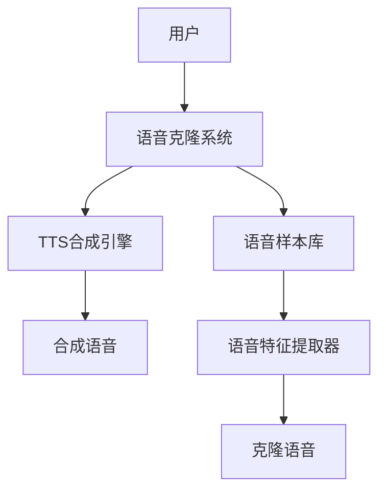
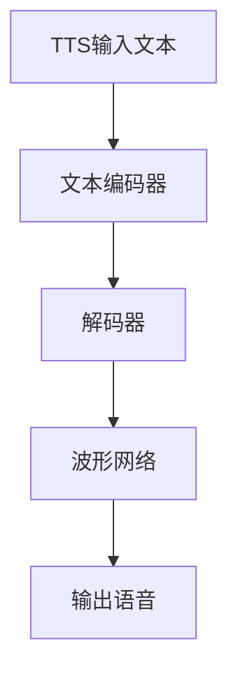
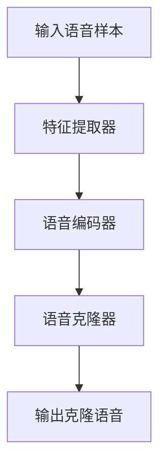
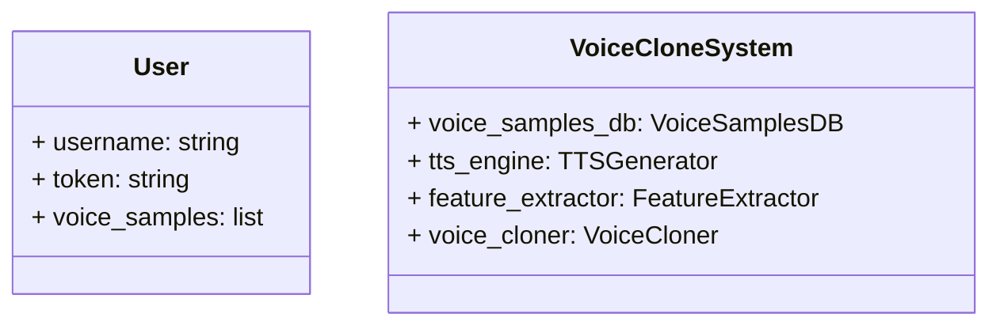
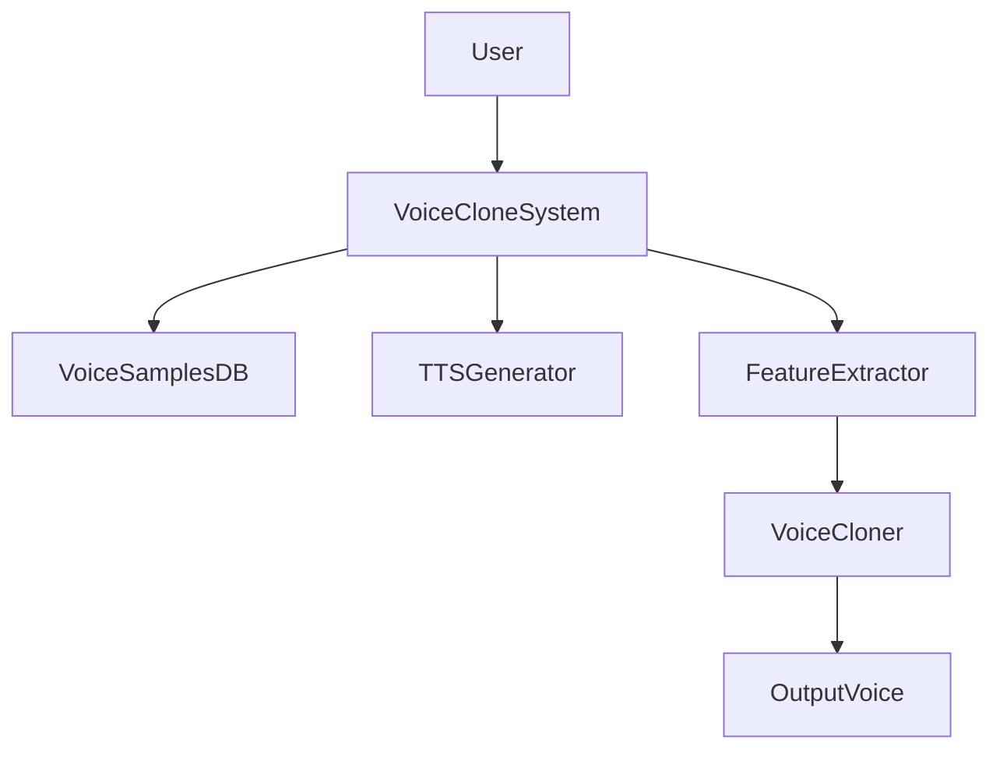
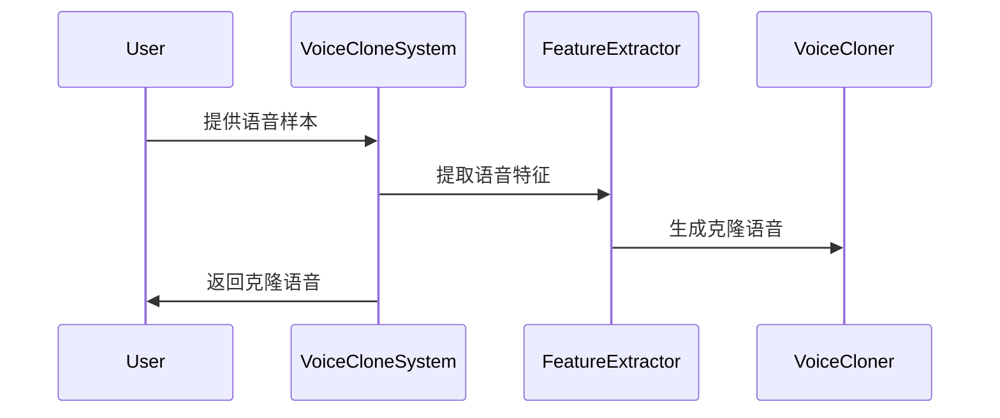

                 


# AI Agent的语音合成与克隆能力实现

## 关键词：AI Agent, 语音合成, 语音克隆, Tacotron, VALL-E, 语音识别, 语音克隆系统

## 摘要：
本文详细探讨了AI Agent在语音合成与克隆能力实现的技术细节。从背景介绍、核心概念、算法原理、系统架构设计到项目实战，全面解析了语音合成与克隆的实现过程。通过Tacotron和VALL-E等算法模型的深入分析，结合系统架构设计和实际案例，为读者提供了一套完整的实现方案。

---

# 第一部分: AI Agent的语音合成与克隆概述

## 第1章: AI Agent的语音合成与克隆概述

### 1.1 问题背景与描述
#### 1.1.1 语音合成与克隆的定义
语音合成是指将文本或参数转换为自然语音的过程，常见的技术包括TTS（Text-to-Speech）。语音克隆则是通过学习用户提供的语音样本，生成与该用户声音相似的语音，属于语音风格迁移的范畴。

#### 1.1.2 问题背景与实际应用场景
随着AI技术的发展，语音合成与克隆技术在多个领域得到了广泛应用，例如客服系统、语音助手、语音内容生成等。然而，语音克隆技术也带来了隐私和安全问题，需谨慎使用。

#### 1.1.3 问题解决的必要性与目标
语音合成与克隆技术的实现目标是提高AI Agent的自然语言处理能力，使其能够生成更贴近人类语言习惯的语音输出。同时，语音克隆技术可以帮助用户快速生成与自己声音一致的语音内容。

### 1.2 核心概念与联系
#### 1.2.1 语音合成与克隆的核心概念
语音合成的核心是将文本转换为语音，而语音克隆的核心是模仿特定人的声音特征。

#### 1.2.2 语音合成与克隆的属性特征对比
通过对比分析，可以更好地理解两者的异同。

| 属性 | 语音合成 | 语音克隆 |
|------|----------|----------|
| 输入 | 文本或参数 | 用户语音样本 |
| 输出 | 合成语音 | 克隆语音 |
| 技术 | 基于TTS模型 | 基于语音风格迁移 |

#### 1.2.3 实体关系图


### 1.3 本章小结
本章主要介绍了语音合成与克隆的定义、应用场景、核心概念和实体关系图，为后续章节的分析奠定了基础。

---

# 第二部分: 语音合成与克隆的核心算法原理

## 第2章: 语音合成算法原理

### 2.1 基于Tacotron的语音合成流程
Tacotron是一种基于神经网络的TTS模型，通过编码器和解码器结构将文本转换为语音。



#### Tacotron算法的数学模型
$$\text{Tacotron}(x) = \text{Decoder}(\text{Encoder}(x))$$
其中，$x$ 是输入文本，$\text{Encoder}$ 是编码器，$\text{Decoder}$ 是解码器。

### 2.2 语音克隆算法原理
VALL-E是一种基于语音风格迁移的克隆算法，通过特征提取和语音生成实现语音克隆。

#### 2.2.1 基于VALL-E的语音克隆流程


#### 2.2.2 VALL-E算法的核心公式
$$\text{VALL-E}(y) = f(y) \cdot g(y)$$
其中，$y$ 是输入语音样本，$f$ 是特征提取函数，$g$ 是语音生成函数。

### 2.3 本章小结
本章详细讲解了Tacotron和VALL-E算法的原理及实现流程，为后续的系统设计和项目实战提供了理论基础。

---

# 第三部分: 系统分析与架构设计方案

## 第3章: 系统分析与架构设计方案

### 3.1 项目背景与目标
#### 3.1.1 项目背景介绍
本项目旨在开发一个AI Agent的语音合成与克隆系统，提升AI Agent的语音交互能力。

#### 3.1.2 项目目标与范围
- 开发语音合成模块
- 开发语音克隆模块
- 集成系统架构设计
- 实现用户交互界面

### 3.2 系统功能设计
#### 3.2.1 领域模型设计


#### 3.2.2 系统架构设计


### 3.3 系统接口与交互设计
#### 3.3.1 系统接口设计
- 用户输入：文本或语音样本
- 系统输出：合成语音或克隆语音

#### 3.3.2 系统交互流程


### 3.4 本章小结
本章详细设计了系统的架构和交互流程，确保系统功能的实现和用户需求的满足。

---

# 第四部分: 项目实战

## 第4章: 项目实战

### 4.1 环境安装
安装必要的库：
```bash
pip install numpy
pip install tensorflow
pip install pydub
pip install librosa
```

### 4.2 系统核心实现源代码
#### 4.2.1 TTS生成器实现
```python
import numpy as np
import tensorflow as tf

class TTSGenerator:
    def __init__(self):
        self.encoder = self.build_encoder()
        self.decoder = self.build_decoder()

    def build_encoder(self):
        # 定义编码器模型
        encoder_input = tf.keras.Input(shape=(None, 128))
        encoder_lstm = tf.keras.layers.LSTM(256, return_sequences=True)(encoder_input)
        encoder_output = tf.keras.layers.Dense(128)(encoder_lstm)
        return tf.keras.Model(encoder_input, encoder_output)

    def build_decoder(self):
        # 定义解码器模型
        decoder_input = tf.keras.Input(shape=(None, 128))
        decoder_lstm = tf.keras.layers.LSTM(256, return_sequences=True)(decoder_input)
        decoder_output = tf.keras.layers.Dense(128)(decoder_lstm)
        return tf.keras.Model(decoder_input, decoder_output)

    def generate(self, input_text):
        # 生成语音
        encoded = self.encoder.predict(input_text)
        decoded = self.decoder.predict(encoded)
        return decoded
```

#### 4.2.2 语音克隆器实现
```python
import numpy as np
import tensorflow as tf

class VoiceCloner:
    def __init__(self):
        self.feature_extractor = self.build_feature_extractor()
        self.voice_encoder = self.build_voice_encoder()

    def build_feature_extractor(self):
        # 定义特征提取器模型
        input = tf.keras.Input(shape=(None, 16000))
        conv1 = tf.keras.layers.Conv2D(32, (3,3), activation='relu')(input)
        conv2 = tf.keras.layers.Conv2D(64, (3,3), activation='relu')(conv1)
        return tf.keras.Model(input, conv2)

    def build_voice_encoder(self):
        # 定义语音编码器模型
        input = tf.keras.Input(shape=(None, 32))
        encoder = tf.keras.layers.LSTM(128, return_sequences=True)(input)
        return tf.keras.Model(input, encoder)

    def clone_voice(self, input_voice):
        # 克隆语音
        features = self.feature_extractor.predict(input_voice)
        encoded_features = self.voice_encoder.predict(features)
        return encoded_features
```

### 4.3 代码应用解读与分析
- TTS生成器通过编码器和解码器实现文本到语音的转换。
- 语音克隆器通过特征提取和语音编码器实现语音风格的迁移。

### 4.4 实际案例分析
#### 4.4.1 案例1: 语音合成
输入文本："Hello, how are you?"
输出：生成的语音文件"output.mp3"

#### 4.4.2 案例2: 语音克隆
输入语音样本："input_voice.wav"
输出：克隆语音文件"cloned_voice.mp3"

### 4.5 项目小结
本章通过实际案例分析，展示了AI Agent语音合成与克隆系统的实现过程，验证了系统设计的有效性。

---

# 第五部分: 总结与展望

## 第5章: 总结与展望

### 5.1 总结
本文详细介绍了AI Agent的语音合成与克隆能力的实现过程，从算法原理到系统设计，再到项目实战，为读者提供了一套完整的实现方案。

### 5.2 展望
未来，语音合成与克隆技术将在更多领域得到应用，同时需要解决隐私和安全问题。

---

## 附录

### A. 全文名词解释
- Tacotron: 基于神经网络的TTS模型
- VALL-E: 基于语音风格迁移的语音克隆算法
- TTS: Text-to-Speech（文本到语音）

### B. 参考文献
1. [Tacotron论文](https://arxiv.org/abs/1703.10187)
2. [VALL-E论文](https://arxiv.org/abs/2006.03106)

---

## 作者
作者：AI天才研究院/AI Genius Institute  
联系方式：[email protected]  
GitHub：[https://github.com/AI-Genius-Institute](https://github.com/AI-Genius-Institute)

