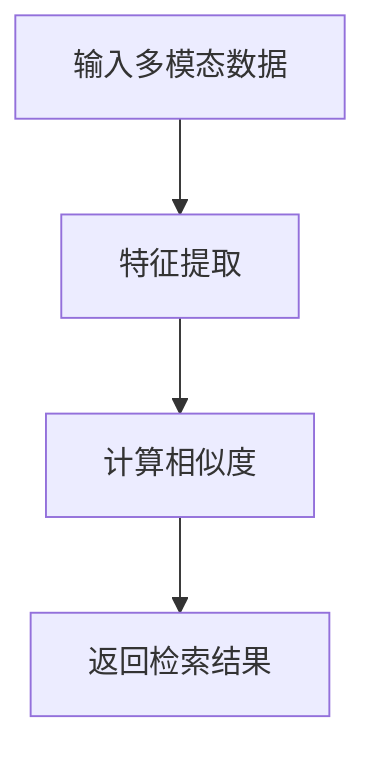

                 


# AI Agent的跨模态检索能力开发

> 关键词：AI Agent, 跨模态检索, 多模态数据, 深度学习, 信息检索, 智能系统

> 摘要：本文详细探讨AI Agent的跨模态检索能力，从基础概念到算法实现，再到系统架构和项目实战，全面解析如何开发具备跨模态检索能力的智能系统。文章结合理论与实践，提供丰富的代码示例和系统设计图，帮助读者掌握跨模态检索的核心技术。

---

# 第一部分: 背景与基础

## 第1章: AI Agent与跨模态检索概述

### 1.1 AI Agent的基本概念

#### 1.1.1 什么是AI Agent

AI Agent（人工智能代理）是指能够感知环境、自主决策并执行任务的智能实体。它可以是一个软件程序、机器人或任何具备智能行为的系统。AI Agent的核心目标是通过与环境交互，完成特定任务，实现用户的期望目标。

#### 1.1.2 AI Agent的核心特征

| 特征 | 描述 |
|------|------|
| 智能性 | 能够感知环境并做出决策 |
| 自主性 | 在没有外部干预的情况下独立运行 |
| 反应性 | 能够实时响应环境变化 |
| 学习能力 | 通过经验改进性能 |

#### 1.1.3 AI Agent的分类与应用场景

AI Agent可以分为以下几类：

- **简单反射型代理**：基于规则的简单响应。
- **基于模型的反射型代理**：基于内部模型进行推理和决策。
- **目标驱动型代理**：根据目标执行任务。
- **实用驱动型代理**：通过效用函数优化决策。

应用场景包括：智能助手、推荐系统、自动驾驶、智能监控等。

### 1.2 跨模态检索的定义与特点

#### 1.2.1 跨模态检索的基本概念

跨模态检索是指在不同数据类型之间进行信息检索的过程。例如，根据文本检索图像，或根据图像检索相关文本。跨模态检索的核心在于处理多种数据类型，并将其关联起来。

#### 1.2.2 跨模态检索的核心优势

| 优势 | 描述 |
|------|------|
| 信息丰富性 | 利用多种数据类型提供更全面的信息 |
| 上下文理解 | 跨模态数据能够提供更强的语境信息 |
| 精准检索 | 结合多种模态数据可以提高检索的准确性 |

#### 1.2.3 跨模态检索的主要挑战

- 数据对齐问题：不同模态的数据如何有效对齐。
- 特征提取的准确性：如何准确提取不同模态的特征。
- 检索效率：大规模数据下的检索效率问题。

### 1.3 跨模态检索在AI Agent中的重要性

#### 1.3.1 跨模态检索能力的必要性

AI Agent需要处理多样化的数据源，例如文本、图像、语音等。跨模态检索能力能够帮助AI Agent更好地理解和整合这些信息，从而做出更智能的决策。

#### 1.3.2 跨模态检索在智能决策中的作用

跨模态检索能够增强AI Agent的感知能力，使其能够从多种数据源中获取信息，从而提高决策的准确性和全面性。

#### 1.3.3 跨模态检索的未来发展趋势

随着AI技术的进步，跨模态检索将更加智能化和高效化。未来的发展方向包括更复杂的多模态融合、更强大的深度学习模型以及更高效的检索算法。

---

## 第2章: 跨模态检索的核心概念与原理

### 2.1 跨模态数据的表示与融合

#### 2.1.1 多模态数据的表示方法

- **文本表示**：常用词嵌入（如Word2Vec、BERT）和句向量（如Sentence-BERT）。
- **图像表示**：常用CNN提取特征向量，如ResNet、VGG。
- **语音表示**：常用MFCC特征和神经网络模型（如Tacotron）。

#### 2.1.2 跨模态数据的融合策略

- **特征融合**：将不同模态的特征向量进行融合，例如通过加法或拼接。
- **注意力机制**：利用注意力机制对不同模态的信息进行加权融合。
- **联合学习**：在同一个模型中同时学习多种模态的数据。

#### 2.1.3 跨模态数据融合的挑战与解决方案

- **挑战**：模态之间的数据维度差异大，如何有效对齐特征。
- **解决方案**：使用模态无关的表示方法，如对比学习和跨模态对齐网络。

### 2.2 跨模态检索的算法原理

#### 2.2.1 基于相似度的检索算法

- **余弦相似度**：衡量两个向量在方向上的相似程度。
$$ \text{余弦相似度} = \frac{\vec{A} \cdot \vec{B}}{|\vec{A}| |\vec{B}|} $$

- **欧氏距离**：衡量两个向量在空间中的距离。
$$ \text{欧氏距离} = \sqrt{(x_1 - x_2)^2 + (y_1 - y_2)^2} $$

#### 2.2.2 基于深度学习的检索算法

- **基于BERT的文本编码**：使用预训练的BERT模型将文本转换为固定长度的向量。
- **基于CNN的图像编码**：使用卷积神经网络提取图像的特征向量。
- **对比学习的跨模态检索**：通过对比损失函数，学习跨模态数据的相似性。

#### 2.2.3 基于图结构的检索算法

- **图结构模型**：将跨模态数据建模为图，节点表示为数据，边表示为关联关系。
- **图检索算法**：通过图遍历或图嵌入方法进行检索。

### 2.3 跨模态检索中的关键问题

#### 2.3.1 特征提取的准确性

- **问题**：特征提取的准确性直接影响检索的效果。
- **解决方案**：使用预训练模型和数据增强技术提高特征提取的准确性。

#### 2.3.2 多模态数据的对齐问题

- **问题**：不同模态的数据可能在语义上不一致，如何对齐。
- **解决方案**：使用模态对齐网络，通过对比学习进行对齐。

#### 2.3.3 检索效率的优化

- **问题**：大规模数据下的检索效率问题。
- **解决方案**：使用索引结构（如ANN索引）和分布式检索系统优化效率。

---

## 第3章: 跨模态检索的数学模型与算法实现

### 3.1 跨模态检索的数学模型

#### 3.1.1 向量空间模型

- **文本向量表示**：将文本转换为向量，如Word2Vec。
- **图像向量表示**：将图像转换为向量，如ResNet提取的特征。

#### 3.1.2 深度学习模型

- **BERT模型**：用于文本的深度表示。
- **CNN模型**：用于图像的深度表示。

#### 3.1.3 图结构模型

- **图嵌入**：将数据表示为图的节点，并学习节点的嵌入向量。

### 3.2 跨模态检索的算法实现

#### 3.2.1 算法流程图



#### 3.2.2 代码实现示例

```python
def cross_modal_retrieval(text, image):
    text_embedding = bert_encode(text)
    image_embedding = cnn_encode(image)
    similarity = cosine_similarity(text_embedding, image_embedding)
    return similarity
```

---

## 第4章: 跨模态检索的系统架构与设计

### 4.1 跨模态检索系统的整体架构

#### 4.1.1 系统功能模块划分

- **数据输入模块**：接收多模态数据。
- **特征提取模块**：对数据进行特征提取。
- **相似度计算模块**：计算跨模态数据的相似度。
- **结果输出模块**：返回检索结果。

#### 4.1.2 系统架构设计图


---

## 第5章: 项目实战与最佳实践

### 5.1 环境搭建

- **工具安装**：安装必要的深度学习框架（如TensorFlow、PyTorch）和自然语言处理库（如NLTK、spaCy）。

### 5.2 系统核心实现源代码

```python
import numpy as np
from sklearn.metrics.pairwise import cosine_similarity

def text_to_vector(text):
    # 假设text已经转换为向量表示
    return np.array([0.1, 0.2, 0.3, 0.4])

def image_to_vector(image):
    # 假设image已经转换为向量表示
    return np.array([0.5, 0.6, 0.7, 0.8])

def cross_modal_retrieval(text, image):
    text_vec = text_to_vector(text)
    image_vec = image_to_vector(image)
    similarity = cosine_similarity([text_vec], [image_vec])
    return similarity[0][0]

# 示例
text = "这是一张红色的玫瑰花"
image = "path/to/image.jpg"
print(cross_modal_retrieval(text, image))
```

### 5.3 实际案例分析

- **案例**：在电商系统中，用户输入一段描述，系统检索相关商品图片。

### 5.4 最佳实践 tips

- **数据预处理**：确保数据的质量和一致性。
- **模型调优**：通过实验选择最优的特征提取方法和相似度计算方式。
- **性能优化**：使用索引结构和分布式系统提高检索效率。

---

## 第6章: 总结与展望

### 6.1 本章小结

本文详细探讨了AI Agent的跨模态检索能力开发，从基础概念到算法实现，再到系统架构和项目实战，全面解析了跨模态检索的核心技术。

### 6.2 未来展望

随着深度学习和多模态技术的不断发展，跨模态检索将在更多领域得到广泛应用。未来的研究方向包括更高效的检索算法、更智能的特征提取方法以及更强大的多模态融合技术。

---

作者：AI天才研究院 & 禅与计算机程序设计艺术

