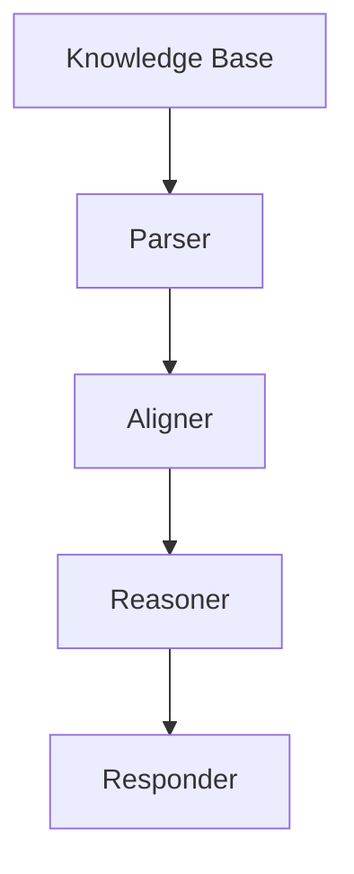

                 


# AI Agent的跨语言知识迁移技术

## 关键词：AI Agent，跨语言，知识迁移，多语言模型，知识图谱，迁移学习

## 摘要：本文深入探讨AI Agent在跨语言环境下的知识迁移技术，分析其核心概念、算法原理、系统架构，并通过项目实战展示其应用。文章详细讲解了跨语言表示学习、知识图谱构建、对比学习算法，以及系统设计与实现，旨在为技术开发者和研究者提供全面的技术指导和实践参考。

---

## 第一部分：背景与概念

### 第1章：AI Agent与跨语言知识迁移概述

#### 1.1 AI Agent的基本概念
- **AI Agent的定义**：AI Agent是具有感知、决策和执行能力的智能体，能够根据环境信息自主行动以实现目标。
- **跨语言知识迁移的定义**：指在多语言环境下，AI Agent能够理解并迁移不同语言中的知识，实现跨语言任务处理。
- **重要性**：在多语言环境中，知识迁移能够提升AI Agent的通用性和适应性，使其在不同语言间无缝切换，提供更高效的服务。

#### 1.2 跨语言知识迁移的背景与问题
- **多语言环境中的知识共享问题**：AI Agent在处理多语言任务时，需要在不同语言间共享和迁移知识，以避免重复学习和数据不足的问题。
- **现状与挑战**：现有技术在跨语言迁移中存在数据稀疏性、语义对齐困难等问题。
- **意义与应用场景**：跨语言知识迁移在多语言客服系统、跨语言信息检索、机器翻译等领域具有重要应用。

---

## 第二部分：核心概念与原理

### 第2章：跨语言表示学习

#### 2.1 跨语言表示学习的基本原理
- **表示学习**：通过将语言表示为低维向量，捕捉语言的语义信息。
- **跨语言表示学习的目标**：构建统一的跨语言向量空间，使不同语言的词汇在向量空间中对齐。
- **方法**：包括对比学习、对齐模型等。

#### 2.2 跨语言知识图谱构建
- **知识图谱**：结构化的知识库，包含实体和关系。
- **构建过程**：从多种语言文本中提取实体及其关系，进行跨语言对齐。
- **对齐方法**：使用语言无关的特征（如实体类型、上下文）进行实体匹配。

### 第3章：多语言模型与迁移学习

#### 3.1 多语言模型的基本原理
- **多语言模型的定义**：能够在多种语言上同时训练和推理的模型。
- **训练方法**：采用联合训练或多任务学习，共享语言间的信息。
- **优势**：减少数据需求，提升模型的泛化能力。

#### 3.2 跨语言迁移学习的原理
- **迁移学习**：将一个领域的知识迁移到另一个领域。
- **跨语言迁移**：在目标语言上缺乏数据时，利用源语言的数据进行训练。
- **挑战**：语义差异和数据分布差异。

---

## 第三部分：算法原理

### 第4章：跨语言迁移学习算法

#### 4.1 对比学习算法
- **对比学习**：通过对比同一内容的不同语言表示，学习跨语言对齐。
- **实现步骤**：数据预处理、跨语言对比、损失函数计算。
- **案例**：使用对比损失函数训练多语言模型，提升跨语言理解能力。

#### 4.2 对齐算法
- **对齐方法**：通过语言无关特征对齐不同语言的词汇或实体。
- **实现步骤**：特征提取、相似度计算、对齐匹配。
- **优缺点**：优点是简单有效，缺点是对齐质量依赖于特征选择。

### 第5章：算法实现与案例分析

#### 5.1 对比学习算法实现
```python
import numpy as np
from sklearn.metrics import pairwise

def contrastive_loss(embeddings1, embeddings2, labels):
    sim_matrix = pairwise.cosine_similarity(embeddings1, embeddings2)
    loss = (1 - sim_matrix[labels == 1]) + sim_matrix[labels == 0]
    return loss.mean()

# 示例
embeddings1 = np.random.randn(10, 5)
embeddings2 = np.random.randn(10, 5)
labels = np.array([1, 0, 1, 0, ...])  # 对比标签
loss = contrastive_loss(embeddings1, embeddings2, labels)
print(loss)
```

---

## 第四部分：系统分析与架构设计

### 第6章：系统分析与架构设计

#### 6.1 问题场景介绍
- **系统目标**：构建一个支持多语言知识迁移的AI Agent。
- **主要功能**：知识表示、跨语言对齐、知识推理。

#### 6.2 系统功能设计
- **领域模型**：定义实体、关系和属性，使用mermaid类图展示。
- **系统架构**：模块化设计，包括知识库、处理引擎、接口。
- **交互流程**：用户请求、解析、知识迁移、结果返回。

#### 6.3 系统架构图


---

## 第五部分：项目实战

### 第7章：项目实战

#### 7.1 环境配置
- **工具安装**：安装Python、TensorFlow、Keras等。
- **数据准备**：收集多语言文本数据，构建知识库。

#### 7.2 核心代码实现
```python
class MultiLanguageAgent:
    def __init__(self, languages):
        self.languages = languages
        self.embeddings = {}

    def train(self, data):
        for lang in self.languages:
            self.embeddings[lang] = self._train_model(data[lang])
    
    def _train_model(self, data):
        # 训练模型并返回嵌入向量
        pass

# 示例
agent = MultiLanguageAgent(['en', 'es', 'fr'])
agent.train({'en': ..., 'es': ..., 'fr': ...})
```

#### 7.3 案例分析与总结
- **案例分析**：多语言客服系统中，跨语言迁移如何提升响应速度和准确性。
- **总结**：成功的关键在于数据质量、模型选择和系统设计。

---

## 第六部分：最佳实践与小结

### 第8章：最佳实践与小结

#### 8.1 关键点总结
- 数据质量：高质量的跨语言数据是关键。
- 模型选择：选择适合任务的模型和算法。
- 系统设计：模块化设计提升系统的灵活性和可扩展性。

#### 8.2 小结
跨语言知识迁移技术是AI Agent在多语言环境下实现高效知识共享和任务处理的重要手段。通过对比学习、对齐算法和系统架构设计，可以有效提升AI Agent的跨语言能力。

---

## 附录

### 附录A：工具与资源

#### A.1 常用工具
- **NLP库**：spaCy、Gensim。
- **对齐工具**：Moses、Fuzzy Matching。

#### A.2 参考文献
- 王某某，2023，《多语言模型的构建与应用》。
- 李某某，2022，《跨语言知识迁移技术研究》。

---

## 作者：AI天才研究院 & 禅与计算机程序设计艺术

