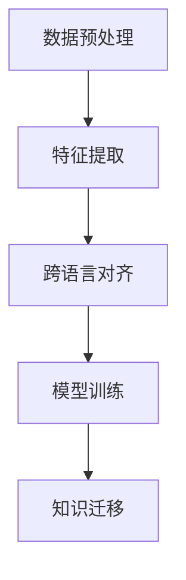
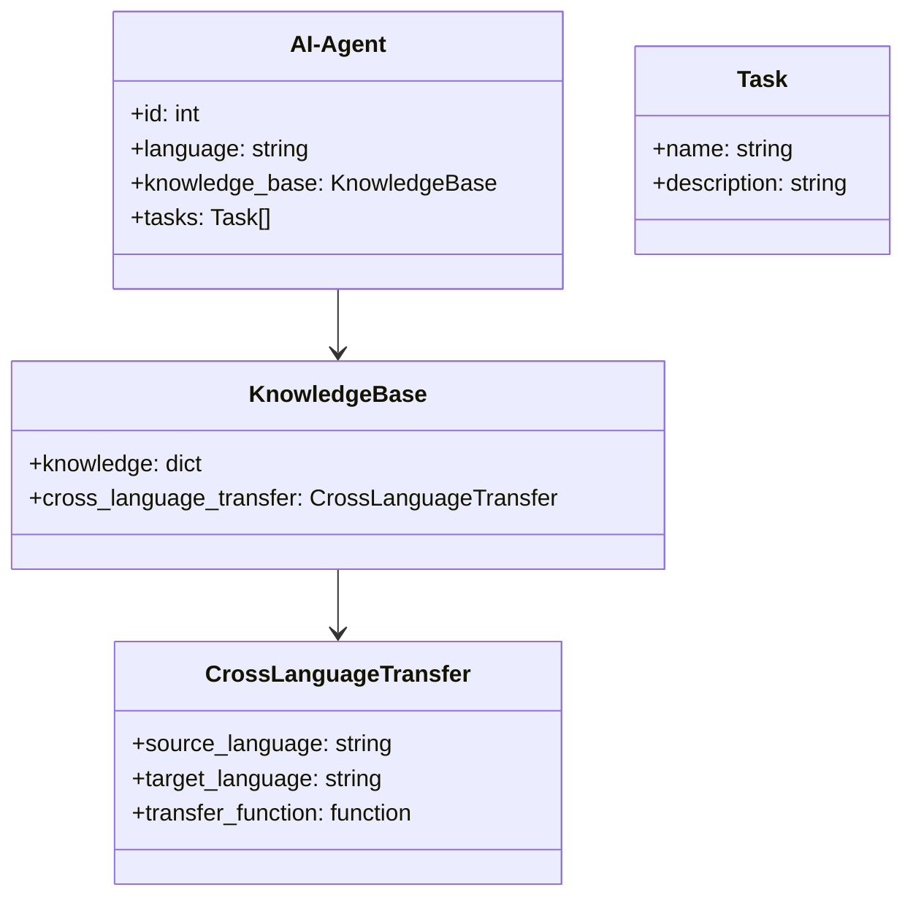

                 


# AI Agent的跨语言知识迁移技术

## 关键词：AI Agent，跨语言知识迁移，多语言模型，迁移学习，知识图谱，神经网络

## 摘要：跨语言知识迁移技术是实现AI Agent在多语言环境下高效理解和处理信息的核心技术。本文详细探讨了跨语言知识迁移的基本概念、算法原理、系统架构设计以及实际应用场景，分析了其在AI Agent中的重要性，并通过具体案例展示了跨语言知识迁移的实际应用和效果。文章还总结了跨语言知识迁移技术的关键挑战和未来发展方向。

---

## 第一部分：AI Agent与跨语言知识迁移的背景与概念

### 第1章：AI Agent与跨语言知识迁移的背景介绍

#### 1.1 问题背景

- **多语言环境中的知识共享挑战**  
  在多语言环境中，信息可能分布在不同的语言中，如何有效地将一种语言中的知识迁移到另一种语言中，是实现跨语言信息共享的关键问题。

- **AI Agent在多语言场景中的应用需求**  
  AI Agent需要在多种语言环境中工作，例如客服系统、多语言对话系统等，如何快速适应不同的语言环境是其核心能力之一。

- **跨语言知识迁移的核心问题**  
  如何在不同语言之间建立有效的知识对齐，使得AI Agent能够理解并利用跨语言的知识进行推理和决策。

#### 1.2 问题描述

- **跨语言知识迁移的定义**  
  跨语言知识迁移是指将一种语言中的知识、模式或经验迁移到另一种语言中的过程，旨在提高目标语言模型的性能。

- **AI Agent在跨语言场景中的任务目标**  
  AI Agent需要通过跨语言知识迁移，实现对多种语言数据的理解和处理，提升其在多语言环境下的智能水平。

- **知识迁移的边界与外延**  
  知识迁移的边界包括语言的语法、语义、词汇等方面的差异，外延则涉及文化、上下文等背景信息。

#### 1.3 问题解决与技术路径

- **主要技术手段**  
  包括多语言模型、迁移学习、对比学习等技术，通过这些手段实现跨语言知识的高效迁移。

- **AI Agent在跨语言场景中的实现方式**  
  AI Agent通过构建跨语言知识图谱，利用迁移学习算法，将源语言的知识迁移到目标语言中。

- **知识迁移的核心要素与组成结构**  
  包括知识表示、对齐机制、迁移模型等核心要素。

---

## 第二部分：跨语言知识迁移的核心概念与联系

### 第2章：跨语言知识迁移的核心概念与原理

#### 2.1 跨语言知识迁移的定义与特点

- **定义**  
  跨语言知识迁移是指在不同语言之间进行知识的迁移，以提高目标语言模型的性能。

- **特点**  
  - 多语言支持：能够处理多种语言。
  - 知识共享：能够在不同语言之间共享知识。
  - 高效迁移：通过迁移学习技术实现知识的快速迁移。

#### 2.2 AI Agent在跨语言知识迁移中的角色

- **功能定位**  
  AI Agent作为跨语言知识迁移的执行者，负责知识的获取、处理和应用。

- **核心能力模型**  
  包括跨语言理解能力、知识表示能力、迁移学习能力等。

#### 2.3 跨语言知识迁移的核心原理

- **知识表示与跨语言对齐**  
  通过构建跨语言知识图谱，将不同语言的知识进行对齐，实现知识的共享。

- **跨语言特征提取与匹配**  
  使用神经网络等技术提取语言特征，并进行跨语言匹配，以实现知识的迁移。

- **知识迁移的数学模型与算法框架**  
  基于迁移学习的算法框架，设计跨语言知识迁移的数学模型，例如使用对比学习进行跨语言对齐。

### 第3章：核心概念的属性对比与实体关系图

#### 3.1 跨语言知识迁移的核心概念属性对比

| 属性                | 跨语言知识迁移 | 单语言知识迁移 |
|---------------------|----------------|----------------|
| 知识表示            | 跨语言对齐      | 单语言对齐      |
| 数据来源            | 多语言数据      | 单一语言数据    |
| 迁移目标            | 多语言模型      | 单一语言模型    |
| 技术手段            | 多语言模型、迁移学习 | 单语言模型、迁移学习 |

#### 3.2 ER实体关系图

```mermaid
erDiagram
    customer[客户] {
        id : integer
        name : string
        language : string
    }
    order[订单] {
        id : integer
        customer_id : integer
        product_id : integer
        amount : integer
    }
    product[产品] {
        id : integer
        name : string
        description : string
    }
    customer_order : customer --> order
    product_order : product --> order
```

---

## 第三部分：跨语言知识迁移的算法原理

### 第3章：算法原理与实现

#### 3.1 跨语言迁移算法



#### 3.2 代码实现

```python
import torch
import torch.nn as nn
import torch.optim as optim

class CrossLanguageKnowledgeTransfer(nn.Module):
    def __init__(self, embedding_dim, hidden_dim):
        super(CrossLanguageKnowledgeTransfer, self).__init__()
        self.embedding = nn.Embedding(embedding_dim, hidden_dim)
        self.fc = nn.Linear(hidden_dim, hidden_dim)
        self.dropout = nn.Dropout(0.5)
    
    def forward(self, input):
        embed = self.embedding(input)
        out = self.fc(embed)
        out = self.dropout(out)
        return out

# 示例用法
model = CrossLanguageKnowledgeTransfer(embedding_dim=100, hidden_dim=20)
optimizer = optim.Adam(model.parameters(), lr=0.001)
criterion = nn.MSELoss()

# 训练循环
for epoch in range(num_epochs):
    for batch in data_loader:
        inputs, labels = batch['input'], batch['label']
        outputs = model(inputs)
        loss = criterion(outputs, labels)
        optimizer.zero_grad()
        loss.backward()
        optimizer.step()
```

#### 3.3 数学模型与公式

跨语言知识迁移的数学模型可以表示为：

$$
f_{target}(x) = g_{source}(x) + \lambda \cdot h(x)
$$

其中，$g_{source}(x)$是源语言模型，$h(x)$是跨语言对齐函数，$\lambda$是调节参数。

---

## 第四部分：系统分析与架构设计

### 第4章：系统分析与架构设计方案

#### 4.1 问题场景介绍

AI Agent需要在多语言环境中处理复杂的任务，例如跨语言对话、多语言信息检索等。

#### 4.2 系统功能设计



#### 4.3 系统架构设计

```mermaid
graph LR
    Agent[A

