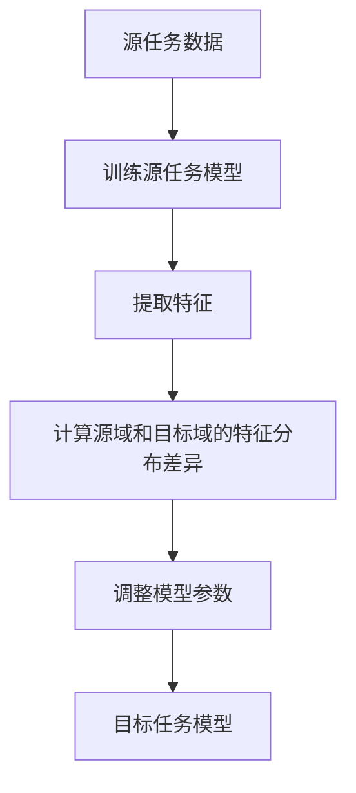

                 

# AI Agent的迁移学习在低资源语言处理中的应用

## 关键词：AI Agent, 迁移学习, 低资源语言处理, 自然语言处理, 机器学习

## 摘要：  
本文探讨了AI Agent在低资源语言处理中的应用，重点分析了迁移学习如何帮助AI Agent在数据稀缺的语言环境中有效进行语言处理。文章从迁移学习的基本概念、AI Agent的定义与特点、低资源语言处理的挑战，到迁移学习的核心原理、算法实现和实际应用案例进行了系统性地阐述。通过理论分析和实践案例的结合，本文为AI Agent在低资源语言处理中的应用提供了深入的见解和可行的解决方案。

---

## 第一部分: AI Agent的迁移学习基础

### 第1章: 迁移学习与低资源语言处理概述

#### 1.1 迁移学习的基本概念

- **1.1.1 迁移学习的定义**  
  迁移学习是一种机器学习技术，旨在通过将从一个任务或数据集中学到的知识迁移到另一个任务或数据集上，以提高学习效率和性能。其核心思想是利用已有的知识或经验来解决新问题，减少对新任务数据的依赖。

- **1.1.2 迁移学习的核心思想**  
  迁移学习的核心思想是通过共享特征或参数，减少对新任务数据的需求。这种方法特别适用于数据稀缺的情况，如低资源语言处理。

- **1.1.3 迁移学习的分类与应用场景**  
  迁移学习主要分为基于特征的迁移学习、基于参数的迁移学习和基于分布的迁移学习。应用场景包括自然语言处理、计算机视觉、语音识别等领域。

#### 1.2 AI Agent的定义与特点

- **1.2.1 AI Agent的基本概念**  
  AI Agent是一种智能体，能够感知环境、自主决策并执行任务。它具有自主性、反应性、社会性和持续性等特点。

- **1.2.2 AI Agent的核心功能**  
  包括感知环境、处理信息、决策制定、执行任务和学习提升。

- **1.2.3 AI Agent与传统AI的区别**  
  AI Agent强调自主性和适应性，能够动态调整策略以应对复杂环境，而传统AI通常依赖于固定的规则和数据。

#### 1.3 低资源语言处理的挑战

- **1.3.1 低资源语言的定义**  
  低资源语言指的是缺乏足够标注数据的语言，通常是指小语种或 minority languages。

- **1.3.2 低资源语言处理的主要挑战**  
  包括数据稀缺、计算资源不足、语言复杂性高等问题。

- **1.3.3 低资源语言处理的应用场景**  
  如机器翻译、文本分类、信息抽取等。

#### 1.4 迁移学习在低资源语言处理中的作用

- **1.4.1 迁移学习如何解决低资源问题**  
  通过利用高资源语言的数据和知识，迁移到低资源语言任务中，减少对低资源语言数据的依赖。

- **1.4.2 迁移学习在语言处理中的优势**  
  包括提高模型性能、减少训练时间、降低计算成本等。

- **1.4.3 迁移学习的未来发展趋势**  
  包括多语言迁移学习、自适应迁移学习、迁移学习与深度学习的结合等。

#### 1.5 本章小结

通过本章的介绍，我们了解了迁移学习的基本概念、AI Agent的定义与特点，以及低资源语言处理的挑战和迁移学习在其中的作用。接下来，我们将深入探讨迁移学习的核心原理和算法实现。

---

## 第二部分: 迁移学习的核心概念与原理

### 第2章: 迁移学习的核心概念

#### 2.1 迁移学习的核心要素

- **2.1.1 数据分布的差异性**  
  数据分布的差异性是迁移学习的核心问题，表现为源域和目标域的数据分布不同。

- **2.1.2 任务相似性**  
  迁移学习依赖于源任务和目标任务的相似性，任务相似性越高，迁移效果越好。

- **2.1.3 特征表示的重要性**  
  特征表示是迁移学习的关键，高质量的特征可以有效减少源域和目标域之间的分布差异。

#### 2.2 迁移学习的理论基础

- **2.2.1 表征学习的基本原理**  
  表征学习旨在通过学习数据的低维表示，捕捉数据的本质特征。

- **2.2.2 分布式语义表示**  
  如词嵌入（Word2Vec）等技术，通过分布式表示捕捉词义。

- **2.2.3 迁移学习的数学模型**  
  迁移学习的数学模型通常涉及特征变换和参数调整，旨在最小化源域和目标域之间的差异。

#### 2.3 迁移学习的挑战与解决方案

- **2.3.1 数据不平衡问题**  
  数据分布差异可能导致目标域数据稀少，影响迁移效果。

- **2.3.2 领域适应问题**  
  如何有效适应不同领域的数据分布差异，是迁移学习的关键挑战。

- **2.3.3 任务适应问题**  
  目标任务可能与源任务有所不同，需要进行任务特定的调整。

#### 2.4 本章小结

本章详细探讨了迁移学习的核心概念，包括核心要素、理论基础和面临的挑战。接下来，我们将深入分析迁移学习的算法原理。

---

## 第三部分: 迁移学习的算法原理

### 第3章: 迁移学习的算法原理

#### 3.1 迁移学习的算法分类

- **3.1.1 基于特征的迁移学习**  
  通过学习共享特征，减少源域和目标域之间的分布差异。

- **3.1.2 基于参数的迁移学习**  
  将源任务的模型参数迁移到目标任务，进行微调。

- **3.1.3 基于分布的迁移学习**  
  通过调整数据分布，使源域和目标域的数据分布更接近。

#### 3.2 迁移学习的算法实现

- **3.2.1 基于特征的迁移学习算法**  
  如匹配层（Matching Layer）和对抗训练（Adversarial Training）。

- **3.2.2 基于参数的迁移学习算法**  
  如Fine-tuning、参数初始化等方法。

- **3.2.3 基于分布的迁移学习算法**  
  如最大均值差异（Maximum Mean Discrepancy, MMD）。

#### 3.3 迁移学习的数学模型

- **3.3.1 匹配层的数学模型**  
  匹配层的目标是通过学习一个变换矩阵，使源域和目标域的特征分布更接近。

- **3.3.2 对抗训练的数学模型**  
  对抗训练通过最小化源域和目标域的特征分布差异，提高迁移效果。

- **3.3.3 Fine-tuning的数学模型**  
  在源任务模型的基础上，对目标任务的数据进行微调，优化目标任务的模型参数。

#### 3.4 迁移学习的算法流程图

#### 3.5 本章小结

本章详细介绍了迁移学习的算法分类和实现原理，通过数学模型和流程图的形式，帮助读者更好地理解迁移学习的实现过程。

---

## 作者：AI天才研究院 & 禅与计算机程序设计艺术

---

通过以上内容，我们系统性地探讨了AI Agent的迁移学习在低资源语言处理中的应用。从基础概念到算法实现，再到实际应用案例，本文为读者提供了全面的视角和深入的分析。希望本文能够为AI Agent在低资源语言处理中的应用提供有价值的参考和指导。

