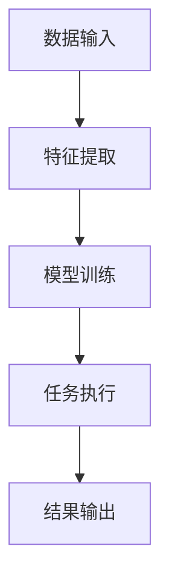

                 


# AI Agent的迁移学习技术应用

## 关键词：AI Agent、迁移学习、机器学习、算法原理、系统架构、项目实战

## 摘要：
本文深入探讨了AI Agent在迁移学习技术应用中的核心原理、算法实现和系统架构设计。通过分析迁移学习的基本概念、算法原理以及在AI Agent中的实际应用场景，本文为读者提供了从理论到实践的全面解读。文章还详细介绍了迁移学习的数学模型、算法实现步骤以及AI Agent迁移学习的系统架构设计，结合实际案例分析，帮助读者更好地理解和应用迁移学习技术。

---

# 第一部分: AI Agent与迁移学习基础

## 第1章: AI Agent的定义与核心概念

### 1.1 AI Agent的基本定义
AI Agent（人工智能代理）是指能够感知环境、自主决策并执行任务的智能体。AI Agent的核心目标是通过感知和行动与环境交互，以实现特定的目标。AI Agent可以分为简单反射型代理、基于模型的反射型代理、目标驱动型代理和效用驱动型代理。

### 1.2 AI Agent的核心特征
- **自主性**：AI Agent能够自主决策，无需外部干预。
- **反应性**：AI Agent能够实时感知环境并做出反应。
- **目标驱动**：AI Agent的行为通常是为了实现特定的目标。
- **学习能力**：AI Agent可以通过学习提升自身的智能水平。

### 1.3 AI Agent的分类与应用场景
AI Agent可以根据智能水平分为反应式代理、基于模型的代理和目标驱动型代理。AI Agent广泛应用于自动驾驶、智能助手、机器人控制、游戏AI等领域。

## 第2章: 迁移学习的基本概念

### 2.1 迁移学习的定义
迁移学习是指将一个领域（源域）中的知识迁移到另一个领域（目标域）中，以提升目标域模型性能的技术。迁移学习的核心思想是利用源域和目标域之间的共享特征，减少对目标域数据的依赖。

### 2.2 迁移学习的核心思想
迁移学习的核心思想是通过共享特征或任务之间的相似性，将源域的知识迁移到目标域，从而减少目标域数据的需求，提升模型的泛化能力。

### 2.3 迁移学习与传统机器学习的区别
- **数据依赖性**：传统机器学习需要大量目标域数据，而迁移学习可以在目标域数据有限的情况下进行学习。
- **任务适应性**：迁移学习强调任务之间的相似性，而传统机器学习通常专注于单一任务。
- **知识共享**：迁移学习通过共享特征或任务结构实现知识共享，而传统机器学习通常不考虑跨任务的知识共享。

## 第3章: AI Agent中的迁移学习技术

### 3.1 AI Agent与迁移学习的关系
AI Agent的任务需求通常需要处理多个相关任务或领域，迁移学习在AI Agent中起着关键作用。通过迁移学习，AI Agent可以快速适应新环境、新任务，提升其智能性和实用性。

### 3.2 迁移学习在AI Agent中的应用场景
- **多任务学习**：AI Agent需要同时处理多个任务时，可以通过迁移学习共享任务之间的特征和知识。
- **领域适应**：在目标领域数据有限的情况下，AI Agent可以通过迁移学习从源领域学习到目标领域。
- **知识迁移**：通过迁移学习，AI Agent可以将已知领域的知识迁移到未知领域，提升其智能性。

---

# 第二部分: 迁移学习的算法原理与数学模型

## 第4章: 迁移学习的核心算法

### 4.1 迁移学习的主要算法
- **基于特征的迁移学习算法**：通过提取共享特征，将源域和目标域的数据映射到同一个特征空间。
- **基于标签的迁移学习算法**：利用标签信息进行跨领域迁移。
- **基于实例的迁移学习算法**：通过实例相似性进行迁移。

### 4.2 迁移学习算法的数学推导
迁移学习的数学模型通常包括源域和目标域的联合分布、特征提取函数、以及目标函数的优化。通过数学推导，可以更好地理解迁移学习算法的工作原理。

## 第5章: 迁移学习的数学模型与公式

### 5.1 迁移学习的数学模型
- **源域和目标域的联合分布**：表示源域和目标域数据的联合概率分布。
- **迁移学习的条件概率模型**：描述目标域数据在源域模型下的条件概率分布。
- **迁移学习的损失函数与目标函数**：定义模型的优化目标。

### 5.2 迁移学习的关键公式
- **目标函数**：通常包括源域和目标域的损失函数，以及迁移项的损失函数。
- **损失函数**：用于衡量模型在源域和目标域上的预测误差。
- **优化算法**：用于优化目标函数的数学方法，如梯度下降、Adam等。

## 第6章: 迁移学习的算法实现

### 6.1 迁移学习算法的实现步骤
- **数据预处理与特征提取**：对源域和目标域数据进行预处理，提取共享特征。
- **模型训练与参数优化**：基于迁移学习的目标函数，训练模型并优化参数。
- **模型评估与性能分析**：通过测试数据评估模型的性能，并分析迁移学习的效果。

### 6.2 迁移学习的Python实现
- **环境搭建与库安装**：安装必要的Python库，如TensorFlow、Keras等。
- **数据加载与处理**：加载源域和目标域数据，进行预处理。
- **模型定义与训练**：定义迁移学习模型，进行训练并优化参数。
- **模型评估与结果分析**：评估模型在目标域上的性能，并分析迁移学习的效果。

---

# 第三部分: AI Agent迁移学习的系统架构与设计

## 第7章: AI Agent迁移学习的系统架构

### 7.1 系统架构设计
AI Agent迁移学习的系统架构通常包括数据输入、特征提取、模型训练、任务执行和结果输出等模块。系统架构设计需要考虑源域和目标域的数据特点，以及迁移学习算法的实现。

### 7.2 系统功能设计
- **数据输入模块**：接收源域和目标域的数据。
- **特征提取模块**：提取共享特征，进行特征对齐。
- **模型训练模块**：基于迁移学习算法，训练模型并优化参数。
- **任务执行模块**：将训练好的模型应用于目标任务。
- **结果输出模块**：输出模型的预测结果和性能评估。

### 7.3 系统架构图


## 第8章: 迁移学习的系统实现

### 8.1 系统实现步骤
- **问题场景介绍**：描述迁移学习的应用场景和目标。
- **系统功能设计**：设计系统的功能模块和交互流程。
- **系统架构设计**：绘制系统架构图和类图。
- **系统接口设计**：定义系统之间的接口和交互协议。
- **系统交互图**：绘制系统交互的序列图。

### 8.2 系统实现代码
```python
import tensorflow as tf
from tensorflow import keras
from tensorflow.keras import layers

# 数据输入模块
def load_data():
    # 加载源域和目标域数据
    pass

# 特征提取模块
def feature_extraction():
    # 提取共享特征
    pass

# 模型训练模块
def train_model():
    model = keras.Sequential([
        layers.Dense(64, activation='relu'),
        layers.Dense(10, activation='softmax')
    ])
    model.compile(optimizer='adam', loss='sparse_categorical_crossentropy', metrics=['accuracy'])
    return model

# 任务执行模块
def execute_task(model):
    # 应用模型进行预测
    pass

# 结果输出模块
def output_results():
    # 输出结果
    pass
```

---

# 第四部分: 项目实战与总结

## 第9章: 项目实战

### 9.1 环境安装与配置
- **安装Python**：安装Python 3.8及以上版本。
- **安装库**：安装TensorFlow、Keras、scikit-learn等库。

### 9.2 核心代码实现
```python
import tensorflow as tf
from tensorflow import keras
from tensorflow.keras import layers
import numpy as np

# 加载数据
def load_data():
    # 加载源域和目标域数据
    pass

# 特征提取
def feature_extraction():
    # 提取共享特征
    pass

# 模型定义
def create_model(input_shape):
    model = keras.Sequential([
        layers.Dense(64, activation='relu', input_shape=input_shape),
        layers.Dense(10, activation='softmax')
    ])
    return model

# 迁移学习算法实现
def transfer_learning():
    # 实现迁移学习算法
    pass

# 训练模型
def train_model(model, X_train, y_train, X_val, y_val):
    model.compile(optimizer='adam', loss='sparse_categorical_crossentropy', metrics=['accuracy'])
    history = model.fit(X_train, y_train, epochs=10, validation_data=(X_val, y_val))
    return model, history

# 模型评估
def evaluate_model(model, X_test, y_test):
    loss, accuracy = model.evaluate(X_test, y_test)
    print(f"Test loss: {loss}, Test accuracy: {accuracy}")

# 主函数
def main():
    # 加载数据
    X_train, y_train, X_val, y_val, X_test, y_test = load_data()
    # 特征提取
    feature_extractor = feature_extraction()
    # 模型定义
    model = create_model(feature_extractor.input_shape)
    # 迁移学习算法实现
    model, history = train_model(model, X_train, y_train, X_val, y_val)
    # 模型评估
    evaluate_model(model, X_test, y_test)

if __name__ == "__main__":
    main()
```

### 9.3 案例分析与结果解读
通过实际案例分析，展示迁移学习在AI Agent中的应用效果，并对结果进行详细解读。

### 9.4 项目小结
总结迁移学习在AI Agent中的应用价值，以及在实际项目中的实现经验。

## 第10章: 总结与展望

### 10.1 迁移学习在AI Agent中的总结
总结迁移学习在AI Agent中的核心作用，以及其在实际应用中的优势和挑战。

### 10.2 迁移学习的未来展望
展望迁移学习技术在未来的发展方向，以及其在AI Agent中的潜在应用。

## 第11章: 最佳实践与注意事项

### 11.1 最佳实践
- **数据预处理**：确保数据的质量和一致性。
- **特征提取**：选择合适的特征提取方法，提升迁移效果。
- **模型优化**：合理选择模型结构和优化算法，提升模型性能。

### 11.2 注意事项
- **数据分布差异**：注意源域和目标域之间的数据分布差异，避免迁移失败。
- **模型过拟合**：防止模型在源域上过拟合，影响目标域的性能。
- **计算资源**：迁移学习通常需要较多的计算资源，确保硬件配置足够。

## 第12章: 拓展阅读

### 12.1 推荐书籍
- 《迁移学习》（《Transfer Learning》）
- 《深度学习》（《Deep Learning》）

### 12.2 推荐论文
- "A Survey on Transfer Learning"（《迁移学习综述》）
- "Deep Transfer Learning"（《深度迁移学习》）

### 12.3 推荐博客与技术文章
- 知乎专栏：迁移学习入门与进阶
- GitHub开源项目：迁移学习代码实现

---

# 作者：AI天才研究院/AI Genius Institute & 禅与计算机程序设计艺术 /Zen And The Art of Computer Programming

---

通过以上目录大纲，您可以逐步展开每个章节的内容，结合实际案例和技术实现，深入理解AI Agent的迁移学习技术应用。

