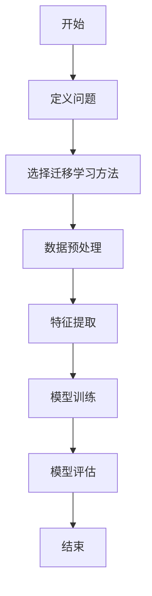
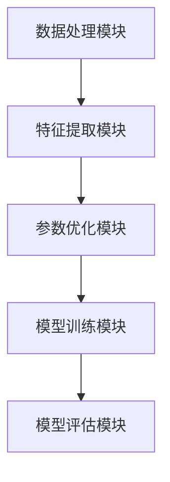
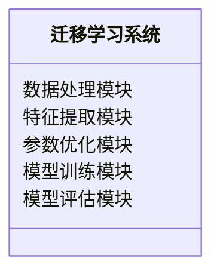

                 


# AI Agent的迁移学习能力开发

> 关键词：AI Agent, 迁移学习, 人工智能, 系统架构, 算法实现

> 摘要：本文深入探讨AI Agent的迁移学习能力开发，从背景介绍、核心概念、算法原理到系统架构和项目实战，全面解析迁移学习在AI Agent中的应用与实现。

---

## 第1章: 迁移学习的背景与核心概念

### 1.1 迁移学习的定义与背景

#### 1.1.1 什么是迁移学习
- 迁移学习的定义
- 迁移学习的核心问题背景
- 迁移学习的重要性和应用领域

#### 1.1.2 迁移学习的背景与问题背景
- 传统机器学习的局限性
- 迁移学习的提出动机
- 迁移学习的实际问题场景

#### 1.1.3 迁移学习的核心目标与问题解决
- 迁移学习的核心目标
- 迁移学习解决的实际问题
- 迁移学习的适用场景与边界

### 1.2 迁移学习的核心概念与技术原理

#### 1.2.1 迁移学习的核心概念
- 特征表示与任务适应
- 参数优化与模型迁移
- 迁移学习的关键技术与方法

#### 1.2.2 迁移学习的核心技术与方法
- 特征提取与表示
- 参数优化与模型调整
- 任务适应与迁移策略

#### 1.2.3 迁移学习的边界与外延
- 迁移学习的适用范围
- 迁移学习的边界条件
- 迁移学习与其他AI技术的关系

### 1.3 迁移学习的核心要素与概念结构

#### 1.3.1 迁移学习的核心要素分析
- 数据源与目标数据
- 任务源与任务目标
- 特征空间与模型参数

#### 1.3.2 迁移学习的概念结构与模型
- 迁移学习的模型框架
- 迁移学习的概念图解
- 迁移学习的数学表达式

#### 1.3.3 迁移学习与相关概念的对比分析
- 迁移学习与传统机器学习的对比
- 迁移学习与深度学习的对比
- 迁移学习与其他AI技术的对比

### 1.4 本章小结

---

## 第2章: 迁移学习的核心概念与技术联系

### 2.1 迁移学习的核心概念原理

#### 2.1.1 特征表示与任务适应
- 特征表示的核心作用
- 任务适应的实现方法
- 特征表示与任务适应的关系

#### 2.1.2 参数优化与模型迁移
- 参数优化的原理与方法
- 模型迁移的实现策略
- 参数优化与模型迁移的结合

#### 2.1.3 迁移学习的数学模型与公式
- 迁移学习的数学表达式
- 参数优化的公式推导
- 模型迁移的数学模型

### 2.2 迁移学习的核心概念对比分析

#### 2.2.1 迁移学习与传统机器学习的对比
- 传统机器学习的特点与局限性
- 迁移学习的优势与创新点
- 两者在实际应用中的对比

#### 2.2.2 迁移学习与深度学习的对比
- 深度学习的特点与优势
- 迁移学习与深度学习的结合
- 两者的异同点分析

#### 2.2.3 迁移学习与其他AI技术的对比
- 迁移学习与自然语言处理的对比
- 迁移学习与计算机视觉的对比
- 两者的结合与应用

### 2.3 迁移学习的ER实体关系图与流程图

#### 2.3.1 ER实体关系图
```mermaid
erDiagram
    actor 迁移学习用户 {
        <属性> 用户ID
        <属性> 用户需求
    }
    actor 数据源 {
        <属性> 数据集ID
        <属性> 数据特征
    }
    actor 任务目标 {
        <属性> 任务ID
        <属性> 任务目标
    }
    迁移学习用户 --> 数据源: 提供数据
    迁移学习用户 --> 任务目标: 定义目标
    数据源 --> 任务目标: 提供特征
```

#### 2.3.2 迁移学习的流程图（使用mermaid）


---

## 第3章: 迁移学习的算法原理与数学模型

### 3.1 迁移学习的算法原理

#### 3.1.1 特征表示与参数优化
- 特征表示的核心原理
- 参数优化的算法实现
- 两者结合的优化策略

#### 3.1.2 迁移学习的数学模型
- 迁移学习的数学公式
- 参数优化的数学推导
- 模型迁移的数学表达

#### 3.1.3 迁移学习的算法流程
- 算法的步骤分解
- 算法的实现流程
- 算法的优化技巧

### 3.2 迁移学习的数学模型与公式

#### 3.2.1 特征表示的数学模型
- 特征表示的公式表示
- 参数优化的数学推导
- 模型迁移的数学公式

#### 3.2.2 迁移学习的数学推导
- 参数优化的详细推导
- 模型迁移的数学证明
- 特征表示的数学分析

#### 3.2.3 迁移学习的算法实现
- 算法实现的步骤分解
- 算法实现的代码示例
- 算法实现的优化建议

### 3.3 迁移学习的算法实现与优化

#### 3.3.1 算法实现的核心步骤
- 数据预处理
- 特征提取
- 模型训练
- 模型评估

#### 3.3.2 算法实现的代码示例
```python
def transfer_learning_algorithm():
    # 数据预处理
    preprocess_data()
    
    # 特征提取
    extract_features()
    
    # 参数优化
    optimize_parameters()
    
    # 模型训练
    train_model()
    
    # 模型评估
    evaluate_model()
```

#### 3.3.3 算法优化与改进
- 参数优化的技巧
- 模型迁移的策略
- 算法实现的优化建议

### 3.4 本章小结

---

## 第4章: 迁移学习的系统架构与设计

### 4.1 迁移学习的系统架构设计

#### 4.1.1 系统功能模块设计
- 数据处理模块
- 特征提取模块
- 参数优化模块
- 模型训练模块
- 模型评估模块

#### 4.1.2 系统架构设计


#### 4.1.3 系统架构的实现细节
- 模块之间的交互流程
- 模块内部的实现细节
- 系统架构的优化建议

### 4.2 迁移学习的系统设计与实现

#### 4.2.1 系统功能设计
- 系统功能模块划分
- 功能模块的实现细节
- 功能模块的交互流程

#### 4.2.2 系统设计的mermaid类图


#### 4.2.3 系统接口设计
- 系统接口的设计原则
- 接口的实现细节
- 接口的交互流程

### 4.3 迁移学习的系统实现与优化

#### 4.3.1 系统实现的核心步骤
- 系统环境的搭建
- 系统模块的实现
- 系统功能的测试

#### 4.3.2 系统优化与改进
- 系统性能的优化
- 系统功能的扩展
- 系统架构的改进

### 4.4 本章小结

---

## 第5章: 迁移学习的项目实战与案例分析

### 5.1 项目实战: 迁移学习的环境搭建

#### 5.1.1 环境搭建的步骤
- 安装必要的软件和库
- 配置开发环境
- 确保环境的兼容性

#### 5.1.2 环境搭建的注意事项
- 环境配置的常见问题
- 环境配置的优化建议
- 环境配置的验证方法

### 5.2 项目实战: 迁移学习的核心实现

#### 5.2.1 核心实现的代码示例
```python
def main():
    # 数据预处理
    preprocess_data()
    
    # 特征提取
    extract_features()
    
    # 参数优化
    optimize_parameters()
    
    # 模型训练
    train_model()
    
    # 模型评估
    evaluate_model()
    
if __name__ == "__main__":
    main()
```

#### 5.2.2 代码实现的详细解读
- 代码实现的逻辑分析
- 代码实现的关键点
- 代码实现的注意事项

### 5.3 项目实战: 迁移学习的案例分析

#### 5.3.1 案例分析的核心步骤
- 案例分析的背景介绍
- 案例分析的方法
- 案例分析的结果

#### 5.3.2 案例分析的详细解读
- 案例分析的实现细节
- 案例分析的结果解读
- 案例分析的总结与启示

### 5.4 本章小结

---

## 第6章: 迁移学习的最佳实践与小结

### 6.1 迁移学习的最佳实践

#### 6.1.1 开发经验总结
- 开发过程中的经验和教训
- 开发过程中的注意事项
- 开发过程中的优化技巧

#### 6.1.2 迁移学习的注意事项
- 迁移学习的常见问题
- 迁移学习的解决策略
- 迁移学习的未来发展

### 6.2 迁移学习的未来展望

#### 6.2.1 迁移学习的发展趋势
- 迁移学习的未来发展方向
- 迁移学习的创新技术
- 迁移学习的应用前景

#### 6.2.2 迁移学习的潜在挑战
- 迁移学习面临的挑战
- 迁移学习的解决思路
- 迁移学习的未来研究方向

### 6.3 本章小结

---

## 作者：AI天才研究院/AI Genius Institute & 禅与计算机程序设计艺术 /Zen And The Art of Computer Programming

