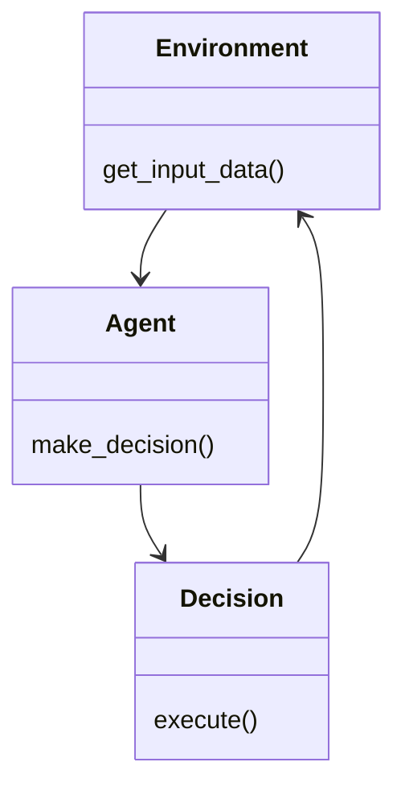

                 


# AI Agent的道德决策框架设计

> 关键词：AI Agent、道德决策、伦理框架、算法设计、系统架构

> 摘要：AI Agent的道德决策框架设计是人工智能领域的重要研究方向，旨在为AI Agent赋予道德决策能力，使其在复杂环境中能够做出符合伦理规范的决策。本文从AI Agent的基本概念出发，深入探讨道德决策框架的核心概念、算法原理、系统架构设计，并结合实际案例进行分析，最后总结经验和展望未来发展方向。

---

## 第一章: AI Agent的背景与概念

### 1.1 AI Agent的基本概念

AI Agent（人工智能代理）是指能够感知环境、自主决策并采取行动的智能实体。AI Agent可以是软件程序、机器人或其他智能系统，其核心特征包括自主性、反应性、目标导向和社会性。

- **自主性**：AI Agent能够自主决策，无需外部干预。
- **反应性**：AI Agent能够实时感知环境并做出响应。
- **目标导向**：AI Agent的行为通常是为了实现特定目标。
- **社会性**：AI Agent能够与其他实体（包括人类和其他AI Agent）进行交互和协作。

### 1.2 AI Agent的发展历史

AI Agent的概念起源于20世纪60年代的知识检索和专家系统研究。随着技术的进步，AI Agent逐渐从简单的规则驱动系统演变为复杂的自主决策系统。近年来，随着深度学习和强化学习技术的发展，AI Agent在游戏、自动驾驶、智能助手等领域取得了显著进展。

### 1.3 道德决策的必要性

AI Agent的决策过程需要考虑伦理和道德因素，以确保其行为符合人类社会的价值观和法律法规。例如，在自动驾驶汽车中，AI Agent需要在紧急情况下做出道德决策，以最小化伤害。

### 1.4 本章小结

本章介绍了AI Agent的基本概念、发展历史和道德决策的重要性，为后续内容奠定了基础。

---

## 第二章: 道德决策框架的核心概念

### 2.1 道德决策框架的定义

道德决策框架是一种用于指导AI Agent在复杂环境中做出符合伦理规范的决策的系统。它通常包括规则、目标、约束条件和伦理规范等核心要素。

### 2.2 道德决策框架与相关概念的关系

- **与伦理学的关系**：道德决策框架借鉴了伦理学的理论，例如义务论、功利主义等。
- **与法律的关系**：道德决策框架需要考虑法律法规的要求，确保AI Agent的行为符合法律规范。
- **与社会规范的关系**：道德决策框架需要适应社会文化背景，尊重不同社会的伦理价值观。

### 2.3 道德决策框架的ER实体关系图

```mermaid
er
    Actor: 用户
    Agent: AI Agent
    Decision: 决策
    Ethics: 道德规范
    Rule: 规则
    Constraint: 约束条件
    Relation: 关系
    用户 --> 决策
    决策 --> 道德规范
    决策 --> 规则
    决策 --> 约束条件
```

### 2.4 本章小结

本章详细探讨了道德决策框架的核心概念及其与相关领域的联系，为后续的算法设计提供了理论基础。

---

## 第三章: 道德决策框架的算法原理

### 3.1 基于规则的道德决策算法

基于规则的道德决策算法是一种简单但有效的决策方法。它通过预定义的规则和约束条件来指导AI Agent的决策过程。

#### 3.1.1 算法原理

基于规则的道德决策算法的基本原理是：根据输入的环境信息，匹配预定义的规则，输出相应的决策。规则可以是简单的条件语句，也可以是复杂的逻辑表达式。

#### 3.1.2 算法实现

以下是一个简单的基于规则的道德决策算法的Python实现示例：

```python
def make_moral_decision(environment):
    if environment.human_in_danger():
        return "帮助人类"
    elif environment.animal_in_danger():
        return "帮助动物"
    else:
        return "保持中立"
```

#### 3.1.3 示例分析

假设有一个自动驾驶汽车，其道德决策框架需要在紧急情况下做出决策。基于规则的算法可以根据预定义的规则，例如“优先保护车内乘客的生命安全”，做出相应的决策。

---

### 3.2 基于效用的道德决策算法

基于效用的道德决策算法是一种更加灵活的决策方法。它通过评估不同决策的效用值，选择最优的决策方案。

#### 3.2.1 算法原理

基于效用的道德决策算法的基本原理是：为每个可能的决策分配一个效用值，然后选择效用值最大的决策。

#### 3.2.2 算法实现

以下是一个基于效用的道德决策算法的Python实现示例：

```python
def calculate_utility(decision):
    return decision.util_score

def make_moral_decision(environment):
    decisions = environment.get_possible_decisions()
    max_utility = -infinity
    best_decision = None
    for decision in decisions:
        utility = calculate_utility(decision)
        if utility > max_utility:
            max_utility = utility
            best_decision = decision
    return best_decision
```

#### 3.2.3 示例分析

假设有一个AI Agent需要在两个选项中做出决策：一个是帮助人类，另一个是保护环境。基于效用的算法可以根据预定义的效用函数，选择效用值更高的决策。

---

### 3.3 基于学习的道德决策算法

基于学习的道德决策算法是一种更加复杂但强大的决策方法。它通过学习历史数据，生成决策模型，从而做出决策。

#### 3.3.1 算法原理

基于学习的道德决策算法的基本原理是：通过机器学习技术（如深度学习、强化学习等），训练模型，使其能够根据输入的环境信息，输出相应的决策。

#### 3.3.2 算法实现

以下是一个简单的基于学习的道德决策算法的Python实现示例：

```python
import tensorflow as tf

def build_model():
    model = tf.keras.Sequential([
        tf.keras.layers.Dense(64, activation='relu'),
        tf.keras.layers.Dense(1, activation='sigmoid')
    ])
    model.compile(optimizer='adam', loss='binary_crossentropy', metrics=['accuracy'])
    return model

def make_moral_decision(environment):
    model = build_model()
    model.load_weights('moral_decision_weights.h5')
    input_data = environment.get_input_data()
    prediction = model.predict(input_data)
    return prediction
```

#### 3.3.3 示例分析

假设有一个AI Agent需要在多个选项中做出决策。基于学习的算法可以通过训练模型，使其能够根据输入的环境信息，输出相应的决策。

---

## 第四章: 道德决策框架的系统架构设计

### 4.1 问题场景介绍

假设我们正在设计一个自动驾驶汽车的道德决策框架。该框架需要在紧急情况下，做出符合伦理规范的决策。

### 4.2 系统功能设计

系统功能包括环境感知、决策计算和结果输出。

#### 4.2.1 环境感知

AI Agent需要感知环境信息，例如道路状况、其他车辆的位置和速度、行人位置等。

#### 4.2.2 决策计算

AI Agent需要根据环境信息，结合道德决策框架，计算出最优的决策。

#### 4.2.3 结果输出

AI Agent需要输出决策结果，例如转向、加速或减速。

### 4.3 系统架构设计

以下是系统的类图：



### 4.4 本章小结

本章详细探讨了道德决策框架的系统架构设计，包括功能设计和架构图。

---

## 第五章: 项目实战

### 5.1 项目介绍

本项目旨在设计一个自动驾驶汽车的道德决策框架，使其在紧急情况下做出符合伦理规范的决策。

### 5.2 核心代码实现

以下是道德决策框架的核心代码实现：

```python
class MoralDecisionFramework:
    def __init__(self):
        self.rules = []
        self.constraints = []

    def add_rule(self, rule):
        self.rules.append(rule)

    def add_constraint(self, constraint):
        self.constraints.append(constraint)

    def make_decision(self, environment):
        # 匹配规则
        for rule in self.rules:
            if rule.matches(environment):
                return rule.apply(environment)
        # 匹配约束条件
        for constraint in self.constraints:
            if constraint.matches(environment):
                return constraint.apply(environment)
        # 默认决策
        return "保持中立"
```

### 5.3 实际案例分析

假设自动驾驶汽车遇到紧急情况，需要在帮助人类或保护环境之间做出决策。道德决策框架可以根据预定义的规则和约束条件，选择最优的决策。

---

## 第六章: 总结与展望

### 6.1 本章总结

本文详细探讨了AI Agent的道德决策框架设计，包括基本概念、算法原理、系统架构设计和项目实战。

### 6.2 未来展望

未来，随着人工智能技术的不断发展，道德决策框架将变得更加复杂和智能。我们需要进一步研究如何将不同的伦理学理论融入决策框架中，以应对更加复杂的决策场景。

### 6.3 最佳实践 Tips

- 在设计道德决策框架时，需要考虑不同的伦理学理论和法律法规。
- 道德决策框架的设计需要结合实际应用场景，确保决策的可解释性和透明性。
- 道德决策框架的实现需要考虑系统的实时性和安全性。

---

## 作者

作者：AI天才研究院/AI Genius Institute & 禅与计算机程序设计艺术 /Zen And The Art of Computer Programming

---

以上是《AI Agent的道德决策框架设计》的技术博客文章的完整目录大纲和部分内容。希望这篇文章能够为读者提供清晰的思路和实用的知识，帮助他们在实际应用中设计和实现AI Agent的道德决策框架。

