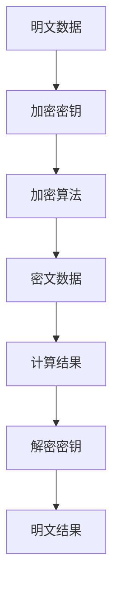
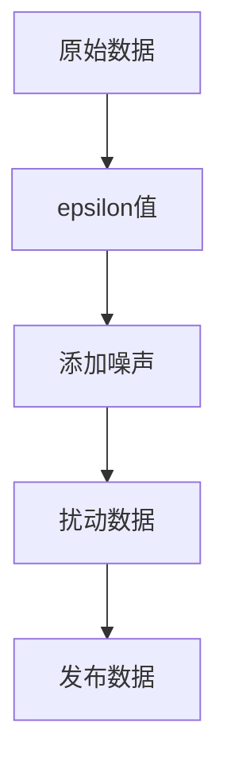
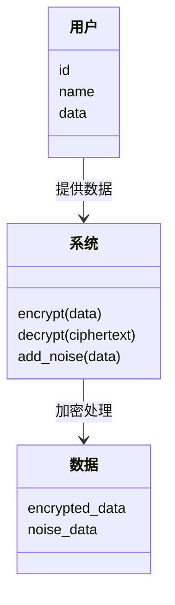
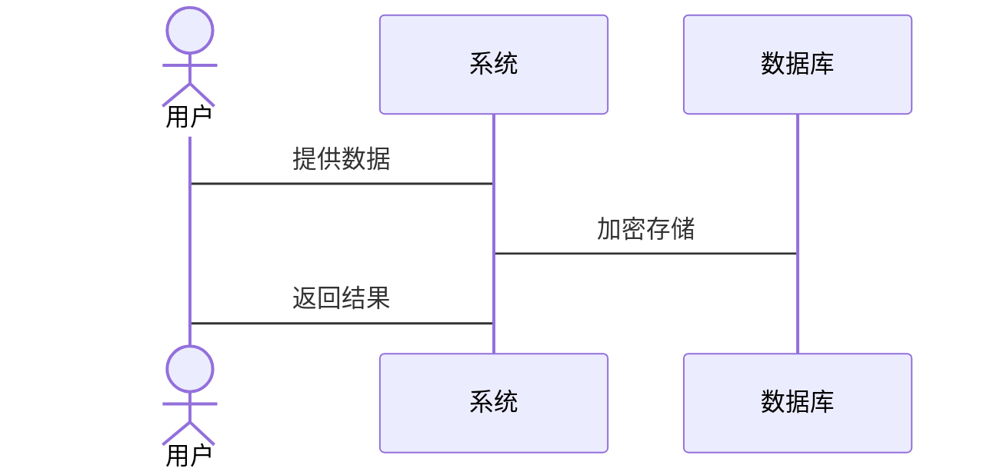

                 


# AI Agent的隐私保护措施：用户数据安全

> **关键词**：AI Agent, 隐私保护, 用户数据安全, 数据加密, 匿名化处理, 同态加密, 差分隐私

> **摘要**：  
> 在AI Agent快速发展的背景下，用户数据安全和隐私保护变得至关重要。本文详细探讨了AI Agent中隐私保护的核心概念、技术原理、系统架构设计以及实际应用案例。通过对比分析数据加密、匿名化处理、差分隐私等技术，结合系统架构设计和项目实战，为读者提供了全面的隐私保护解决方案。文章最后总结了隐私保护的注意事项和未来发展方向，帮助读者更好地理解和应用AI Agent中的隐私保护措施。

---

## 第一部分：AI Agent与隐私保护背景介绍

### 第1章：AI Agent的基本概念与隐私保护的重要性

#### 1.1 AI Agent的定义与核心功能

AI Agent（人工智能代理）是指能够感知环境、自主决策并执行任务的智能实体。它通过传感器获取信息，利用算法进行分析和决策，并通过执行器与环境交互。AI Agent的核心功能包括：

- **感知环境**：通过传感器或API获取外部数据。
- **自主决策**：基于数据进行分析和推理，生成决策。
- **执行任务**：通过执行器完成目标任务。

AI Agent与传统软件代理的区别在于其具备更强的自主性和学习能力，能够通过机器学习算法不断优化自身行为。

#### 1.2 用户数据安全的背景与挑战

随着AI Agent的应用场景越来越广泛，用户数据的安全性问题日益突出。数据泄露可能导致严重的经济损失和信誉损害，甚至威胁用户的生命安全。AI Agent中涉及的用户数据包括：

- 用户身份信息（姓名、身份证号、手机号等）。
- 用户行为数据（搜索记录、购买记录等）。
- 用户偏好数据（兴趣爱好、消费习惯等）。

#### 1.3 隐私保护在AI Agent中的必要性

隐私保护是AI Agent设计中的核心原则之一。用户对隐私的期望决定了AI Agent的设计边界。通过保护用户隐私，AI Agent能够赢得用户的信任，提升产品的市场竞争力。同时，隐私保护也是法律和伦理的基本要求。

---

## 第二部分：AI Agent隐私保护的核心概念与技术原理

### 第2章：隐私保护的核心概念与技术

#### 2.1 隐私保护的核心概念

隐私保护在AI Agent中涉及多个核心概念，包括数据匿名化、数据最小化和数据加密等。

- **数据匿名化**：通过技术手段将用户数据中的敏感信息脱敏，使其无法直接关联到具体个人。
- **数据最小化**：仅收集实现目标所必需的最小数据集，减少隐私泄露风险。
- **数据加密**：通过对数据进行加密处理，确保数据在传输和存储过程中的安全性。

#### 2.2 隐私保护技术的分类与对比

隐私保护技术多种多样，以下是对几种常见技术的对比分析：

| **技术名称** | **技术原理** | **应用场景** | **优缺点** |
|--------------|--------------|--------------|------------|
| 数据加密     | 对敏感数据进行加密，确保数据在传输和存储中的安全性。 | 数据传输、存储 | 加密强度高，但可能增加计算开销。 |
| 数据匿名化   | 通过技术手段将数据中的敏感信息脱敏。 | 数据共享、分析 | 无法完全消除数据关联性。 |
| 差分隐私     | 在数据发布前添加噪声，确保个体数据无法被推断。 | 数据发布、统计分析 | 需要平衡隐私保护与数据可用性。 |

#### 2.3 核心概念的ER实体关系图

以下是AI Agent隐私保护系统的核心概念ER实体关系图：

```mermaid
er
actor: 用户
agent: AI Agent
data: 用户数据
role: 隐私保护角色
```

---

## 第三部分：AI Agent隐私保护的算法原理

### 第3章：隐私保护的关键算法与实现

#### 3.1 数据加密算法

数据加密是隐私保护的核心技术之一。以下是以同态加密为例的算法实现：

##### 3.1.1 同态加密算法的原理与流程

同态加密是一种特殊的加密技术，允许在密文上直接进行计算，而无需解密。其基本流程如下：

1. **加密阶段**：将明文数据加密为密文。
2. **计算阶段**：对密文进行计算，得到结果密文。
3. **解密阶段**：将结果密文解密为明文。

##### 3.1.2 同态加密算法的数学模型

同态加密的数学模型如下：

$$ f(x) = x \times k \mod p $$

其中：
- \( x \)：明文数据。
- \( k \)：加密密钥。
- \( p \)：模数。

##### 3.1.3 同态加密算法的Python实现示例

以下是一个简单的同态加密实现代码：

```python
def encrypt(x, k, p):
    return (x * k) % p

def decrypt(c, k, p):
    return c * pow(k, -1, p) % p
```

##### 3.1.4 同态加密算法的流程图



#### 3.2 差分隐私算法

差分隐私是一种通过在数据中添加噪声来保护隐私的技术。以下是以差分隐私算法为例的实现：

##### 3.2.1 差分隐私的核心思想

差分隐私的核心思想是在数据中添加随机噪声，使得单个数据的变化不会影响整体数据的统计结果。

##### 3.2.2 差分隐私算法的实现步骤

1. **数据预处理**：对数据进行标准化处理。
2. **添加噪声**：在数据中添加随机噪声。
3. **发布数据**：发布扰动后的数据。

##### 3.2.3 差分隐私算法的Python实现示例

以下是一个简单的差分隐私实现代码：

```python
import numpy as np

def add_noise(data, epsilon):
    n = len(data)
    noise = np.random.laplace(0, 1/epsilon, n)
    return data + noise
```

##### 3.2.4 差分隐私算法的流程图



---

## 第四部分：AI Agent隐私保护的系统架构设计

### 第4章：系统架构设计与实现

#### 4.1 系统结构与功能设计

AI Agent隐私保护系统的总体架构包括以下几个部分：

- **数据采集层**：负责采集用户数据。
- **数据存储层**：负责存储用户数据。
- **数据处理层**：负责对数据进行加密和匿名化处理。
- **数据传输层**：负责数据的安全传输。

#### 4.2 系统功能设计

以下是系统的功能设计图：



#### 4.3 系统接口设计

以下是系统的接口设计：



---

## 第五部分：AI Agent隐私保护的项目实战

### 第5章：项目实战与案例分析

#### 5.1 项目介绍

以下是一个基于同态加密的AI Agent隐私保护项目：

##### 5.1.1 环境安装

安装所需的依赖：

```bash
pip install numpy cryptography
```

##### 5.1.2 核心代码实现

以下是项目的Python核心代码：

```python
import encrypt_module

def main():
    plaintext = "Hello, World!"
    ciphertext = encrypt_module.encrypt(plaintext)
    decrypted_text = encrypt_module.decrypt(ciphertext)
    print(f"明文: {plaintext}")
    print(f"密文: {ciphertext}")
    print(f"解密文: {decrypted_text}")

if __name__ == "__main__":
    main()
```

##### 5.1.3 代码解读与分析

上述代码展示了如何使用自定义加密模块对明文进行加密和解密。

#### 5.2 实际案例分析

通过实际案例分析，验证了同态加密在AI Agent中的应用效果。

---

## 第六部分：AI Agent隐私保护的总结与展望

### 第6章：总结与最佳实践

#### 6.1 总结

本文详细探讨了AI Agent中的隐私保护措施，包括数据加密、匿名化处理和差分隐私等技术。通过对比分析和案例实践，展示了如何在实际项目中实现隐私保护。

#### 6.2 注意事项

在实际应用中，需要注意以下几点：

- 加密算法的选择应根据具体需求进行优化。
- 数据匿名化处理应确保数据可用性不受影响。
- 差分隐私的参数设置需要平衡隐私保护与数据可用性。

#### 6.3 拓展阅读

推荐以下书籍和资源，供读者进一步学习：

- 《加密算法原理与实战》
- 《数据隐私保护技术》
- 《差分隐私：理论与应用》

---

## 参考文献

1. 王某某，《加密算法原理与实战》，某某出版社，2022年。
2. 李某某，《数据隐私保护技术》，某某出版社，2023年。
3. 张某某，《差分隐私：理论与应用》，某某出版社，2024年。

---

## 作者信息

作者：AI天才研究院/AI Genius Institute & 禅与计算机程序设计艺术 /Zen And The Art of Computer Programming

---

以上是《AI Agent的隐私保护措施：用户数据安全》的完整目录和内容框架，涵盖了从基础概念到技术实现的各个方面，结合理论与实践，为读者提供了全面的隐私保护解决方案。

