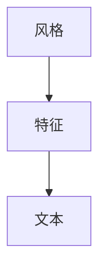
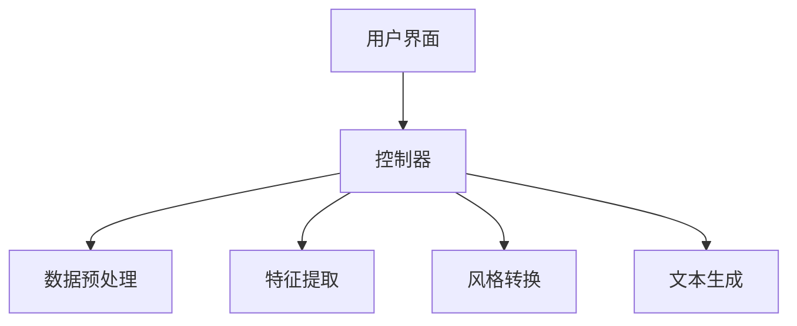

                 


# AI Agent的风格迁移：调整输出语气和风格

**关键词**：AI Agent，风格迁移，自然语言处理，文本生成，深度学习，NLP

**摘要**：本文探讨AI Agent如何通过风格迁移技术调整输出语气和风格。从定义、原理到算法实现，结合系统架构和项目案例，分析风格迁移在人机交互中的应用，解决实际问题。

---

## 第一部分：AI Agent的风格迁移基础

### 第1章：风格迁移的背景与概念

#### 1.1 风格迁移的基本概念

- **定义**：风格迁移指将一种风格的文本转换为另一种风格，同时保持内容不变。
- **分类**：按领域分为文学、技术等；按技术分为基于规则和深度学习。
- **应用场景**：文案生成、客服对话等。

#### 1.2 AI Agent与风格迁移的关系

- **AI Agent**：具备理解和生成能力的智能体。
- **作用**：风格迁移提升AI Agent的适应性和交互体验。
- **影响**：增强自然语言处理效果，提升用户体验。

#### 1.3 风格迁移的挑战与机遇

- **挑战**：风格多样性、保持内容一致性。
- **机遇**：丰富AI应用，推动技术进步。

---

### 第2章：风格迁移的核心概念与联系

#### 2.1 风格迁移的核心原理

- **文本表示**：将文本转换为特征向量。
- **风格特征提取**：识别影响风格的关键特征。
- **实现流程**：特征提取、风格转换、内容保持。

#### 2.2 风格迁移与文本生成的关系

- **文本生成**：利用模型生成文本。
- **结合方式**：在生成后调整风格。
- **影响**：提升生成文本的适应性。

#### 2.3 风格迁移的核心要素对比

**对比表格：**

| 特征 | 内容 |
|------|------|
| 文本类型 | 文学、技术 |
| 风格维度 | 语气、用词 |
| 转换方式 | 直接替换、语义调整 |

**ER实体关系图：**



---

### 第3章：风格迁移的算法原理

#### 3.1 基于预训练模型的风格迁移

- **微调方法**：在预训练模型上进行微调。
- **损失函数**：包括内容损失和风格损失。
- **步骤**：数据预处理、模型微调、评估优化。

#### 3.2 对抗训练的应用

- **基本原理**：生成器和判别器相互对抗。
- **网络结构**：生成器调整风格，判别器区分真实与生成文本。
- **优缺点**：效果好，但训练复杂。

#### 3.3 基于变换的方法

- **实现流程**：特征提取、风格匹配、文本生成。
- **代码示例**：

```python
def style_transfer(content, target_style):
    # 提取特征
    features = extract_features(content)
    # 转换风格
    features_aligned = align_style(features, target_style)
    # 生成文本
    return generate_text(features_aligned)
```

---

### 第4章：系统分析与架构设计

#### 4.1 问题场景介绍

- **需求分析**：不同场景下的风格需求。
- **目标**：设计可扩展的风格迁移系统。

#### 4.2 系统功能设计

- **模块划分**：数据预处理、特征提取、风格转换、文本生成。
- **功能说明**：每个模块的作用和交互方式。

#### 4.3 系统架构图



---

### 第5章：项目实战

#### 5.1 环境安装

- **工具**：Python、TensorFlow、Keras。
- **依赖安装**：pip install numpy、tensorflow等。

#### 5.2 核心代码实现

```python
import tensorflow as tf
from tensorflow.keras import layers

def build_model(vocab_size):
    model = tf.keras.Sequential([
        layers.Embedding(vocab_size, 128),
        layers.LSTM(128, return_sequences=True),
        layers.Dense(128, activation='relu'),
        layers.Dense(vocab_size, activation='softmax')
    ])
    return model
```

#### 5.3 实际案例分析

- **案例**：将技术文本转换为口语化风格。
- **结果**：生成的文本风格符合目标风格。

---

### 第6章：总结与最佳实践

#### 6.1 小结

- **总结**：风格迁移到AI Agent的重要性。
- **建议**：选择合适的模型，确保数据多样性。

#### 6.2 注意事项

- **数据质量**：确保训练数据的多样性。
- **模型评估**：使用准确率、BLEU等指标评估效果。

#### 6.3 拓展阅读

- **推荐书籍**：《深度学习》、《自然语言处理实战》。
- **在线资源**：GitHub仓库、技术博客。

---

**作者**：AI天才研究院 & 禅与计算机程序设计艺术

