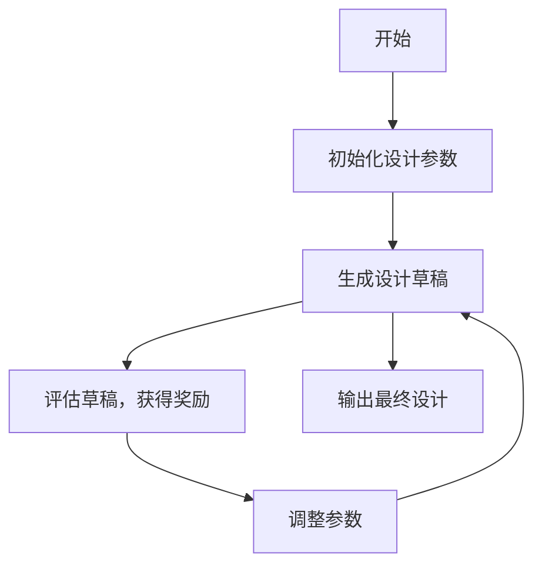
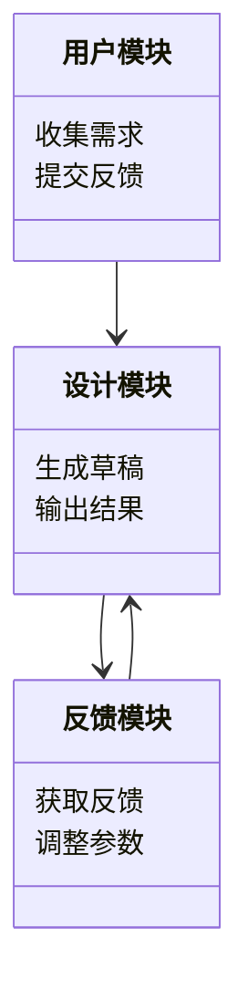

                 


# AI Agent辅助企业品牌形象设计与管理

> 关键词：AI Agent，企业品牌，设计与管理，强化学习，系统架构

> 摘要：本文探讨了AI Agent如何辅助企业品牌形象设计与管理，解决传统设计中的痛点，并详细介绍了AI Agent的核心原理、系统架构、算法实现及实际应用案例。通过分析，展示了AI Agent在提升品牌设计效率和精准度方面的巨大潜力。

---

## 第1章: AI Agent与企业品牌管理概述

### 1.1 AI Agent的基本概念

#### 1.1.1 AI Agent的定义与特点
AI Agent（人工智能代理）是指能够感知环境、自主决策并执行任务的智能系统。其特点包括自主性、反应性、目标导向和社会能力，能够在复杂环境中主动解决问题。

#### 1.1.2 AI Agent在企业品牌管理中的应用背景
随着市场竞争加剧，企业品牌设计需要高效、精准的解决方案。传统设计依赖设计师经验，效率低且主观性强。AI Agent的引入为企业提供了自动化、数据驱动的设计工具。

#### 1.1.3 企业品牌形象设计与管理的核心问题
品牌形象设计涉及市场定位、目标受众分析、设计元素选择等，传统方法耗时且成本高。AI Agent通过数据挖掘和机器学习，优化设计流程，提升设计效率和精准度。

---

### 1.2 AI Agent辅助设计的背景与意义

#### 1.2.1 传统企业品牌设计与管理的痛点
传统设计流程繁琐，从需求收集到设计完成耗时长，且依赖设计师个人能力，导致设计结果可能偏离目标受众需求。

#### 1.2.2 AI Agent如何解决这些痛点
AI Agent通过自动化处理和数据驱动优化，缩短设计周期，降低设计成本，提高设计的精准度和一致性。

#### 1.2.3 AI Agent辅助设计的创新价值
AI Agent引入创新的设计方法，如生成对抗网络（GAN）和强化学习，推动品牌设计从经验驱动向数据驱动转型。

---

## 第2章: AI Agent辅助设计的核心概念与原理

### 2.1 AI Agent的设计原理

#### 2.1.1 AI Agent的基本工作流程
AI Agent的设计流程包括需求解析、生成设计草稿、优化设计、反馈迭代和输出结果。通过强化学习优化设计，确保结果符合用户需求。

#### 2.1.2 基于强化学习的AI Agent设计
强化学习通过奖励机制优化设计，AI Agent根据用户反馈调整设计策略，逐步逼近最佳方案。

#### 2.1.3 AI Agent与传统设计工具的对比
| 对比维度 | AI Agent | 传统设计工具 |
|----------|-----------|---------------|
| 效率     | 高         | 低             |
| 精准度   | 高         | 中             |
| 可扩展性 | 高         | 低             |

---

### 2.2 AI Agent的核心算法与实现

#### 2.2.1 基于强化学习的AI Agent算法
强化学习通过状态、动作和奖励机制优化设计。AI Agent根据当前设计状态，选择最优动作以获得最大奖励。



#### 2.2.2 算法实现的数学模型
强化学习的数学模型包括损失函数和优化器。例如，使用Adam优化器优化损失函数：

$$ L = -\frac{1}{m}\sum_{i=1}^{m} \log(P(y_i|x_i)) $$

其中，$P(y|x)$ 是模型预测的概率，$m$ 是训练样本数。

#### 2.2.3 算法实现的Python代码示例

```python
import numpy as np
import tensorflow as tf

# 定义模型
model = tf.keras.Sequential([
    tf.keras.layers.Dense(256, activation='relu'),
    tf.keras.layers.Dense(1, activation='sigmoid')
])

# 定义损失函数和优化器
loss = tf.keras.losses.BinaryCrossentropy()
optimizer = tf.keras.optimizers.Adam(learning_rate=0.001)

# 编译模型
model.compile(optimizer=optimizer, loss=loss)
```

---

## 第3章: AI Agent辅助设计的系统架构

### 3.1 系统功能设计

#### 3.1.1 用户需求收集与解析
系统通过用户输入收集品牌定位、目标受众等信息，解析需求并生成设计参数。

#### 3.1.2 AI Agent的设计与优化
AI Agent根据解析后的参数生成多个设计草稿，并通过强化学习优化设计。

#### 3.1.3 设计结果的输出与反馈
系统输出设计结果，并根据用户反馈调整设计参数，进行多次迭代优化。

### 3.2 系统架构设计

#### 3.2.1 系统模块划分
系统主要模块包括用户模块、设计模块、反馈模块和优化模块。



#### 3.2.2 系统交互流程
系统交互流程包括用户提交需求、AI生成设计、用户反馈、系统优化，最终输出结果。

```mermaid
sequenceDiagram
    用户 -> 系统: 提交需求
    系统 -> AI Agent: 开始设计
    AI Agent -> 系统: 生成草稿
    用户 -> 系统: 提交反馈
    系统 -> AI Agent: 调整参数
    AI Agent -> 系统: 输出优化结果
    用户 <- 系统: 最终设计
```

---

## 第4章: 项目实战

### 4.1 项目环境与安装

#### 4.1.1 环境要求
- Python 3.8+
- TensorFlow 2.0+
- Mermaid图生成工具

#### 4.1.2 安装依赖
```bash
pip install numpy tensorflow keras matplotlib
```

### 4.2 核心代码实现

#### 4.2.1 算法实现

```python
def train_agent():
    # 数据准备
    inputs = ...
    labels = ...
    
    # 模型训练
    model.fit(inputs, labels, epochs=100, batch_size=32)
    
    return model

# 训练AI Agent
agent = train_agent()
```

#### 4.2.2 代码解读
- `train_agent`函数负责训练AI Agent模型，使用强化学习优化设计。
- 模型训练完成后，可以生成并优化设计草稿。

### 4.3 实际案例分析

#### 4.3.1 案例背景
某公司希望设计新品牌logo，目标受众为年轻人群。通过AI Agent辅助设计，快速生成并优化多个草稿，最终选择最佳方案。

#### 4.3.2 案例分析
AI Agent生成多个logo设计，用户反馈后系统优化，最终输出符合目标受众的方案。

---

## 第5章: 案例分析与最佳实践

### 5.1 行业案例分析

#### 5.1.1 案例一：科技公司品牌重塑
AI Agent帮助科技公司重新设计品牌形象，通过数据分析选择适合的视觉元素，提升品牌现代感。

#### 5.1.2 案例二：消费品品牌优化
消费品品牌利用AI Agent优化包装设计，提高市场吸引力和销售转化率。

### 5.2 最佳实践 tips

- 数据质量：确保训练数据多样化且高质量。
- 模型优化：定期更新模型，适应市场变化。
- 用户反馈：及时收集反馈，持续优化设计。

---

## 第6章: 未来趋势与挑战

### 6.1 未来发展趋势

#### 6.1.1 技术进步
AI Agent将更加智能化，深度学习和生成模型的进步将提升设计能力。

#### 6.1.2 应用场景拓展
AI Agent将应用于更多领域，如广告创意、用户体验设计等。

### 6.2 当前挑战

#### 6.2.1 数据隐私
如何保护用户数据隐私，避免数据泄露风险。

#### 6.2.2 技术瓶颈
算法的可解释性和实时性仍需突破，以满足企业需求。

---

## 作者

作者：AI天才研究院 & 禅与计算机程序设计艺术

---

以上是《AI Agent辅助企业品牌形象设计与管理》的技术博客文章的完整撰写，涵盖背景、原理、系统架构、项目实战、案例分析和未来展望。通过详细的技术分析和实际案例，展示了AI Agent在品牌设计中的潜力和应用价值。

