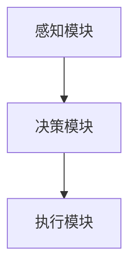
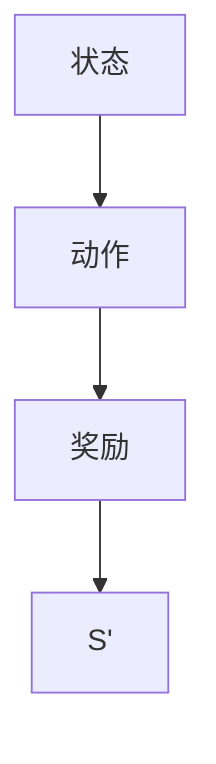
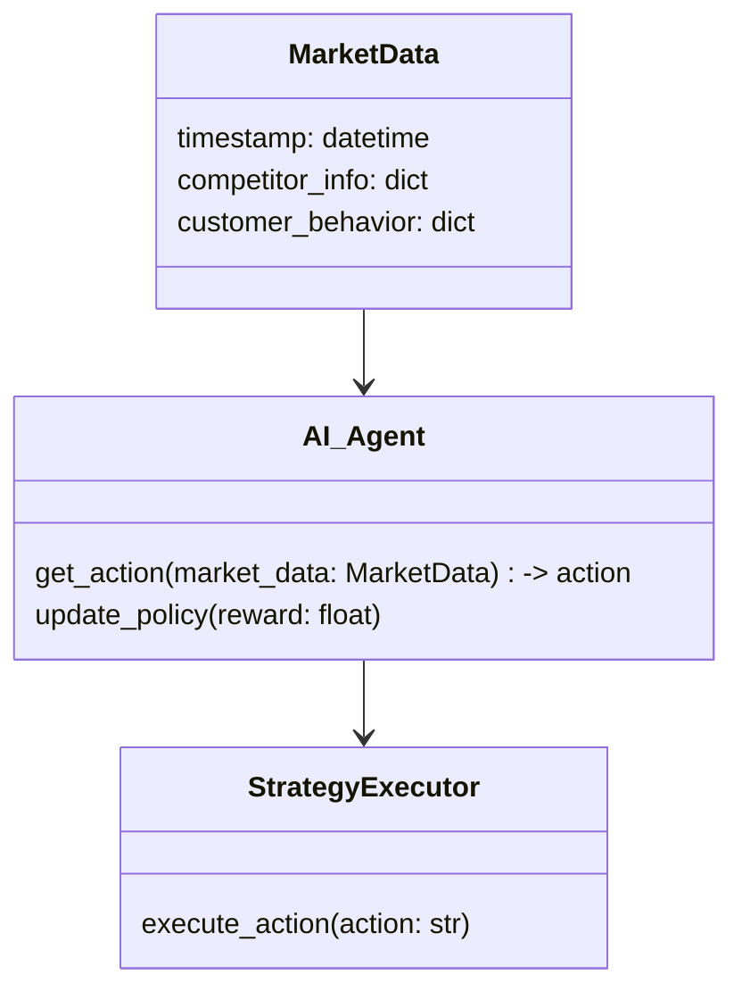
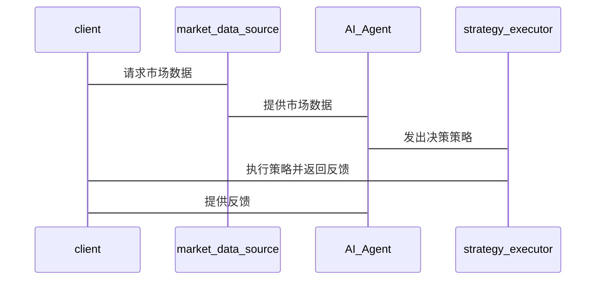

                 


# AI Agent辅助企业市场分析与战略规划

## 关键词：AI Agent, 企业市场分析, 战略规划, 人工智能, 数据分析

## 摘要：  
本文探讨了AI Agent在企业市场分析与战略规划中的应用，详细分析了AI Agent的核心原理、算法实现、系统架构设计及实际项目案例。文章从背景介绍、核心概念、算法原理、系统分析、项目实战到最佳实践，层层递进，为企业提供了一套完整的解决方案。

---

# 第1章：AI Agent与企业市场分析概述

## 1.1 问题背景

### 1.1.1 传统企业市场分析的局限性  
传统的企业市场分析依赖于人工收集和处理数据，效率低下且容易出错。分析师需要手动整理大量数据，耗时且成本高昂。此外，市场环境复杂多变，传统方法难以快速响应变化，导致决策滞后。

### 1.1.2 数据爆炸对企业决策的影响  
随着互联网的发展，企业每天面对的数据量呈指数级增长。如何高效地处理、分析这些数据，提取有价值的信息，成为企业面临的重要挑战。

### 1.1.3 AI技术对企业效率提升的潜力  
AI技术，特别是AI Agent，能够快速处理大量数据，提供实时反馈和自动化决策支持，帮助企业提高效率，降低成本。

## 1.2 问题描述

### 1.2.1 市场分析中的数据处理挑战  
企业需要处理来自不同渠道的结构化和非结构化数据，数据清洗和预处理过程复杂且耗时。

### 1.2.2 战略规划中的不确定性问题  
市场环境复杂多变，传统基于历史数据的规划方法难以应对未来的不确定性。

### 1.2.3 传统方法在实时反馈中的不足  
传统方法难以快速响应市场变化，缺乏实时反馈机制，导致决策不够灵活。

## 1.3 问题解决

### 1.3.1 引入AI Agent的必要性  
AI Agent能够实时监控市场动态，快速分析数据，提供智能化的决策支持，提升企业市场分析和战略规划的效率。

### 1.3.2 AI Agent在数据处理与决策中的优势  
AI Agent能够自动化处理数据，识别模式和趋势，提供精准的预测和建议，帮助企业在复杂环境中做出更明智的决策。

### 1.3.3 提高企业决策效率的解决方案  
通过AI Agent的辅助，企业可以快速响应市场变化，优化资源配置，提高决策的准确性和效率。

## 1.4 边界与外延

### 1.4.1 AI Agent的应用范围  
AI Agent主要应用于市场分析、客户行为预测、竞争分析等领域，能够辅助企业制定更具前瞻性的战略。

### 1.4.2 与其他技术的区分  
AI Agent与传统数据分析工具的区别在于其智能化和自动化能力，能够主动学习和适应变化。

### 1.4.3 未来可能的发展方向  
随着技术的进步，AI Agent将更加智能化，具备更强的自适应能力和学习能力，能够处理更复杂的问题。

## 1.5 概念结构与核心要素

### 1.5.1 AI Agent的基本构成  
AI Agent由感知模块、决策模块和执行模块组成，能够完成数据感知、分析和决策执行的全过程。

### 1.5.2 核心要素的详细解析  
- **感知模块**：负责数据的采集和初步处理。
- **决策模块**：基于感知的数据进行分析和预测，制定决策策略。
- **执行模块**：将决策策略转化为具体行动，实现目标。

### 1.5.3 概念结构的可视化展示  
使用Mermaid流程图展示AI Agent的核心结构：



---

# 第2章：AI Agent的核心原理

## 2.1 感知与理解

### 2.1.1 数据采集与处理  
AI Agent通过多种渠道采集市场数据，包括社交媒体、新闻、竞争对手信息等，并进行清洗和预处理。

### 2.1.2 自然语言处理技术  
利用NLP技术，AI Agent能够理解文本内容，提取关键词和情感倾向，帮助分析客户意见和市场趋势。

### 2.1.3 数据分析与洞察提取  
通过机器学习算法，AI Agent能够识别数据中的模式和趋势，提取有价值的市场洞察。

## 2.2 决策与推理

### 2.2.1 逻辑推理与决策树  
AI Agent使用逻辑推理和决策树算法，根据市场数据制定最优决策策略。

### 2.2.2 强化学习在策略选择中的应用  
强化学习通过试错和反馈优化决策策略，帮助企业在复杂市场环境中做出最佳选择。

### 2.2.3 风险评估与优化模型  
AI Agent能够评估不同决策方案的风险，并通过优化模型找到最优解决方案。

## 2.3 行动与执行

### 2.3.1 自动化操作流程  
AI Agent能够自动化执行决策，例如发布营销策略、调整供应链等。

### 2.3.2 反馈机制与动态调整  
AI Agent通过实时反馈不断优化决策策略，确保在动态市场环境中保持最佳状态。

### 2.3.3 多轮交互中的状态管理  
AI Agent能够处理多轮交互，维护上下文状态，确保决策过程的连贯性和一致性。

---

# 第3章：AI Agent的算法原理

## 3.1 算法原理概述

### 3.1.1 强化学习算法  
强化学习通过试错和奖励机制优化决策策略。例如，使用Q-learning算法训练AI Agent在市场环境中做出最优选择。

### 3.1.2 监督学习算法  
监督学习通过训练数据预测未来趋势，例如使用线性回归预测市场需求。

### 3.1.3 无监督学习算法  
无监督学习用于发现数据中的潜在模式，例如使用聚类算法识别客户群体。

## 3.2 算法实现

### 3.2.1 强化学习算法的Mermaid流程图  


### 3.2.2 Python实现代码  
```python
class AI_Agent:
    def __init__(self):
        self.Q_table = {}

    def get_action(self, state):
        if state not in self.Q_table:
            self.Q_table[state] = [0] * 4  # 动作空间大小
        max_action = self.Q_table[state].index(max(self.Q_table[state]))
        return max_action

    def update_Q_table(self, state, action, reward, next_state):
        self.Q_table[state][action] = reward + max(self.Q_table.get(next_state, [0])[i] for i in range(4))
```

### 3.2.3 算法的数学模型  
强化学习的目标是最优化Q值函数：  
$$ Q(s, a) = Q(s, a) + \alpha (r + \gamma \max Q(s', a') - Q(s, a)) $$  
其中，$\alpha$ 是学习率，$\gamma$ 是折扣因子。

## 3.3 算法实现的详细解读

### 3.3.1 强化学习的步骤  
1. 状态感知：AI Agent感知当前市场状态。
2. 动作选择：基于Q表选择最优动作。
3. 执行动作：发布营销策略。
4. 获取反馈：收到市场反馈和奖励。
5. 更新Q表：根据反馈更新Q值。

### 3.3.2 监督学习的应用  
使用历史销售数据训练回归模型，预测未来市场需求：

$$ \hat{y} = w_1 x_1 + w_2 x_2 + \dots + w_n x_n + b $$

### 3.3.3 无监督学习的应用  
使用聚类算法将客户分为不同群体，优化市场策略。

---

# 第4章：系统分析与架构设计方案

## 4.1 问题场景介绍

### 4.1.1 企业市场分析场景  
企业需要实时监控市场动态，分析竞争对手和客户行为，制定市场策略。

## 4.2 系统功能设计

### 4.2.1 领域模型  
使用Mermaid类图展示领域模型：



## 4.3 系统架构设计

### 4.3.1 整体架构  
使用Mermaid架构图展示系统架构：


## 4.4 接口设计

### 4.4.1 系统接口  
- 输入接口：市场数据接口。
- 输出接口：决策策略接口。

### 4.4.2 交互序列图  
展示系统交互流程：



---

# 第5章：项目实战

## 5.1 环境安装

### 5.1.1 Python环境配置  
安装必要的库：numpy、pandas、scikit-learn、tensorflow。

## 5.2 核心代码实现

### 5.2.1 AI Agent实现  
```python
class AI_Agent:
    def __init__(self):
        self.model = Sequential()
        self.model.add(Dense(64, activation='relu', input_dim=10))
        self.model.add(Dense(1, activation='sigmoid'))
        self.model.compile(optimizer='adam', loss='binary_crossentropy')
```

### 5.2.2 数据处理代码  
```python
import pandas as pd

def load_data():
    data = pd.read_csv('market_data.csv')
    X = data.drop('label', axis=1)
    y = data['label']
    return X, y
```

### 5.2.3 训练代码  
```python
agent = AI_Agent()
X, y = load_data()
agent.model.fit(X, y, epochs=10, batch_size=32)
```

## 5.3 代码解读与分析

### 5.3.1 AI Agent实现解读  
AI Agent使用深度学习模型进行分类预测，帮助识别市场趋势和客户行为。

### 5.3.2 数据处理代码解读  
数据加载和预处理是关键步骤，确保模型能够有效训练。

## 5.4 实际案例分析

### 5.4.1 案例背景  
某企业希望利用AI Agent分析竞争对手的市场动态，优化自身的营销策略。

### 5.4.2 数据分析与模型训练  
使用历史数据训练模型，识别市场趋势和竞争对手的策略。

### 5.4.3 模型优化与部署  
根据反馈不断优化模型，部署到生产环境，实时监控市场动态。

## 5.5 项目小结

### 5.5.1 项目成果  
成功实现AI Agent辅助市场分析和战略规划，提升企业决策效率。

### 5.5.2 经验总结  
数据质量是关键，模型选择和调优直接影响效果，反馈机制的实时性至关重要。

---

# 第6章：最佳实践与注意事项

## 6.1 最佳实践 Tips

### 6.1.1 数据质量管理  
确保数据的准确性和完整性，建立数据清洗流程。

### 6.1.2 模型选择与调优  
根据具体问题选择合适的算法，进行充分的调优和验证。

### 6.1.3 反馈机制设计  
建立实时反馈机制，确保模型能够不断优化。

## 6.2 小结

### 6.2.1 核心内容回顾  
AI Agent通过感知、决策和执行三个环节，帮助企业高效分析市场和制定战略。

### 6.2.2 技术总结  
结合机器学习、NLP和强化学习等技术，实现智能化的市场分析和决策支持。

## 6.3 注意事项

### 6.3.1 数据隐私与安全  
确保数据处理符合隐私保护法规，防止数据泄露。

### 6.3.2 模型解释性  
选择具有高解释性的模型，便于理解和优化。

### 6.3.3 实时性与稳定性  
确保系统能够实时响应，具备高可用性和稳定性。

## 6.4 拓展阅读

### 6.4.1 推荐书籍  
- 《机器学习实战》
- 《深度学习》
- 《自然语言处理实战》

### 6.4.2 推荐博客与资源  
- 维基百科：AI Agent
- TensorFlow官方文档
- PyTorch官方文档

---

# 作者：AI天才研究院 & 禅与计算机程序设计艺术

