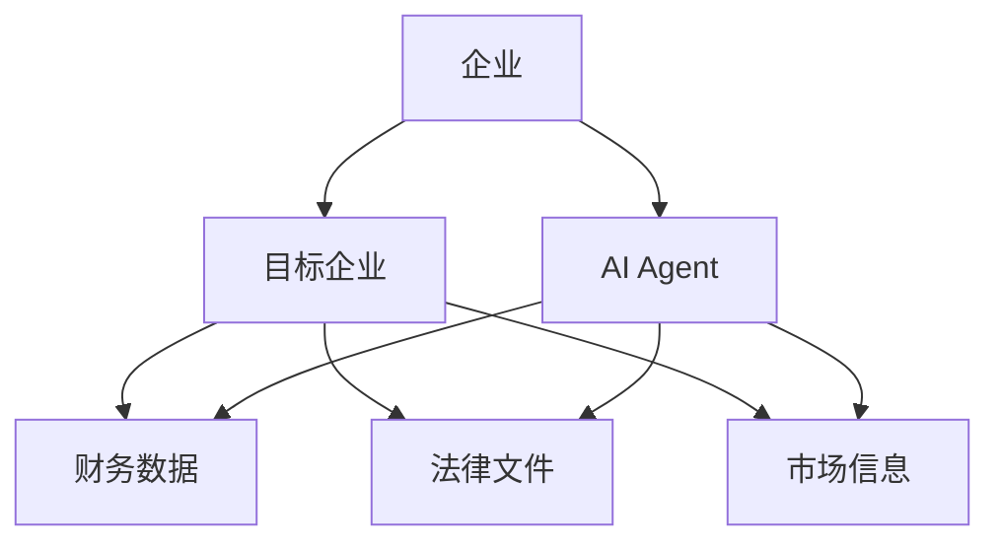
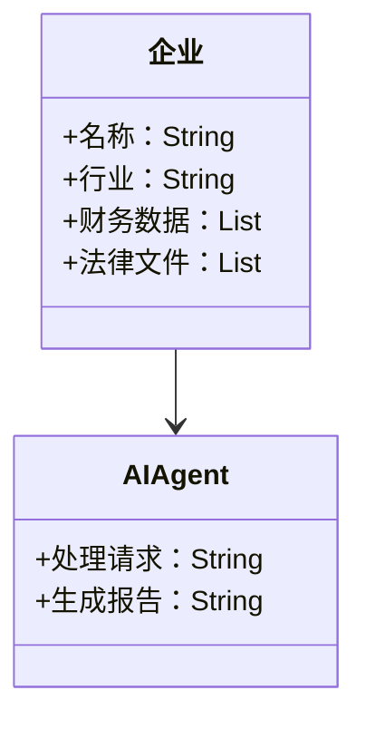

                 


# AI Agent辅助企业并购分析与尽职调查

> 关键词：AI Agent, 企业并购, 尽职调查, 自然语言处理, 知识图谱, 文本挖掘, 机器学习

> 摘要：随着人工智能技术的快速发展，AI Agent在企业并购分析与尽职调查中的应用越来越广泛。本文从AI Agent的核心概念出发，详细探讨其在企业并购分析中的算法原理、系统架构以及实际应用场景。通过具体的案例分析和项目实战，揭示AI Agent如何提高企业并购的效率和准确性，为企业提供有力的支持。

---

# 第1章: AI Agent与企业并购分析概述

## 1.1 AI Agent的定义与核心概念

### 1.1.1 AI Agent的基本概念
AI Agent（人工智能代理）是指能够感知环境、自主决策并执行任务的智能系统。在企业并购分析中，AI Agent通过数据挖掘、自然语言处理（NLP）和机器学习等技术，帮助分析目标企业的财务、法律和市场信息。

### 1.1.2 AI Agent在企业并购中的作用
AI Agent能够高效处理大量非结构化数据，识别潜在风险，并提供决策支持。其主要作用包括：
- 自动化数据收集与分析
- 风险识别与预警
- 目标企业筛选与评估

### 1.1.3 企业并购分析的背景与现状
企业并购是企业战略发展的重要手段，但传统的并购分析依赖人工操作，效率低且易出错。随着AI技术的发展，AI Agent的应用为企业并购提供了更高效、准确的解决方案。

## 1.2 企业并购分析的核心流程

### 1.2.1 并购前的准备工作
- 确定并购目标
- 收集目标企业信息
- 制定分析框架

### 1.2.2 目标企业筛选与评估
- 财务数据评估
- 市场地位分析
- 竞争优势识别

### 1.2.3 尽职调查的关键环节
- 财务尽职调查
- 法律尽职调查
- 市场尽职调查

## 1.3 AI Agent在尽职调查中的优势

### 1.3.1 提高效率与准确性
AI Agent能够快速处理大量数据，减少人为错误。

### 1.3.2 数据分析能力
通过NLP和机器学习，AI Agent能够从非结构化数据中提取有价值的信息。

### 1.3.3 风险识别与预警
AI Agent能够实时监控市场变化，识别潜在风险并及时预警。

## 1.4 本章小结
本章介绍了AI Agent的基本概念及其在企业并购中的作用，分析了企业并购的核心流程，并总结了AI Agent在尽职调查中的优势。

---

# 第2章: 企业并购分析的核心概念与联系

## 2.1 核心概念与原理

### 2.1.1 企业并购的基本流程
企业并购通常包括以下几个步骤：
1. 确定并购目标
2. 收集目标企业信息
3. 进行尽职调查
4. 制定并购方案
5. 完成交易

### 2.1.2 尽职调查的关键要素
- 财务数据
- 法律文件
- 市场信息

### 2.1.3 AI Agent的核心技术
- 自然语言处理（NLP）
- 知识图谱构建
- 机器学习算法

## 2.2 核心概念对比表

| 对比维度 | 传统尽职调查 | AI Agent辅助尽职调查 |
|----------|--------------|-----------------------|
| 效率     | 低           | 高                   |
| 数据分析能力 | 有限        | 强                   |
| 风险识别 | 程度低       | 程度高               |

## 2.3 实体关系图（ER图）



## 2.4 本章小结
本章通过对比分析，展示了AI Agent在企业并购中的优势，并通过ER图明确了各实体之间的关系。

---

# 第3章: AI Agent的核心算法原理

## 3.1 自然语言处理（NLP）在AI Agent中的应用

### 3.1.1 文本预处理
文本预处理包括分词、去停用词、词干提取等步骤。

### 3.1.2 文本表示与相似度计算
使用词向量（如Word2Vec）对文本进行表示，并通过余弦相似度计算文本相似度。

### 3.1.3 文本匹配算法
基于相似度的文本匹配算法，用于识别相关文档。

## 3.2 知识图谱构建与推理

### 3.2.1 知识图谱的构建流程
1. 数据收集
2. 数据清洗
3. 实体识别
4. 关系抽取
5. 图谱构建

### 3.2.2 知识推理的基本原理
通过图谱中的关系进行推理，识别潜在的风险点。

### 3.2.3 实例分析
以目标企业的财务数据为例，构建知识图谱并进行推理。

## 3.3 基于规则的推理与决策

### 3.3.1 规则引擎的基本概念
规则引擎通过预定义的规则进行推理和决策。

### 3.3.2 基于规则的决策树
通过决策树结构进行分类和预测。

### 3.3.3 规则优化与调整
根据实际结果不断优化规则，提高准确性。

## 3.4 本章小结
本章详细介绍了AI Agent的核心算法原理，包括NLP、知识图谱构建和基于规则的推理。

---

# 第4章: 算法原理与数学模型

## 4.1 文本相似度计算的数学模型

### 4.1.1 余弦相似度公式
余弦相似度的计算公式为：
$$\text{余弦相似度} = \frac{\vec{A} \cdot \vec{B}}{|\vec{A}| |\vec{B}|}$$

其中，$\vec{A}$和$\vec{B}$分别是两个文本的向量表示。

### 4.1.2 实例分析
假设目标企业的财务报告和行业报告的相似度为0.85，说明两者内容高度相关。

## 4.2 知识图谱构建的算法原理

### 4.2.1 实体识别
通过NLP技术识别文本中的实体，如公司名称、行业术语等。

### 4.2.2 关系抽取
通过模式匹配或机器学习方法抽取实体之间的关系。

## 4.3 本章小结
本章通过数学模型和算法原理，详细讲解了AI Agent的核心技术。

---

# 第5章: 系统分析与架构设计方案

## 5.1 问题场景介绍
企业并购分析需要处理大量异构数据，包括文本、表格和图像等。

## 5.2 项目介绍
本项目旨在开发一个AI Agent系统，辅助企业并购分析与尽职调查。

## 5.3 系统功能设计

### 5.3.1 领域模型


### 5.3.2 系统架构设计


### 5.3.3 系统接口设计
- 数据接口：提供API用于数据交互
- 报告生成器：生成分析报告

## 5.4 本章小结
本章通过系统架构设计，明确了AI Agent在企业并购中的实现方式。

---

# 第6章: 项目实战

## 6.1 环境安装
- 安装Python和相关库（如NLTK、spaCy、networkx）

## 6.2 系统核心实现源代码

### 6.2.1 文本匹配实现
```python
import numpy as np
from sklearn.feature_extraction.text import TfidfVectorizer

def compute_cosine_similarity(text1, text2):
    vectorizer = TfidfVectorizer()
    vectors = vectorizer.fit_transform([text1, text2])
    return np.dot(vectors[0], vectors[1]) / (vectors[0].norm() * vectors[1].norm())
```

### 6.2.2 知识图谱构建实现
```python
import networkx as nx

def build_knowledge_graph(documents):
    G = nx.Graph()
    for doc in documents:
        entities = extract_entities(doc)
        relationships = extract_relationships(doc)
        for e1, e2 in relationships:
            G.add_edge(e1, e2)
    return G
```

## 6.3 代码应用解读与分析
- 文本匹配代码用于计算文本相似度
- 知识图谱构建代码用于抽取实体和关系

## 6.4 实际案例分析
以某目标企业的财务报告为例，展示AI Agent如何进行分析。

## 6.5 本章小结
本章通过代码实现和案例分析，展示了AI Agent在企业并购中的实际应用。

---

# 第7章: 总结与展望

## 7.1 总结
本文详细介绍了AI Agent在企业并购分析与尽职调查中的应用，涵盖了算法原理、系统架构和项目实战。

## 7.2 注意事项
- 数据隐私保护
- 系统稳定性
- 模型可解释性

## 7.3 拓展阅读
- 《自然语言处理实战》
- 《知识图谱构建与应用》

## 7.4 本章小结
本文总结了AI Agent的优势和应用前景，并提出了未来的研究方向。

---

# 附录

## 附录A: AI Agent的安装与部署

## 附录B: 项目源代码

## 附录C: 参考文献

---

作者：AI天才研究院/AI Genius Institute & 禅与计算机程序设计艺术 /Zen And The Art of Computer Programming

