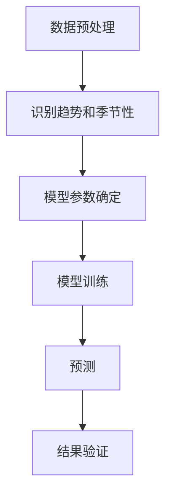
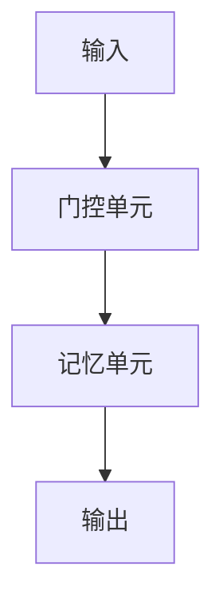
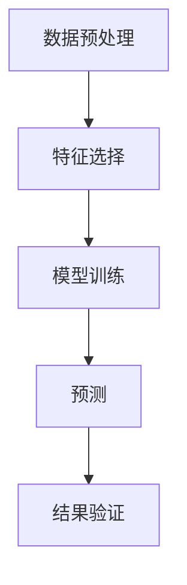
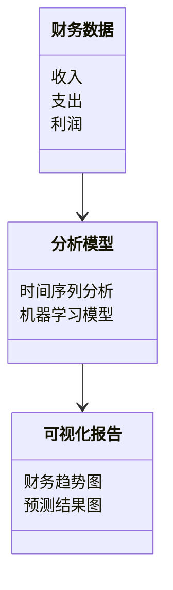
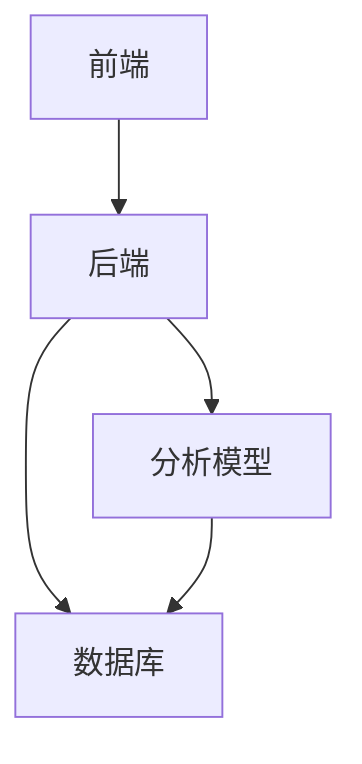
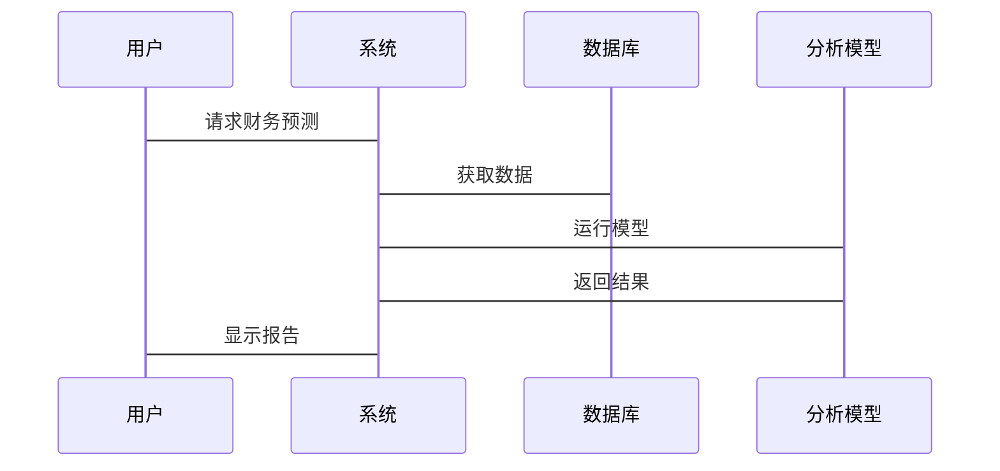

                 


# AI Agent辅助企业财务分析与预测

> 关键词：AI Agent, 企业财务分析, 预测模型, 时间序列分析, 机器学习, 数据分析

> 摘要：本文详细探讨了AI Agent在企业财务分析与预测中的应用，结合了算法原理、系统架构设计和项目实战，展示了如何利用AI技术提升财务分析的效率和准确性。

---

# 第一部分: AI Agent辅助企业财务分析与预测的背景与核心概念

## 第1章: AI Agent与企业财务分析概述

### 1.1 AI Agent的基本概念
#### 1.1.1 AI Agent的定义与特点
AI Agent（人工智能代理）是指能够感知环境、自主决策并执行任务的智能实体。其特点包括自主性、反应性、目标导向和学习能力。与传统软件相比，AI Agent能够通过数据学习和优化，提供更智能的服务。

#### 1.1.2 AI Agent与传统财务分析工具的对比
传统财务分析工具依赖于人工操作和固定的模型，而AI Agent能够实时处理大量数据，提供动态的预测和建议。AI Agent的自动化和智能化使其在处理复杂财务问题时更具优势。

#### 1.1.3 AI Agent在企业财务分析中的优势
AI Agent能够快速处理大量数据，发现隐藏的模式，提供实时的财务预测和风险评估。其优势在于高效性、准确性和可扩展性，能够显著提升企业的财务决策能力。

### 1.2 企业财务分析的背景与挑战
#### 1.2.1 传统财务分析的痛点
传统财务分析依赖于手动数据录入和固定的模型，效率低下且容易出错。此外，传统方法难以应对数据量爆炸和实时性要求高的需求。

#### 1.2.2 数据量爆炸与分析效率的需求
随着企业数据的快速增长，传统的财务分析工具难以处理海量数据，导致分析效率低下。AI Agent能够高效处理大数据，满足企业的分析需求。

#### 1.2.3 企业对实时财务预测的需求
企业需要实时了解财务状况，以便及时调整策略。AI Agent能够实时分析数据，提供动态的财务预测，帮助企业做出快速决策。

## 第2章: AI Agent辅助财务分析的核心概念

### 2.1 财务分析的核心要素
#### 2.1.1 财务数据的分类与处理
财务数据包括收入、支出、利润等，AI Agent需要对这些数据进行清洗和预处理，确保数据的准确性和一致性。

#### 2.1.2 财务分析模型的构建
基于处理后的数据，构建适合的分析模型，如时间序列分析、机器学习模型等。模型的选择取决于数据特征和分析目标。

#### 2.1.3 财务预测的准确性与实时性
AI Agent通过高精度的模型和实时数据处理，确保财务预测的准确性和及时性，为企业提供可靠的决策支持。

### 2.2 AI Agent在财务分析中的应用范围
#### 2.2.1 财务数据的清洗与预处理
AI Agent能够自动识别和纠正数据中的错误，填补缺失值，确保数据质量。

#### 2.2.2 财务趋势的预测与分析
利用时间序列分析和机器学习模型，AI Agent能够预测收入、支出等财务指标的趋势，帮助企业制定合理的财务计划。

#### 2.2.3 财务风险的识别与预警
通过异常检测和风险评估模型，AI Agent能够识别潜在的财务风险，提前发出预警，帮助企业规避风险。

---

# 第二部分: AI Agent辅助财务分析的核心原理

## 第3章: AI Agent的感知与决策机制

### 3.1 数据采集与特征提取
AI Agent通过多种渠道采集财务数据，包括企业内部系统和外部市场数据。特征提取是关键步骤，需要选择最具代表性的特征，以提高模型的准确性。

#### 3.1.1 数据采集
AI Agent可以通过API接口、数据库查询等方式采集财务数据。例如，从企业的ERP系统中获取销售数据、成本数据等。

#### 3.1.2 特征提取
特征提取是将原始数据转化为模型可以理解的特征。例如，从时间序列数据中提取趋势、季节性等特征。

### 3.2 模型训练与预测
AI Agent通过训练模型来预测财务指标。常用的时间序列模型包括ARIMA、LSTM等，这些模型能够捕捉数据中的趋势和周期性。

#### 3.2.1 时间序列分析
时间序列分析是财务预测的重要方法。通过分析历史数据，预测未来的趋势。例如，使用ARIMA模型预测公司未来的销售收入。

#### 3.2.2 机器学习模型
机器学习模型（如LSTM）能够处理复杂的非线性关系，适用于财务预测。例如，使用LSTM模型预测股票价格的走势。

### 3.3 结果解释与反馈优化
模型预测的结果需要解释和验证，以确保其准确性和可靠性。通过反馈机制优化模型，提高预测的精度。

---

# 第三部分: AI Agent辅助财务分析的算法原理

## 第4章: 算法原理讲解

### 4.1 时间序列分析
时间序列分析是一种常用的预测方法。以下是ARIMA模型的流程：



#### 4.1.1 ARIMA模型
ARIMA（自回归积分移动平均模型）是一种常用的时间序列分析方法。其数学公式如下：

$$ ARIMA(p, d, q) $$

其中，p为自回归阶数，d为差分阶数，q为移动平均阶数。

#### 4.1.2 LSTM模型
LSTM（长短期记忆网络）适用于处理长序列数据。以下是LSTM的结构：



### 4.2 机器学习模型
机器学习模型（如随机森林、XGBoost）也可以用于财务预测。以下是随机森林的流程：



---

# 第四部分: AI Agent辅助财务分析的系统架构设计

## 第5章: 系统分析与架构设计方案

### 5.1 问题场景介绍
企业财务部门需要实时监控财务状况，预测未来趋势。传统方法效率低下，难以应对海量数据。

### 5.2 系统功能设计
系统功能包括数据采集、分析模型、可视化报告等。以下是领域模型：



### 5.3 系统架构设计
采用分层架构，包括前端、后端、数据库等。以下是系统架构图：



### 5.4 系统接口设计
系统接口包括数据接口、模型接口和报告接口。以下是接口设计：



---

# 第五部分: 项目实战

## 第6章: 项目实战

### 6.1 环境安装
安装Python、Pandas、Scikit-learn、TensorFlow等库。

### 6.2 系统核心实现

#### 6.2.1 数据处理
```python
import pandas as pd

# 读取数据
data = pd.read_csv('financial_data.csv')

# 数据清洗
data = data.dropna()
data = data.fillna(method='ffill')
```

#### 6.2.2 模型训练
```python
from sklearn.ensemble import RandomForestRegressor

# 特征选择
features = data[['收入', '支出']]
target = data['利润']

# 模型训练
model = RandomForestRegressor(n_estimators=100)
model.fit(features, target)
```

#### 6.2.3 结果展示
```python
import matplotlib.pyplot as plt

# 预测结果
predictions = model.predict(features)

# 绘制实际值与预测值
plt.plot(target, label='实际值')
plt.plot(predictions, label='预测值')
plt.legend()
plt.show()
```

### 6.3 案例分析
以某企业为例，分析其财务数据，预测未来利润。通过模型训练和结果展示，验证模型的准确性。

---

# 第六部分: 总结与展望

## 第7章: 总结与展望

### 7.1 最佳实践
确保数据质量，选择合适的模型，定期更新模型参数。

### 7.2 小结
本文详细探讨了AI Agent在企业财务分析中的应用，结合了算法原理和系统设计，展示了如何利用AI技术提升财务分析的效率和准确性。

### 7.3 注意事项
数据隐私和安全是重要问题，需严格遵守相关法律法规。

### 7.4 拓展阅读
进一步研究多变量时间序列分析、强化学习在财务预测中的应用。

---

# 作者信息

作者：AI天才研究院/AI Genius Institute & 禅与计算机程序设计艺术 /Zen And The Art of Computer Programming

---

通过以上目录大纲，我们可以系统地了解AI Agent在企业财务分析与预测中的应用，从理论到实践，从算法到系统设计，全面覆盖相关内容。

