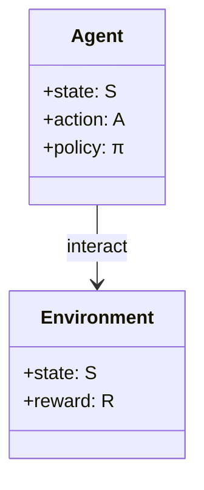
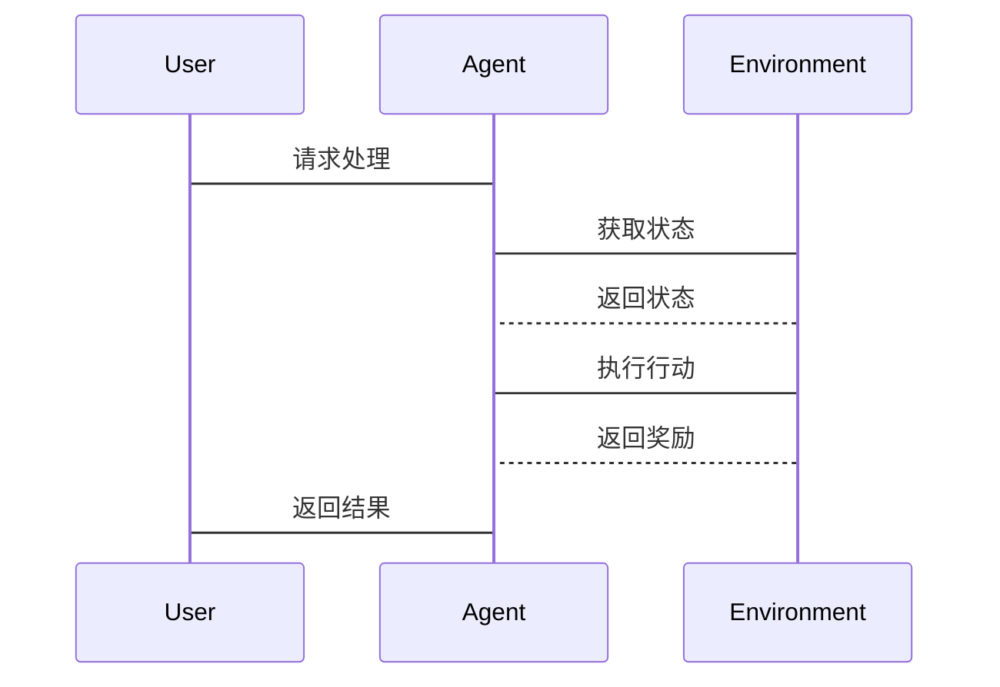

                 


# 《AI Agent辅助软件开发的方法》

---

## 关键词

- AI Agent
- 软件开发
- 强化学习
- Q-learning
- 系统架构

---

## 摘要

本文探讨AI Agent在软件开发中的应用，从理论到实践，系统介绍AI Agent的核心原理、算法、系统架构与设计，结合实际案例，展示如何通过AI Agent提升软件开发效率和质量。

---

# 第1章 AI Agent与软件开发概述

## 1.1 AI Agent的基本概念

### 1.1.1 AI Agent的定义与特点

AI Agent是一种智能实体，具备感知环境、自主决策和执行任务的能力，其特点包括智能性、自主性、反应性和社交性。

### 1.1.2 AI Agent与传统软件开发的区别

AI Agent能够自我学习和适应，而传统软件开发依赖于人工编写规则，AI Agent的自适应能力使其在复杂任务中表现更优。

### 1.1.3 AI Agent在现代软件开发中的作用

AI Agent可以辅助代码生成、测试、调试和项目管理，提高开发效率和代码质量。

## 1.2 AI Agent在软件开发中的应用场景

### 1.2.1 代码生成与优化

AI Agent可以根据需求生成代码片段，优化代码结构，减少开发时间。

### 1.2.2 项目管理与任务调度

AI Agent可以自动分配任务、跟踪进度，优化资源利用。

### 1.2.3 软件测试与调试

AI Agent可以自动编写测试用例，辅助调试，提高测试覆盖率。

## 1.3 本章小结

本章介绍了AI Agent的基本概念及其在软件开发中的应用场景，为后续章节奠定基础。

---

# 第2章 AI Agent的核心原理与算法

## 2.1 AI Agent的智能体结构

### 2.1.1 状态空间

AI Agent通过感知环境状态，做出决策。

### 2.1.2 行动空间

AI Agent根据状态选择行动，以最大化奖励。

### 2.1.3 奖励机制

奖励机制驱动AI Agent的学习，强化正确行为。

## 2.2 AI Agent的任务规划与学习机制

### 2.2.1 强化学习的基本原理

通过试错学习，AI Agent优化策略，最大化累积奖励。

### 2.2.2 监督学习与无监督学习的区别

监督学习使用标记数据，无监督学习发现数据结构。

### 2.2.3 知识表示与推理

知识图谱和逻辑推理帮助AI Agent理解和解决问题。

## 2.3 AI Agent的数学模型与公式

### 2.3.1 Q-learning算法公式

$$ Q(s,a) = (1-\alpha)Q(s,a) + \alpha [r + \gamma \max Q(s',a')] $$

### 2.3.2 策略梯度算法公式

$$ \theta_{t+1} = \theta_t + \alpha \nabla_\theta J(\theta) $$

## 2.4 本章小结

本章深入探讨了AI Agent的核心原理与算法，为实际应用提供理论支持。

---

# 第3章 AI Agent的系统架构与设计

## 3.1 系统功能设计

### 3.1.1 领域模型设计（Mermaid类图）



### 3.1.2 功能模块划分

- 状态感知模块
- 行动决策模块
- 奖励评估模块

## 3.2 系统架构设计（Mermaid架构图）


## 3.3 接口和交互设计

### 3.3.1 接口设计

- 请求接口
- 响应接口

### 3.3.2 交互设计（Mermaid序列图）



## 3.4 本章小结

本章详细描述了AI Agent的系统架构与设计，为后续实现提供指导。

---

# 第4章 项目实战

## 4.1 环境安装

### 4.1.1 安装Python

```bash
python --version
```

### 4.1.2 安装必要的库

```bash
pip install numpy matplotlib
```

## 4.2 核心代码实现

### 4.2.1 Q-learning实现

```python
import numpy as np

class AI-Agent:
    def __init__(self, state_space, action_space):
        self.q_table = np.zeros((state_space, action_space))
        self.alpha = 0.1
        self.gamma = 0.9

    def choose_action(self, state):
        return np.argmax(self.q_table[state])

    def learn(self, state, action, reward, next_state):
        self.q_table[state, action] += self.alpha * (reward + self.gamma * np.max(self.q_table[next_state])) - self.q_table[state, action]
```

### 4.2.2 系统交互

```python
agent = AI-Agent(10, 5)
for _ in range(100):
    state = get_current_state()
    action = agent.choose_action(state)
    reward = get_reward(action)
    next_state = get_next_state()
    agent.learn(state, action, reward, next_state)
```

## 4.3 案例分析

### 4.3.1 环境搭建

```bash
mkdir -p src/{agent,environment}
touch src/{agent/Q-learning.py,environment/reward_function.py}
```

### 4.3.2 功能实现

- 状态感知
- 行动决策
- 奖励评估

## 4.4 本章小结

本章通过实际案例展示了AI Agent的实现过程，帮助读者掌握核心代码和系统设计。

---

# 第5章 最佳实践与总结

## 5.1 最佳实践 tips

- 明确需求，合理设计系统架构
- 选择合适的算法，避免过度复杂
- 定期优化模型，提高性能

## 5.2 小结

AI Agent在软件开发中的应用前景广阔，通过不断学习和优化，能够显著提升开发效率和代码质量。

## 5.3 注意事项

- 数据质量影响模型性能
- 算法选择需结合具体场景
- 系统设计需考虑可扩展性

## 5.4 拓展阅读

- 《强化学习入门》
- 《软件工程导论》
- 《深度学习与自然语言处理》

---

# 作者：AI天才研究院/AI Genius Institute & 禅与计算机程序设计艺术 /Zen And The Art of Computer Programming

