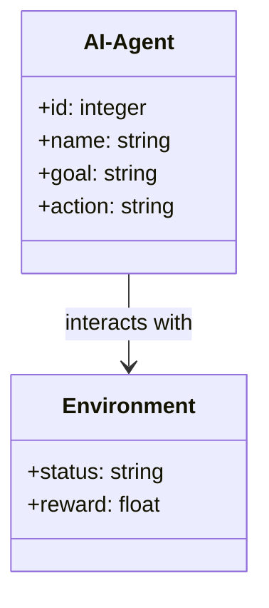
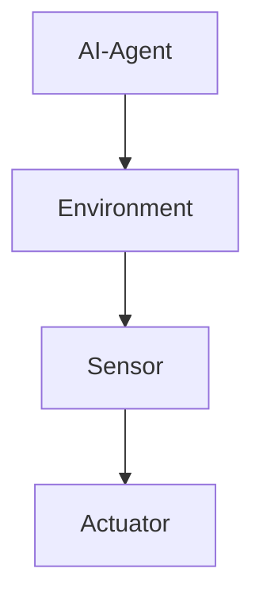
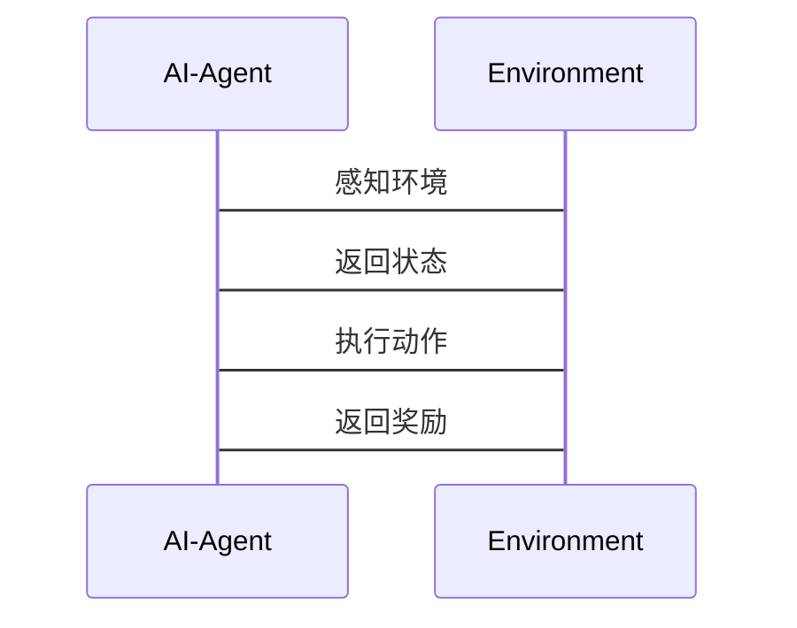
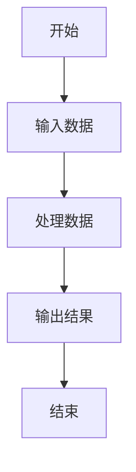

                 


# AI Agent项目的ROI分析方法

## 关键词：AI Agent, ROI分析, 投资回报率, 人工智能, 项目管理

## 摘要：本文详细探讨了AI Agent项目的投资回报率（ROI）分析方法，从基本概念、数学模型到系统设计和项目实战，结合实例分析和最佳实践，为读者提供全面的分析框架和实用指导。

---

# 第一部分: AI Agent项目的ROI分析基础

## 第1章: AI Agent的基本概念与背景

### 1.1 AI Agent的定义与类型

#### 1.1.1 什么是AI Agent
AI Agent（人工智能代理）是指能够感知环境、自主决策并执行任务的智能体。它可以看作是一个软件系统，通过算法和数据实现特定目标。

#### 1.1.2 AI Agent的主要类型
- **简单反射型AI Agent**：基于预定义规则执行任务，适用于简单的决策场景。
- **基于模型的规划型AI Agent**：利用环境模型进行决策，适用于复杂场景。
- **目标驱动型AI Agent**：根据目标选择最优行动，具有高度自主性。

#### 1.1.3 AI Agent的核心特征
- **自主性**：无需外部干预，自主完成任务。
- **反应性**：能够感知环境变化并实时调整行为。
- **目标导向**：基于目标驱动决策和行动。

### 1.2 AI Agent的应用场景

#### 1.2.1 智能客服中的AI Agent
AI Agent可以处理客户咨询、订单跟踪等任务，提升客户体验。

#### 1.2.2 金融领域的AI Agent
在股票交易、风险评估等领域，AI Agent能够实时分析数据并做出决策。

#### 1.2.3 工业自动化中的AI Agent
在制造业中，AI Agent可以优化生产流程、监控设备状态。

---

## 第2章: ROI分析的基本原理

### 2.1 ROI的定义与计算方法

#### 2.1.1 什么是ROI
ROI（投资回报率）是衡量投资项目盈利能力的指标，公式为：
$$ ROI = \frac{收益 - 投资}{投资} $$

#### 2.1.2 ROI的计算公式
- **收益**：AI Agent项目带来的直接和间接收益。
- **投资**：项目开发、维护等成本。

#### 2.1.3 ROI的评价标准
- **正数**：项目值得投资。
- **负数**：项目可能亏损，需重新评估。

### 2.2 AI Agent项目中ROI的影响因素

#### 2.2.1 成本因素
- 开发成本：算法设计、数据收集等。
- 维护成本：系统更新、技术支持。

#### 2.2.2 效益因素
- 时间效率：AI Agent能否显著提高任务处理速度。
- 成本节约：是否降低人工成本。

#### 2.2.3 时间因素
- 回报周期：项目多久能收回投资。

---

## 第3章: AI Agent项目的数学模型与公式

### 3.1 ROI的数学模型

#### 3.1.1 ROI的公式推导
基于基本ROI公式，结合AI Agent项目的特性，可以构建更复杂的模型。

#### 3.1.2 ROI的数学表达式
$$ ROI = \frac{收益 - 投资}{投资} $$

### 3.2 AI Agent的成本与收益分析

#### 3.2.1 成本模型
$$ C = C_{dev} + C_{maint} $$
其中，$C_{dev}$是开发成本，$C_{maint}$是维护成本。

#### 3.2.2 收益模型
$$ R = R_{direct} + R_{indirect} $$
其中，$R_{direct}$是直接收益，$R_{indirect}$是间接收益。

#### 3.2.3 效益对比分析
通过比较有无AI Agent的情况，评估其对ROI的影响。

---

## 第4章: AI Agent项目的系统分析与架构设计

### 4.1 项目场景介绍

#### 4.1.1 项目目标
设计一个AI Agent，用于自动处理客户服务请求。

#### 4.1.2 项目范围
包括需求分析、系统设计、开发测试。

#### 4.1.3 项目约束
资源有限，需在预算内完成。

### 4.2 系统功能设计

#### 4.2.1 领域模型设计（Mermaid类图）


### 4.3 系统架构设计

#### 4.3.1 系统架构图（Mermaid架构图）


#### 4.3.2 系统接口设计
AI Agent通过API与外部系统交互。

#### 4.3.3 系统交互流程图（Mermaid序列图）


---

## 第5章: AI Agent项目的数学模型与公式

### 5.1 算法原理讲解

#### 5.1.1 算法流程图（Mermaid流程图）


#### 5.1.2 核心算法代码
```python
def calculate ROI():
    investment = 10000  # 投资
    revenue = 15000  # 收益
    ROI = (revenue - investment) / investment
    return ROI
```

### 5.2 算法原理的数学模型

#### 5.2.1 算法原理
通过感知环境、决策、执行动作，AI Agent优化目标函数。

#### 5.2.2 目标函数
$$ J = \theta^T X - y $$
其中，$\theta$是参数，$X$是输入，$y$是目标输出。

### 5.3 代码实现与解读

#### 5.3.1 核心代码
```python
def calculate ROI(investment, revenue):
    return (revenue - investment) / investment
```

#### 5.3.2 代码解读
函数计算投资回报率，输入投资和收益，输出ROI值。

---

## 第6章: AI Agent项目的系统分析与架构设计

### 6.1 项目场景介绍

#### 6.1.1 项目目标
实现一个AI Agent，用于优化供应链管理。

#### 6.1.2 项目范围
包括数据收集、模型训练、系统集成。

#### 6.1.3 项目约束
需在3个月内完成，预算有限。

### 6.2 系统功能设计

#### 6.2.1 领域模型设计（Mermaid类图）


### 6.3 系统架构设计

#### 6.3.1 系统架构图（Mermaid架构图）


#### 6.3.2 系统接口设计
AI Agent通过API与供应链系统交互。

#### 6.3.3 系统交互流程图（Mermaid序列图）


---

## 第7章: AI Agent项目的项目实战

### 7.1 环境安装

#### 7.1.1 安装Python
确保安装Python 3.8及以上版本。

#### 7.1.2 安装依赖库
使用pip安装numpy和scikit-learn。

### 7.2 核心代码实现

#### 7.2.1 AI Agent核心代码
```python
def calculate ROI(investment, revenue):
    return (revenue - investment) / investment
```

#### 7.2.2 训练代码
```python
from sklearn import linear_model

# 训练模型
model = linear_model.LinearRegression()
model.fit(X, y)
```

### 7.3 代码应用解读与分析

#### 7.3.1 代码解读
函数calculate ROI计算投资回报率，模型训练用于预测收益。

#### 7.3.2 应用分析
通过AI Agent优化供应链管理，提升效率，降低成本。

### 7.4 实际案例分析

#### 7.4.1 案例背景
某公司引入AI Agent优化供应链，投资10万元，一年后收益15万元。

#### 7.4.2 计算ROI
$$ ROI = \frac{150000 - 100000}{100000} = 0.5 = 50\% $$

#### 7.4.3 分析结果
ROI为50%，项目值得投资。

### 7.5 项目小结

---

## 第8章: 最佳实践与总结

### 8.1 小结

#### 8.1.1 核心观点
通过科学的ROI分析，确保AI Agent项目具有投资价值。

#### 8.1.2 重要性
准确的ROI分析是项目成功的关键。

### 8.2 注意事项

#### 8.2.1 数据准确性
确保输入数据的准确性和完整性。

#### 8.2.2 模型选择
选择适合的算法，避免过拟合。

### 8.3 拓展阅读

#### 8.3.1 推荐书籍
- 《机器学习实战》
- 《投资学原理》

### 8.4 FAQ

#### 8.4.1 ROI分析的步骤是什么？
1. 确定投资和收益。
2. 计算ROI。
3. 评估是否达标。

#### 8.4.2 如何提高AI Agent的收益？
优化算法、扩展应用场景。

---

## 作者：AI天才研究院/AI Genius Institute & 禅与计算机程序设计艺术 /Zen And The Art of Computer Programming

---

本文通过系统介绍AI Agent的基本概念、ROI分析方法、数学模型和系统设计，结合实际案例分析，为读者提供了一套完整的分析框架。希望对读者在AI Agent项目中进行ROI分析有所帮助。

