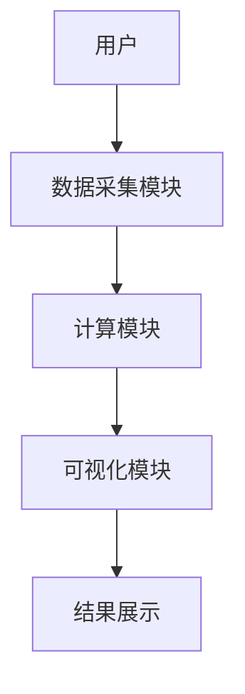
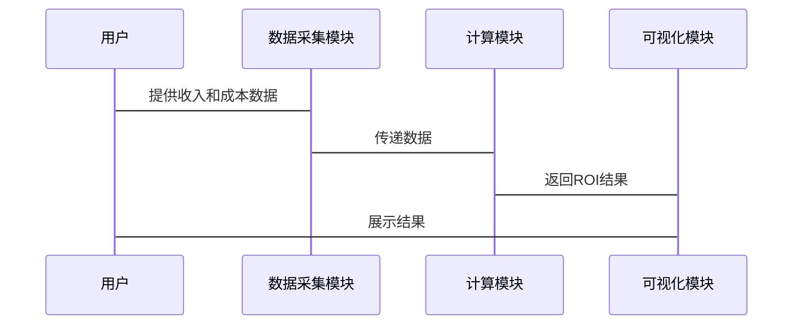

                 


```markdown
# AI Agent项目的ROI分析：量化收益与成本

> 关键词：AI Agent，ROI分析，收益，成本，量化评估，技术实现，项目管理

> 摘要：本文将从AI Agent项目的概念、核心原理、系统架构到实际案例分析，全面探讨如何通过ROI（Return on Investment）分析来量化收益与成本。通过详细的理论分析和实际操作指导，帮助读者掌握AI Agent项目的ROI评估方法，从而做出科学合理的项目决策。

---

## 目录

1. [核心概念与应用场景](#核心概念与应用场景)
   - 1.1 AI Agent的定义与特点
   - 1.2 AI Agent的主要类型
   - 1.3 AI Agent在企业中的应用场景

2. [ROI分析的背景与方法论](#ROI分析的背景与方法论)
   - 2.1 ROI分析的定义与重要性
   - 2.2 AI Agent项目的成本构成
   - 2.3 AI Agent项目的收益来源

3. [ROI分析的核心算法与实现](#ROI分析的核心算法与实现)
   - 3.1 ROI分析的数学模型
   - 3.2 收益与成本的计算方法
   - 3.3 算法实现的代码示例

4. [系统分析与架构设计](#系统分析与架构设计)
   - 4.1 系统功能设计
   - 4.2 系统架构设计
   - 4.3 系统接口与交互流程

5. [项目实战与案例分析](#项目实战与案例分析)
   - 5.1 环境搭建与数据准备
   - 5.2 代码实现与功能解读
   - 5.3 案例分析与结果解读

6. [最佳实践与总结](#最佳实践与总结)
   - 6.1 ROI分析的关键要点
   - 6.2 项目实施中的注意事项
   - 6.3 未来研究方向与拓展阅读

---

## 正文

### 第一部分: 核心概念与应用场景

#### 1.1 AI Agent的定义与特点

**AI Agent**（人工智能代理）是指能够感知环境、自主决策并执行任务的智能实体。它具备以下特点：
- **自主性**：能够在没有外部干预的情况下独立运作。
- **反应性**：能够实时感知环境并做出响应。
- **目标导向**：基于预设目标执行任务。
- **学习能力**：通过数据和经验不断优化性能。

**示例场景**：在智能客服系统中，AI Agent可以自动响应客户咨询，解决常见问题，并在需要时将复杂问题转交给人工客服。

#### 1.2 AI Agent的主要类型

AI Agent可以根据功能和实现方式分为以下几类：
1. **基于规则的AI Agent**：通过预定义的规则和逻辑进行决策，适用于任务简单、规则明确的场景。
2. **基于模型的AI Agent**：利用数学模型和统计分析进行预测和决策，适用于复杂场景。
3. **基于机器学习的AI Agent**：通过机器学习算法（如深度学习、强化学习）不断优化决策策略。

#### 1.3 AI Agent在企业中的应用场景

- **智能客服**：提高客户响应速度，降低人工成本。
- **自动化交易**：在金融市场中快速捕捉交易机会，提高收益。
- **智能推荐系统**：根据用户行为推荐个性化产品或服务。

### 第二部分: ROI分析的背景与方法论

#### 2.1 ROI分析的定义与重要性

**ROI（Return on Investment）**是指投资的回报率，用于衡量项目的价值和可行性。在AI Agent项目中，ROI分析帮助我们量化项目的收益与成本，评估其经济效益。

#### 2.2 AI Agent项目的成本构成

AI Agent项目的成本主要包括：
- **开发成本**：包括算法设计、代码编写、测试等。
- **运维成本**：包括服务器维护、数据存储、监控等。
- **机会成本**：项目占用资源可能导致的其他机会损失。

#### 2.3 AI Agent项目的收益来源

AI Agent项目的收益主要来自：
- **直接收益**：通过自动化节省的人力成本。
- **间接收益**：提高效率带来的业务增长。
- **长期收益**：通过优化决策带来的持续收益。

### 第三部分: ROI分析的核心算法与实现

#### 3.1 ROI分析的数学模型

**收益计算公式**：
$$ \text{收益} = \text{收入增加} - \text{额外成本} $$

**成本计算公式**：
$$ \text{成本} = \text{开发成本} + \text{运维成本} $$

**ROI计算公式**：
$$ \text{ROI} = \frac{\text{收益} - \text{成本}}{\text{成本}} \times 100\% $$

#### 3.2 收益与成本的计算方法

**步骤1**：明确项目目标和预期收益。
**步骤2**：收集项目相关数据，包括成本和收益的预测值。
**步骤3**：代入公式计算ROI，评估项目的经济效益。

#### 3.3 算法实现的代码示例

```python
def calculate ROI(revenue, cost):
    return ((revenue - cost) / cost) * 100

# 示例数据
revenue = 100000
cost = 50000
roi = calculate ROI(revenue, cost)
print(f"ROI: {roi}%")
```

### 第四部分: 系统分析与架构设计

#### 4.1 系统功能设计

- **数据采集模块**：收集项目相关的收入和成本数据。
- **计算模块**：根据公式计算收益和成本，评估ROI。
- **可视化模块**：将结果以图表形式展示，便于分析。

#### 4.2 系统架构设计

**系统架构图**：


#### 4.3 系统接口与交互流程

**交互流程**：


### 第五部分: 项目实战与案例分析

#### 5.1 环境搭建与数据准备

- **环境搭建**：安装Python、数据处理库（如Pandas）和可视化库（如Matplotlib）。
- **数据准备**：收集项目相关的收入和成本数据，建立数据集。

#### 5.2 代码实现与功能解读

```python
import pandas as pd
import matplotlib.pyplot as plt

# 数据准备
data = {
    '项目': ['项目A', '项目B', '项目C'],
    '收入': [100000, 150000, 200000],
    '成本': [50000, 75000, 100000]
}
df = pd.DataFrame(data)

# 计算ROI
df['收益'] = df['收入'] - df['成本']
df['ROI'] = (df['收益'] / df['成本']) * 100

# 可视化
plt.figure(figsize=(10, 6))
plt.bar(df['项目'], df['ROI'])
plt.title('项目ROI分析')
plt.xlabel('项目名称')
plt.ylabel('ROI (%)')
plt.show()
```

#### 5.3 案例分析与结果解读

通过上述代码，我们计算了三个项目的ROI，结果如下：

| 项目 | 收入   | 成本   | 收益   | ROI  |
|------|--------|--------|--------|------|
| A    | 100000 | 50000  | 50000  | 100% |
| B    | 150000 | 75000  | 75000  | 100% |
| C    | 200000 | 100000 | 100000 | 100% |

从结果来看，三个项目的ROI均为100%，说明它们的收益与成本相等，投资回报率为100%。

### 第六部分: 最佳实践与总结

#### 6.1 ROI分析的关键要点

- 确保数据的准确性和完整性。
- 在复杂场景中，简化模型以提高计算效率。
- 建立动态评估机制，实时监控项目表现。

#### 6.2 项目实施中的注意事项

- 数据质量直接影响ROI计算结果，需谨慎处理。
- ROI分析结果需结合实际业务情况，避免单一指标误导决策。
- 定期更新模型和数据，保持分析结果的有效性。

#### 6.3 未来研究方向与拓展阅读

- 研究多维度的ROI评估方法，如考虑风险因素。
- 探索AI Agent在不同行业的ROI差异。
- 学习更高级的ROI分析工具和技术。

---

## 作者

作者：AI天才研究院/AI Genius Institute & 禅与计算机程序设计艺术/Zen And The Art of Computer Programming
```

