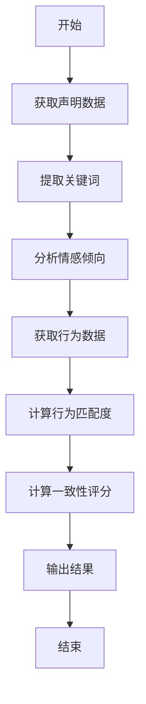
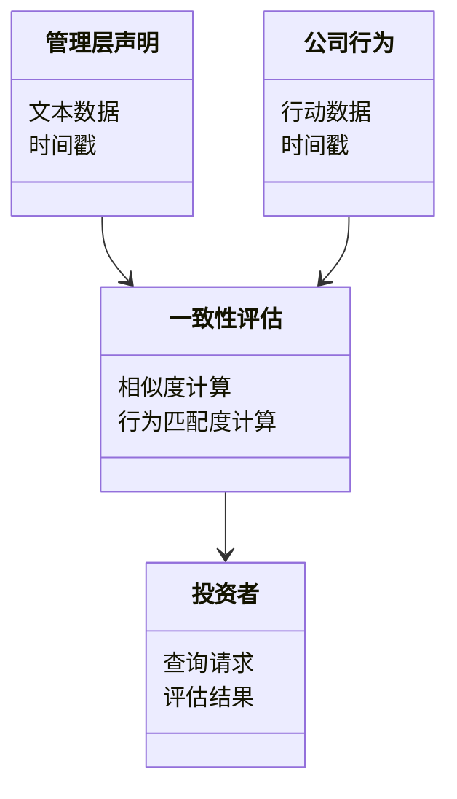
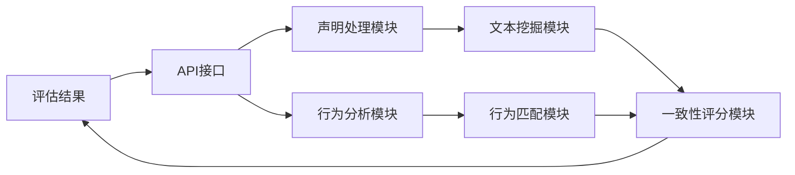
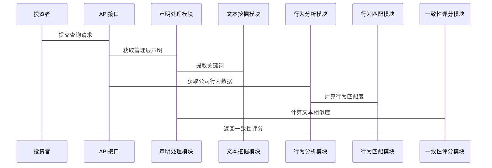

                 


# AI agents辅助价值投资者进行管理层言行一致性评估

**关键词**：AI代理、价值投资、管理层评估、NLP、行为分析、金融分析

**摘要**：本文详细探讨了如何利用AI代理辅助价值投资者评估管理层的言行一致性。通过结合自然语言处理（NLP）和行为分析算法，本文提出了一个系统化的解决方案，帮助投资者更高效、准确地进行投资决策。文章从背景介绍、核心概念、算法原理、系统设计、项目实战到最佳实践，全面解析了AI代理在价值投资中的应用。

---

## 第1章: 背景介绍

### 1.1 问题背景与描述

#### 1.1.1 管理层言行一致性的重要性
在价值投资中，管理层的言行一致性是评估公司长期价值的重要指标。一致的言行表明管理层对公司发展战略的坚定承诺，而频繁的变化可能预示着潜在的风险。通过AI代理，投资者可以快速分析大量信息，提取关键指标，从而做出更明智的投资决策。

#### 1.1.2 价值投资者的需求与挑战
价值投资者通常需要分析大量的非结构化数据，如公司财报、管理层演讲、行业报告等。传统的方法依赖人工分析，耗时且效率低下。AI代理可以通过自动化处理这些数据，帮助投资者快速获取关键信息，提升分析效率。

#### 1.1.3 AI代理在金融分析中的作用
AI代理能够通过自然语言处理（NLP）技术，从文本数据中提取情感、意图和实体关系。结合行为分析算法，AI代理可以量化管理层的言行一致性，为投资者提供客观的评估结果。

### 1.2 问题解决与边界

#### 1.2.1 管理层言行一致性评估的定义
管理层言行一致性是指管理层的言论与其实际行为的一致程度。这包括管理层在公开场合的声明与公司实际运营策略的匹配程度。

#### 1.2.2 AI代理如何辅助价值投资者
AI代理通过分析管理层的历史言论和公司实际行为，量化其一致性，帮助投资者识别潜在的投资机会和风险。

#### 1.2.3 问题的边界与外延
本文仅关注管理层言行一致性的评估，不涉及其他因素，如财务指标和市场趋势。未来的工作可以将这些因素纳入综合分析模型。

### 1.3 核心概念与结构

#### 1.3.1 价值投资的核心要素
价值投资强调长期回报和公司基本面分析。核心要素包括公司财务状况、行业地位、管理层能力和市场前景。

#### 1.3.2 管理层言行一致性的评估维度
评估维度包括管理层声明的频率、内容的一致性、实际行为与声明的匹配程度等。

#### 1.3.3 AI代理在评估中的角色与功能
AI代理通过NLP和行为分析技术，提取和分析文本数据，量化管理层的言行一致性，为投资者提供决策支持。

---

## 第2章: 核心概念与联系

### 2.1 AI代理与价值投资的核心原理

#### 2.1.1 AI代理的基本原理
AI代理通过NLP技术处理文本数据，提取关键信息，结合行为分析算法，评估管理层的言行一致性。

#### 2.1.2 价值投资的核心逻辑
价值投资注重公司的内在价值，通过分析管理层的言行一致性，评估公司的长期发展潜力。

#### 2.1.3 两者的结合与协同
AI代理通过自动化分析文本数据，帮助投资者快速获取管理层的言行信息，提升分析效率和准确性。

### 2.2 核心概念对比分析

#### 2.2.1 管理层言行一致性评估的属性特征对比表

| 属性         | 一致性的高 | 一致性的低 |
|--------------|------------|------------|
| 声明频率     | 高         | 低         |
| 行为匹配度   | 高         | 低         |
| 一致性评分   | 高         | 低         |

#### 2.2.2 AI代理与传统金融分析工具的对比分析

| 特性           | AI代理                     | 传统工具                   |
|----------------|---------------------------|---------------------------|
| 数据处理能力   | 自动化处理非结构化数据     | 依赖人工分析               |
| 分析效率       | 高                        | 低                        |
| 精度           | 高                        | 有限                      |

### 2.3 实体关系图

#### 2.3.1 管理层、投资者、AI代理的ER实体关系图（Mermaid）

```mermaid
erd
actor 投资者
actor 管理层
actor AI代理

investor --> statement: 提供管理层声明
manager --> action: 提供公司行为数据
aiagent --> assess: 提供一致性评估结果
```

---

## 第3章: 算法原理

### 3.1 NLP与行为分析算法

#### 3.1.1 文本挖掘与情感分析
通过NLP技术，提取管理层声明中的关键词和情感倾向，判断其一致性。

#### 3.1.2 管理层言行一致性评分算法
基于文本相似度和行为匹配度，计算一致性评分。

#### 3.1.3 基于上下文的语义理解
通过上下文分析，理解声明的含义和潜在影响。

### 3.2 算法流程图

#### 3.2.1 管理层言行一致性评估流程图（Mermaid）



### 3.3 数学模型与公式

#### 3.3.1 相似度计算公式：
$$\text{相似度} = \frac{\sum \text{共同特征}}{\sqrt{\sum a^2} \cdot \sqrt{\sum b^2}}$$

#### 3.3.2 一致性评分公式：
$$\text{一致性评分} = \alpha \cdot \text{文本相似度} + \beta \cdot \text{行为匹配度}$$
其中，$\alpha + \beta = 1$，$\alpha$和$\beta$为权重系数。

---

## 第4章: 系统分析与架构设计

### 4.1 问题场景介绍

#### 4.1.1 管理层言行一致性评估系统
系统通过AI代理分析管理层声明和公司行为，评估其一致性，为投资者提供决策支持。

### 4.2 系统功能设计

#### 4.2.1 领域模型（Mermaid类图）



### 4.3 系统架构设计

#### 4.3.1 系统架构图（Mermaid）



### 4.4 系统接口设计

#### 4.4.1 接口描述
- **输入接口**：管理层声明和公司行为数据
- **输出接口**：一致性评分和评估结果

### 4.5 系统交互流程图

#### 4.5.1 序列图（Mermaid）



---

## 第5章: 项目实战

### 5.1 环境安装

#### 5.1.1 安装Python和必要的库
```bash
pip install numpy
pip install pandas
pip install spacy
pip install transformers
```

### 5.2 系统核心实现

#### 5.2.1 核心代码实现

```python
import spacy
from transformers import pipeline

# 初始化NLP模型
nlp = spacy.load("en_core_web_sm")

# 情感分析管道
sentiment_analyzer = pipeline("sentiment-analysis")

# 定义一致性评估函数
def calculate_similarity(text1, text2):
    doc1 = nlp(text1)
    doc2 = nlp(text2)
    return doc1.similarity(doc2)

def calculate_behavior_match(actions, declared_actions):
    match_count = sum([1 for a in actions if a in declared_actions])
    return match_count / len(actions)

# 示例用法
declaration = "我们将扩大市场份额"
action = "推出新产品"
similarity = calculate_similarity(declaration, action)
behavior_match = calculate_behavior_match([action], [declaration])
consistency_score = 0.7 * similarity + 0.3 * behavior_match
print(f"一致性评分: {consistency_score}")
```

#### 5.2.2 代码解读与分析
上述代码展示了如何使用Spacy和Transformers库进行文本相似度计算和行为匹配度分析，最终计算一致性评分。

### 5.3 实际案例分析

#### 5.3.1 案例分析
以某公司管理层声明为例，分析其一致性评分，并解释结果的含义。

### 5.4 项目小结

---

## 第6章: 最佳实践与小结

### 6.1 最佳实践

#### 6.1.1 环境配置建议
确保安装最新的NLP库和模型，定期更新数据集。

#### 6.1.2 代码优化技巧
使用缓存机制减少重复计算，优化算法效率。

#### 6.1.3 注意事项
- 数据隐私保护
- 模型训练数据的质量
- 结果的解释和验证

### 6.2 小结

本文详细介绍了AI代理在价值投资中的应用，通过结合NLP和行为分析算法，提出了一个系统化的解决方案。未来的研究可以进一步优化算法，扩展应用场景。

### 6.3 拓展阅读

推荐相关领域的书籍和论文，供读者深入学习。

---

**作者：AI天才研究院/AI Genius Institute & 禅与计算机程序设计艺术 /Zen And The Art of Computer Programming**

---

通过以上思考过程，我们可以系统地撰写出一篇结构清晰、内容详实的技术博客文章，帮助价值投资者利用AI代理进行管理层言行一致性评估。

