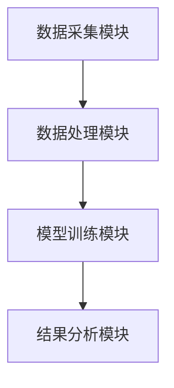

                 


# AI在企业并购估值中的应用与挑战

## 关键词：企业并购，估值，人工智能，机器学习，深度学习，数据科学，风险管理

## 摘要：  
企业并购是企业战略发展的重要手段，而估值是并购决策中的核心环节。随着人工智能技术的迅速发展，AI在企业并购估值中的应用日益广泛，能够提高估值的准确性和效率。本文将从AI技术的基本原理出发，探讨其在企业并购估值中的具体应用，分析面临的挑战，并提出相应的解决方案。通过实际案例分析和系统架构设计，本文旨在为读者提供一个全面、深入的视角，帮助企业在并购决策中更好地利用AI技术。

---

## 目录大纲

### 第1章：企业并购与估值概述
- 1.1 企业并购的基本概念
- 1.2 传统企业估值方法
- 1.3 AI技术在企业估值中的应用背景

### 第2章：AI驱动的并购数据处理
- 2.1 数据收集与清洗
- 2.2 特征工程与数据增强

### 第3章：AI模型在企业估值中的应用
- 3.1 机器学习算法简介
- 3.2 基于机器学习的企业估值模型
- 3.3 深度学习在企业估值中的应用

### 第4章：企业并购估值的AI系统架构与实现
- 4.1 系统架构设计
- 4.2 系统实现与代码示例

### 第5章：企业并购估值中的AI应用挑战与解决方案
- 5.1 数据质量与完整性问题
- 5.2 模型解释性与可解释性要求
- 5.3 伦理与法律问题

### 第6章：总结与展望
- 6.1 本文总结
- 6.2 未来展望

---

## 正文

### 第1章：企业并购与估值概述

#### 1.1 企业并购的基本概念

企业并购是指一家企业通过购买其他企业的股权或资产，以实现战略发展的行为。并购可以分为横向并购、纵向并购和混合并购，分别对应于相同行业、上下游行业和非相关行业的企业并购。并购的目的是为了扩大市场份额、获取技术优势、降低成本或进入新市场。

在企业并购过程中，估值是决定并购价格的核心环节。传统的企业估值方法包括市盈率法、市净率法和现金流折现法等，但这些方法存在主观性强、数据依赖度高和难以量化风险等问题。

近年来，随着人工智能技术的快速发展，AI在企业并购估值中的应用逐渐成为研究热点。AI技术能够通过大数据分析和机器学习模型，提高估值的准确性和效率，同时降低人为误差。

---

### 第2章：AI驱动的并购数据处理

#### 2.1 数据收集与清洗

在企业并购估值中，数据是AI模型的基础。数据来源包括企业的财务报表、市场数据、行业报告和新闻资讯等。然而，这些数据往往存在噪声、缺失或不一致的问题，需要进行清洗和预处理。

数据清洗的过程包括去除重复数据、处理缺失值和异常值，以及标准化数据格式。例如，对于缺失的财务数据，可以通过插值法或回归分析进行估算。对于异常值，可以通过统计方法或聚类分析进行识别和处理。

#### 2.2 特征工程与数据增强

特征工程是将原始数据转化为对模型友好的特征表示的过程。在企业并购估值中，关键特征可能包括企业的收入增长率、利润率、市场占有率和行业风险等。特征工程的目标是提取这些关键特征，并通过数据增强技术（如标准化、归一化和PCA降维）提高模型的泛化能力。

例如，使用主成分分析（PCA）可以将多个相关特征降维，减少维度带来的冗余信息，同时保留数据的主要特征。此外，可以通过文本挖掘技术从新闻资讯中提取情感特征，进一步丰富数据维度。

---

### 第3章：AI模型在企业估值中的应用

#### 3.1 机器学习算法简介

机器学习算法可以分为监督学习、无监督学习和强化学习三类。在企业并购估值中，监督学习是最常用的方法，因为其目标是通过历史数据预测目标变量（如企业价值）。

常用的监督学习算法包括线性回归、随机森林和梯度提升树（如XGBoost和LightGBM）。这些算法在处理非线性关系和高维数据时表现优异，特别适合企业并购估值这种复杂场景。

#### 3.2 基于机器学习的企业估值模型

基于机器学习的企业估值模型通常包括数据预处理、模型训练和结果分析三个阶段。在数据预处理阶段，需要对数据进行清洗和特征工程；在模型训练阶段，可以选择合适的算法并进行超参数调优；在结果分析阶段，需要对模型的预测结果进行解释和验证。

例如，使用随机森林算法训练企业价值预测模型，可以通过特征重要性分析找到影响企业价值的关键因素。同时，可以通过K折交叉验证评估模型的泛化能力。

#### 3.3 深度学习在企业估值中的应用

深度学习在处理非结构化数据（如文本和图像）方面具有显著优势。在企业并购估值中，可以通过自然语言处理（NLP）技术分析企业的新闻报道和财务报告，提取隐含的价值信息。

例如，使用长短时记忆网络（LSTM）处理时间序列数据，可以预测企业的未来现金流；使用卷积神经网络（CNN）分析企业的图像数据（如产品图片）以评估其市场潜力。

---

### 第4章：企业并购估值的AI系统架构与实现

#### 4.1 系统架构设计

企业并购估值的AI系统通常包括数据采集、数据处理、模型训练和结果分析四个功能模块。数据采集模块负责收集企业相关的数据；数据处理模块负责清洗和特征工程；模型训练模块负责训练和优化AI模型；结果分析模块负责解释和验证模型的预测结果。

系统架构设计如图所示：



#### 4.2 系统实现与代码示例

以下是一个基于Python的简单企业估值模型实现示例：

```python
import pandas as pd
from sklearn.ensemble import RandomForestRegressor
from sklearn.metrics import mean_absolute_error

# 数据加载与预处理
data = pd.read_csv('企业数据.csv')
X = data.drop('企业价值', axis=1)
y = data['企业价值']

# 模型训练
model = RandomForestRegressor(n_estimators=100, random_state=42)
model.fit(X, y)

# 模型预测
y_pred = model.predict(X)

# 模型评估
mae = mean_absolute_error(y, y_pred)
print(f'平均绝对误差：{mae}')
```

---

### 第5章：企业并购估值中的AI应用挑战与解决方案

#### 5.1 数据质量与完整性问题

在企业并购估值中，数据质量直接影响模型的预测效果。AI系统需要处理大量异构数据，包括结构化数据和非结构化数据。解决数据质量问题的方法包括数据清洗、数据增强和数据融合。

#### 5.2 模型解释性与可解释性要求

企业并购决策需要高度透明和可解释的估值结果。然而，深度学习模型通常被视为“黑箱”，难以解释其预测结果。解决这一问题的方法包括使用可解释性模型（如线性回归）和模型解释技术（如特征重要性分析）。

#### 5.3 伦理与法律问题

AI在企业并购估值中的应用可能引发伦理和法律问题，如数据隐私和算法偏见。解决这些问题的方法包括制定数据隐私保护政策和算法公平性评估标准。

---

### 第6章：总结与展望

#### 6.1 本文总结

本文系统地探讨了AI在企业并购估值中的应用，分析了其优势和挑战，并提出了相应的解决方案。通过实际案例分析和系统架构设计，本文为读者提供了一个全面、深入的视角。

#### 6.2 未来展望

未来，随着AI技术的不断发展，企业并购估值将更加智能化和个性化。可能的研究方向包括多模态数据融合、模型解释性优化和智能化决策支持系统。

---

## 作者：AI天才研究院/AI Genius Institute & 禅与计算机程序设计艺术 /Zen And The Art of Computer Programming

