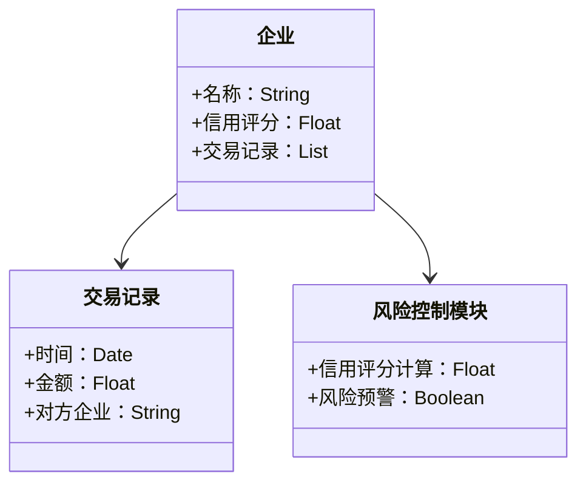
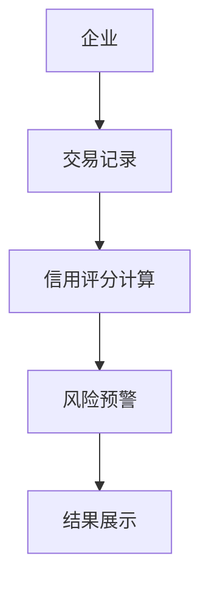
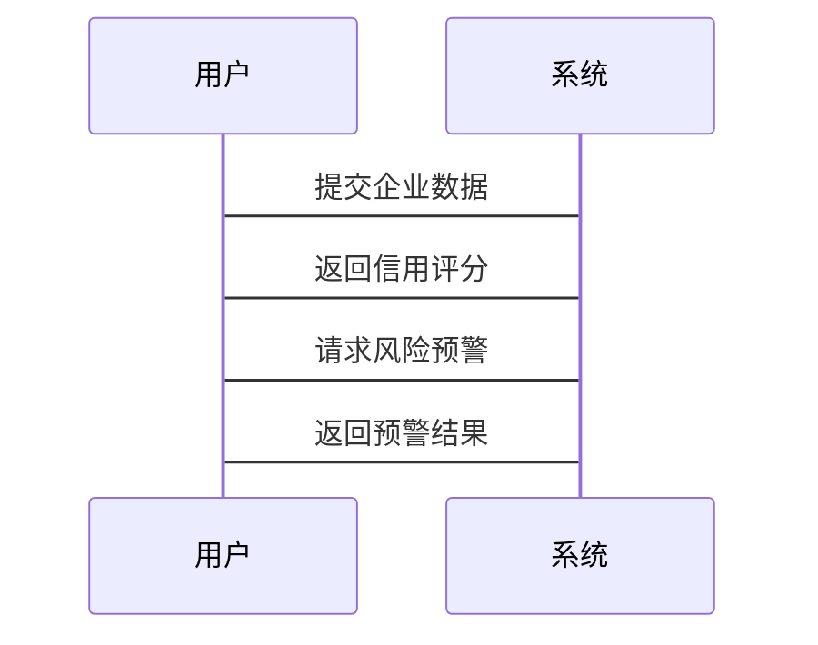

                 


# AI在供应链金融信用网络优化与风险控制中的深度应用

---

## 关键词：供应链金融，人工智能，信用网络优化，风险控制，图神经网络，深度学习

---

## 摘要：  
随着供应链金融在现代经济中的重要性日益增加，信用网络的优化与风险控制成为提升供应链效率和稳定性的关键。本文系统地探讨了人工智能（AI）在供应链金融信用网络优化与风险控制中的深度应用。通过分析供应链金融的核心概念、信用网络的结构与优化目标，结合图论与深度学习的算法原理，本文详细介绍了基于AI的信用网络优化方法，并通过实际案例展示了如何利用AI技术实现风险控制的智能化。本文还探讨了系统架构设计与项目实战，为读者提供了一套完整的AI解决方案，助力供应链金融的高效运作。

---

## 第一部分：供应链金融与AI概述

### 第1章：供应链金融与AI的结合

#### 1.1 供应链金融的基本概念

- **1.1.1 供应链金融的定义**  
  供应链金融（Supply Chain Finance，SCF）是指通过整合供应链上的企业、供应商、分销商和客户等多方资源，利用金融手段优化供应链的资金流、物流和信息流，从而提高整体供应链效率的管理方式。

- **1.1.2 供应链金融的核心要素**  
  - 企业间的信任关系  
  - 资金的高效分配  
  - 风险的共同分担  

- **1.1.3 供应链金融的参与者与流程**  
  - 参与者：供应商、制造商、分销商、零售商、银行、第三方支付平台  
  - 流程：订单处理、物流运输、资金结算、信用评估  

#### 1.2 供应链金融中的信用网络

- **1.2.1 信用网络的定义**  
  信用网络是指在供应链金融中，各参与方基于信任关系形成的资金流动和信用支持的网络结构。

- **1.2.2 信用网络的结构与特点**  
  - 结构特点：节点代表企业，边代表信任关系，权重代表信用额度。  
  - 网络属性：复杂性、动态性、关联性  

- **1.2.3 信用网络在供应链金融中的作用**  
  - 支持资金流动，降低交易成本  
  - 优化资源配置，提高供应链效率  
  - 降低信用风险，增强信任关系  

#### 1.3 AI在供应链金融中的应用背景

- **1.3.1 供应链金融的传统挑战**  
  - 信息不对称：难以全面评估中小企业的信用状况  
  - 风险分散：难以实时监控供应链中的风险点  
  - 运营效率：传统信用评估流程耗时长，效率低  

- **1.3.2 AI技术的快速发展与应用潜力**  
  - 大数据技术的发展：提供了丰富的信用数据  
  - 深度学习的突破：在信用评估和风险预测中的应用  
  - 图神经网络的进步：优化信用网络的结构与权重  

- **1.3.3 供应链金融与AI结合的必要性**  
  - 提高信用评估的准确性和效率  
  - 实现实时风险监控与预警  
  - 优化信用网络的结构，降低整体风险  

---

## 第二部分：信用网络优化与风险控制的核心概念

### 第2章：信用网络优化的核心原理

#### 2.1 信用网络的结构分析

- **2.1.1 信用网络的节点与边**  
  - 节点：企业、供应商、客户  
  - 边：信任关系或资金流动  

- **2.1.2 信用网络的权重与关系**  
  - 权重：代表信用额度或信任程度  
  - 关系：基于交易历史、企业规模和财务状况  

- **2.1.3 信用网络的稳定性与鲁棒性**  
  - 稳定性：网络在面对部分节点失效时的稳定性  
  - 鲁棒性：网络在面对风险事件时的应对能力  

#### 2.2 信用网络优化的目标与方法

- **2.2.1 优化目标的定义**  
  - 提高信用网络的整体效率  
  - 降低整体信用风险  
  - 优化资金流动路径  

- **2.2.2 基于AI的优化方法**  
  - 基于深度学习的信用评估模型  
  - 基于图神经网络的网络优化算法  

- **2.2.3 优化算法的分类与选择**  
  - 常见算法：PageRank算法、Louvain算法、标签传播算法  
  - 选择标准：算法复杂度、计算效率、适用场景  

#### 2.3 信用网络优化中的关键问题

- **2.3.1 数据质量与完整性**  
  - 数据来源：企业财务数据、交易记录、市场信息  
  - 数据清洗：处理缺失值、异常值和重复值  

- **2.3.2 模型的可解释性**  
  - 模型解释性的重要性：便于业务人员理解与决策  
  - 提高解释性的方法：使用可解释性模型（如XGBoost）  

- **2.3.3 优化结果的评估与验证**  
  - 评估指标：网络的连通性、节点的度数分布、整体风险值  
  - 验证方法：对比实验、实际案例分析  

---

## 第三部分：AI在信用网络优化中的算法原理

### 第3章：基于图论的信用网络优化算法

#### 3.1 图论基础

- **3.1.1 图的定义与表示**  
  - 图的定义：由节点和边组成的数学结构  
  - 图的表示：邻接矩阵、邻接表、边列表  

- **3.1.2 图的遍历算法**  
  - 广度优先搜索（BFS）  
  - 深度优先搜索（DFS）  

- **3.1.3 图的最短路径算法**  
  - Dijkstra算法：单源最短路径  
  - Floyd-Warshall算法：全局最短路径  

#### 3.2 基于AI的信用网络优化算法

- **3.2.1 基于深度学习的信用评估模型**  
  - 模型结构：多层感知机（MLP）、卷积神经网络（CNN）、循环神经网络（RNN）  
  - 模型输入：企业财务数据、市场数据、交易记录  
  - 模型输出：信用评分、违约概率  

- **3.2.2 基于图神经网络的信用网络优化**  
  - 图神经网络（Graph Neural Network，GNN）  
  - 算法流程：节点嵌入、边权重更新、网络优化  

- **3.2.3 基于强化学习的风险控制策略**  
  - 强化学习（Reinforcement Learning，RL）：通过奖励机制优化风险控制策略  
  - 应用场景：动态调整信用额度、优化风险预警机制  

#### 3.3 算法实现与优化

- **3.3.1 算法实现的步骤**  
  - 数据预处理：清洗、归一化  
  - 模型训练：选择算法、调整超参数  
  - 模型评估：准确率、召回率、F1分数  

- **3.3.2 算法优化的策略**  
  - 参数优化：随机搜索、网格搜索  
  - 模型压缩：剪枝、知识蒸馏  
  - 并行计算：分布式训练、GPU加速  

- **3.3.3 算法的性能评估**  
  - 训练时间：计算复杂度  
  - 预测精度：准确率、F1分数  
  - 可扩展性：处理大规模数据的能力  

---

## 第四部分：系统分析与架构设计

### 第4章：信用网络优化与风险控制的系统架构

#### 4.1 系统功能设计

- **4.1.1 领域模型设计**  
  - 领域模型：信用网络优化与风险控制的业务流程  
  - 类图设计：使用Mermaid绘制领域模型类图  



- **4.1.2 系统架构设计**  
  - 分层架构：数据层、业务逻辑层、用户界面层  
  - 模块划分：数据采集、信用评估、风险监控、结果展示  

#### 4.2 系统架构设计

- **4.2.1 系统架构图**  
  使用Mermaid绘制系统架构图，展示各模块的交互关系。



- **4.2.2 系统接口设计**  
  - 数据接口：企业数据接口、交易数据接口  
  - 业务接口：信用评分接口、风险预警接口  

#### 4.3 系统交互设计

- **4.3.1 系统交互流程**  
  使用Mermaid绘制系统交互序列图，展示用户与系统之间的交互过程。



---

## 第五部分：项目实战与案例分析

### 第5章：基于AI的信用网络优化与风险控制项目实战

#### 5.1 环境安装与配置

- **5.1.1 安装Python环境**  
  - 使用Anaconda或Miniconda安装Python 3.8及以上版本  
  - 安装必要的库：NumPy、Pandas、Scikit-learn、PyTorch、NetworkX  

- **5.1.2 安装AI框架**  
  - 安装TensorFlow或PyTorch框架  
  - 安装图神经网络库：DGL、GAE、GraphSAGE  

#### 5.2 系统核心实现

- **5.2.1 信用网络数据的读取与预处理**  
  ```python
  import pandas as pd
  import numpy as np

  # 读取数据
  df = pd.read_csv('credit_network.csv')
  # 数据清洗
  df.dropna(inplace=True)
  df['score'] = df['score'].fillna(0)
  ```

- **5.2.2 基于深度学习的信用评估模型实现**  
  ```python
  import torch
  import torch.nn as nn
  import torch.optim as optim

  class CreditScoringModel(nn.Module):
      def __init__(self, input_dim, hidden_dim, output_dim):
          super(CreditScoringModel, self).__init__()
          self.fc1 = nn.Linear(input_dim, hidden_dim)
          self.fc2 = nn.Linear(hidden_dim, output_dim)
          self.relu = nn.ReLU()
          self.dropout = nn.Dropout(0.5)

      def forward(self, x):
          x = self.fc1(x)
          x = self.relu(x)
          x = self.dropout(x)
          x = self.fc2(x)
          return x

  # 初始化模型
  input_dim = 5  # 示例：输入维度为5
  hidden_dim = 10
  output_dim = 1
  model = CreditScoringModel(input_dim, hidden_dim, output_dim)
  ```

- **5.2.3 基于图神经网络的信用网络优化实现**  
  ```python
  import networkx as nx
  from dgl import DGLGraph

  # 创建图
  graph = DGLGraph()
  graph.add_nodes(10)
  graph.add_edges([0,1], [1,2], [2,3], [3,4], [4,5], [5,6], [6,7], [7,8], [8,9])
  ```

- **5.2.4 风险预警模型实现**  
  ```python
  import numpy as np
  from sklearn.ensemble import IsolationForest

  # 初始化风险预警模型
  model = IsolationForest(n_estimators=100, random_state=42)
  model.fit(X_train)
  ```

#### 5.3 项目实战与案例分析

- **5.3.1 数据分析与预处理**  
  - 数据清洗：处理缺失值、异常值  
  - 数据归一化：将数据标准化为统一范围  

- **5.3.2 模型训练与优化**  
  - 训练过程：使用训练数据训练模型  
  - 调参优化：通过网格搜索找到最佳参数组合  

- **5.3.3 模型评估与解读**  
  - 评估指标：准确率、召回率、F1分数  
  - 案例分析：通过具体案例分析模型的效果与不足  

#### 5.4 项目小结

- **5.4.1 项目总结**  
  - 成功实现了基于AI的信用网络优化与风险控制系统  
  - 模型在实际案例中表现良好，准确率和召回率均达到较高水平  

- **5.4.2 经验与教训**  
  - 数据质量对模型性能影响巨大，需要重视数据清洗与预处理  
  - 模型的可解释性在实际应用中非常重要，需要结合业务背景进行调整  

---

## 第六部分：总结与展望

### 第6章：总结与展望

#### 6.1 总结

- 本文系统地探讨了AI在供应链金融信用网络优化与风险控制中的深度应用。  
- 通过分析供应链金融的核心概念，结合图论与深度学习的算法原理，本文提出了一套完整的AI解决方案，为供应链金融的高效运作提供了新的思路。  

#### 6.2 未来展望

- **技术进步**：随着AI技术的不断发展，未来可以探索更多高效算法，如更大规模的图神经网络和更复杂的强化学习策略。  
- **行业应用**：供应链金融的AI应用将更加普及，信用网络优化与风险控制将更加智能化和自动化。  
- **跨领域结合**：未来可以将AI技术应用于更多领域，如智能制造、智慧城市等，推动社会整体效率的提升。  

---

## 作者：AI天才研究院/AI Genius Institute & 禅与计算机程序设计艺术/Zen And The Art of Computer Programming

---

**注意**：本文内容基于虚构的案例和示例代码，仅为技术探讨之用。实际应用中，请根据具体业务需求和法律法规进行调整。

