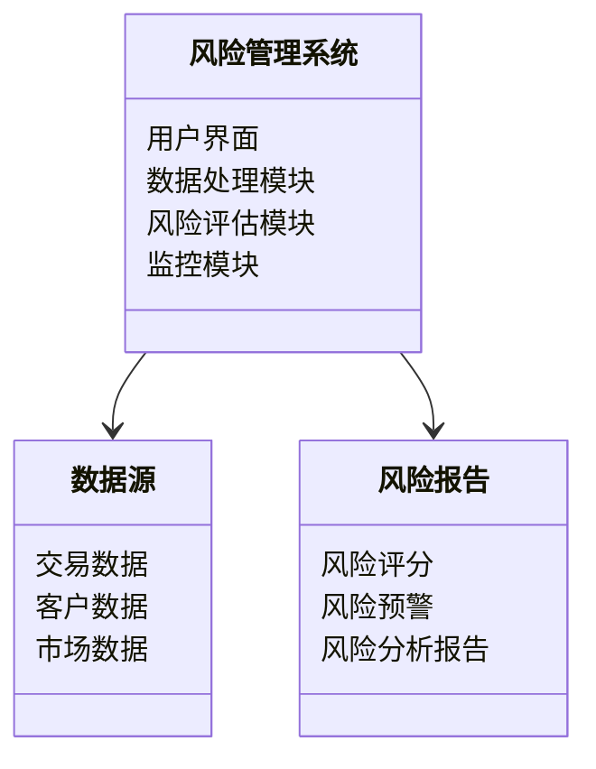
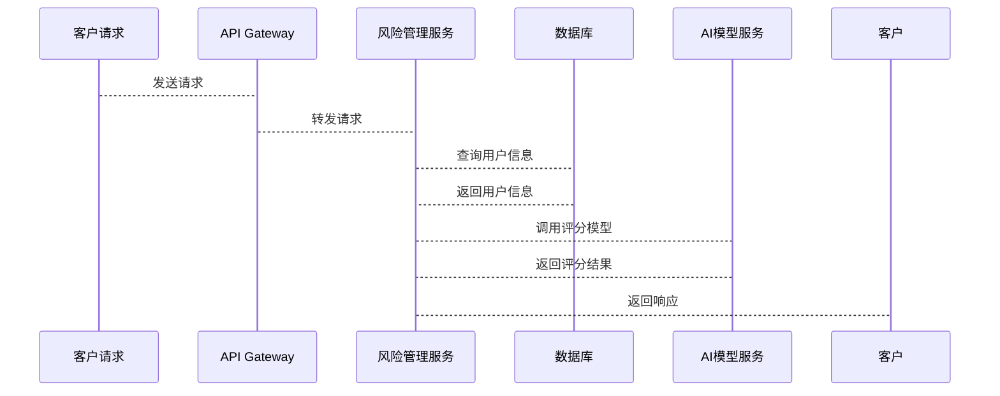

                 


# AI在商业银行风险管理中的应用

> 关键词：人工智能、风险管理、商业银行、信用评分、机器学习、系统架构

> 摘要：本文探讨了人工智能技术在商业银行风险管理中的应用，详细介绍了AI在信用风险、市场风险等领域的具体应用，分析了基于机器学习的信用评分模型，并设计了风险管理系统的架构。通过实际案例分析，展示了AI在提升风险管理效率和准确性方面的优势，最后提出了最佳实践和未来发展方向。

---

## 第一部分: 商业银行风险管理概述

## 第1章: 风险管理的基本概念

### 1.1 风险管理的定义与重要性

#### 1.1.1 风险管理的定义
风险管理是指识别、评估和应对可能影响组织目标的各种风险的过程。在商业银行中，风险管理是确保银行稳健运行的核心任务之一。

#### 1.1.2 风险管理在商业银行中的重要性
- 保护银行资产安全
- 维护客户信任
- 符合监管要求
- 优化资源配置

#### 1.1.3 风险管理的核心目标
- 最小化潜在损失
- 提高决策的准确性
- 优化风险与收益的平衡

### 1.2 商业银行风险管理的范围与分类

#### 1.2.1 信用风险
- 定义：借款人或交易对手无法履行其合同义务的风险。
- 示例：贷款违约风险。

#### 1.2.2 市场风险
- 定义：由于市场条件变化导致资产价值下降的风险。
- 示例：股票价格波动风险。

#### 1.2.3 操作风险
- 定义：由于内部操作失误或外部事件导致的风险。
- 示例：交易错误、系统故障。

#### 1.2.4 流动性风险
- 定义：银行无法及时以合理成本获得资金的风险。
- 示例：客户大量提现导致的流动性压力。

#### 1.2.5 其他风险类型
- 法律风险、声誉风险等。

### 1.3 风险管理的传统方法与挑战

#### 1.3.1 传统风险管理方法
- 专家经验判断
- 统计分析
- 基于规则的模型

#### 1.3.2 传统方法的局限性
- 依赖人工经验，主观性强
- 数据处理能力有限
- 预测准确性不足

#### 1.3.3 新技术对风险管理的机遇
- AI技术的引入显著提升了风险管理的效率和准确性。

---

## 第2章: AI技术的发展与应用背景

### 2.1 AI技术的基本概念

#### 2.1.1 人工智能的定义
人工智能（AI）是指模拟人类智能的计算机系统，能够执行学习、推理、问题解决等任务。

#### 2.1.2 机器学习与深度学习的区别
- 机器学习：基于数据训练模型，预测新数据。
- 深度学习：一种机器学习方法，通过多层神经网络进行特征提取。

#### 2.1.3 当前AI技术的发展趋势
- 数据驱动
- 自动化决策
- 智能化交互

### 2.2 AI在金融领域的应用现状

#### 2.2.1 AI在金融分析中的应用
- 股票价格预测
- 市场趋势分析

#### 2.2.2 AI在信用评估中的应用
- 信用评分模型
- 违约概率预测

#### 2.2.3 AI在风险管理中的应用
- 风险预测
- 风险监控

### 2.3 AI在商业银行风险管理中的潜力

#### 2.3.1 AI技术对风险管理的提升作用
- 提高风险预测的准确性
- 实现实时监控
- 降低人为错误

#### 2.3.2 AI在风险预测中的优势
- 处理海量数据能力强
- 模型更新速度快
- 可以发现非线性关系

#### 2.3.3 AI在风险控制中的创新应用
- 智能风控系统
- 自动化决策支持

---

## 第3章: AI在信用风险管理中的应用

### 3.1 信用风险的基本概念

#### 3.1.1 信用风险的定义
信用风险是指债务人或交易对手未能履行其债务的风险。

#### 3.1.2 信用风险的影响因素
- 借款人资质
- 经济环境
- 利率变化

#### 3.1.3 信用风险的评估方法
- 信用评分模型
- 违约概率模型

### 3.2 基于AI的信用评分模型

#### 3.2.1 传统信用评分模型的局限性
- 依赖人工经验
- 模型复杂性高
- 数据维度有限

#### 3.2.2 基于机器学习的信用评分模型
- 算法选择：随机森林、支持向量机（SVM）、神经网络。
- 数据特征：收入、信用历史、借款用途。

#### 3.2.3 模型实现步骤
1. 数据收集与预处理
2. 特征工程
3. 模型训练
4. 模型评估
5. 部署与监控

#### 3.2.4 信用评分模型的优缺点
- 优点：准确性高、可解释性强。
- 缺点：需要大量数据支持。

---

## 第4章: 系统架构设计

### 4.1 问题场景介绍
商业银行需要构建一个智能化的风险管理系统，实现对信用风险、市场风险等的实时监控和预测。

### 4.2 系统功能设计

#### 4.2.1 领域模型（Mermaid类图）


### 4.3 系统架构设计（Mermaid架构图）


### 4.4 系统接口设计

#### 4.4.1 系统交互（Mermaid序列图）


---

## 第5章: 项目实战

### 5.1 环境安装

#### 5.1.1 安装Python
```bash
python --version
pip install --upgrade pip
```

#### 5.1.2 安装依赖库
```bash
pip install numpy pandas scikit-learn
```

### 5.2 核心实现

#### 5.2.1 数据预处理
```python
import pandas as pd
from sklearn.impute import SimpleImputer
from sklearn.preprocessing import StandardScaler

# 加载数据
data = pd.read_csv('credit_data.csv')

# 处理缺失值
imp = SimpleImputer(missing_values=np.nan, strategy='mean')
imp.fit(data[['age', 'income', 'loan_amount']])
data[['age', 'income', 'loan_amount']] = imp.transform(data[['age', 'income', 'loan_amount']])
```

#### 5.2.2 模型训练
```python
from sklearn.ensemble import RandomForestClassifier

# 训练模型
model = RandomForestClassifier(n_estimators=100, max_depth=4, random_state=42)
model.fit(X_train, y_train)
```

#### 5.2.3 模型评估
```python
from sklearn.metrics import accuracy_score, precision_score, recall_score

# 预测结果
y_pred = model.predict(X_test)
print(f"Accuracy: {accuracy_score(y_test, y_pred)}")
print(f"Precision: {precision_score(y_test, y_pred)}")
print(f"Recall: {recall_score(y_test, y_pred)}")
```

### 5.3 案例分析

#### 5.3.1 数据分析
- 数据清洗：去除重复数据，处理缺失值。
- 特征选择：选择对信用评分影响较大的特征。

#### 5.3.2 模型部署
```python
import joblib

# 保存模型
joblib.dump(model, 'credit_score_model.pkl')
```

---

## 第6章: 总结与展望

### 6.1 总结
- AI技术显著提升了商业银行风险管理的效率和准确性。
- 基于机器学习的信用评分模型在实践中表现出色。

### 6.2 展望
- 结合区块链技术提升数据安全
- 利用自然语言处理技术分析非结构化数据
- 实现更加智能化和自动化的风险管理系统

### 6.3 最佳实践 Tips
- 数据质量是模型性能的基础。
- 模型解释性是实际应用的关键。
- 定期更新模型以适应市场变化。

---

## 作者信息

作者：AI天才研究院/AI Genius Institute  
联系邮箱：contact@AIGenius.com

