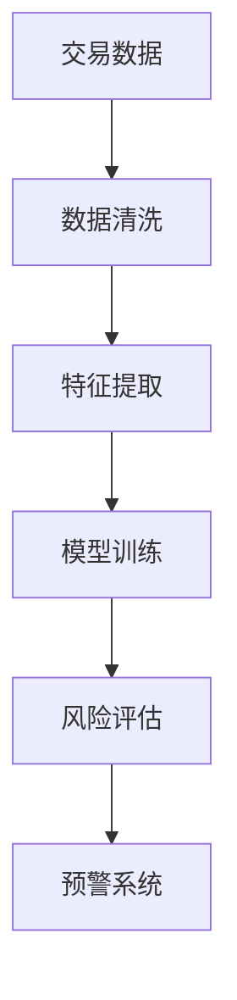

                 


# AI在金融衍生品风险管理中的应用

## 关键词：AI，金融衍生品，风险管理，机器学习，深度学习，数学模型

## 摘要：  
随着金融市场的复杂化和波动性的增加，传统金融衍生品风险管理方法逐渐显现出其局限性。人工智能（AI）技术的快速发展为金融衍生品风险管理带来了新的可能性。本文将从金融衍生品风险管理的基本概念入手，详细探讨AI技术在其中的应用，包括常见的AI算法、数学模型、系统架构设计以及实际项目案例。通过本文的分析，读者可以全面了解AI在金融衍生品风险管理中的核心作用及其未来发展方向。

---

# 第一部分: 金融衍生品风险管理基础

## 第1章: 金融衍生品概述

### 1.1 金融衍生品的基本概念

#### 1.1.1 金融衍生品的定义
金融衍生品（Financial Derivatives）是一种以金融资产或其价格为基础，衍生出的金融工具。常见的金融衍生品包括期货、期权、掉期和远期合约等。这些工具的本质是通过约定在未来某一特定时间以预定价格买卖某种资产，从而转移或管理特定的金融风险。

#### 1.1.2 金融衍生品的分类
1. **期货（Futures）**：双方约定在未来某一时间以预定价格买卖资产。
2. **期权（Options）**：买方有权在未来特定时间内以预定价格买卖资产，但没有义务。
3. **掉期（Swaps）**：双方约定在未来某一时间交换资产或现金流。
4. **远期合约（Forwards）**：类似于期货，但通常在非交易所市场进行交易。

#### 1.1.3 金融衍生品的市场现状
金融衍生品市场是全球最大的金融市场之一，市场规模超过百万亿美元。这些工具广泛应用于对冲风险、投机和套利。然而，金融衍生品的复杂性和高杠杆性也带来了巨大的风险管理挑战。

---

### 1.2 风险管理的重要性

#### 1.2.1 风险管理的基本概念
风险管理是指通过识别、评估和应对风险，以最小化其对组织目标的影响。在金融衍生品中，风险管理尤为重要，因为这些工具的复杂性和杠杆效应可能导致巨大的潜在损失。

#### 1.2.2 金融衍生品风险管理的特殊性
1. **高杠杆性**：衍生品通常需要较少的初始保证金即可控制大额头寸，这放大了潜在收益和损失。
2. **复杂性**：衍生品的价值往往依赖于多种因素，如利率、汇率、市场价格波动等，这增加了风险管理的难度。
3. **市场流动性**：衍生品市场的流动性可能在特定情况下迅速下降，导致价格剧烈波动。

#### 1.2.3 风险管理的目标与方法
- **目标**：最小化潜在损失，确保资产安全，实现稳健的投资回报。
- **方法**：包括风险识别、风险量化、风险对冲和风险监控。

---

## 第2章: AI在金融衍生品风险管理中的应用背景

### 2.1 传统金融风险管理的局限性

#### 2.1.1 传统风险管理的挑战
1. **数据不足**：传统的风险管理方法依赖于历史数据，但在复杂和不确定的市场环境中，历史数据可能不足以预测未来风险。
2. **模型假设的局限性**：传统模型通常基于假设，如正态分布和独立性，但实际市场中存在“肥尾”现象和相关性，导致模型失效。
3. **计算复杂性**：复杂的金融模型需要大量计算资源，传统方法在处理实时数据和高频交易时效率较低。

#### 2.1.2 数据分析的局限性
传统的数据分析方法（如统计分析）在处理非结构化数据和实时数据时效率较低，且难以捕捉市场中的复杂模式。

#### 2.1.3 模型的复杂性与不准确性
复杂的金融模型（如VaR模型）在极端市场条件下表现不佳，且难以实时更新以适应市场变化。

---

### 2.2 AI技术在金融领域的优势

#### 2.2.1 AI在数据分析中的优势
1. **数据处理能力**：AI技术能够处理海量数据，包括结构化和非结构化数据。
2. **模式识别**：AI能够识别数据中的复杂模式和隐藏关联，帮助发现潜在风险。
3. **实时分析**：AI能够实时处理数据，支持快速决策。

#### 2.2.2 AI在模型构建中的优势
1. **自适应性**：AI模型能够自适应市场变化，实时更新以反映最新市场状况。
2. **非线性建模**：AI技术（如神经网络）能够捕捉数据中的非线性关系，提高风险预测的准确性。
3. **多维度分析**：AI能够同时考虑多个因素，构建全面的风险评估模型。

#### 2.2.3 AI在实时监控中的优势
1. **实时预警**：AI系统能够实时监控市场动态，及时发现潜在风险并发出预警。
2. **高频交易支持**：AI技术能够支持高频交易中的实时风险评估和对冲。

---

### 2.3 本章小结
本章介绍了传统金融风险管理的局限性和AI技术在金融领域的优势。AI技术通过强大的数据处理能力、模式识别能力和实时分析能力，为金融衍生品风险管理提供了新的解决方案。

---

# 第二部分: AI在金融衍生品风险管理中的核心概念

## 第3章: 风险管理的核心概念与AI的结合

### 3.1 风险管理的核心概念

#### 3.1.1 市场风险
市场风险是指由于市场价格波动导致的投资损失。在金融衍生品中，市场风险主要来源于利率、汇率和资产价格的波动。

#### 3.1.2 信用风险
信用风险是指由于交易对手无法履行合同义务而导致的损失。在衍生品交易中，信用风险通常与交易对手的信用状况相关。

#### 3.1.3 操作风险
操作风险是指由于内部操作失误或外部事件（如自然灾害、网络攻击）导致的损失。

---

### 3.2 AI在风险管理中的核心应用

#### 3.2.1 数据驱动的风险评估
AI通过分析海量数据，识别潜在风险因素并量化其影响。例如，使用机器学习算法分析市场数据，预测价格波动并评估风险。

#### 3.2.2 模型驱动的风险预测
AI模型（如神经网络）能够预测未来市场走势，评估不同情景下的风险敞口。

#### 3.2.3 实时风险监控
AI系统能够实时监控市场动态，及时发现异常情况并发出预警。

---

## 第4章: AI在风险管理中的数学模型与算法

### 4.1 风险管理的数学模型

#### 4.1.1 风险价值（VaR）
风险价值（Value at Risk, VaR）是衡量市场风险的一种常用指标。VaR表示在给定置信水平下，投资组合可能遭受的最大损失。公式如下：

$$ VaR = \alpha \times \sigma $$

其中，$\alpha$是置信水平对应的分位数，$\sigma$是资产的波动率。

#### 4.1.2 条件风险价值（CVaR）
条件风险价值（Conditional Value at Risk, CVaR）是VaR的扩展，表示在VaR水平超过的情况下，投资组合的平均损失。公式如下：

$$ CVaR = \frac{1}{1-\alpha} \int_{\alpha}^{1} VaR dF $$

其中，$F$是概率分布函数。

#### 4.1.3 风险敏感性分析
风险敏感性分析用于评估资产价格波动对投资组合风险的影响。常用工具包括蒙特卡洛模拟和梯度下降算法。

---

### 4.2 常见的AI算法及其在风险管理中的应用

#### 4.2.1 线性回归模型
线性回归模型用于预测资产价格的变化趋势。例如，可以通过回归分析预测股票价格的变化。

#### 4.2.2 支持向量机（SVM）
支持向量机用于分类和回归分析。在风险管理中，SVM可以用于预测资产的信用评级。

#### 4.2.3 随机森林与梯度提升树
随机森林和梯度提升树是基于树的集成学习方法。它们能够处理高维数据，适用于复杂的金融衍生品风险评估。

#### 4.2.4 神经网络与深度学习
神经网络和深度学习算法（如LSTM）能够捕捉时间序列数据中的复杂模式，适用于预测金融市场波动。

---

## 第5章: AI在风险管理中的系统架构设计

### 5.1 问题场景介绍
在金融衍生品交易中，机构需要实时监控投资组合的风险敞口，并根据市场变化动态调整头寸。传统的风险管理方法难以应对高频交易和复杂市场环境。

### 5.2 系统功能设计

#### 5.2.1 数据采集与处理
系统需要实时采集市场数据（如价格、波动率、交易量等），并进行清洗和预处理。

#### 5.2.2 风险模型构建
基于AI算法构建风险评估模型，包括VaR、CVaR等。

#### 5.2.3 风险评估与预警
系统需要实时评估投资组合的风险敞口，并根据预设阈值发出预警。

#### 5.2.4 实时监控与决策支持
系统提供实时监控界面，帮助交易员快速响应市场变化。

---

### 5.3 系统架构设计

#### 5.3.1 数据流架构


#### 5.3.2 系统架构图


---

## 第6章: 项目实战

### 6.1 环境搭建

#### 6.1.1 安装Python和必要的库
```bash
pip install numpy pandas scikit-learn tensorflow matplotlib
```

#### 6.1.2 数据获取
使用Yahoo Finance API获取股票价格数据。

### 6.2 核心实现

#### 6.2.1 数据清洗与特征提取
```python
import pandas as pd
import numpy as np

# 获取数据
data = pd.read_csv('stock_data.csv')

# 数据清洗
data.dropna(inplace=True)
data = data[~data['close'].isnull()]
```

#### 6.2.2 模型训练
```python
from sklearn.ensemble import RandomForestRegressor
from sklearn.metrics import mean_squared_error

# 特征选择
features = ['open', 'high', 'low', 'close']
target = 'next_day_close'

# 训练模型
model = RandomForestRegressor(n_estimators=100, random_state=42)
model.fit(data[features], data[target])

# 预测
predictions = model.predict(data[features])
```

#### 6.2.3 风险评估与预警
```python
import matplotlib.pyplot as plt

# 计算VaR
def calculate VaR(data, confidence_level=0.95):
    returns = data['returns'].dropna()
    VaR = np.percentile(returns, (1 - confidence_level) * 100)
    return VaR

# 可视化
plt.hist(data['returns'], bins=50)
plt.xlabel('Returns')
plt.ylabel('Frequency')
plt.title('Return Distribution')
plt.show()
```

---

## 第7章: 最佳实践与小结

### 7.1 最佳实践
1. **数据质量**：确保数据的准确性和完整性。
2. **模型选择**：根据具体问题选择合适的AI算法。
3. **实时性**：在高频交易中，实时性是关键。
4. **风险管理**：结合AI模型和传统方法，构建全面的风险管理体系。

### 7.2 小结
本文详细探讨了AI在金融衍生品风险管理中的应用，从理论到实践，从算法到系统架构，为读者提供了全面的视角。通过AI技术，金融衍生品风险管理的效率和准确性得到了显著提升。

---

## 作者：AI天才研究院/AI Genius Institute & 禅与计算机程序设计艺术 /Zen And The Art of Computer Programming

---

以上是《AI在金融衍生品风险管理中的应用》的技术博客文章的目录和内容大纲。希望这篇文章能够帮助读者深入了解AI在金融衍生品风险管理中的应用，并为实际操作提供有价值的参考。

