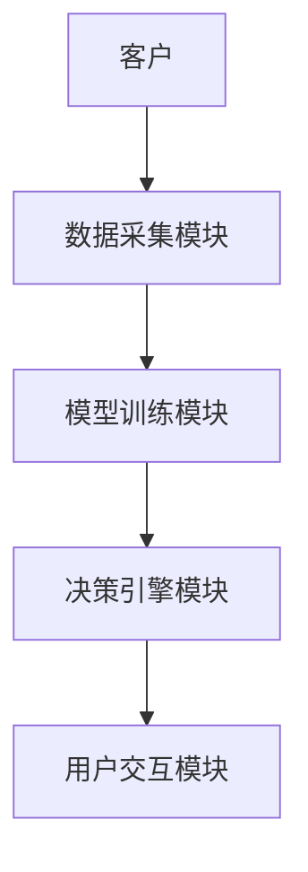

                 

# AI技术在私人银行业务中的应用前景分析

## 关键词：私人银行、人工智能、机器学习、自然语言处理、深度学习

## 摘要：  
随着人工智能技术的快速发展，私人银行业务正面临前所未有的变革。本文将从私人银行业务的基本概念、AI技术的核心原理出发，详细分析AI技术在客户画像、投资组合管理、风险评估等关键业务中的应用前景。通过对全球私人银行业务发展趋势的探讨，本文将揭示AI技术如何解决传统业务中的痛点，提升服务效率和客户体验，并展望未来AI技术在私人银行业务中的潜在应用场景和发展方向。

---

## 第一部分: 私人银行与AI技术概述

### 第1章: 私人银行的基本概念

#### 1.1 私人银行的定义与特点
私人银行是为高净值客户（High Net Worth，HNW）提供定制化金融服务的银行分支机构。其核心特点是：
- **定制化服务**：根据客户需求提供个性化的财富管理方案。
- **高门槛**：通常要求客户资产规模较大（如100万美元以上）。
- **综合服务**：涵盖财富管理、资产配置、税务规划、家族传承等多个领域。

#### 1.2 AI技术的核心原理
人工智能（AI）是模拟人类智能的技术，其核心包括：
- **机器学习（Machine Learning）**：通过数据训练模型，实现预测和分类。
- **深度学习（Deep Learning）**：基于人工神经网络，模拟人类大脑的学习方式。
- **自然语言处理（NLP）**：理解和生成人类语言的技术。

#### 1.3 私人银行业务中的问题背景
传统私人银行业务面临以下痛点：
- **服务效率低**：客户需求多样，人工服务成本高。
- **风险控制难**：市场波动和客户行为复杂，传统方法难以精准预测。
- **客户体验差**：个性化服务不足，客户满意度低。

---

## 第二部分: AI技术在私人银行业务中的应用现状

### 第2章: AI技术的应用场景

#### 2.1 客户画像与精准营销
- **数据收集**：通过客户资产、交易记录、市场行为等数据，构建客户画像。
- **机器学习模型**：利用聚类分析和分类算法，识别客户群体的特征和需求。
- **效果提升**：通过AI推荐合适的理财产品，提高客户转化率。

#### 2.2 投资组合管理
- **市场预测**：基于历史数据和市场信号，预测资产价格走势。
- **风险评估**：使用AI模型分析投资组合的波动性和潜在风险。
- **动态调整**：根据市场变化实时优化投资组合。

#### 2.3 客户关系管理
- **智能客服**：通过NLP技术实现24/7的智能客服，解答客户疑问。
- **客户行为分析**：分析客户互动数据，识别潜在需求。
- **客户忠诚度提升**：通过个性化服务增强客户粘性。

---

## 第三部分: AI技术的核心原理与系统架构

### 第3章: AI技术的核心原理

#### 3.1 机器学习模型
- **监督学习**：输入特征和标签，训练模型预测新数据。
- **无监督学习**：从无标签数据中发现隐藏模式。
- **强化学习**：通过试错优化决策策略。

#### 3.2 深度学习模型
- **神经网络**：模拟人脑结构，处理复杂非线性关系。
- **卷积神经网络（CNN）**：擅长图像识别和模式识别。
- **循环神经网络（RNN）**：适用于序列数据处理。

### 第4章: 系统架构设计

#### 4.1 系统功能模块
- **数据采集模块**：整合客户数据和市场信息。
- **模型训练模块**：基于数据训练AI模型。
- **决策引擎模块**：根据模型输出制定策略。
- **用户交互模块**：提供客户界面和交互服务。

#### 4.2 系统架构图

---

## 第四部分: 应用案例与前景展望

### 第5章: 应用案例分析

#### 5.1 客户画像与精准营销
- **案例背景**：某私人银行希望通过AI技术提高客户转化率。
- **实施步骤**：
  1. 数据采集：收集客户资产、交易记录、市场行为等数据。
  2. 数据清洗：去除噪声数据，确保数据质量。
  3. 模型训练：使用聚类算法识别客户群体特征。
  4. 精准营销：根据客户画像推荐理财产品。
- **效果分析**：客户转化率提高了30%，客户满意度显著提升。

### 第6章: 未来发展趋势

#### 6.1 技术融合与创新
- **多模态AI**：结合文本、图像、语音等多种数据源，提升模型理解能力。
- **实时分析**：利用边缘计算实现实时市场监控和决策。

#### 6.2 行业影响与挑战
- **数据隐私**：如何在AI应用中保护客户数据隐私。
- **技术成熟度**：AI模型的准确性和稳定性仍需进一步提升。
- **人才短缺**：AI技术人才需求与供给之间的矛盾。

---

## 第五部分: 总结与展望

### 第7章: 总结
AI技术正在深刻改变私人银行业务的方方面面。通过客户画像、投资组合管理和风险评估等应用场景，AI技术能够显著提高服务效率和客户体验。然而，AI技术的应用也面临数据隐私、技术成熟度和人才短缺等挑战。

### 第8章: 展望
未来，随着技术的不断进步，AI将在私人银行业务中发挥更大的作用。多模态AI和实时分析等技术将推动行业进一步创新，而数据隐私和人才问题是需要持续关注的重点。

---

## 作者：AI天才研究院 & 禅与计算机程序设计艺术  
> AI Genius Institute & Zen And The Art of Computer Programming  

---

通过以上目录和内容框架，您可以根据需要进一步扩展每个章节的内容，深入探讨具体的技术细节和实际案例。希望这篇技术博客能够为您提供有价值的见解和启发。

