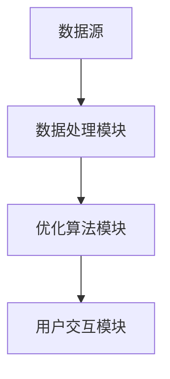

                 


```markdown
# AI智能体协作优化价值投资的股东积极主义策略

## 关键词：AI智能体，协作优化，价值投资，股东积极主义策略，投资策略优化

## 摘要：  
本文探讨了AI智能体在优化价值投资中的应用，特别是如何通过协作优化提升股东积极主义策略的效果。文章首先分析了价值投资与股东积极主义策略的基本概念和关联，然后详细阐述了AI智能体协作优化的核心原理和算法，结合实际案例展示了系统设计与实现，并提出了项目实战的具体步骤和最佳实践建议。

---

## 第一部分：AI智能体协作优化的背景与核心概念

### 第1章：问题背景与核心概念

#### 1.1 问题背景

- **价值投资**：基于公司基本面分析，寻找被市场低估的投资标的。传统方法依赖人工分析，效率低下且难以覆盖大规模数据。
- **股东积极主义**：投资者通过持股影响公司决策，以提升投资回报。传统策略依赖经验，缺乏系统性优化。
- **AI智能体的应用**：利用AI技术提升投资分析效率和准确性，优化投资决策过程。

#### 1.2 核心概念

- **AI智能体**：具备自主决策和协作能力的智能系统，能够处理复杂问题。
- **价值投资**：基于基本面分析的投资策略，寻找长期稳定收益。
- **股东积极主义**：投资者通过持股影响公司治理，优化投资回报。

#### 1.3 问题描述

- 传统价值投资依赖人工分析，效率低且覆盖面有限。
- 股东积极主义策略缺乏系统性优化，难以最大化投资回报。
- AI智能体在协作优化中的应用尚不成熟，需进一步探索。

#### 1.4 问题解决

- 引入AI智能体进行数据挖掘和分析，提升投资决策效率。
- 通过协作优化提升股东积极主义策略的实施效果。
- 结合AI技术实现投资策略的系统性优化。

#### 1.5 边界与外延

- 问题的边界：聚焦于AI智能体在价值投资和股东积极主义策略中的应用。
- 相关领域的外延：涉及机器学习、金融工程等多领域知识。
- 问题的限制：基于现有数据和算法，优化空间有限。

---

## 第二部分：AI智能体协作优化的核心原理

### 第2章：AI智能体协作优化的核心原理

#### 2.1 AI智能体协作优化的原理

- **多智能体协作**：多个AI智能体协同工作，共享信息和资源，提升整体效率。
- **协作优化算法**：基于博弈论的优化方法，实现资源的最优分配。
- **目标函数**：最大化投资回报率，最小化风险。

#### 2.2 价值投资与股东积极主义策略的关联

- **价值投资**：AI智能体通过分析财务数据，识别被低估的投资标的。
- **股东积极主义**：AI智能体通过分析公司治理结构，制定优化策略。
- **协作优化**：结合两者，实现投资策略的系统性优化。

#### 2.3 核心概念的对比分析

| **概念**        | **特征**                               |
|------------------|--------------------------------------|
| 价值投资        | 长期持有，基本面分析                 |
| 股东积极主义     | 主动参与公司治理，提升投资回报       |
| AI智能体协作优化 | 数据驱动，智能决策，协作效率提升     |

---

## 第三部分：算法原理讲解

### 第3章：AI智能体协作优化的算法原理

#### 3.1 算法原理概述

- **多智能体协作优化算法**：基于分布式优化，实现资源的最优分配。
- **博弈论模型**：模拟多个智能体的互动，寻找纳什均衡。
- **数学模型**：构建优化问题的数学模型，求解最优解。

#### 3.2 算法的数学模型与公式

- **目标函数**：最大化投资回报率，$ \max \sum w_i r_i $。
- **约束条件**：投资组合的权重满足$ \sum w_i = 1 $。
- **优化算法**：使用梯度下降法求解优化问题。

#### 3.3 算法实现

```python
def optimize_portfolio(weights, returns):
    # 初始化参数
    n = len(weights)
    # 定义目标函数
    def objective(weights):
        return -sum(weights[i] * returns[i] for i in range(n))
    # 定义约束条件
    constraints = [{'type': 'eq', 'fun': lambda w: sum(w) - 1}]
    # 使用SLSQP求解
    from scipy.optimize import minimize
    result = minimize(objective, weights, constraints=constraints, method='SLSQP')
    return result.x
```

---

## 第四部分：系统分析与架构设计

### 第4章：系统分析与架构设计

#### 4.1 问题场景介绍

- **数据来源**：金融市场数据，公司基本面数据。
- **用户需求**：投资者希望优化投资策略，提升回报率。

#### 4.2 系统功能设计

- 数据采集与处理：收集和清洗数据。
- 投资策略优化：基于AI算法优化投资组合。
- 系统架构设计：采用微服务架构，包含数据处理模块、优化算法模块、用户交互模块。

#### 4.3 系统架构图



---

## 第五部分：项目实战

### 第5章：项目实战

#### 5.1 环境安装

- **Python**：安装Anaconda或Miniconda。
- **依赖库**：安装numpy、pandas、scipy、mermaid。

#### 5.2 核心实现

```python
import numpy as np
from scipy.optimize import minimize

def portfolio_objective(weights, returns):
    return -np.sum(weights * returns)

def portfolio_constraint(weights):
    return np.sum(weights) - 1

# 示例数据
returns = np.array([0.1, 0.2, 0.15])
initial_weights = np.array([1/3, 1/3, 1/3])

# 优化投资组合
result = minimize(portfolio_objective, initial_weights, 
                  constraints=[{'type': 'eq', 'fun': portfolio_constraint}],
                  method='SLSQP')
optimal_weights = result.x
```

---

## 第六部分：总结与扩展

### 第6章：总结与扩展

#### 6.1 总结

- AI智能体在优化价值投资策略中发挥了重要作用。
- 协作优化算法能够有效提升投资回报率。
- 系统设计和实现为投资者提供了高效工具。

#### 6.2 最佳实践 tips

- 定期更新数据和模型，保持策略的有效性。
- 结合市场变化，动态调整投资组合。
- 注意风险管理，避免过度依赖AI模型。

#### 6.3 注意事项

- 数据质量影响结果，需谨慎处理数据。
- 算法选择需根据具体情况调整参数。
- 系统维护需定期更新和优化。

#### 6.4 拓展阅读

- 推荐阅读《算法导论》和《机器学习实战》。

---

## 作者：AI天才研究院/AI Genius Institute & 禅与计算机程序设计艺术 /Zen And The Art of Computer Programming
```

