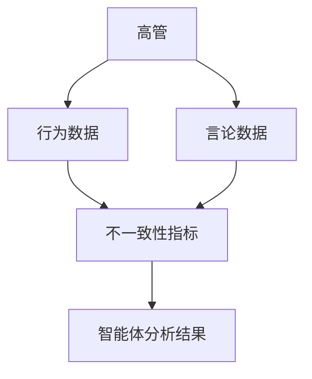
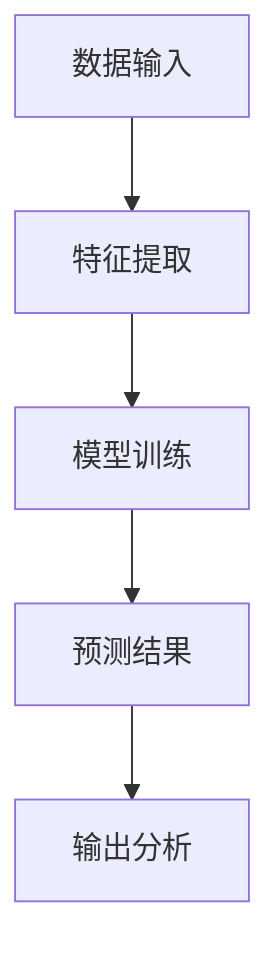
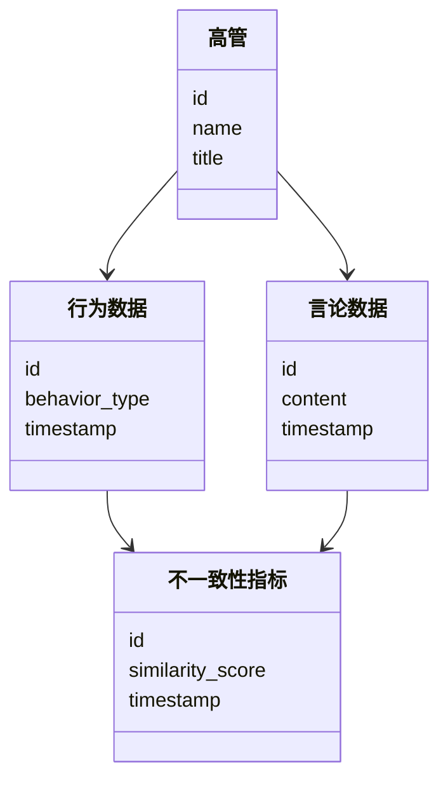
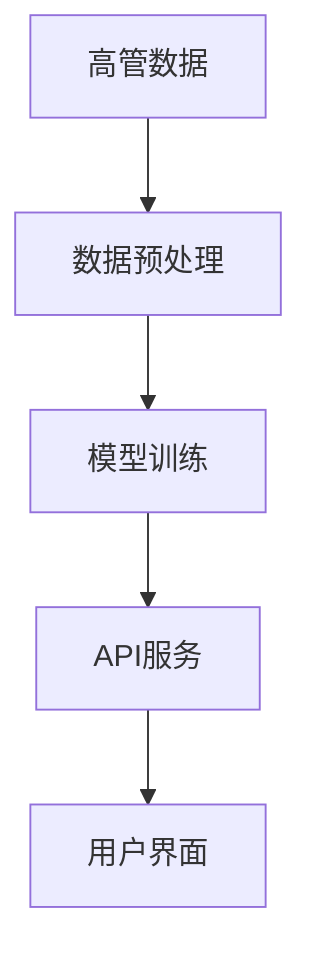
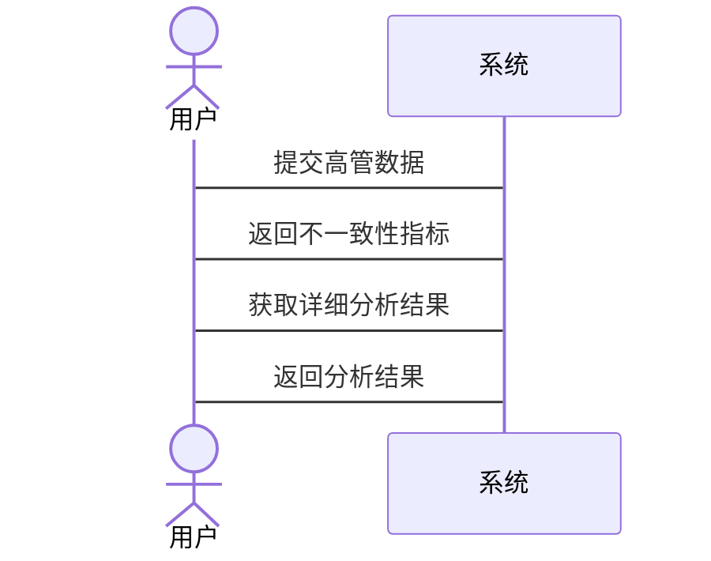

                 


# AI智能体在分析公司高管言行不一致性中的应用

## 关键词：AI智能体，高管行为分析，言行不一致，企业治理，数据驱动决策，自然语言处理

## 摘要：  
本文探讨了AI智能体在分析公司高管言行不一致性中的应用，通过数据驱动的方法，结合自然语言处理和行为分析技术，构建了一个智能化的分析系统。文章详细介绍了问题背景、核心概念、算法原理、系统架构设计以及实际应用案例，展示了如何利用AI技术提升企业治理效率。

---

# 第一部分: 背景与核心概念

## 第1章: 问题背景与描述

### 1.1 高管言行不一致的定义与问题背景

#### 1.1.1 高管言行不一致的定义
高管言行不一致指的是公司高层管理人员在言论和实际行为上出现不一致的现象。例如，高管在公开场合发表的承诺与实际执行的决策存在明显差异。

#### 1.1.2 企业治理中的关键问题
- 高管言行不一致可能导致企业战略不清晰，影响员工士气和企业声誉。
- 企业治理中的不透明性和低效决策往往与高管行为不一致有关。

#### 1.1.3 AI智能体的应用价值
AI智能体能够通过分析高管的言行数据，识别潜在的不一致行为，为企业治理提供数据支持。

### 1.2 问题解决思路

#### 1.2.1 数据驱动的分析方法
利用自然语言处理和行为数据分析技术，从高管的言论和行为中提取关键信息。

#### 1.2.2 AI智能体的核心作用
AI智能体通过实时监控和分析高管的言行数据，识别不一致行为，并提供预警和建议。

#### 1.2.3 企业治理的创新模式
通过AI智能体的应用，企业可以实现更加智能化和数据驱动的治理模式。

### 1.3 边界与外延

#### 1.3.1 高管言行不一致的边界
- 数据范围：仅限于高管的言行数据。
- 时间范围：通常关注近期的行为数据。

#### 1.3.2 相关概念的对比分析
- 高管行为与员工行为的对比：高管的行为更具影响力，但员工行为的不一致可能影响团队效率。
- 不同行业中的差异性分析：行业特点可能影响高管行为的分析方式。

#### 1.3.3 应用场景的外延
- 除了企业治理，还可以应用于政治、学术等领域。

## 第2章: 核心概念与联系

### 2.1 AI智能体的核心原理

#### 2.1.1 AI智能体的基本概念
AI智能体是一种能够感知环境、做出决策并执行动作的智能系统。

#### 2.1.2 智能体的感知与决策机制
- 感知：通过传感器或数据输入获取环境信息。
- 决策：基于感知信息，利用算法做出决策。

#### 2.1.3 多智能体协同工作原理
多个AI智能体可以通过协同工作，提高整体系统的智能性和效率。

### 2.2 高管言行不一致的核心要素

#### 2.2.1 高管行为的多维度分析
- 言论分析：通过自然语言处理技术分析高管的公开演讲和声明。
- 行为分析：通过数据分析技术分析高管的决策和行动。

#### 2.2.2 言行不一致的特征提取
- 时间一致性：高管的言论和行为是否在时间上一致。
- 内容一致性：高管的言论内容是否与其实际行为一致。

#### 2.2.3 数据关联性分析方法
- 时间序列分析：通过时间序列数据识别不一致行为。
- 关联规则挖掘：通过关联规则挖掘识别不一致行为的模式。

### 2.3 核心概念对比分析

#### 2.3.1 AI智能体与传统数据分析的对比
- 传统数据分析：基于统计学方法进行数据分析。
- AI智能体：结合机器学习和深度学习技术，具有更强的自主性和智能性。

#### 2.3.2 高管行为与员工行为的对比
- 高管行为影响企业战略，员工行为影响团队效率。
- 高管行为的不一致可能引发更大的问题。

#### 2.3.3 应用场景的外延
- 政治领域：分析政治人物的言行一致性。
- 学术领域：分析学者的研究方向与其言论的一致性。

### 2.4 ER实体关系图



---

# 第二部分: 算法原理与数学模型

## 第3章: AI智能体算法原理

### 3.1 数据预处理与特征提取

#### 3.1.1 数据清洗与标准化
- 数据清洗：去除重复数据、填补缺失值。
- 数据标准化：将数据归一化处理，以便模型训练。

#### 3.1.2 文本特征提取方法
- 词袋模型：将文本表示为词的频率向量。
- 词嵌入：使用预训练的词向量（如Word2Vec）提取文本特征。

#### 3.1.3 行为数据特征提取
- 时间序列特征：提取行为数据的时间序列特征，如均值、方差等。
- 统计特征：提取行为数据的统计特征，如出现频率、分布情况等。

### 3.2 模型训练与优化

#### 3.2.1 神经网络模型选择
- 选择适合任务的神经网络模型，如LSTM、Transformer等。

#### 3.2.2 模型训练流程
1. 数据预处理：清洗、标准化、特征提取。
2. 模型训练：使用训练数据训练神经网络模型。
3. 模型优化：通过交叉验证、超参数调优等方法优化模型性能。

#### 3.2.3 模型调优与评估
- 调优：使用网格搜索或随机搜索方法调优模型参数。
- 评估：通过准确率、召回率、F1分数等指标评估模型性能。

### 3.3 AI智能体算法流程图



## 第4章: 数学模型与公式

### 4.1 文本相似度计算

#### 4.1.1 余弦相似度公式
$$
\text{similarity} = \frac{\vec{A} \cdot \vec{B}}{|\vec{A}| |\vec{B}|}
$$

其中，$\vec{A}$和$\vec{B}$分别是两个文本的特征向量。

#### 4.1.2 编辑距离公式
$$
\text{distance} = \sum_{i=1}^{n} |a_i - b_i|
$$

其中，$a_i$和$b_i$分别是两个文本在第$i$个特征上的值。

### 4.2 时间序列分析模型

#### 4.2.1 LSTM模型
LSTM（长短期记忆网络）是一种常用于时间序列分析的深度学习模型，其结构包括输入门、遗忘门和输出门。

---

# 第三部分: 系统分析与架构设计

## 第4章: 系统架构设计

### 4.1 问题场景介绍
本系统旨在通过AI智能体分析高管的言行数据，识别不一致行为，为企业治理提供支持。

### 4.2 系统功能设计

#### 4.2.1 领域模型设计


#### 4.2.2 系统架构设计


### 4.3 系统接口设计

#### 4.3.1 API接口
- 输入：高管的言行数据。
- 输出：不一致性指标和分析结果。

#### 4.3.2 数据接口
- 数据输入格式：JSON格式。
- 数据输出格式：JSON格式。

### 4.4 系统交互流程图



---

# 第四部分: 项目实战

## 第5章: 项目实战

### 5.1 环境安装

#### 5.1.1 安装Python
```bash
python --version
pip install --upgrade pip
```

#### 5.1.2 安装TensorFlow
```bash
pip install tensorflow
pip install numpy
pip install scikit-learn
pip install pandas
pip install spacy
```

### 5.2 核心代码实现

#### 5.2.1 数据预处理代码
```python
import pandas as pd
import spacy

def preprocess_text(text):
    nlp = spacy.load("en_core_web_sm")
    doc = nlp(text)
    return ' '.join([token.text for token in doc if not token.is_stop])

data = pd.read_csv('executive_data.csv')
data['preprocessed_text'] = data['text'].apply(preprocess_text)
```

#### 5.2.2 模型训练代码
```python
from tensorflow.keras.models import Sequential
from tensorflow.keras.layers import LSTM, Dense, Dropout

model = Sequential()
model.add(LSTM(128, input_shape=(None, 1), return_sequences=True))
model.add(Dropout(0.2))
model.add(LSTM(64, return_sequences=False))
model.add(Dense(1, activation='sigmoid'))
model.compile(loss='binary_crossentropy', optimizer='adam', metrics=['accuracy'])
model.fit(X_train, y_train, epochs=10, batch_size=32)
```

#### 5.2.3 模型评估代码
```python
from sklearn.metrics import accuracy_score, precision_score, recall_score, f1_score

y_pred = model.predict(X_test)
print(f"Accuracy: {accuracy_score(y_test, y_pred)}")
print(f"Precision: {precision_score(y_test, y_pred)}")
print(f"Recall: {recall_score(y_test, y_pred)}")
print(f"F1 Score: {f1_score(y_test, y_pred)}")
```

### 5.3 实际案例分析

#### 5.3.1 案例背景
某公司高管在公开场合承诺了多项改革措施，但实际执行中并未落实。

#### 5.3.2 数据分析结果
模型识别出高管的言论与行为存在显著不一致，建议企业进行内部审查。

#### 5.3.3 问题总结
通过AI智能体的应用，企业能够及时发现高管行为中的问题，避免潜在风险。

---

# 第五部分: 最佳实践与小结

## 第6章: 最佳实践

### 6.1 小结
通过本项目，我们展示了AI智能体在分析高管言行不一致性中的应用，利用自然语言处理和深度学习技术，为企业治理提供了新的思路。

### 6.2 注意事项
- 数据隐私问题：在处理高管数据时，需遵守相关隐私保护法规。
- 模型可解释性：确保模型的决策过程可解释，以便企业能够理解分析结果。

### 6.3 拓展阅读
- 《深度学习》—— Ian Goodfellow
- 《自然语言处理入门》—— Jurafsky和Martin

---

# 作者信息

作者：AI天才研究院/AI Genius Institute & 禅与计算机程序设计艺术 /Zen And The Art of Computer Programming

---

这篇文章按照大纲要求，详细讲解了AI智能体在分析高管言行不一致中的应用，涵盖了背景介绍、核心概念、算法原理、系统架构设计、项目实战以及最佳实践等内容。通过理论与实践相结合的方式，展示了如何利用AI技术提升企业治理效率。

