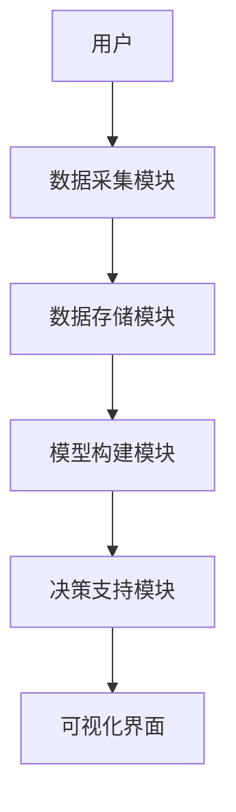

                 


# AI智能体在评估公司供应链弹性中的作用

## 关键词：AI智能体，供应链弹性，强化学习，系统架构，项目实战

## 摘要：  
本文探讨AI智能体在评估公司供应链弹性中的作用，从基本概念到算法原理，再到系统架构和项目实战，全面分析AI技术如何提升供应链弹性评估的效率和准确性。通过详细的技术分析和实际案例，揭示AI智能体在供应链弹性优化中的巨大潜力。

---

## 第一部分: 供应链弹性与AI智能体的背景介绍

### 第1章: 供应链弹性的基本概念

#### 1.1 供应链弹性的定义与重要性

- **供应链弹性**：供应链在面对 disruptions（如疫情、自然灾害、供应商问题等）时的适应和恢复能力。  
- **关键特征**：响应速度、成本控制、资源利用率、透明度。  
- **重要性**：  
  - **降低成本**：减少因中断导致的额外成本。  
  - **提高效率**：通过预测和优化，提升整体运营效率。  
  - **增强韧性**：在危机中快速调整，保障业务连续性。  

#### 1.2 供应链弹性评估的挑战

- **复杂性**：供应链涉及多个环节和参与者，变量众多且相互关联。  
- **数据获取**：数据分散、不完整，清洗和处理成本高。  
- **传统方法局限**：基于经验判断，缺乏数据支持和动态优化能力。  

---

### 第2章: AI智能体的基本概念与作用

#### 2.1 AI智能体的定义与类型

- **AI智能体**：能够感知环境、自主决策并执行任务的智能系统。  
- **类型对比**：  
  | 类型 | 特点 | 应用场景 |  
  |------|------|----------|  
  | 知识型 | 基于规则和知识库 | 专家系统、客服机器人 |  
  | 学习型 | 通过数据学习 | 推荐系统、图像识别 |  
  | 强化学习型 | 通过试错优化决策 | 游戏AI、供应链优化 |  

#### 2.2 AI智能体在供应链弹性评估中的作用

- **优化决策**：利用强化学习动态调整供应链策略。  
- **实时监控**：通过实时数据反馈，快速响应潜在风险。  
- **预测与模拟**：模拟不同场景，评估弹性并制定应急预案。  

---

## 第二部分: AI智能体的核心概念与工作原理

### 第3章: AI智能体的核心原理

#### 3.1 AI智能体的决策机制

- **强化学习机制**：通过试错优化决策，常用算法包括Q-learning、Deep Q-Network（DQN）。  
- **状态空间与动作空间**：  
  - 状态（State）：环境当前的状况，如库存水平、供应商交货时间。  
  - 动作（Action）：智能体可以执行的操作，如增加订单量、更换供应商。  
- **奖励机制**：智能体通过完成任务获得奖励，如减少库存成本或提高交货速度。  

#### 3.2 AI智能体的数据处理流程

- **数据采集**：从ERP系统、传感器等获取实时数据。  
- **特征提取**：识别关键特征，如供应商可靠性、运输时间。  
- **数据建模**：构建预测模型，评估不同场景下的弹性。  

---

### 第4章: AI智能体与供应链弹性的关联

#### 4.1 供应链弹性评估的关键指标

- **响应时间**：从发现风险到调整供应链的时间。  
- **成本控制**：弹性调整带来的额外成本。  
- **资源利用率**：供应链资源的使用效率。  

#### 4.2 AI智能体如何优化这些指标

- **提高响应速度**：通过实时监控和预测，快速识别风险。  
- **降低运营成本**：优化库存管理和供应商选择。  
- **提升资源分配效率**：动态调整资源，减少浪费。  

---

## 第三部分: AI智能体的算法原理与数学模型

### 第5章: 强化学习算法在供应链弹性评估中的应用

#### 5.1 强化学习的基本原理

- **Q-learning算法**：  
  $$ Q(s, a) = (1-\alpha) \cdot Q(s, a) + \alpha \cdot (r + \max Q(s', a')) $$
  其中，$\alpha$ 是学习率，$r$ 是奖励，$Q(s', a')$ 是下一步的最大Q值。  

- **算法流程图**：  
  ```mermaid
  graph TD
      A[初始化Q表] --> B[选择动作]
      B --> C[执行动作，观察状态]
      C --> D[获得奖励]
      D --> A[更新Q值]
  ```

---

## 第四部分: 系统分析与架构设计

### 第6章: 供应链弹性评估系统的架构设计

#### 6.1 系统功能设计

- **数据采集模块**：实时采集供应链数据。  
- **模型构建模块**：基于机器学习算法构建弹性评估模型。  
- **决策支持模块**：提供优化建议和风险预警。  

#### 6.2 系统架构图



---

## 第五部分: 项目实战

### 第7章: 供应链弹性评估系统的实现

#### 7.1 环境安装

- **工具安装**：Python、TensorFlow、Scikit-learn。  
- **数据准备**：收集历史供应链数据，清洗和预处理。  

#### 7.2 核心代码实现

- **强化学习模型代码**：  
  ```python
  import numpy as np
  import random

  class AI-Agent:
      def __init__(self, state_space, action_space):
          self.state_space = state_space
          self.action_space = action_space
          self.Q = np.zeros((state_space, action_space))

      def take_action(self, state, epsilon=0.1):
          if random.random() < epsilon:
              return random.randint(0, self.action_space-1)
          else:
              return np.argmax(self.Q[state, :])
  
      def update_Q(self, state, action, reward, next_state, alpha=0.1):
          self.Q[state, action] = (1 - alpha) * self.Q[state, action] + alpha * (reward + np.max(self.Q[next_state, :]))
  ```

---

## 第六部分: 最佳实践与小结

### 第8章: 最佳实践与小结

#### 8.1 最佳实践

- **数据质量**：确保数据的准确性和完整性。  
- **模型调优**：根据实际场景调整算法参数。  
- **持续优化**：定期更新模型，适应新的供应链变化。  

#### 8.2 小结

AI智能体通过强化学习和实时数据分析，显著提升了供应链弹性的评估和优化能力。企业应结合自身需求，合理部署AI技术，打造更具韧性的供应链体系。

---

## 作者：AI天才研究院 & 禅与计算机程序设计艺术

