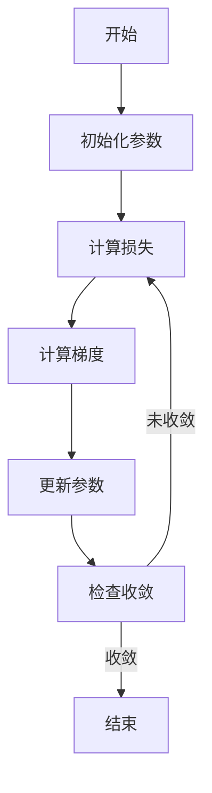

                 


# AI模型训练与优化步骤详解

> 关键词：AI模型、训练步骤、优化算法、数学公式、系统架构、项目实战

> 摘要：本文详细介绍了AI模型训练与优化的步骤，从背景概念到算法原理，再到系统设计与项目实战，逐步剖析了每个环节的核心内容。通过数学公式、流程图和代码示例，帮助读者全面理解AI模型训练与优化的过程。

---

## 第一部分: AI模型训练与优化背景介绍

### 第1章: AI模型训练与优化的核心概念

#### 1.1 问题背景与描述

- **AI模型训练的必要性**  
  AI模型的训练是通过大量数据调整模型参数，使其能够准确地进行预测或分类。训练过程是模型学习数据特征的关键步骤，直接影响模型的性能和准确性。

- **模型优化的目标与意义**  
  优化的目标是通过调整模型结构或优化算法，减少训练时间和计算资源的消耗，同时提高模型的预测准确率。优化是训练过程中的重要环节，能够显著提升模型的效率和效果。

- **训练与优化的边界与外延**  
  训练和优化的边界在于模型的训练过程和参数调整，而其外延则包括数据预处理、模型部署和应用。优化不仅仅是调整参数，还包括选择合适的算法和模型结构。

#### 1.2 核心概念与联系

- **训练与优化的核心原理**  
  训练是通过损失函数和优化算法调整模型参数的过程，而优化则是通过选择合适的算法和策略来加速训练过程。

- **概念属性特征对比表**

| 概念 | 属性 | 特征 |
|------|-------|------|
| 训练 | 输入数据 | 特征和标签 |
|      | 输出 | 模型参数调整 |
| 优化 | 输入 | 模型参数 |
|      | 输出 | 最优参数 |

- **ER实体关系图架构**

```mermaid
er
    actor: 训练工程师
    model: AI模型
    data: 训练数据
    actor -[训练]-> model
    model -[优化]-> model
    data -[输入]-> model
```

#### 1.3 本章小结

本章介绍了AI模型训练与优化的核心概念，包括训练和优化的必要性、核心原理以及它们之间的关系。通过对比表和ER图，帮助读者理解训练与优化的边界和外延。

---

## 第二部分: AI模型训练与优化的算法原理

### 第2章: 训练算法原理

#### 2.1 梯度下降算法

- **数学模型**

  梯度下降的数学模型如下：

  $$f(x) = w^2$$
  $$f'(x) = 2w$$
  $$w := w - \eta f'(x)$$

  其中，$\eta$ 是学习率，$w$ 是模型参数。

- **实现步骤**

  1. 初始化参数 $w$。
  2. 计算损失函数 $f(w)$。
  3. 计算梯度 $f'(w)$。
  4. 更新参数 $w = w - \eta f'(w)$。
  5. 重复步骤2-4，直到收敛。

- **优缺点分析**

  梯度下降的优点是简单易实现，缺点是收敛速度慢，尤其在数据量大的情况下。

#### 2.2 模型优化算法

- **随机梯度下降（SGD）**

  SGD通过随机抽取一批数据进行梯度计算，适用于大规模数据集。

- **批度下降（BGD）**

  BGD使用全部数据计算梯度，精度高但计算量大。

- **小批量梯度下降（MGD）**

  MGD介于SGD和BGD之间，既能加速训练，又能保持一定的精度。

### 第3章: 优化算法原理

#### 3.1 动量优化

- **数学模型**

  $$v_t = \beta v_{t-1} + (1-\beta)g_t$$
  $$w_t = w_{t-1} - \eta v_t$$

- **实现步骤**

  1. 初始化动量参数 $v$ 和学习率 $\eta$。
  2. 计算梯度 $g_t$。
  3. 更新动量 $v_t = \beta v_{t-1} + (1-\beta)g_t$。
  4. 更新参数 $w_t = w_{t-1} - \eta v_t$。

#### 3.2 Adam优化

- **数学模型**

  $$m_t = \beta_1 m_{t-1} + (1-\beta_1)g_t$$
  $$v_t = \beta_2 v_{t-1} + (1-\beta_2)g_t^2$$
  $$w_t = w_{t-1} - \eta \frac{m_t}{\sqrt{v_t + \epsilon}}$$

- **实现步骤**

  1. 初始化参数 $m$, $v$ 和学习率 $\eta$。
  2. 计算梯度 $g_t$。
  3. 更新 $m_t$ 和 $v_t$。
  4. 更新参数 $w_t$。

#### 3.3 优化算法对比分析

通过对比分析，Adam优化在大多数情况下表现优于SGD和动量优化，尤其是在数据稀疏性和非平稳情况下的表现更优。

### 第4章: 算法流程图



---

## 第三部分: AI模型训练与优化的系统分析与架构设计

### 第5章: 训练平台系统分析

#### 5.1 系统功能设计

- **领域模型设计**

  ```mermaid
  classDiagram
      class 训练工程师 {
          输入数据
          初始化模型
          训练模型
          优化参数
      }
      class 数据集 {
          特征
          标签
      }
      class 模型 {
          参数
          预测结果
      }
      训练工程师 --> 数据集: 提供数据
      训练工程师 --> 模型: 初始化
      训练工程师 --> 模型: 训练
      训练工程师 --> 模型: 优化
  ```

- **系统架构设计**

  ```mermaid
  graph LR
      A[训练工程师] --> B[数据预处理]
      B --> C[数据存储]
      C --> D[模型训练]
      D --> E[优化算法]
      E --> F[模型评估]
      F --> G[模型部署]
  ```

---

## 第四部分: AI模型训练与优化的项目实战

### 第6章: 项目实战

#### 6.1 环境安装

- **安装Python和相关库**

  ```bash
  pip install numpy matplotlib tensorflow
  ```

#### 6.2 核心实现

- **代码示例**

  ```python
  import numpy as np
  import matplotlib.pyplot as plt

  def f(x):
      return x**2

  def df(x):
      return 2*x

  def gradient_descent(f, df, x0, eta, iterations):
      x = x0
      history = [x]
      for _ in range(iterations):
          dx = df(x)
          x = x - eta * dx
          history.append(x)
      return history

  x_history = gradient_descent(f, df, 5, 0.1, 100)
  plt.plot(x_history)
  plt.xlabel('Iteration')
  plt.ylabel('x')
  plt.show()
  ```

---

## 第五部分: 最佳实践与小结

### 7.1 最佳实践

- **选择合适的优化算法**：根据数据和任务选择SGD、Adam等算法。
- **调整学习率**：适当调整学习率以加速收敛。
- **数据预处理**：进行归一化或标准化处理。

### 7.2 小结

本文详细介绍了AI模型训练与优化的步骤，从背景概念到算法原理，再到系统设计与项目实战，帮助读者全面理解AI模型训练与优化的过程。通过数学公式、流程图和代码示例，提供了丰富的理论和实践指导。

---

**作者：AI天才研究院/AI Genius Institute & 禅与计算机程序设计艺术 /Zen And The Art of Computer Programming**

---

以上是《AI模型训练与优化步骤详解》的完整目录和部分正文内容。如需继续补充其他部分，请随时告知！

