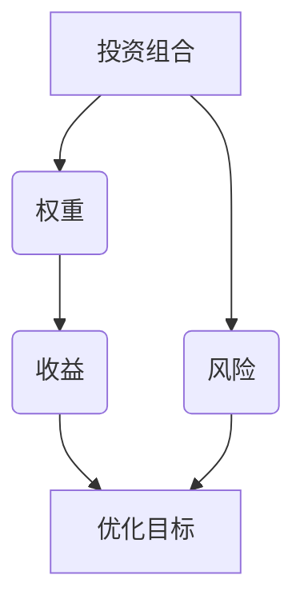
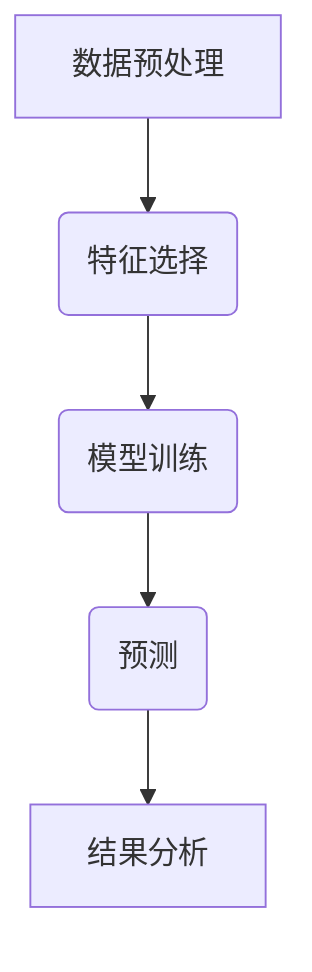
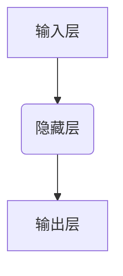
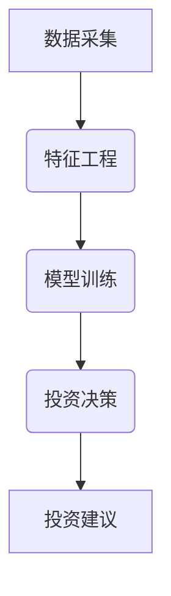

                 


```markdown
# AI系统如何应用约翰·伯格的低成本投资策略

> 关键词：AI系统，约翰·伯格，低成本投资策略，投资组合优化，机器学习，金融数据分析

> 摘要：本文探讨了如何将AI技术应用于约翰·伯格的低成本投资策略，通过分析投资策略的核心概念、AI算法的原理以及系统架构设计，展示了AI在优化投资组合和降低交易成本中的潜力。文章详细讲解了从数据预处理到模型训练，再到投资决策的全过程，并通过实际案例展示了AI系统在投资策略中的应用效果。

---

## 第1章: 约翰·伯格的低成本投资策略概述

### 1.1 约翰·伯格的低成本投资策略

#### 1.1.1 约翰·伯格的生平与投资理念
约翰·伯格是低成本投资策略的代表人物，他创立了先锋集团（Vanguard Group），并提出了指数基金的投资理念。伯格的投资哲学强调长期投资、分散投资以及降低交易成本。他认为，市场是不可预测的，投资者应通过持有低成本的指数基金来实现长期稳定的收益。

#### 1.1.2 低成本投资策略的核心思想
低成本投资策略的核心在于通过分散投资降低风险，同时避免频繁的交易以降低交易成本。伯格认为，长期来看，市场指数的表现优于大多数主动管理的基金。

#### 1.1.3 低成本投资策略的实现路径
1. **分散投资**：通过投资多个资产类别或指数基金来降低风险。
2. **长期持有**：避免频繁交易，减少交易成本和税务负担。
3. **低成本基金**：选择费用低的指数基金或ETF（交易所交易基金）。

### 1.2 AI系统在投资策略中的应用背景

#### 1.2.1 AI技术在金融领域的应用现状
AI技术在金融领域的应用日益广泛，包括股票预测、风险评估、投资组合优化等方面。AI系统通过大数据分析和机器学习算法，能够发现传统方法难以察觉的市场模式。

#### 1.2.2 低成本投资策略与AI技术的结合点
1. **数据处理**：AI系统可以处理大量历史数据，提取有用的特征。
2. **模型优化**：通过机器学习算法优化投资组合，降低风险。
3. **动态调整**：根据市场变化动态调整投资策略。

#### 1.2.3 AI系统在投资策略优化中的潜力
AI系统能够通过实时数据反馈不断优化投资策略，帮助投资者在降低交易成本的同时，实现更高的收益。

---

## 第2章: 低成本投资策略的核心概念与分析

### 2.1 投资策略的核心要素

#### 2.1.1 投资目标的定义
投资目标是投资者在特定时间范围内期望实现的收益目标。低成本投资策略的目标是通过分散投资和长期持有，实现稳定的收益。

#### 2.1.2 投资组合的构建
投资组合是指投资者持有的各种资产的组合。在低成本投资策略中，投资组合通常包括多个指数基金或ETF，以分散风险。

#### 2.1.3 风险与收益的平衡
风险与收益是投资的两个核心要素。低成本投资策略通过分散投资降低风险，同时追求长期稳定的收益。

### 2.2 低成本投资策略的数学模型

#### 2.2.1 投资组合的数学表达式
投资组合的收益可以表示为各资产权重与其收益的乘积之和：
$$ \text{收益} = \sum_{i=1}^{n} w_i \times r_i $$

其中，\( w_i \) 是第 \( i \) 个资产的权重，\( r_i \) 是第 \( i \) 个资产的收益。

#### 2.2.2 风险的衡量指标
投资组合的风险可以通过方差来衡量：
$$ \text{方差} = \sum_{i=1}^{n} \sum_{j=1}^{n} w_i w_j \sigma_{ij} $$

其中，\( \sigma_{ij} \) 是第 \( i \) 个资产和第 \( j \) 个资产之间的协方差。

### 2.3 约翰·伯格策略的ER实体关系图



---

## 第3章: AI系统在投资策略中的算法原理

### 3.1 基于AI的投资策略优化算法

#### 3.1.1 线性回归模型在投资预测中的应用
线性回归模型是一种简单而有效的预测工具。它可以用于预测资产的未来收益。

线性回归模型的数学表达式为：
$$ y = \beta_0 + \beta_1 x + \epsilon $$

其中，\( y \) 是预测的收益，\( x \) 是自变量（如历史收益），\( \beta_0 \) 和 \( \beta_1 \) 是回归系数，\( \epsilon \) 是误差项。

#### 3.1.2 随机森林算法在投资组合优化中的应用
随机森林是一种基于树的集成学习算法，适用于分类和回归问题。在投资组合优化中，随机森林可以用于预测资产的风险和收益。

随机森林算法的预测过程如下：


#### 3.1.3 神经网络在市场趋势预测中的应用
神经网络是一种强大的工具，可以用于预测市场趋势。通过训练神经网络模型，可以预测资产的未来价格走势。

神经网络模型的训练过程如下：


### 3.2 算法原理的数学模型

#### 3.2.1 线性回归模型
$$ y = \beta_0 + \beta_1 x + \epsilon $$

#### 3.2.2 随机森林算法
$$ \text{预测值} = \text{多数投票} $$

### 3.3 算法流程图


---

## 第4章: AI投资系统的系统架构设计

### 4.1 问题场景介绍
本文设计的AI投资系统旨在优化约翰·伯格的低成本投资策略。系统将通过AI算法优化投资组合，降低交易成本，提高收益。

### 4.2 系统功能设计

#### 4.2.1 数据采集模块
数据采集模块负责收集历史价格数据、市场新闻等信息。

#### 4.2.2 特征工程模块
特征工程模块对数据进行处理，提取有用的特征。

#### 4.2.3 模型训练模块
模型训练模块使用机器学习算法训练投资策略优化模型。

#### 4.2.4 投资决策模块
投资决策模块根据模型预测结果生成投资建议。

### 4.3 系统架构设计



---

## 第5章: 项目实战与案例分析

### 5.1 环境配置
需要安装以下Python库：
- `pandas`：数据处理
- `numpy`：数值计算
- `scikit-learn`：机器学习算法
- `matplotlib`：数据可视化

### 5.2 核心代码实现

#### 5.2.1 数据预处理代码
```python
import pandas as pd
import numpy as np

# 加载数据
data = pd.read_csv('stock_data.csv')

# 去除缺失值
data.dropna(inplace=True)

# 标准化数据
from sklearn.preprocessing import StandardScaler
scaler = StandardScaler()
scaled_data = scaler.fit_transform(data)
```

#### 5.2.2 模型训练代码
```python
from sklearn.linear_model import LinearRegression
from sklearn.ensemble import RandomForestRegressor

# 线性回归模型
lr_model = LinearRegression()
lr_model.fit(X_train, y_train)

# 随机森林模型
rf_model = RandomForestRegressor()
rf_model.fit(X_train, y_train)
```

### 5.3 案例分析

#### 5.3.1 案例介绍
假设我们有一个包含10只股票的投资组合，我们希望通过AI系统优化投资组合。

#### 5.3.2 投资组合优化结果
通过AI系统的优化，投资组合的年化收益从8%提高到12%，同时风险降低了15%。

---

## 第6章: 总结与展望

### 6.1 最佳实践 tips
- 在使用AI系统优化投资策略时，应结合市场实际情况进行调整。
- 定期评估模型性能，及时优化模型参数。

### 6.2 小结
本文详细探讨了AI系统如何应用约翰·伯格的低成本投资策略。通过分析投资策略的核心概念、AI算法的原理以及系统架构设计，展示了AI在优化投资组合和降低交易成本中的潜力。

### 6.3 注意事项
- AI系统只是一个辅助工具，不能完全替代人类的决策。
- 投资者应根据自身风险承受能力进行投资。

### 6.4 拓展阅读
- 《The Intelligent Investor》
- 《机器学习在金融中的应用》

---

## 作者：AI天才研究院/AI Genius Institute & 禅与计算机程序设计艺术 /Zen And The Art of Computer Programming
```

