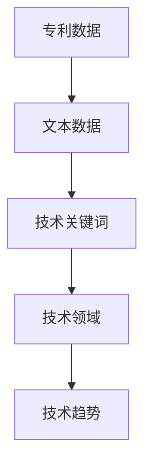
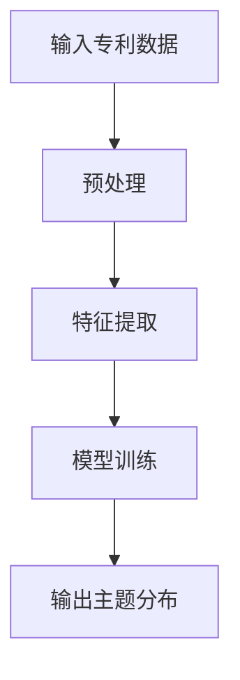
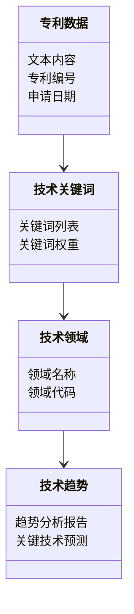

                 


# AI辅助专利分析与技术趋势预测的方法与工具

## 关键词：AI，专利分析，技术趋势预测，自然语言处理，机器学习

## 摘要：本文探讨AI技术如何辅助专利分析与技术趋势预测，介绍核心概念、算法原理、系统架构，并通过项目实战展示具体实现。

---

## 第一部分：AI辅助专利分析与技术趋势预测的背景与核心概念

### 第1章：AI与专利分析的背景介绍

#### 1.1 专利分析与技术趋势预测的背景
专利分析是指通过对专利数据的整理、挖掘和分析，揭示技术的发展趋势、竞争态势及创新热点。技术趋势预测则基于专利分析结果，预测未来的技术发展方向和关键领域。随着科技的快速发展，专利数量急剧增加，传统的手动分析方式已难以应对海量数据，因此引入AI技术成为必然趋势。

#### 1.2 AI如何改变专利分析
AI技术，特别是自然语言处理（NLP）和机器学习（ML），能够高效处理和分析专利文本，提取关键信息，识别技术关键词和主题，从而帮助研究人员快速掌握技术动态。AI还能预测技术发展趋势，识别潜在的技术空白和创新方向。

#### 1.3 技术趋势预测的重要性
技术趋势预测对于企业制定研发战略、优化资源配置具有重要意义。通过预测技术趋势，企业可以提前布局关键领域，抢占技术高地，降低研发风险。

---

### 第2章：AI辅助专利分析的核心概念与联系

#### 2.1 核心概念原理
- **自然语言处理（NLP）**：用于理解和分析专利文本，提取关键词、主题和摘要。
- **机器学习（ML）**：用于分类、聚类和预测，帮助识别技术趋势和创新热点。
- **数据挖掘**：从大量专利数据中提取模式和关联，发现潜在的技术关系。

#### 2.2 核心概念属性特征对比
以下是AI技术与传统专利分析方法的对比：

| 对比维度         | AI辅助专利分析                  | 传统专利分析              |
|------------------|----------------------------------|---------------------------|
| 数据处理能力     | 高效处理海量数据                | 手工处理，效率较低          |
| 分析深度         | 深度挖掘潜在关系                | 主要基于表面信息            |
| 可扩展性         | 支持大规模数据分析              | 适用于小规模数据            |
| 准确性           | 结合模型训练，准确性较高          | 取决于分析人员的经验          |

#### 2.3 实体关系图（Mermaid流程图）
以下是专利分析的核心实体关系图：



---

## 第二部分：AI辅助专利分析的算法原理讲解

### 第3章：算法原理概述

#### 3.1 文本挖掘算法的原理
文本挖掘通过提取、处理和分析文本数据，发现隐藏在其中的知识和模式。常用算法包括分词、实体识别和情感分析。

#### 3.2 主题建模算法（如LDA）的流程
主题建模（如Latent Dirichlet Allocation, LDA）用于识别文档中的主题分布。其流程如下：



#### 3.3 机器学习算法在专利分类中的应用
机器学习算法（如SVM、随机森林）可用于专利分类，通过训练模型，准确分类专利到不同的技术领域。

### 第4章：算法实现代码示例

以下是主题建模的Python代码示例：

```python
from sklearn.feature_extraction.text import TfidfVectorizer
from sklearn.decomposition import LatentDirichletAllocation

# 示例代码
vectorizer = TfidfVectorizer(max_features=1000)
X = vectorizer.fit_transform(documents)
lda = LatentDirichletAllocation(n_components=5)
lda.fit(X)
```

---

## 第三部分：系统分析与架构设计

### 第5章：系统功能设计

#### 5.1 领域模型设计
以下是领域模型的Mermaid类图：



#### 5.2 系统架构设计
以下是系统架构的Mermaid架构图：


---

## 第四部分：项目实战

### 第6章：环境安装与核心代码实现

#### 6.1 环境安装
建议使用Python 3.8及以上版本，安装以下库：

```bash
pip install numpy pandas scikit-learn gensim
```

#### 6.2 核心代码实现
以下是主题建模的Python代码示例：

```python
from gensim.models import LdaModel
from gensim.corpora import Dictionary

# 假设已经进行了文本预处理和分词
dictionary = Dictionary(documents)
corpus = [dictionary.doc2bow(doc) for doc in documents]
lda_model = LdaModel(corpus, num_topics=5, id2word=dictionary)
```

#### 6.3 代码解读与分析
- **文本预处理**：包括分词、去除停用词等。
- **主题建模**：通过LDA模型提取主题，识别每个主题的相关关键词。
- **技术趋势预测**：基于主题分布和时间序列分析，预测未来的技术发展趋势。

---

## 第五部分：最佳实践与小结

### 第7章：总结与注意事项

#### 7.1 总结
AI辅助专利分析与技术趋势预测通过结合NLP和机器学习技术，能够高效处理海量专利数据，发现潜在的技术趋势和创新方向。本文详细介绍了核心概念、算法原理、系统架构和项目实战，为读者提供了全面的指导。

#### 7.2 注意事项
- 数据质量：确保专利数据的完整性和准确性。
- 模型选择：根据具体需求选择合适的算法和模型。
- 实际应用：结合企业实际需求，灵活调整分析方法。

### 第8章：拓展阅读与工具推荐

#### 8.1 拓展阅读
- 《自然语言处理实战》：深入讲解NLP技术及其应用。
- 《机器学习实战》：提供丰富的机器学习算法实现案例。

#### 8.2 工具推荐
- **NLTK**：Python自然语言处理库。
- **Gensim**：主题建模和文本挖掘工具。
- **spaCy**：工业级NLP工具。

---

## 作者：AI天才研究院/AI Genius Institute & 禅与计算机程序设计艺术/Zen And The Art of Computer Programming

---

这篇文章从背景介绍到项目实战，详细讲解了AI辅助专利分析与技术趋势预测的方法与工具。通过理论与实践结合，帮助读者掌握相关技术的核心概念和实现方法。

