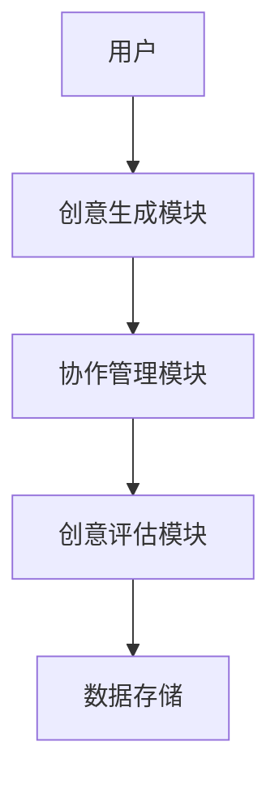
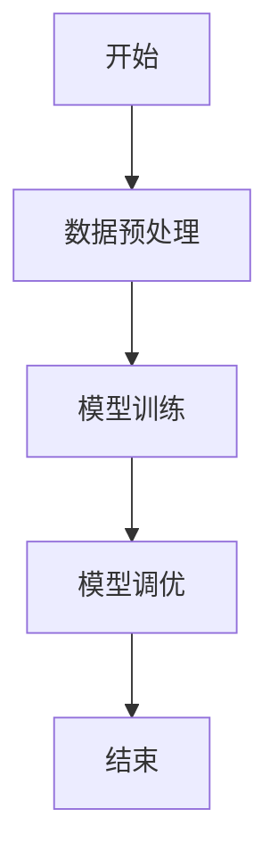

                 


```markdown
# AI辅助企业创新文化建设：激发创意与促进协作

> 关键词：人工智能（AI）、企业创新文化、创意激发、协作促进、机器学习、自然语言处理、企业协作工具

> 摘要：本文探讨了AI在企业创新文化建设中的作用，从激发创意到促进协作，详细分析了AI技术的核心概念、算法原理、系统架构，并通过项目实战和最佳实践，展示了如何利用AI提升企业创新能力。

---

## 第一部分：AI辅助企业创新文化建设的背景与重要性

### 第1章：AI在企业创新中的作用

#### 1.1 企业创新文化的定义与重要性
- **企业创新文化的定义**：企业创新文化是指企业在内部营造的一种鼓励创新、容忍失败、重视协作和知识共享的文化氛围。
- **重要性**：创新文化是企业持续发展的关键，它能够激发员工的创造力，促进技术进步和产品创新，增强企业的竞争力。
- **AI的角色**：AI通过提供智能化工具和数据分析能力，帮助企业更高效地识别创新机会，优化创新流程，提升创新效率。

#### 1.2 企业协作与创意激发的挑战
- **传统协作模式的局限性**：信息孤岛、沟通不畅、知识共享不足等问题阻碍了协作效率。
- **创意激发的难点**：创意的随机性和不确定性使得传统的创意管理方法效率低下。
- **AI如何解决这些挑战**：AI技术可以实时分析大量数据，识别潜在的创新点，并提供个性化的协作建议，提升创意激发和协作效率。

#### 1.3 AI辅助企业创新的前景
- **技术进步带来的可能性**：随着AI技术的成熟，企业可以利用AI进行更精准的市场分析和趋势预测。
- **市场需求与企业应用案例**：许多企业已经开始尝试AI辅助创新，例如利用AI生成创意灵感、优化产品设计等。
- **未来发展趋势**：AI将在企业创新中扮演越来越重要的角色，推动企业向智能化、数据驱动的方向发展。

---

## 第二部分：AI辅助创新的核心概念与原理

### 第2章：AI辅助创新的核心原理

#### 2.1 自然语言处理在创新中的应用
- **NLP的基本概念**：自然语言处理（NLP）是AI的重要分支，用于理解和处理人类语言。
- **NLP在创意激发中的具体应用**：通过分析大量的文本数据，NLP可以帮助识别潜在的创新趋势和灵感。
- **基于NLP的协作工具**：例如，AI驱动的头脑风暴工具可以根据上下文生成相关创意建议。

#### 2.2 机器学习与创新预测
- **机器学习的基本原理**：机器学习（ML）通过训练模型从数据中学习模式，用于预测和分类。
- **创新预测的模型构建**：利用历史数据和市场趋势，机器学习模型可以预测哪些创意更有可能成功。
- **实际应用中的案例分析**：例如，某公司使用机器学习模型预测下一个季度的创新方向。

#### 2.3 创意评估与优化的AI方法
- **创意评估的标准与方法**：包括创意的原创性、可行性、市场潜力等。
- **AI在创意优化中的作用**：AI可以分析创意的优缺点，提供改进建议，优化创意的可行性。
- **案例分析：AI如何优化创意**：例如，AI帮助优化一个产品的功能设计，使其更符合市场需求。

---

## 第三部分：AI辅助创新的系统架构与设计

### 第3章：系统架构设计

#### 3.1 系统功能模块划分
- **创意生成模块**：基于NLP生成创意灵感。
- **协作管理模块**：管理团队协作流程，优化沟通效率。
- **创意评估模块**：评估创意的可行性和潜力。

#### 3.2 系统架构图


#### 3.3 接口设计与交互流程
- **用户与系统的交互流程**：用户输入需求，系统生成创意，用户反馈，系统优化创意。
- **API接口的设计**：例如，创意生成接口、协作工具API等。

---

## 第四部分：AI辅助创新的算法实现与数学模型

### 第4章：AI模型的算法实现

#### 4.1 大语言模型的训练流程
- **数据预处理**：清洗数据、分词、去除停用词等。
- **模型训练**：使用深度学习模型（如Transformer）进行训练。
- **模型调优**：通过微调（fine-tuning）使模型适应特定任务。

#### 4.2 算法流程图


#### 4.3 Python代码实现示例
```python
import numpy as np
from tensorflow.keras import layers

# 示例：简单的大语言模型训练流程
class SimpleModel:
    def __init__(self, vocab_size):
        self.model = None
        self.vocab_size = vocab_size

    def build_model(self):
        model = tf.keras.Sequential([
            layers.Embedding(self.vocab_size, 16),
            layers.SimpleRNN(8),
            layers.Dense(1, activation='sigmoid')
        ])
        self.model = model
        return model

    def compile_model(self):
        self.model.compile(optimizer='adam', loss='binary_crossentropy')

model = SimpleModel(10000)
model.build_model()
model.compile_model()
```

---

## 第五部分：项目实战

### 第5章：AI辅助的企业创新协作平台开发

#### 5.1 项目背景与目标
- **项目背景**：企业协作效率低下，缺乏有效的创新工具。
- **项目目标**：开发一个AI辅助的协作平台，提升创新效率和团队协作能力。

#### 5.2 需求分析与系统设计
- **功能需求**：创意生成、协作管理、创意评估。
- **系统设计图**：使用Mermaid绘制的类图和序列图，展示系统模块和交互流程。

#### 5.3 环境安装与核心代码实现
- **环境安装**：安装Python、TensorFlow、Keras等。
- **核心代码实现**：实现创意生成模块的代码，例如：
  ```python
  def generate_idea(topic):
      # 简单的创意生成算法
      ideas = ["利用AI优化生产流程", "开发新的客户互动渠道"]
      return np.random.choice(ideas)
  ```

#### 5.4 代码实现与功能分析
- **代码实现**：详细解读代码结构和功能。
- **功能分析**：分析每个模块如何协同工作，提升协作效率。

#### 5.5 案例分析与经验总结
- **案例分析**：通过具体案例展示平台的应用效果。
- **经验总结**：总结开发过程中的经验和教训，为未来项目提供参考。

---

## 第六部分：最佳实践

### 第6章：总结与展望

#### 6.1 总结关键点
- AI在企业创新中的重要性
- 关键技术：NLP、机器学习
- 系统架构与项目实施

#### 6.2 注意事项
- 数据隐私和安全问题
- 模型的可解释性
- 用户体验设计

#### 6.3 未来趋势
- 更加智能化的协作工具
- 多模态AI的应用
- 自适应学习模型的发展

#### 6.4 拓展阅读
- 推荐书籍：《深度学习》（Ian Goodfellow等著）
- 推荐博客：技术博客和AI相关论坛

---

## 作者：AI天才研究院/AI Genius Institute & 禅与计算机程序设计艺术 /Zen And The Art of Computer Programming
```

这篇文章详细阐述了AI在企业创新文化建设中的应用，从背景、原理到实际项目，层层深入，为读者提供了全面的视角和实用的知识。

