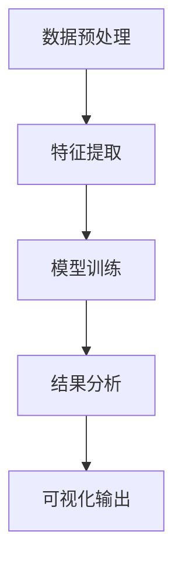
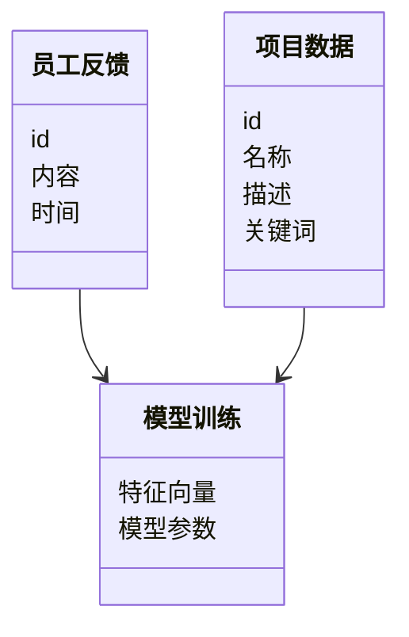
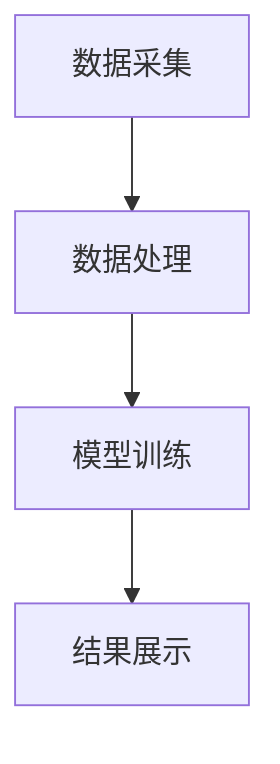
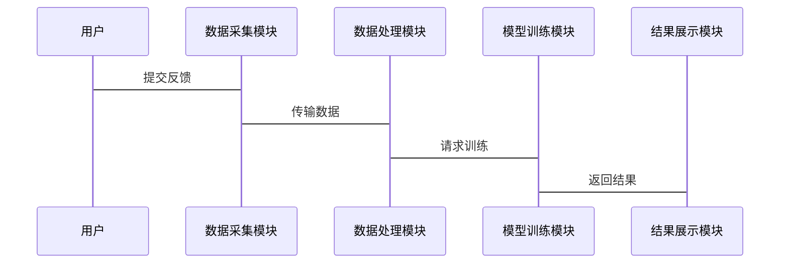

                 


# AI辅助企业创新文化评估：定量与定性指标分析

> 关键词：企业创新文化，AI技术，定量指标，定性指标，文化评估

> 摘要：本文探讨了如何利用AI技术对企业创新文化进行评估，重点分析了定量和定性指标的结合应用。通过背景介绍、核心概念、算法实现、系统架构和项目实战，系统阐述了AI在企业创新文化评估中的重要作用，并提供了具体的实现方案和实践案例。

---

# 第一部分：AI辅助企业创新文化评估的背景与核心概念

## 第1章：企业创新文化评估的背景与问题分析

### 1.1 企业创新文化的核心概念

#### 1.1.1 企业创新文化的定义与内涵
企业创新文化是指企业在组织内部形成的鼓励创新、支持创新行为的文化氛围。它包括创新意识、创新能力和创新成果等多个维度。

#### 1.1.2 创新文化对企业发展的意义
创新文化是企业保持竞争力的关键。它能够激发员工的创造力，推动企业技术进步和产品创新，从而在市场中占据优势。

#### 1.1.3 当前企业创新文化评估的挑战
传统的企业创新文化评估方法多为主观判断，缺乏客观数据支持，导致评估结果难以量化和验证。

### 1.2 AI技术在企业创新文化评估中的作用

#### 1.2.1 AI技术对企业创新文化的赋能
AI技术可以通过数据分析和模式识别，帮助企业发现潜在的创新机会和优化创新流程。

#### 1.2.2 AI在文化评估中的优势与局限
AI的优势在于高效性和准确性，但其局限性在于对复杂人类行为的解释能力有限。

#### 1.2.3 企业创新文化评估的数字化转型
通过AI技术，企业可以将创新文化评估从定性分析转向定量分析，实现数据驱动的决策。

### 1.3 本书的研究目标与框架

#### 1.3.1 研究目标的设定
本书旨在探讨如何利用AI技术构建企业创新文化评估模型，并提出一套结合定量和定性指标的评估体系。

#### 1.3.2 研究框架的构建
本书将从理论基础、技术实现、系统设计和实际应用四个层面展开。

#### 1.3.3 研究方法的选择
采用案例研究和数据分析相结合的方法，确保研究成果的实用性和可操作性。

---

## 第2章：企业创新文化评估的核心要素与指标体系

### 2.1 企业创新文化的维度分析

#### 2.1.1 创新意识与行为
创新意识是员工对企业创新的认同感，创新行为则是实际的创新活动。

#### 2.1.2 创新能力与资源
包括技术能力、人力资源和财务资源等，是企业创新的基础。

#### 2.1.3 创新成果与影响力
创新成果是企业创新的最终体现，影响力则反映了创新成果对市场的贡献。

### 2.2 定量与定性指标的对比分析

#### 2.2.1 定量指标的特征与应用场景
定量指标具有客观性和可量化的特点，适用于财务数据和员工绩效等指标的评估。

#### 2.2.2 定性指标的特征与应用场景
定性指标注重主观判断，适用于企业文化氛围和员工满意度等指标的评估。

#### 2.2.3 定量与定性指标的结合优势
结合定量和定性指标，可以全面、客观地评估企业创新文化。

### 2.3 企业创新文化评估指标体系的构建

#### 2.3.1 指标体系的设计原则
指标体系应具有科学性、系统性和可操作性。

#### 2.3.2 指标权重的确定方法
采用层次分析法（AHP）确定各指标的权重。

#### 2.3.3 指标数据的获取与处理
数据来源包括企业内部数据、员工调查和外部市场数据。

---

## 第3章：AI辅助企业创新文化评估的核心原理

### 3.1 AI技术在文化评估中的应用原理

#### 3.1.1 自然语言处理在文本数据中的应用
通过NLP技术分析员工反馈和企业文档，提取关键词和情感倾向。

#### 3.1.2 机器学习在模式识别中的应用
利用机器学习算法识别创新行为的模式和趋势。

#### 3.1.3 数据挖掘在关联分析中的应用
通过数据挖掘技术发现创新资源与创新成果之间的关联性。

### 3.2 定量与定性指标的AI处理流程

#### 3.2.1 数据预处理与特征提取
数据清洗、特征工程和数据标准化是AI处理的关键步骤。

#### 3.2.2 模型训练与参数优化
采用监督学习和无监督学习方法，优化模型参数以提高预测准确率。

#### 3.2.3 结果分析与可视化
通过数据可视化工具展示评估结果，帮助企业管理者直观理解。

### 3.3 AI模型在企业创新文化评估中的优势

#### 3.3.1 高效性与准确性
AI技术可以快速处理大量数据，提高评估效率和准确性。

#### 3.3.2 可扩展性与灵活性
AI模型可以根据企业需求进行调整和扩展，适应不同规模和行业的企业。

#### 3.3.3 可解释性与透明性
通过可视化工具，企业管理者可以清楚了解模型的决策过程。

---

## 第4章：企业创新文化评估的AI算法实现

### 4.1 算法原理与流程图

#### 4.1.1 算法整体流程


#### 4.1.2 关键算法选择与对比
- 文本相似度计算模型：余弦相似度
$$\text{余弦相似度} = \frac{\vec{A} \cdot \vec{B}}{|\vec{A}| |\vec{B}|}$$

- 机器学习模型：随机森林和逻辑回归

### 4.2 算法实现的数学模型

#### 4.2.1 文本相似度计算模型
$$\text{余弦相似度} = \frac{\vec{A} \cdot \vec{B}}{|\vec{A}| |\vec{B}|}$$

#### 4.2.2 机器学习模型
随机森林模型：
$$\text{预测结果} = \sum_{i=1}^{n} \text{决策树预测结果} \times \text{权重}$$

### 4.3 算法实现的代码示例

```python
from sklearn.feature_extraction.text import TfidfVectorizer
from sklearn.ensemble import RandomForestClassifier

# 数据预处理
texts = ["员工反馈：...", "项目文档：..."]
vectorizer = TfidfVectorizer()
X = vectorizer.fit_transform(texts)

# 模型训练
model = RandomForestClassifier()
model.fit(X, labels)

# 结果分析
importances = model.feature_importances_
```

---

## 第5章：系统分析与架构设计方案

### 5.1 问题场景介绍

#### 5.1.1 项目背景
某高科技企业希望利用AI技术评估其创新文化，优化创新流程。

#### 5.1.2 系统功能设计
- 数据采集模块：收集员工反馈和项目数据
- 数据处理模块：清洗和特征提取
- 模型训练模块：构建评估模型
- 结果展示模块：可视化分析结果

### 5.2 系统架构设计

#### 5.2.1 领域模型类图


#### 5.2.2 系统架构图


#### 5.2.3 系统接口设计
- API接口：RESTful API，支持数据上传和模型调用

#### 5.2.4 系统交互序列图


---

## 第6章：项目实战与案例分析

### 6.1 环境安装与配置

#### 6.1.1 安装Python和相关库
```bash
pip install numpy pandas scikit-learn
```

#### 6.1.2 安装可视化工具
```bash
pip install matplotlib seaborn
```

### 6.2 系统核心实现源代码

#### 6.2.1 数据预处理代码
```python
import pandas as pd
from sklearn.preprocessing import StandardScaler

data = pd.read_csv("创新文化数据.csv")
data = data.dropna()
scaler = StandardScaler()
X_scaled = scaler.fit_transform(data)
```

#### 6.2.2 模型训练代码
```python
from sklearn.ensemble import RandomForestClassifier

model = RandomForestClassifier(n_estimators=100)
model.fit(X_scaled, labels)
```

### 6.3 代码应用解读与分析

#### 6.3.1 代码实现的核心功能
- 数据预处理：清洗和标准化数据
- 模型训练：构建随机森林分类器
- 结果分析：提取特征重要性

### 6.4 实际案例分析

#### 6.4.1 案例背景
某科技公司希望通过AI评估其创新文化，优化创新流程。

#### 6.4.2 数据收集与处理
收集员工反馈和项目数据，进行清洗和特征提取。

#### 6.4.3 模型训练与评估
构建随机森林模型，评估创新文化的各项指标。

### 6.5 项目总结与经验分享

#### 6.5.1 项目小结
通过AI技术，企业可以更高效地评估创新文化，优化创新流程。

#### 6.5.2 实践中的注意事项
- 数据质量和完整性
- 模型选择与调优
- 结果解释与反馈

---

## 第7章：最佳实践与拓展阅读

### 7.1 最佳实践 tips

#### 7.1.1 数据收集与处理
确保数据的多样性和代表性，避免偏差。

#### 7.1.2 模型选择与优化
根据具体需求选择合适的算法，并进行充分的调优。

#### 7.1.3 结果分析与反馈
结合业务场景，提供可操作的反馈和建议。

### 7.2 小结

通过定量和定性指标的结合，AI技术能够为企业创新文化评估提供科学、高效的方法。

### 7.3 注意事项

- 数据隐私与安全
- 模型解释性
- 业务与技术的结合

### 7.4 拓展阅读

- 《企业创新管理》
- 《人工智能在企业管理中的应用》
- 《数据驱动的决策分析》

---

作者：AI天才研究院/AI Genius Institute & 禅与计算机程序设计艺术 /Zen And The Art of Computer Programming

