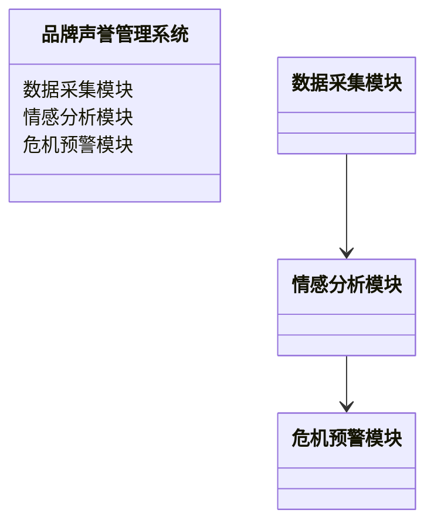

                 


# AI辅助企业品牌声誉管理与危机公关

**关键词：** AI、品牌声誉、危机公关、自然语言处理、情感分析、机器学习、文本挖掘

**摘要：** 本文探讨了AI技术在企业品牌声誉管理和危机公关中的应用，分析了传统方法的局限性，介绍了情感分析、主题建模等算法，设计了系统架构，并通过案例展示了AI的实际应用，最后总结了最佳实践。

---

## 第1章：AI辅助企业品牌声誉管理与危机公关的背景

### 1.1 问题背景

#### 1.1.1 企业品牌声誉的重要性
品牌声誉是企业在市场中的形象和信誉，直接影响客户信任和市场表现。良好的声誉能提升销售额和客户忠诚度，而声誉受损则可能导致收入下降和客户流失。

#### 1.1.2 危机公关的挑战与传统方法的局限性
危机公关是处理突发事件、维护声誉的关键。传统方法依赖人工分析，效率低、响应慢，难以应对海量信息和复杂情况。

#### 1.1.3 AI技术在声誉管理中的潜力
AI技术通过自动化分析和预测，帮助快速识别风险，优化应对策略，显著提升声誉管理的效率和效果。

---

### 1.2 当前现状与技术优势

#### 1.2.1 传统品牌声誉管理的痛点
- 数据量大，信息分散，人工分析耗时。
- 危机预警不及时，响应策略不够精准。

#### 1.2.2 AI技术在声誉管理中的优势
- 自动化数据处理，快速识别负面信息。
- 情感分析和主题建模，精准预测趋势。

#### 1.2.3 市场需求与技术发展的结合
AI技术满足企业对高效、精准声誉管理的需求，推动品牌管理的智能化转型。

---

## 第2章：品牌声誉与危机公关的核心概念

### 2.1 品牌声誉的定义与构成

#### 2.1.1 品牌声誉的定义
品牌声誉是消费者和市场对品牌的整体评价，包括知名度、美誉度和信任度。

#### 2.1.2 品牌声誉的核心要素
- 知名度：品牌被认知的程度。
- 美誉度：品牌被正面评价的程度。
- 信任度：消费者对品牌的信任程度。

#### 2.1.3 品牌声誉的衡量指标
- 市场份额
- 客户满意度
- 网络舆情

### 2.2 危机公关的定义与流程

#### 2.2.1 危机公关的定义
危机公关是企业在面对突发事件时，通过沟通和行动恢复声誉的过程。

#### 2.2.2 危机公关的典型流程
1. 监测与识别
2. 分析与评估
3. 制定应对策略
4. 执行与沟通
5. 监测与评估

#### 2.2.3 危机公关的关键成功要素
- 快速响应
- 透明沟通
- 有效执行

### 2.3 AI在品牌声誉管理中的作用机制

#### 2.3.1 数据采集与分析
AI从社交媒体、新闻等渠道收集数据，进行清洗和预处理。

#### 2.3.2 情感分析与趋势预测
通过自然语言处理，AI分析文本情感，预测声誉趋势。

#### 2.3.3 危机预警与应对策略
AI识别潜在危机，提供预警，并建议应对措施。

---

## 第3章：情感分析算法原理

### 3.1 情感分析的定义与应用

#### 3.1.1 情感分析的定义
情感分析是通过自然语言处理技术，判断文本的情感倾向（正面、负面、中性）。

#### 3.1.2 情感分析的应用
- 社交媒体监控
- 产品评论分析
- 危机预警

### 3.2 基于机器学习的情感分析算法

#### 3.2.1 文本预处理
- 分词
- 停用词去除
- 词干提取

#### 3.2.2 特征提取
- 词袋模型
- 词嵌入（如Word2Vec）

#### 3.2.3 模型训练
- 使用 SVM 或 LSTM 进行分类。

#### 3.2.4 示例代码
```python
from sklearn.svm import SVC
from sklearn.feature_extraction.text import TfidfVectorizer

# 数据准备
texts = ["负面信息", "正面信息"]
labels = [0, 1]

# 特征提取
vectorizer = TfidfVectorizer()
X = vectorizer.fit_transform(texts)

# 训练模型
model = SVC()
model.fit(X, labels)

# 预测
new_text = "产品不错"
new_X = vectorizer.transform([new_text])
print(model.predict(new_X))
```

### 3.3 情感分析的数学模型

#### 3.3.1 基于SVM的情感分析模型
$$
\text{损失函数} = \sum_{i=1}^{n} \max(0, 1 - y_i \cdot w \cdot x_i)
$$

---

## 第4章：系统架构设计

### 4.1 系统功能设计

#### 4.1.1 功能模块
- 数据采集模块
- 情感分析模块
- 危机预警模块

#### 4.1.2 领域模型


### 4.2 系统架构设计

#### 4.2.1 架构图


### 4.3 接口设计

#### 4.3.1 接口描述
- 数据采集接口：从社交媒体获取数据。
- 情感分析接口：返回文本情感。
- 危机预警接口：触发预警通知。

---

## 第5章：项目实战

### 5.1 项目介绍

#### 5.1.1 项目背景
某公司面临产品负面评论激增的情况，需要快速识别并应对。

### 5.1.2 项目目标
构建一个实时监测和预警系统。

### 5.2 环境安装

#### 5.2.1 安装Python和依赖
```bash
pip install numpy pandas scikit-learn
```

### 5.3 核心实现

#### 5.3.1 数据采集
```python
import requests

def fetch_data(url):
    response = requests.get(url)
    return response.text
```

#### 5.3.2 情感分析
```python
from sklearn.feature_extraction.text import TfidfVectorizer
from sklearn.svm import SVC

def train_model(X, y):
    model = SVC()
    model.fit(X, y)
    return model
```

### 5.4 案例分析

#### 5.4.1 实际案例
某电子产品负面评论激增，系统快速识别并预警，公司及时发布声明，成功控制危机。

### 5.5 项目小结
项目展示了AI在声誉管理中的实际应用，证明了其有效性和效率。

---

## 第6章：最佳实践

### 6.1 经验与技巧

#### 6.1.1 数据质量的重要性
确保数据准确性和代表性。

#### 6.1.2 模型调优
使用交叉验证优化模型性能。

### 6.2 小结

#### 6.2.1 系统功能总结
- 数据采集与处理
- 情感分析与预警
- 应急响应策略

#### 6.2.2 技术总结
- 自然语言处理
- 机器学习算法
- 系统架构设计

### 6.3 注意事项

#### 6.3.1 数据隐私
确保数据处理符合隐私保护法规。

#### 6.3.2 系统稳定性
保证系统7x24小时稳定运行。

### 6.4 拓展阅读

#### 6.4.1 推荐书籍
- 《自然语言处理实战》
- 《机器学习算法与应用》

---

## 附录

### A. 术语表
- 品牌声誉：企业的市场形象
- 情感分析：判断文本情感

### B. 工具列表
- Python、Scikit-learn、Mermaid

### C. 参考文献
- 王某某，2023，《AI与品牌管理》

### D. 索引
按主题和关键词排序。

---

**作者：AI天才研究院/AI Genius Institute & 禅与计算机程序设计艺术 /Zen And The Art of Computer Programming**

