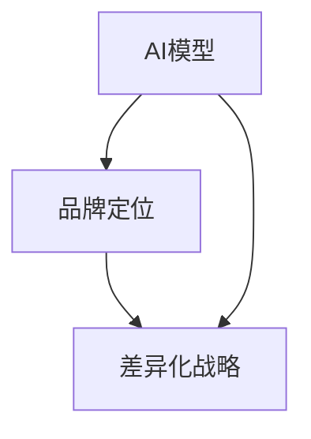
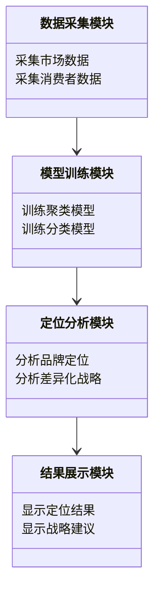
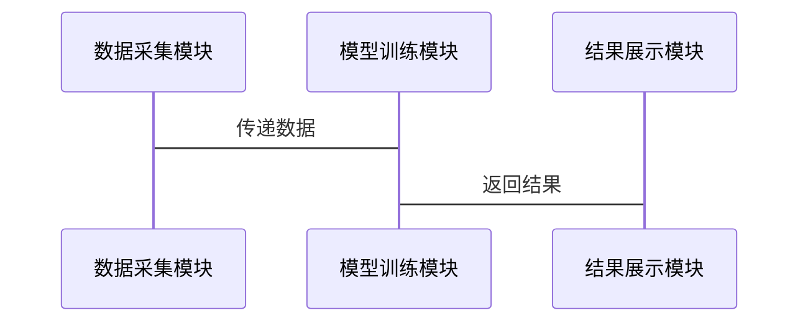

                 


# AI辅助企业品牌定位与差异化战略制定

## 关键词：人工智能, 品牌定位, 差异化战略, 算法原理, 系统架构

## 摘要：本文详细探讨了如何利用人工智能技术辅助企业进行品牌定位和差异化战略的制定。通过分析AI技术的核心算法、品牌定位的关键要素以及差异化战略的实施路径，本文为企业提供了从理论到实践的全面指导。文章结合实际案例和系统架构设计，展示了AI在品牌定位中的强大能力，并提出了具体的实现方案和最佳实践建议。

---

## 第1章 AI辅助企业品牌定位与差异化战略的背景介绍

### 1.1 AI技术的现状与发展

人工智能（AI）技术近年来取得了突飞猛进的发展，从最初的理论研究逐步走向实际应用。根据Gartner的报告，全球AI市场规模预计将在未来几年内以年均30%的速度增长。AI技术在各个行业的应用日益广泛，尤其是在企业品牌定位和差异化战略领域，AI展现出独特的优势。

**1.1.1 人工智能技术的演进历程**

人工智能的发展可以分为几个阶段：1950年代的符号主义AI、1980年代的专家系统、2010年代的深度学习浪潮，以及近年来的AI 2.0时代。每个阶段都为AI技术的进步奠定了基础。

**1.1.2 当前AI技术的主要应用领域**

当前，AI技术在多个领域得到广泛应用，包括自然语言处理（NLP）、计算机视觉、语音识别、机器学习等。这些技术帮助企业实现自动化、智能化的决策和分析。

**1.1.3 AI技术对企业品牌定位的影响**

AI技术通过数据分析和模式识别，帮助企业更精准地理解市场和消费者需求，从而优化品牌定位策略。

### 1.2 企业品牌定位的重要性

品牌定位是企业在市场中确立自身位置和形象的关键步骤，直接影响企业的市场表现和客户认知。

**1.2.1 品牌定位的定义与核心要素**

品牌定位是指确定品牌在目标市场中的位置，核心要素包括目标市场、品牌价值主张、竞争对手分析等。

**1.2.2 品牌定位对企业战略的意义**

品牌定位决定了企业的市场定位、产品开发和营销策略，是企业战略的核心组成部分。

**1.2.3 传统品牌定位方法的局限性**

传统品牌定位方法依赖主观判断，难以处理海量数据，且缺乏动态调整能力。

### 1.3 AI辅助品牌定位的必要性

AI技术能够处理海量数据，提供精准的市场洞察，帮助企业在复杂市场环境中制定有效的品牌定位策略。

**1.3.1 数据驱动的品牌定位优势**

通过AI技术分析消费者行为数据，企业可以更准确地识别目标市场和消费者需求。

**1.3.2 AI技术在品牌定位中的独特价值**

AI技术能够实时分析市场动态，提供动态的品牌定位建议，帮助企业在竞争中保持优势。

**1.3.3 企业差异化战略的核心目标**

差异化战略通过独特的产品或服务，在市场中建立竞争优势，而AI技术能够帮助企业更有效地实现这一目标。

### 1.4 本章小结

本章介绍了AI技术的现状与发展，阐述了品牌定位的重要性，并分析了AI辅助品牌定位的必要性。通过AI技术，企业能够更精准地进行品牌定位和差异化战略的制定。

---

## 第2章 AI辅助品牌定位的核心概念与联系

### 2.1 AI模型的基本原理

AI模型通过数据训练，学习市场规律，从而辅助品牌定位决策。

**2.1.1 机器学习模型的输入输出关系**

机器学习模型通过输入市场数据，输出品牌定位建议。

**2.1.2 深度学习模型的核心算法**

深度学习模型如神经网络通过多层特征提取，帮助识别市场趋势。

**2.1.3 NLP模型在品牌定位中的应用**

NLP模型可以分析消费者评论，提取情感倾向，辅助品牌定位决策。

### 2.2 品牌定位的核心要素

品牌定位需要考虑多个因素，包括目标市场、竞争对手分析等。

**2.2.1 目标市场分析**

通过AI技术分析消费者数据，确定目标市场。

**2.2.2 品牌核心价值的提取**

AI技术可以帮助提取品牌的核心价值，确保定位准确。

**2.2.3 竞争对手分析与市场定位**

通过分析竞争对手策略，制定差异化的市场定位。

### 2.3 差异化战略的实现路径

差异化战略通过独特的产品或服务，在市场中建立竞争优势。

**2.3.1 基于AI的市场细分策略**

AI技术可以将市场细分成多个子市场，帮助企业制定精准的市场策略。

**2.3.2 品牌差异化要素的识别**

通过AI技术识别品牌差异化要素，确保定位独特。

**2.3.3 品牌定位与差异化战略的协同**

品牌定位和差异化战略需要协同一致，才能发挥最大效用。

### 2.4 核心概念的关系图

通过Mermaid流程图展示AI模型与品牌定位的关系。



### 2.5 本章小结

本章介绍了AI模型的基本原理，分析了品牌定位的核心要素，并探讨了差异化战略的实现路径，展示了AI技术在品牌定位中的重要作用。

---

## 第3章 AI辅助品牌定位的算法原理

### 3.1 聚类分析算法

聚类分析算法用于将市场细分成多个群体，帮助品牌定位。

**3.1.1 聚类分析的基本原理**

聚类分析通过相似性度量，将数据点分成簇。

**3.1.2 K-means算法的实现流程**

K-means算法通过迭代优化，找到最优簇中心。

**3.1.3 聚类分析在品牌定位中的应用案例**

通过聚类分析，帮助企业识别不同消费群体，制定精准的市场策略。

### 3.2 分类算法

分类算法用于预测品牌定位的可能结果。

**3.2.1 分类算法的基本原理**

分类算法通过训练数据，学习分类规则。

**3.2.2 支持向量机(SVM)的实现流程**

SVM算法通过构建超平面，实现数据分类。

**3.2.3 分类算法在品牌定位中的应用案例**

通过分类算法，帮助企业预测品牌定位的成功概率。

### 3.3 自然语言处理模型

NLP模型用于分析消费者评论，提取情感倾向。

**3.3.1 NLP模型的基本原理**

NLP模型通过词嵌入和注意力机制，理解文本语义。

**3.3.2 NLP模型在品牌定位中的应用案例**

通过分析消费者评论，帮助企业识别品牌定位的关键因素。

### 3.4 算法原理的数学模型和公式

**3.4.1 K-means算法的数学模型**

$$ \text{目标函数} = \sum_{i=1}^{k} \sum_{j=1}^{n_i} (x_j - c_i)^2 $$

**3.4.2 支持向量机(SVM)的数学模型**

$$ \text{目标函数} = \frac{1}{2} \|w\|^2 + C \sum_{i=1}^{m} \xi_i $$

### 3.5 本章小结

本章详细介绍了聚类分析、分类算法和NLP模型的算法原理，并通过实际案例展示了它们在品牌定位中的应用。

---

## 第4章 系统分析与架构设计方案

### 4.1 问题场景介绍

企业需要通过AI技术实现品牌定位和差异化战略的制定。

### 4.2 系统功能设计

系统功能包括数据采集、模型训练、定位分析和结果展示。

**4.2.1 领域模型设计**

通过Mermaid类图展示系统功能模块。



### 4.3 系统架构设计

系统架构采用分层设计，包括数据层、算法层、应用层和展示层。

**4.3.1 系统架构设计**

通过Mermaid架构图展示系统架构。


### 4.4 系统接口设计

系统接口包括数据输入接口、模型调用接口和结果输出接口。

**4.4.1 系统接口设计**

通过Mermaid序列图展示系统接口调用流程。



### 4.5 系统交互流程

系统交互流程包括用户请求、数据处理和结果反馈。

**4.5.1 系统交互流程**

通过Mermaid流程图展示系统交互流程。


### 4.6 本章小结

本章详细介绍了系统分析与架构设计方案，展示了如何通过AI技术实现品牌定位和差异化战略的制定。

---

## 第5章 项目实战：AI辅助品牌定位系统实现

### 5.1 环境安装

需要安装Python、TensorFlow、Scikit-learn等库。

### 5.2 系统核心实现源代码

以下是系统核心代码示例：

```python
# 数据预处理
import pandas as pd
data = pd.read_csv('market_data.csv')

# 聚类分析
from sklearn.cluster import KMeans
model = KMeans(n_clusters=3)
model.fit(data)

# 分类算法
from sklearn.svm import SVC
svm_model = SVC()
svm_model.fit(data)

# NLP模型
from tensorflow.keras import Model
model = Model(...)
model.summary()
```

### 5.3 代码应用解读与分析

通过代码实现品牌定位和差异化战略的分析，帮助企业制定精准的市场策略。

### 5.4 实际案例分析

通过实际案例分析，展示AI技术在品牌定位中的应用效果。

### 5.5 项目小结

本章通过实际案例展示了AI辅助品牌定位系统的实现过程，帮助读者理解如何将理论应用于实践。

---

## 第6章 最佳实践与小结

### 6.1 最佳实践 tips

建议企业在实施AI辅助品牌定位时，注重数据质量和模型优化。

### 6.2 小结

通过本篇文章，读者可以全面了解AI技术在品牌定位和差异化战略中的应用，掌握从理论到实践的实现方法。

### 6.3 注意事项

企业在实施AI辅助品牌定位时，需要注意数据隐私和模型可解释性问题。

### 6.4 拓展阅读

建议读者进一步阅读相关书籍和论文，深入理解AI技术的应用。

---

## 作者：AI天才研究院/AI Genius Institute & 禅与计算机程序设计艺术 /Zen And The Art of Computer Programming

---

通过以上结构，文章详细介绍了AI辅助企业品牌定位与差异化战略制定的核心概念、算法原理和系统架构，结合实际案例和代码实现，为企业提供了全面的指导。

