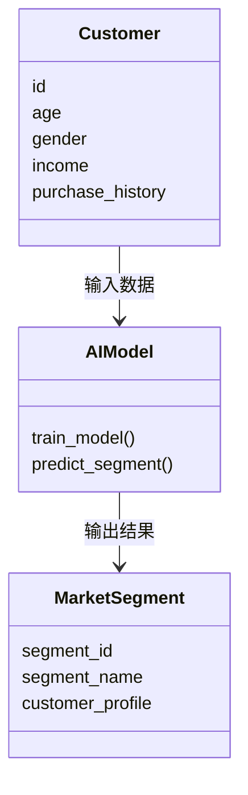
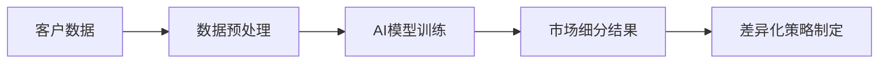
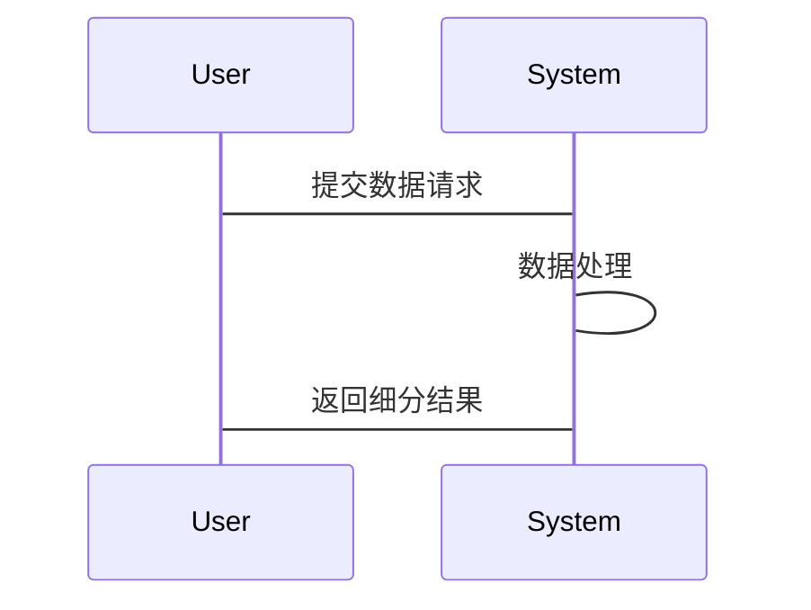

                 


# AI辅助企业品牌定位：市场细分与差异化战略

---

## 关键词：AI，品牌定位，市场细分，差异化战略，聚类算法，决策树，系统架构

---

## 摘要：

本文探讨AI技术如何辅助企业进行品牌定位，重点分析市场细分与差异化战略。通过AI算法优化市场细分，实现精准客户定位，建立差异化竞争优势。文章从算法原理到系统架构，结合实战案例，为企业提供AI驱动的品牌定位策略。

---

# 第一部分: AI辅助企业品牌定位概述

## 第1章: AI辅助企业品牌定位的背景与意义

### 1.1 企业品牌定位的挑战与痛点

#### 1.1.1 传统品牌定位方法的局限性

传统品牌定位依赖市场调研和经验判断，存在耗时长、成本高、主观性强等问题。例如，问卷调查和焦点小组难以捕捉消费者深层需求。

#### 1.1.2 数据驱动的品牌定位新趋势

AI技术通过大数据分析，从海量数据中提取价值，帮助品牌更精准地定位目标客户。数据驱动方法的优势在于高效、客观和可量化。

#### 1.1.3 AI技术在品牌定位中的应用潜力

AI能够处理结构化和非结构化数据，识别模式和趋势，为市场细分和差异化战略提供科学依据，提升品牌定位的准确性和效果。

### 1.2 AI辅助品牌定位的核心概念

#### 1.2.1 市场细分的定义与特征

市场细分是将整体市场划分为多个子市场，每个子市场具有相似需求特征。核心特征包括可衡量性、可进入性和可盈利性。

| 特征 | 描述 |
|------|------|
| 可衡量性 | 子市场的规模和潜力可量化 |
| 可进入性 | 企业能有效进入并服务子市场 |
| 可盈利性 | 子市场能够带来利润 |

#### 1.2.2 差异化战略的内涵与外延

差异化战略通过提供独特价值，使品牌在竞争中脱颖而出。外延包括产品、服务、价格等多个维度。

#### 1.2.3 AI在市场细分与差异化中的作用

AI通过数据分析优化市场细分，识别潜在客户群体，制定个性化营销策略，提升品牌定位的精准度和效果。

---

## 第2章: 市场细分的理论与实践

### 2.1 市场细分的理论基础

#### 2.1.1 市场细分的定义与分类

市场细分基于客户特征，如年龄、性别、收入等，将市场划分为多个子市场。常用分类包括地理、人口统计、心理和行为细分。

#### 2.1.2 市场细分的核心要素对比表

| 维度 | 描述 |
|------|------|
| 地理 | 地理位置，如地区、城市 |
| 人口统计 | 年龄、性别、收入 |
| 心理 | 消费者态度、价值观 |
| 行为 | 购买习惯、忠诚度 |

### 2.2 差异化战略的实施策略

#### 2.2.1 差异化战略的类型

- 产品差异化：通过产品创新形成竞争优势。
- 服务差异化：提供独特服务提升客户体验。
- 形象差异化：塑造独特品牌形象。

#### 2.2.2 AI在市场细分中的应用

AI通过聚类分析识别客户群体，利用决策树分析客户行为，帮助制定精准的市场细分策略。

---

## 第3章: AI算法在市场细分中的应用

### 3.1 市场细分的算法选择

#### 3.1.1 聚类算法在市场细分中的应用

聚类算法将客户按相似性分组，识别潜在客户群体。K-means算法常用于市场细分。

#### 3.1.2 分类算法在市场细分中的应用

分类算法（如决策树）根据历史数据预测客户类别，帮助识别目标市场。

### 3.2 常见算法原理与实现

#### 3.2.1 K-means聚类算法原理

K-means算法通过迭代优化质心位置，将数据分为K个簇。其数学模型如下：

$$
J = \sum_{i=1}^{k} \sum_{j=1}^{n} (x_j - c_i)^2
$$

其中，\( c_i \) 是第i个簇的质心，\( x_j \) 是数据点。

#### 3.2.2 决策树算法在市场细分中的应用

决策树通过特征分裂构建客户分群模型，帮助识别不同客户群体的需求特征。

### 3.3 算法实现与代码示例

#### 3.3.1 Python实现K-means算法

```python
from sklearn.cluster import KMeans
from sklearn.metrics import silhouette_score
import numpy as np

# 示例数据集
X = np.array([[1, 2], [5, 8], [1.5, 1.8], [8.5, 1.5]])

# 初始化K-means模型
kmeans = KMeans(n_clusters=2, random_state=0)

# 拟合模型
kmeans.fit(X)

# 预测聚类结果
labels = kmeans.predict(X)

# 计算 silhouette score
score = silhouette_score(X, labels)
print(f"Silhouette Score: {score}")
```

---

## 第四部分: 系统分析与架构设计方案

## 第4章: 系统分析与架构设计

### 4.1 问题场景介绍

企业需要通过AI技术优化品牌定位，实现精准市场细分和差异化战略。

### 4.2 系统功能设计

#### 4.2.1 领域模型设计



### 4.3 系统架构设计

#### 4.3.1 系统架构图



### 4.4 系统接口设计

系统提供API接口，供前端调用获取市场细分结果和差异化策略建议。

### 4.5 系统交互设计



---

## 第五部分: 项目实战

## 第5章: 项目实战

### 5.1 环境安装

安装Python和相关库，如scikit-learn、pandas、numpy。

### 5.2 系统核心实现源代码

实现市场细分的Python代码：

```python
from sklearn.cluster import KMeans
import pandas as pd

# 加载数据
data = pd.read_csv('customer_data.csv')

# 数据预处理
X = data[['age', 'income']]

# 训练模型
kmeans = KMeans(n_clusters=3, random_state=0)
kmeans.fit(X)

# 预测结果
labels = kmeans.predict(X)
data['segment'] = labels

# 输出结果
print(data.head())
```

### 5.3 代码应用解读与分析

代码实现市场细分，将客户分为三个群体，输出结果表。

### 5.4 实际案例分析

案例分析客户数据，通过AI模型识别三个细分市场，制定差异化策略，提升销售效果。

---

## 第六部分: 最佳实践与总结

## 第6章: 总结与展望

### 6.1 本章小结

AI技术在市场细分与差异化战略中的应用，提升了品牌定位的精准度和效果。

### 6.2 注意事项

数据质量和算法选择影响结果，需谨慎处理数据，并选择合适算法。

### 6.3 拓展阅读

推荐相关书籍和论文，深入学习AI在品牌定位中的应用。

---

## 作者：AI天才研究院 & 禅与计算机程序设计艺术

---

希望这篇博客能够帮助企业利用AI技术优化品牌定位，实现精准市场细分和差异化战略，提升市场竞争优势。

