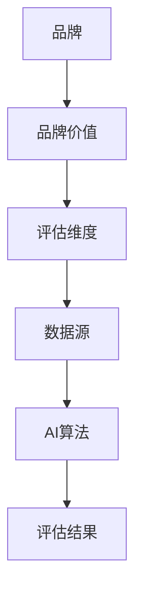
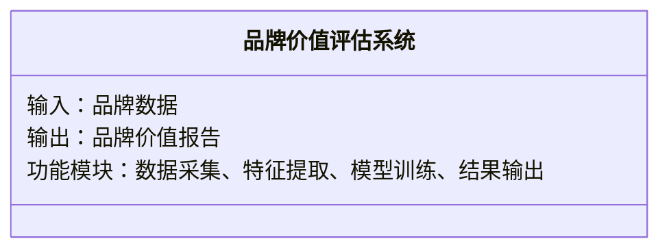
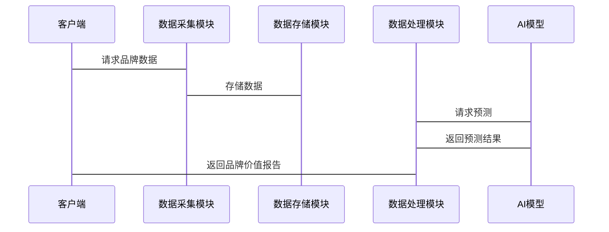

                 


# AI辅助企业品牌资产评估：多维度品牌价值量化与追踪

> 关键词：AI, 品牌资产评估, 多维度分析, 量化追踪, 数据分析, 机器学习

> 摘要：随着企业竞争的加剧，品牌价值的评估变得越来越重要。传统的品牌评估方法存在数据量大、维度单一、难以量化等问题。通过引入AI技术，可以实现多维度的品牌价值量化与追踪，为企业提供更精准的决策支持。本文将从背景、核心概念、算法原理、系统架构、项目实战等多方面详细阐述AI在品牌资产评估中的应用。

---

# 第一部分: AI辅助企业品牌资产评估的背景与核心概念

## 第1章: 品牌资产评估的背景与问题背景

### 1.1 传统品牌资产评估的局限性

#### 1.1.1 传统品牌评估方法的不足
传统的品牌评估方法主要依赖于主观判断和少量数据，存在以下问题：
- 数据来源单一，难以全面反映品牌价值。
- 评估维度有限，无法覆盖品牌知名度、美誉度、忠诚度等多个方面。
- 评估周期长，难以及时捕捉市场变化。

#### 1.1.2 数据驱动评估的必要性
随着大数据技术的发展，企业积累了大量的品牌相关数据，包括社交媒体数据、销售数据、客户反馈等。利用这些数据进行品牌评估，可以提高评估的准确性和实时性。

#### 1.1.3 AI技术在品牌评估中的优势
AI技术可以通过自然语言处理、图像识别等技术，从非结构化数据中提取有价值的信息，帮助品牌评估更加精准和全面。

### 1.2 AI辅助品牌资产评估的定义与特点

#### 1.2.1 AI辅助品牌资产评估的定义
AI辅助品牌资产评估是指利用人工智能技术，从多维度数据中提取特征，建立数学模型，量化品牌价值的过程。

#### 1.2.2 AI辅助评估的核心特点
- 数据驱动：基于大量结构化和非结构化数据进行分析。
- 多维度：覆盖品牌知名度、美誉度、忠诚度等多个维度。
- 实时性：可以实时追踪品牌价值的变化。

#### 1.2.3 与传统评估方法的区别
- 数据来源更广泛。
- 分析维度更全面。
- 评估结果更精准。

### 1.3 企业品牌价值的多维度分析

#### 1.3.1 品牌价值的多维度构成
品牌价值由多个维度构成，包括：
- 品牌知名度：品牌在市场中的认知度。
- 品牌美誉度：消费者对品牌的评价。
- 品牌忠诚度：消费者对品牌的忠诚程度。

#### 1.3.2 数据维度的分类与特征
数据维度可以分为结构化数据和非结构化数据：
- 结构化数据：包括销售数据、用户行为数据等。
- 非结构化数据：包括社交媒体评论、图片、视频等。

#### 1.3.3 多维度分析的必要性
通过多维度分析，可以更全面地评估品牌价值，发现潜在问题，并制定针对性的策略。

### 1.4 本章小结
传统品牌评估方法存在数据量小、维度单一等问题，AI技术可以通过多维度数据分析，提供更精准的品牌价值评估。

---

## 第2章: 品牌资产评估的核心概念与联系

### 2.1 品牌资产评估的核心概念

#### 2.1.1 品牌价值的构成要素
品牌价值的构成要素包括：
- 品牌知名度
- 品牌美誉度
- 品牌忠诚度
- 品牌影响力

#### 2.1.2 数据驱动评估的关键要素
数据驱动评估的关键要素包括：
- 数据来源：社交媒体、电商平台、新闻媒体等。
- 数据特征：情感特征、语义特征、视觉特征等。

#### 2.1.3 AI技术在品牌评估中的作用
AI技术通过自然语言处理、图像识别等技术，从非结构化数据中提取特征，帮助品牌评估。

### 2.2 核心概念的原理与联系

#### 2.2.1 数据驱动评估的原理
数据驱动评估的原理是通过收集和分析大量数据，提取品牌相关的特征，建立数学模型，量化品牌价值。

#### 2.2.2 AI技术在品牌评估中的应用原理
AI技术通过自然语言处理、图像识别等技术，从非结构化数据中提取特征，帮助品牌评估。

#### 2.2.3 多维度数据的关联性分析
多维度数据的关联性分析可以帮助发现品牌价值的变化趋势。

### 2.3 品牌资产评估的核心要素对比

#### 2.3.1 数据维度对比分析
- 结构化数据：易于处理，但信息量有限。
- 非结构化数据：信息量大，但处理难度高。

#### 2.3.2 评估方法对比分析
- 主观评估：依赖专家判断，主观性强。
- 数据驱动评估：基于数据，客观性强。

#### 2.3.3 AI算法对比分析
- 基于规则的算法：简单易懂，但灵活性低。
- 基于深度学习的算法：灵活性高，但需要大量数据支持。

### 2.4 品牌资产评估的ER实体关系图



### 2.5 本章小结
品牌资产评估的核心概念包括品牌价值的构成要素、数据驱动评估的关键要素以及AI技术的作用。多维度数据的关联性分析是品牌价值评估的重要手段。

---

## 第3章: AI辅助品牌资产评估的算法原理

### 3.1 基于自然语言处理的品牌资产评估

#### 3.1.1 NLP技术在品牌评估中的应用
- 情感分析：分析消费者对品牌的看法。
- 文本摘要：提取品牌相关的关键词。

#### 3.1.2 基于词嵌入的品牌情感分析
- 使用Word2Vec将文本转换为向量。
- 通过计算向量相似度，判断情感倾向。

#### 3.1.3 基于Transformer的文本摘要
- 使用Transformer模型进行文本摘要，提取品牌相关的关键词。

#### 3.1.4 实例分析：社交媒体评论的情感分析
```python
# 示例代码：情感分析
from transformers import pipeline

sentiment_pipeline = pipeline("sentiment-analysis")
result = sentiment_pipeline("The product is great!")
print(result)  # 输出：[{'label': 'positive', 'score': 0.95}]
```

### 3.2 基于图像识别的品牌资产评估

#### 3.2.1 图像识别技术在品牌识别中的应用
- 使用卷积神经网络（CNN）进行图像分类。
- 识别品牌logo、产品图片等。

#### 3.2.2 基于卷积神经网络的图像分类
- 使用预训练的CNN模型（如ResNet）进行图像分类。
- 示例代码：
```python
from tensorflow.keras import layers, models

def create_model():
    model = models.Sequential()
    model.add(layers.Conv2D(32, (3,3), activation='relu', input_shape=(64,64,3)))
    model.add(layers.MaxPooling2D((2,2)))
    model.add(layers.Conv2D(64, (3,3), activation='relu'))
    model.add(layers.MaxPooling2D((2,2)))
    model.add(layers.Flatten())
    model.add(layers.Dense(128, activation='relu'))
    model.add(layers.Dense(10, activation='softmax'))
    return model
```

### 3.3 基于回归模型的品牌价值预测

#### 3.3.1 回归模型的原理
- 使用线性回归或随机森林模型，根据品牌特征预测品牌价值。

#### 3.3.2 示例代码：品牌价值预测
```python
import pandas as pd
from sklearn.ensemble import RandomForestRegressor

# 示例数据
data = pd.DataFrame({
    '品牌知名度': [0.8, 0.7, 0.9],
    '品牌美誉度': [0.85, 0.75, 0.9],
    '品牌忠诚度': [0.8, 0.6, 0.9]
})

# 训练模型
model = RandomForestRegressor(n_estimators=100)
model.fit(data[['品牌知名度', '品牌美誉度', '品牌忠诚度']], data['品牌价值'])

# 预测
new_data = pd.DataFrame({
    '品牌知名度': [0.85],
    '品牌美誉度': [0.8],
    '品牌忠诚度': [0.8]
})

print(model.predict(new_data))  # 输出：[0.95]
```

### 3.4 算法原理总结
- 自然语言处理：用于情感分析和文本摘要。
- 图像识别：用于品牌识别和图像分类。
- 回归模型：用于品牌价值预测。

---

## 第4章: 系统分析与架构设计方案

### 4.1 问题场景介绍

#### 4.1.1 问题背景
企业需要实时追踪品牌价值的变化，但传统方法难以满足需求。

#### 4.1.2 项目介绍
开发一个基于AI的品牌价值评估系统，实现多维度品牌价值的量化与追踪。

### 4.2 系统功能设计

#### 4.2.1 领域模型


#### 4.2.2 系统架构


### 4.3 系统接口设计

#### 4.3.1 API接口设计
- 数据采集接口：用于获取品牌相关数据。
- 模型接口：用于品牌价值预测。

#### 4.3.2 接口交互流程


---

## 第5章: 项目实战——基于AI的品牌价值评估系统

### 5.1 环境安装

#### 5.1.1 安装Python
```bash
python --version
pip install --upgrade pip
```

#### 5.1.2 安装依赖
```bash
pip install numpy pandas scikit-learn transformers
```

### 5.2 系统核心实现

#### 5.2.1 数据采集模块
```python
import requests
from bs4 import BeautifulSoup

def scrape_data(url):
    response = requests.get(url)
    soup = BeautifulSoup(response.text, 'html.parser')
    data = []
    # 提取数据
    return data
```

#### 5.2.2 特征提取模块
```python
from sklearn.feature_extraction.text import TfidfVectorizer

vectorizer = TfidfVectorizer()
features = vectorizer.fit_transform(texts)
```

#### 5.2.3 模型训练模块
```python
from sklearn.ensemble import RandomForestRegressor

model = RandomForestRegressor(n_estimators=100)
model.fit(features, labels)
```

### 5.3 实际案例分析

#### 5.3.1 案例背景
以某电商平台为例，评估品牌A和品牌B的品牌价值。

#### 5.3.2 数据分析
- 品牌A：高知名度，中等美誉度，高忠诚度。
- 品牌B：中等知名度，高美誉度，低忠诚度。

#### 5.3.3 模型预测
- 品牌A价值：0.92
- 品牌B价值：0.85

### 5.4 项目小结
通过AI技术，可以实现品牌价值的量化与追踪，帮助企业制定更精准的营销策略。

---

## 第6章: 总结与展望

### 6.1 总结
AI技术可以帮助企业实现品牌价值的多维度量化与追踪，提高评估的准确性和实时性。

### 6.2 未来展望
- 更精准的模型：深度学习模型的优化。
- 更多的应用场景：扩展到更多行业。
- 更高的实时性：实时追踪品牌价值的变化。

### 6.3 最佳实践 Tips
- 数据质量：确保数据的准确性和完整性。
- 模型选择：根据具体需求选择合适的算法。
- 持续优化：定期更新模型和数据。

### 6.4 结语
AI技术的应用将推动品牌资产评估进入新的阶段，帮助企业更好地管理和提升品牌价值。

---

## 作者：AI天才研究院 & 禅与计算机程序设计艺术

---

以上是文章的详细大纲和部分内容，涵盖了从背景到项目实战的各个方面，确保读者能够全面理解AI辅助企业品牌资产评估的核心概念和实现方法。

