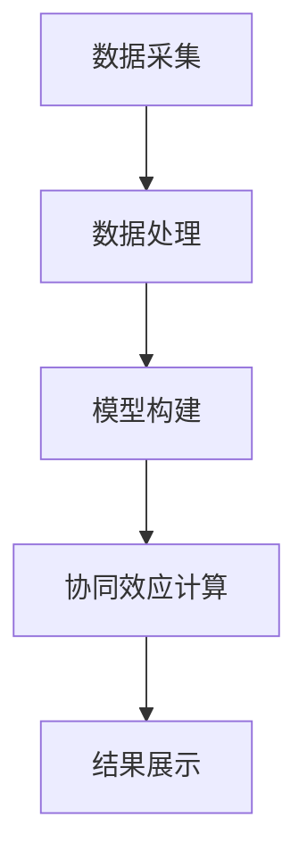

                 


# AI辅助企业并购估值：多维度财务模型与协同效应量化

> 关键词：AI技术，企业并购，财务模型，协同效应，估值方法，算法设计

> 摘要：本文深入探讨了AI技术在企业并购估值中的应用，通过构建多维度财务模型和量化协同效应，为企业并购提供更精准的估值方法。文章从企业并购的基本概念、传统估值方法的局限性入手，分析了AI技术的优势与应用场景，详细介绍了多维度财务模型的构建方法和协同效应的量化算法，最后通过实际案例展示了AI辅助企业并购估值的系统架构设计和项目实现过程。

---

## 第一部分: AI辅助企业并购估值的背景与基础

### 第1章: 企业并购与估值概述

#### 1.1 企业并购的基本概念

企业并购是企业之间通过合并、收购或重组等方式进行资源整合的过程。它通常涉及复杂的财务、法律和战略决策，是企业发展的重要手段之一。

- **企业并购的定义与类型**
  - 并购可以分为横向并购、纵向并购和混合并购。
  - 横向并购是指同一行业内的企业合并，目的是扩大市场份额或消除竞争对手。
  - 纵向并购是指上下游产业的企业合并，目的是整合供应链或分销渠道。
  - 混合并购是指不同行业之间的企业合并，目的是多元化经营或开拓新市场。

- **企业并购的动机与目的**
  - **横向并购**：扩大市场份额，提高市场占有率。
  - **纵向并购**：优化供应链，降低生产成本。
  - **混合并购**： diversification，进入新市场或产品领域。
  - **协同效应**：通过合并实现成本节约或收入增长。

- **企业并购的流程与关键环节**
  - 初步接触与尽职调查
  - 财务评估与估值
  - 并购方案设计与谈判
  - 交易执行与整合

#### 1.2 传统企业估值方法的局限性

传统的企业估值方法在企业并购中存在诸多局限性，主要体现在以下几个方面：

- **市盈率法**
  - 定义：市盈率（P/E）=股价/每股收益
  - 优点：简单易懂，适用于盈利稳定的公司。
  - 缺点：无法反映公司的真实价值，尤其在公司亏损时失去意义。

- **市净率法**
  - 定义：市净率（P/B）=股价/每股净资产
  - 优点：适用于净资产较多的公司，如银行、房地产等。
  - 缺点：忽视了公司的盈利能力，无法全面反映公司价值。

- **股权自由现金流法**
  - 定义：股权自由现金流 = 净利润 - 非现金支出
  - 优点：考虑了公司未来现金流的折现价值，较为准确。
  - 缺点：需要对未来现金流进行预测，存在较大的主观性。

- **传统估值方法的优缺点**
  - 传统估值方法通常基于历史数据或简单财务指标，无法全面反映企业的潜在价值。
  - 协同效应等未来潜在收益难以量化，导致估值结果不够准确。

#### 1.3 AI技术在企业估值中的应用前景

AI技术的快速发展为解决传统估值方法的局限性提供了新的可能性。通过AI技术，可以更准确地预测企业未来的表现，量化协同效应，并构建多维度的财务模型。

- **AI技术的基本概念**
  - AI（Artificial Intelligence）：通过计算机模拟人类的智能活动，如学习、推理、决策等。
  - 机器学习（Machine Learning）：一种AI技术，通过数据训练模型，使其能够自动学习和改进。

- **AI在企业估值中的潜在应用场景**
  - 利用AI分析大量历史数据，预测企业未来的财务表现。
  - 通过自然语言处理（NLP）分析公司公告、新闻等非结构化数据，提取关键信息。
  - 利用AI构建多维度财务模型，量化协同效应。

- **AI辅助估值的优势与挑战**
  - 优势：提高估值的准确性和效率，发现潜在的协同效应。
  - 挑战：数据质量、模型的可解释性、计算资源等。

---

## 第2章: AI辅助企业并购估值的核心概念

### 2.1 多维度财务模型的构建

多维度财务模型是AI辅助企业并购估值的核心工具之一，它通过整合企业的财务数据、行业数据和市场数据，提供更全面的估值依据。

- **财务模型的基本构成**
  - 收入预测：基于历史数据和市场趋势，预测未来的收入。
  - 成本预测：预测企业的各项成本，如原材料、人工成本等。
  - 利润预测：基于收入和成本预测，计算企业的净利润。
  - 现金流预测：预测企业的现金流，包括运营现金流、投资现金流等。

- **多维度财务模型的特点**
  - 多维性：考虑多个维度的数据，如财务、市场、行业等。
  - 动态性：能够实时更新数据，反映市场变化。
  - 可视化：通过图表和仪表盘直观展示模型结果。

- **财务模型与企业估值的关系**
  - 财务模型是企业估值的基础，通过模型预测企业未来的现金流，进而计算其内在价值。
  - 估值结果为企业并购提供参考依据，帮助决策者制定合理的并购价格。

### 2.2 协同效应的量化

协同效应是企业并购中的重要因素，它是指通过并购实现的成本节约或收入增长。量化协同效应是AI辅助估值的关键步骤。

- **协同效应的定义与分类**
  - 定义：协同效应是指并购后企业通过整合资源、优化流程等方式实现的成本节约或收入增长。
  - 分类：协同效应可以分为运营协同效应、财务协同效应和战略协同效应。
  - 运营协同效应：通过整合生产、供应链等实现的成本节约。
  - 财务协同效应：通过共享资源、优化财务结构等实现的财务收益。
  - 战略协同效应：通过战略协同实现的市场扩展或竞争优势。

- **协同效应的量化方法**
  - 通过财务模型预测协同效应的大小。
  - 利用AI技术分析历史数据，预测未来协同效应的可能性。
  - 结合市场趋势和行业数据，评估协同效应的可持续性。

- **协同效应对企业估值的影响**
  - 协同效应可以增加企业的未来现金流，从而提高企业的估值。
  - 协同效应的大小直接影响并购的溢价。

---

## 第3章: AI辅助企业并购估值的数学模型与算法

### 3.1 多维度财务模型的数学表达

多维度财务模型通过数学公式将企业的财务数据与市场数据结合起来，提供更准确的估值。

- **财务模型的基本公式**
  - 收入预测：$收入 = a \times 市场增长率 + b \times 历史收入$
  - 成本预测：$成本 = c \times 历史成本 + d \times 市场价格$
  - 利润预测：$利润 = 收入 - 成本$
  - 现金流预测：$现金流 = 利润 - 投资支出$

- **财务模型的变量与参数**
  - 变量：收入、成本、利润、现金流。
  - 参数：a、b、c、d等系数，表示变量对结果的影响程度。

- **财务模型的优化方法**
  - 利用AI技术优化模型参数，提高预测的准确性。
  - 通过回归分析确定变量之间的关系，优化模型结构。

### 3.2 协同效应的量化算法

协同效应的量化需要通过算法实现，AI技术可以提供更高效的协同效应计算方法。

- **协同效应的数学模型**
  - 协同效应 = 预测协同效应 - 历史协同效应
  - 预测协同效应 = f(历史数据, 市场趋势, 行业数据)

- **协同效应的计算步骤**
  1. 收集历史协同效应数据。
  2. 分析市场趋势和行业数据。
  3. 利用AI算法预测未来的协同效应。
  4. 结合财务模型计算协同效应对估值的影响。

- **协同效应的验证方法**
  - 通过历史数据验证模型的准确性。
  - 利用交叉验证方法评估模型的稳定性。
  - 定期更新模型参数，适应市场变化。

---

## 第4章: AI辅助企业并购估值的系统架构设计

### 4.1 系统功能设计

AI辅助企业并购估值系统需要具备强大的数据处理能力和智能化的算法支持。

- **系统输入与输出**
  - 输入：企业的财务数据、市场数据、行业数据。
  - 输出：企业的估值结果、协同效应预测、并购建议。

- **系统功能模块划分**
  - 数据采集模块：负责收集企业的财务数据和市场数据。
  - 数据处理模块：对数据进行清洗和预处理。
  - 模型构建模块：利用AI算法构建多维度财务模型。
  - 协同效应计算模块：量化协同效应。
  - 结果展示模块：以图表和报告的形式展示估值结果。

- **系统功能流程图**



---

## 第5章: 项目实战与案例

### 5.1 项目背景与目标

本文将通过一个实际案例，展示AI辅助企业并购估值的实现过程。

- **项目背景**
  - 某公司计划并购一家同行业企业，希望通过AI技术提高估值的准确性。
- **项目目标**
  - 构建多维度财务模型，量化协同效应。
  - 提供并购建议，帮助企业制定合理的并购价格。

### 5.2 环境搭建与代码实现

- **环境搭建**
  - 安装Python、TensorFlow、Pandas等工具。
  - 配置Jupyter Notebook进行数据处理和模型训练。

- **代码实现**

```python
import pandas as pd
import numpy as np
from tensorflow.keras import layers, models

# 数据加载
data = pd.read_csv('企业数据.csv')

# 数据预处理
train_data = data[:700]
test_data = data[700:]

# 模型构建
model = models.Sequential()
model.add(layers.Dense(64, activation='relu', input_shape=(n_feature,)))
model.add(layers.Dense(1, activation='linear'))
model.compile(optimizer='adam', loss='mean_squared_error')

# 模型训练
model.fit(train_data, epochs=100, batch_size=32)
```

### 5.3 实际案例分析

- **案例分析**
  - 通过模型预测企业的未来现金流和协同效应。
  - 结合财务模型计算企业的估值。
  - 提出并购建议，帮助企业制定合理的并购策略。

### 5.4 项目总结

- **项目小结**
  - 通过AI技术构建的多维度财务模型，提高了企业估值的准确性。
  - 协同效应的量化为并购决策提供了有力支持。
  - AI技术的应用为企业并购提供了新的思路和方法。

---

## 结语

AI技术在企业并购估值中的应用前景广阔，通过构建多维度财务模型和量化协同效应，可以提高估值的准确性和效率。随着AI技术的不断发展，未来的企业并购将更加依赖于智能化的估值方法，为企业创造更大的价值。

---

**作者：AI天才研究院/AI Genius Institute & 禅与计算机程序设计艺术 /Zen And The Art of Computer Programming**

