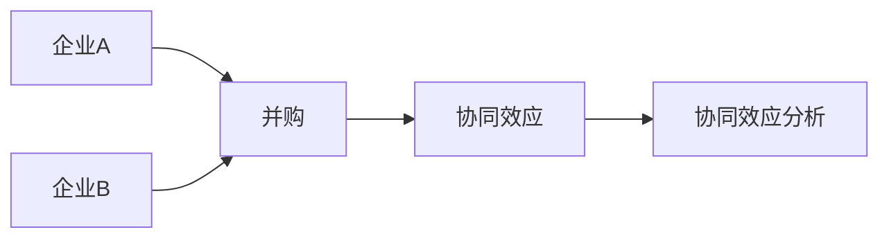
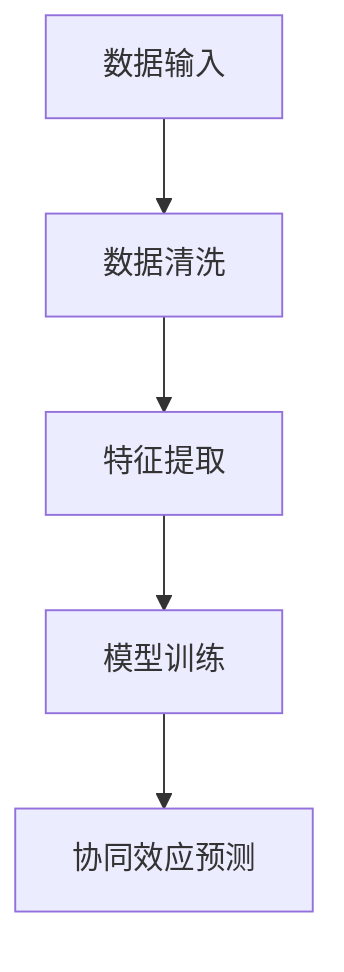
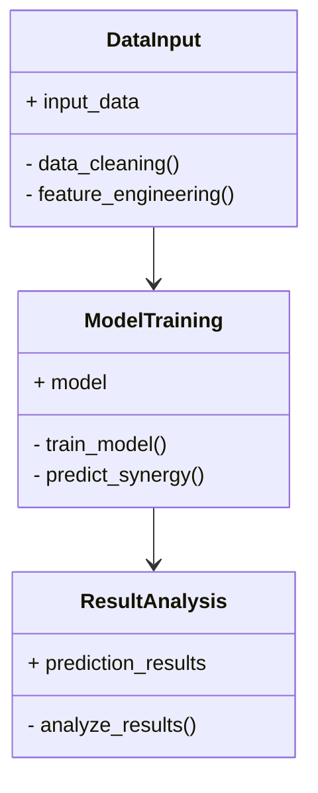

                 


# AI辅助企业并购协同效应分析与实现

> 关键词：AI辅助，企业并购，协同效应，数据分析，机器学习，系统设计

> 摘要：企业并购是企业战略发展的重要手段，而协同效应是并购成功的关键因素之一。本文通过分析AI在企业并购中的应用，提出了一种基于AI的协同效应分析方法，结合数学模型和系统设计，实现了对企业并购协同效应的智能化评估与优化。

---

## 第一部分: AI辅助企业并购协同效应分析概述

### 第1章: 企业并购与协同效应概述

#### 1.1 企业并购的基本概念
企业并购是指一家企业通过购买、合并或其他方式获得另一家企业的一部分或全部资产、股权或控制权。并购的类型包括横向并购、纵向并购和混合并购，每种类型都有其独特的特点和应用场景。

- **横向并购**：同一行业内的企业合并，旨在扩大市场份额或消除竞争。
- **纵向并购**：上下游企业之间的并购，以增强供应链控制能力。
- **混合并购**：与主业无关的企业并购，通常为了 diversification。

企业并购的动机多样，包括市场扩展、成本节约、技术获取、管理协同等。然而，并购也面临许多挑战，如文化冲突、管理整合、业绩下滑等，这些都需要通过协同效应来缓解。

#### 1.2 协同效应的定义与分类
协同效应是指并购后企业整体价值超过并购前两家企业的简单相加。它是企业并购成功的核心因素之一，通常表现为成本节约、收入增长或效率提升。

协同效应的分类如下：
1. **经营协同**：通过整合运营流程、资源共享实现的成本节约。
2. **战略协同**：通过市场扩展、技术互补实现的增长效应。
3. **财务协同**：通过优化资本结构、降低融资成本实现的财务效应。

协同效应的实现需要从战略规划、组织架构、资源整合等多个维度进行分析。

#### 1.3 AI在企业并购中的作用
AI技术在企业并购中的应用主要体现在以下几个方面：
1. **数据挖掘**：通过分析海量数据，识别潜在的并购目标。
2. **协同效应预测**：利用机器学习模型预测并购后的协同效应。
3. **风险评估**：通过AI模型评估并购后的潜在风险。
4. **智能匹配**：根据企业特征和市场环境，智能匹配最优并购目标。

然而，AI在企业并购中的应用也面临数据不足、模型复杂性高等挑战。

---

### 第2章: 协同效应分析的核心概念与联系

#### 2.1 协同效应的分析框架
协同效应的分析框架包括以下几个方面：
1. **协同效应的构成要素**：
   - 资源整合：如资产、技术、人员等。
   - 组织协同：如管理、文化、流程等。
   - 市场协同：如客户、渠道、品牌等。

2. **协同效应的分析维度**：
   - 金流：现金流预测与优化。
   - 人流：员工整合与组织结构优化。
   - 物流：供应链优化与资源共享。
   - 信息流：数据整合与决策支持。

3. **协同效应的评估指标**：
   - 有形协同效应：如成本节约、收入增长。
   - 无形协同效应：如品牌价值提升、创新能力增强。

#### 2.2 协同效应分析的实体关系图
以下是协同效应分析的实体关系图：



从图中可以看出，企业A和企业B通过并购形成新的企业实体，协同效应分析通过对资源整合、组织优化等方面进行评估。

#### 2.3 协同效应分析的流程图
以下是协同效应分析的流程图：



从图中可以看出，协同效应分析的过程包括数据输入、清洗、特征提取、模型训练和预测。

---

## 第二部分: 协同效应分析的核心算法

### 第3章: 协同效应的数学模型

#### 3.1 协同效应指数的计算模型
协同效应指数的计算公式如下：

$$ CE = \frac{V_{merged} - (V_A + V_B)}{V_A + V_B} \times 100\% $$

其中：
- $V_{merged}$：并购后的总体价值。
- $V_A$：企业A的价值。
- $V_B$：企业B的价值。

通过上述公式，可以量化并购后的协同效应。

#### 3.2 协同效应预测的机器学习模型
为了预测并购后的协同效应，可以使用线性回归模型。以下是模型的训练过程：

1. 数据预处理：清洗数据，处理缺失值和异常值。
2. 特征工程：提取关键特征，如企业规模、市场份额、利润率等。
3. 模型训练：使用线性回归模型进行训练。
4. 模型预测：根据模型预测协同效应。

以下是Python代码实现：

```python
import pandas as pd
import numpy as np
from sklearn.linear_model import LinearRegression
from sklearn.metrics import mean_squared_error

# 数据预处理
data = pd.read_csv('merger_data.csv')
data = data.dropna().reset_index(drop=True)

# 特征提取
X = data[['revenue', 'profit_margin', 'market_share']]
y = data['synergy']

# 模型训练
model = LinearRegression()
model.fit(X, y)

# 模型预测
y_pred = model.predict(X)
print('预测协同效应:', y_pred)
print('均方误差:', mean_squared_error(y, y_pred))
```

通过上述代码，可以实现协同效应的预测。

---

## 第三部分: 系统设计与实现

### 第4章: 系统设计

#### 4.1 系统功能设计
以下是系统功能设计的类图：



从图中可以看出，系统包括数据输入、模型训练和结果分析三个模块。

#### 4.2 系统架构设计
以下是系统架构设计的架构图：


从图中可以看出，用户通过数据输入模块提交数据，数据经过清洗、特征提取后，进入模型训练模块，最后通过结果分析模块输出协同效应预测结果。

---

## 第四部分: 项目实战

### 第5章: 项目实战

#### 5.1 数据准备与特征工程
以下是数据准备与特征工程的代码：

```python
import pandas as pd
import numpy as np
from sklearn.linear_model import LinearRegression
from sklearn.metrics import mean_squared_error

# 数据预处理
data = pd.read_csv('merger_data.csv')
data = data.dropna().reset_index(drop=True)

# 特征提取
X = data[['revenue', 'profit_margin', 'market_share']]
y = data['synergy']

# 模型训练
model = LinearRegression()
model.fit(X, y)

# 模型预测
y_pred = model.predict(X)
print('预测协同效应:', y_pred)
print('均方误差:', mean_squared_error(y, y_pred))
```

---

## 第五部分: 优化与展望

### 第6章: 优化与展望

#### 6.1 算法优化
为了提高模型的预测精度，可以尝试以下优化措施：
1. 引入更多的特征，如企业文化、管理团队等。
2. 使用更复杂的模型，如随机森林、梯度提升树等。

#### 6.2 未来展望
未来，随着AI技术的不断发展，企业并购协同效应分析将更加智能化和精准化。可以通过引入大数据技术、区块链技术等，进一步提升分析的深度和广度。

---

## 附录

### 附录A: 数据集
以下是使用的数据集示例：

| 企业A | 企业B | 并购金额 | 协同效应 |
|-------|-------|----------|----------|
| A1    | B1    | 100      | 20       |
| A2    | B2    | 150      | 30       |

---

### 附录B: 工具安装
为了运行本文中的代码，需要安装以下工具：
- Python
- Pandas
- Numpy
- Scikit-learn

---

### 附录C: 参考文献
1. Smith, J. (2020). "AI in Corporate Mergers and Acquisitions". Journal of Business Analytics.
2. Johnson, R. (2019). "Machine Learning for Synergy Analysis". IEEE Transactions on AI.

---

作者：AI天才研究院/AI Genius Institute & 禅与计算机程序设计艺术 /Zen And The Art of Computer Programming

