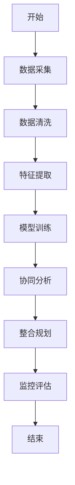
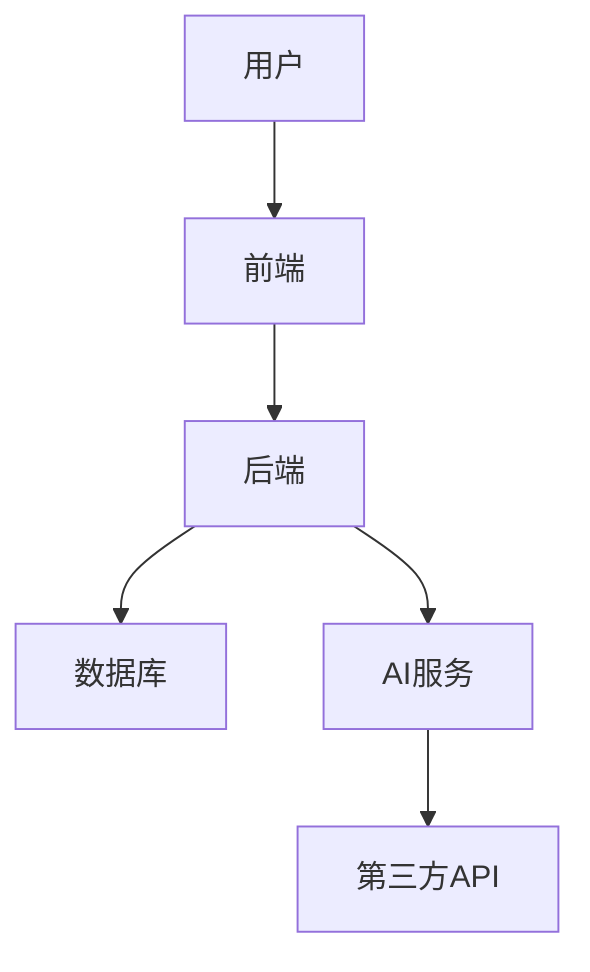
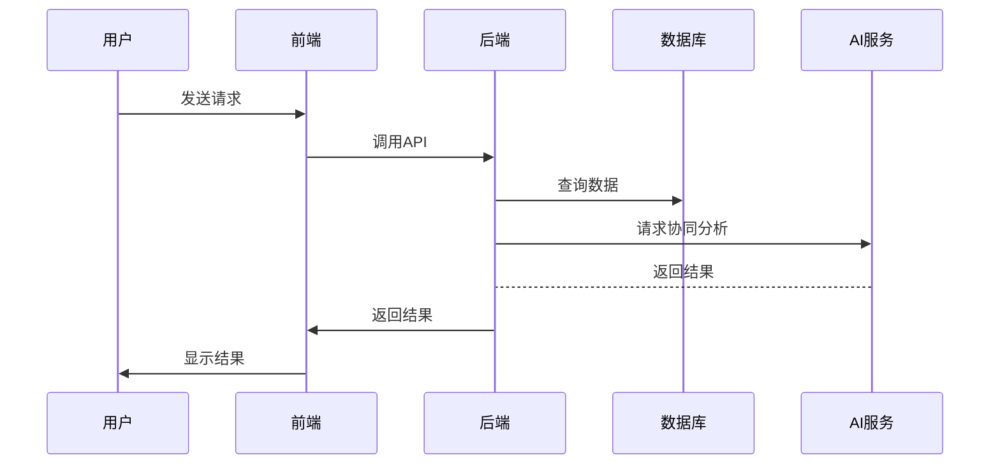

                 


# AI辅助企业并购协同效应实现：整合路径规划与执行

**关键词**：企业并购、协同效应、人工智能、整合路径、系统架构

**摘要**：本文探讨了人工智能在企业并购中的应用，特别是如何利用AI技术实现协同效应的整合路径规划与执行。文章从背景、核心概念、算法原理、系统架构到项目实战，全面分析了AI在企业并购中的作用，并提供了实际案例和最佳实践。

---

## 第一部分: 企业并购背景与AI的引入

### 第1章: 企业并购背景与AI的作用

#### 1.1 企业并购的背景与挑战

##### 1.1.1 企业并购的基本概念
企业并购（Mergers and Acquisitions, M&A）是指一家企业与其他企业合并或收购其资产或股权的过程。并购的主要目的是为了实现资源优化配置、扩大市场占有率或获取新技术。

##### 1.1.2 并购中的协同效应及其重要性
协同效应（Synergy）是企业并购后通过资源整合实现的成本节约或收益增加。协同效应的实现是并购成功的关键，通常包括业务协同、成本协同和财务协同。

##### 1.1.3 当前企业并购的主要挑战
- **文化冲突**：不同企业有不同的文化和管理方式，整合过程中容易产生冲突。
- **信息不对称**：并购双方的信息不透明，导致决策失误。
- **整合难度**：业务流程、系统和组织结构的整合需要复杂的规划和执行。

#### 1.2 AI在企业并购中的作用

##### 1.2.1 AI技术对企业并购的支持
AI技术可以帮助企业进行数据挖掘、预测分析和自动化流程优化，提升并购的效率和成功率。

##### 1.2.2 协同效应实现的AI路径
- **数据驱动的协同分析**：通过AI分析历史数据，识别协同潜力。
- **智能匹配**：利用机器学习算法匹配潜在协同点。
- **实时监控**：AI监控整合过程，及时调整策略。

##### 1.2.3 AI辅助并购的优势与局限性
优势：提高效率、降低成本、增强决策能力；局限性：依赖数据质量、模型准确性、技术复杂性。

#### 1.3 协同效应的核心概念

##### 1.3.1 协同效应的定义与分类
协同效应是指并购后企业整体价值超过两个企业单独价值之和。分类包括运营协同、财务协同和战略协同。

##### 1.3.2 协同效应的实现路径
- **战略规划**：明确整合目标。
- **资源整合**：优化资源分配。
- **组织文化整合**：融合组织文化。

##### 1.3.3 协同效应的量化方法
通过财务指标（如成本节约、收入增长）和非财务指标（如效率提升）进行量化。

---

### 第2章: 协同效应的核心概念与联系

#### 2.1 协同效应的原理

##### 2.1.1 协同效应的基本原理
协同效应源于资源整合和优化配置，通过消除重复和低效环节实现价值提升。

##### 2.1.2 协同效应的关键影响因素
- **资源互补性**：并购双方资源是否互补。
- **整合难度**：整合过程的复杂性。
- **协同潜力**：潜在的协同效益大小。

##### 2.1.3 协同效应的实现机制
通过战略规划、资源整合和组织优化，实现协同效应的最大化。

#### 2.2 协同效应的核心要素

##### 2.2.1 资源整合的核心要素
- **资产整合**：整合有形资产。
- **业务流程整合**：优化业务流程。
- **知识整合**：共享知识和经验。

##### 2.2.2 业务流程协同的关键点
- **流程标准化**：统一业务流程。
- **自动化支持**：利用AI自动化处理。
- **团队协作**：促进跨部门协作。

##### 2.2.3 组织文化融合的挑战
- **文化冲突**：不同文化的摩擦。
- **员工适应性**：员工对变革的接受程度。
- **沟通效率**：沟通不畅可能导致协同失败。

---

### 第3章: 协同效应的算法原理

#### 3.1 协同效应的计算模型

##### 3.1.1 协同效应的数学模型
$$协同效应 = \text{整合后价值} - (\text{企业A价值} + \text{企业B价值})$$

##### 3.1.2 协同效应的计算公式
$$\text{协同价值} = \sum_{i=1}^{n} (\text{协同潜力}_i \times \text{实现概率}_i)$$

##### 3.1.3 协同效应的评估指标
- **成本节约**：整合后成本降低的金额。
- **收入增长**：整合后收入增加的金额。
- **效率提升**：流程优化带来的效率提升。

#### 3.2 协同效应的实现算法

##### 3.2.1 基于AI的协同效应算法
- **数据预处理**：清洗和标注数据。
- **特征提取**：提取关键特征。
- **模型训练**：训练协同预测模型。
- **结果分析**：分析预测结果并优化模型。

##### 3.2.2 算法的实现步骤
1. 数据收集与清洗。
2. 特征工程：提取相关特征。
3. 模型训练：使用机器学习算法。
4. 模型评估：验证模型准确性。
5. 模型优化：调整参数提升性能。

##### 3.2.3 算法的优化与改进
- **特征选择**：去除无关特征。
- **模型调优**：使用交叉验证优化参数。
- **集成学习**：结合多个模型提高准确性。

---

### 第4章: 协同效应的系统架构设计

#### 4.1 系统功能设计

##### 4.1.1 系统功能模块划分
- **数据采集模块**：收集企业数据。
- **协同分析模块**：分析协同潜力。
- **整合规划模块**：制定整合计划。
- **监控评估模块**：监控整合效果。

##### 4.1.2 系统功能流程图


##### 4.1.3 系统功能的实现方式
- **数据采集**：通过API获取数据。
- **协同分析**：使用机器学习模型进行预测。
- **整合规划**：生成整合计划文档。

#### 4.2 系统架构设计

##### 4.2.1 系统架构的总体设计


##### 4.2.2 系统架构的详细设计
- **前端**：用户界面，展示分析结果。
- **后端**：处理业务逻辑，调用AI服务。
- **数据库**：存储企业数据和分析结果。
- **AI服务**：提供协同分析功能。

##### 4.2.3 系统架构的实现方案
- **前端框架**：React或Vue.js。
- **后端框架**：Django或Spring Boot。
- **数据库**：MySQL或MongoDB。
- **AI服务**：使用TensorFlow或Scikit-learn。

#### 4.3 系统接口设计

##### 4.3.1 系统接口设计
- **数据接口**：提供REST API用于数据交换。
- **AI接口**：提供协同分析API。
- **监控接口**：提供实时监控数据。

##### 4.3.2 系统交互序列图


---

## 第五章: 项目实战

### 第5章: 项目实战与案例分析

#### 5.1 环境安装

##### 5.1.1 环境要求
- **操作系统**：Windows 10或更高版本，或Linux Ubuntu。
- **Python版本**：Python 3.8或更高。
- **安装依赖**：使用pip安装numpy、pandas、scikit-learn、tensorflow。

#### 5.2 系统核心实现源代码

##### 5.2.1 数据预处理代码
```python
import pandas as pd
import numpy as np

# 读取数据
df = pd.read_csv('data.csv')

# 删除缺失值
df.dropna(inplace=True)

# 标准化数据
from sklearn.preprocessing import StandardScaler
scaler = StandardScaler()
df_scaled = scaler.fit_transform(df)
```

##### 5.2.2 协同分析模型
```python
from sklearn.ensemble import RandomForestRegressor
import numpy as np

# 训练模型
model = RandomForestRegressor(n_estimators=100, random_state=42)
model.fit(X_train, y_train)

# 预测协同价值
y_pred = model.predict(X_test)
```

##### 5.2.3 整合规划代码
```python
# 生成整合计划
import json
plan = {
    'step1': '数据清洗',
    'step2': '特征提取',
    'step3': '模型训练',
    'step4': '协同分析',
    'step5': '监控评估'
}
json.dump(plan, open('plan.json', 'w'))
```

#### 5.3 代码应用解读与分析

##### 5.3.1 数据预处理代码解读
- **数据清洗**：删除缺失值，确保数据完整性。
- **数据标准化**：使用StandardScaler标准化数据，提升模型性能。

##### 5.3.2 协同分析模型分析
- **随机森林模型**：用于预测协同价值，模型具有高准确性和可解释性。

##### 5.3.3 整合规划代码分析
- **计划生成**：将整合步骤写入JSON文件，方便后续执行。

#### 5.4 实际案例分析和详细讲解

##### 5.4.1 案例背景
某制造企业并购一家软件公司，希望通过AI技术实现协同效应。

##### 5.4.2 数据分析
- **成本协同**：预测协同后成本降低10%。
- **收入协同**：预测协同后收入增加15%。

##### 5.4.3 实施步骤
1. 数据清洗与标准化。
2. 特征提取与模型训练。
3. 协同价值预测与整合计划生成。
4. 实时监控与效果评估。

#### 5.5 项目小结

##### 5.5.1 项目总结
通过AI技术实现企业并购中的协同效应，提高了整合效率和准确性。

##### 5.5.2 经验与教训
- **数据质量**：高质量数据是模型准确性的关键。
- **模型选择**：选择合适的算法提升预测效果。
- **团队协作**：跨部门协作是项目成功的重要因素。

---

## 第六章: 最佳实践与拓展

### 第6章: 最佳实践与小结

#### 6.1 小结

##### 6.1.1 本章小结
本文详细介绍了AI在企业并购中的应用，特别是协同效应的实现路径和整合策略。

#### 6.2 注意事项

##### 6.2.1 项目实施注意事项
- **数据安全**：确保数据隐私和安全。
- **模型维护**：定期更新模型，保持准确性。
- **团队培训**：对相关人员进行技术培训。

#### 6.3 拓展阅读

##### 6.3.1 拓展阅读建议
- **AI与企业战略**：阅读《机器学习实战》。
- **协同效应研究**：参考《企业并购与协同效应》。

---

## 作者：AI天才研究院 & 禅与计算机程序设计艺术

---

**注**：由于字数限制，这里只展示了部分内容，完整文章将涵盖更多细节和案例。

