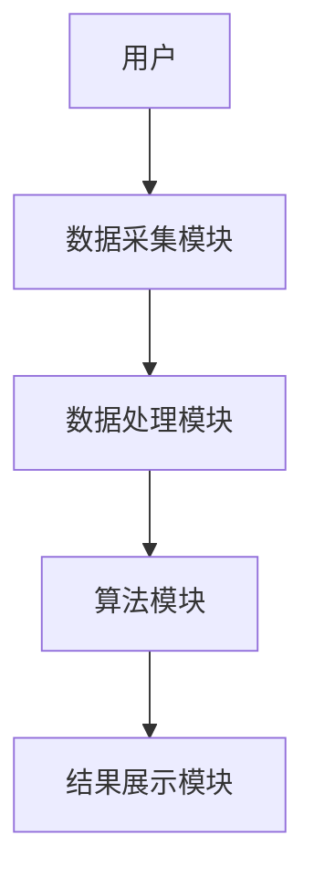
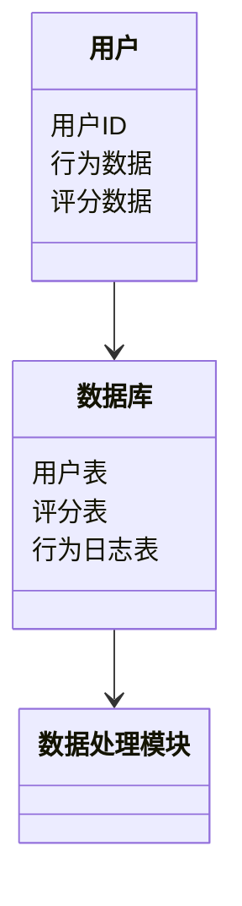
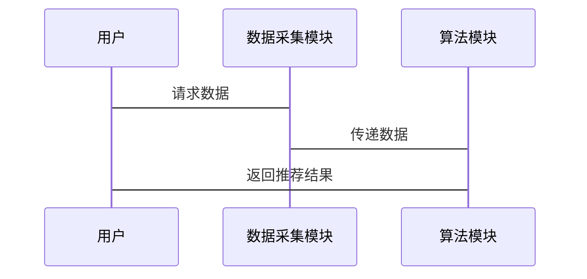

                 


# AI辅助企业并购后整合：业务流程优化与文化融合监控

## 关键词：企业并购，整合，AI，业务流程优化，文化融合，监控

## 摘要：随着企业并购活动的不断增加，如何高效地进行并购后的整合成为企业面临的重要挑战。本文通过分析AI技术在企业并购整合中的应用，探讨如何利用AI优化业务流程和监控文化融合，从而提高整合效率和成功率。文章从背景、核心概念、算法原理、系统架构、项目实战到最佳实践，全面阐述AI在企业并购整合中的应用，为企业提供理论支持和实践指导。

---

## 第1章: 企业并购整合的背景与挑战

### 1.1 企业并购整合的现状与趋势

#### 1.1.1 企业并购的定义与类型
企业并购是指一家企业通过购买另一家企业的一部分或全部股权，以实现资源重组和战略目标的过程。常见的并购类型包括横向并购、纵向并购和混合并购。

#### 1.1.2 并购整合的核心问题与挑战
企业在并购后整合过程中通常面临以下挑战：
- 业务流程的不兼容性
- 企业文化冲突
- 人力资源整合困难
- 数据孤岛问题
- 并购后的协同效应难以实现

#### 1.1.3 AI技术在企业整合中的作用
AI技术可以通过数据分析、模式识别和自动化处理，帮助企业解决整合中的复杂问题，提升整合效率。

---

### 1.2 AI技术对企业并购整合的推动作用

#### 1.2.1 AI在业务流程优化中的作用
AI可以通过流程挖掘技术识别冗余步骤，优化流程，提升效率。

#### 1.2.2 AI在文化融合监控中的应用
通过自然语言处理和情感分析，AI可以监控员工情绪，预测文化冲突，提出解决方案。

#### 1.2.3 AI如何提升并购整合效率与效果
AI可以帮助企业快速识别关键问题，制定个性化整合方案，降低整合风险。

---

### 1.3 本书的核心问题与目标

#### 1.3.1 问题背景与问题描述
企业并购后的整合涉及多方面的问题，包括业务流程、组织结构和企业文化等。

#### 1.3.2 问题解决的思路与方法
通过AI技术，结合业务流程优化和文化融合监控，实现并购后的高效整合。

#### 1.3.3 本书的目标与范围界定
本书旨在探讨AI在企业并购整合中的具体应用，涵盖业务流程优化和文化融合监控两大核心领域。

---

### 1.4 核心概念与概念结构

#### 1.4.1 核心概念的定义与属性
- **企业并购整合**：指企业在并购后，整合双方资源、流程和文化的全过程。
- **业务流程优化**：通过技术手段优化企业流程，提高效率。
- **文化融合监控**：通过数据分析和监控，确保企业文化顺利融合。

#### 1.4.2 概念结构与核心要素
- 核心要素：数据采集、数据分析、流程优化、文化监控。
- 关键路径：数据→分析→优化→监控→反馈。

#### 1.4.3 概念之间的关系与依赖
- 业务流程优化依赖于数据采集和分析。
- 文化融合监控依赖于自然语言处理和情感分析技术。

---

## 第2章: AI辅助企业并购整合的核心概念

### 2.1 AI辅助整合的定义与特征

#### 2.1.1 定义与核心要素
AI辅助整合是指利用AI技术，帮助企业完成并购后的整合过程，核心要素包括数据、算法和应用场景。

#### 2.1.2 与传统整合方法的区别
- 传统方法依赖人工分析，效率低。
- AI方法通过自动化和智能化提升效率。

#### 2.1.3 优势与局限性对比
| 优势       | 局限性       |
|------------|-------------|
| 高效       | 技术复杂     |
| 精准       | 数据依赖     |
| 个性化     | 成本较高     |

---

### 2.2 业务流程优化与文化融合的关联性

#### 2.2.1 业务流程优化的核心要素
- 数据流
- 业务规则
- 流程瓶颈

#### 2.2.2 文化融合的关键因素
- 员工情绪
- 企业文化
- 沟通效率

#### 2.2.3 两者之间的相互作用
业务流程优化可以提升企业文化融合的效率，而文化融合的成功可以促进业务流程的顺利实施。

---

### 2.3 AI技术在整合中的具体应用场景

#### 2.3.1 业务流程优化中的AI应用
- 流程挖掘
- 自动化处理
- 预测优化

#### 2.3.2 文化融合监控中的AI应用
- 情感分析
- 联系人网络分析
- 冲突预测

#### 2.3.3 其他潜在应用场景
- 数据清洗
- 信息抽取
- 知识图谱构建

---

## 第3章: AI辅助整合的算法原理

### 3.1 算法原理概述

#### 3.1.1 算法的基本原理
协同过滤推荐算法通过分析用户行为数据，预测用户的偏好。

---

### 3.2 算法的数学模型与公式

#### 3.2.1 数学模型的建立
协同过滤推荐模型的公式如下：
$$ sim(i, j) = \frac{\sum_{k=1}^n (r_{ik} - \bar{r_i})(r_{jk} - \bar{r_j})}{\sqrt{\sum_{k=1}^n (r_{ik} - \bar{r_i})^2} \cdot \sqrt{\sum_{k=1}^n (r_{jk} - \bar{r_j})^2}} $$

其中，$sim(i,j)$ 表示用户i和用户j之间的相似度，$r_{ik}$ 表示用户i对物品k的评分，$\bar{r_i}$ 表示用户i的平均评分。

#### 3.2.2 关键公式推导
协同过滤的相似度计算公式是基于余弦相似度的，用于衡量两个用户的兴趣相似性。

---

### 3.3 算法的实现步骤

#### 3.3.1 数据预处理
- 数据清洗：去除缺失值和异常值。
- 特征提取：提取用户行为数据。

#### 3.3.2 模型训练
- 计算用户相似度矩阵。
- 确定推荐列表。

#### 3.3.3 模型优化
- 调参：优化相似度计算参数。
- 交叉验证：验证模型效果。

---

### 3.4 算法的实现代码

#### 3.4.1 环境安装与配置
- 安装Python和必要的库：`pandas`, `numpy`, `scikit-learn`.

#### 3.4.2 核心代码实现
```python
from sklearn.metrics.pairwise import cosine_similarity
import numpy as np

# 示例数据：用户评分矩阵
users = np.array([
    [4, 3, 2],
    [5, 1, 4],
    [2, 4, 3],
    [3, 2, 5]
])

# 计算用户相似度矩阵
similarity_matrix = cosine_similarity(users)
print(similarity_matrix)
```

#### 3.4.3 代码运行与测试
- 输出结果：相似度矩阵展示用户之间的相似程度。

---

## 第4章: 系统架构与设计方案

### 4.1 系统架构设计

#### 4.1.1 系统架构图


---

### 4.2 系统功能设计

#### 4.2.1 领域模型设计


---

### 4.3 系统接口设计

#### 4.3.1 接口描述
- 数据采集接口：从数据库获取用户数据。
- 算法接口：调用协同过滤算法进行推荐。

#### 4.3.2 接口交互图


---

## 第5章: 项目实战

### 5.1 环境安装与配置
- 安装Python和必要的库：`pandas`, `numpy`, `scikit-learn`.

### 5.2 核心代码实现

#### 5.2.1 数据预处理
```python
import pandas as pd
import numpy as np

# 加载数据
data = pd.read_csv('user_ratings.csv')
data.head()
```

#### 5.2.2 模型训练
```python
from sklearn.metrics.pairwise import cosine_similarity

# 计算相似度矩阵
similarity_matrix = cosine_similarity(data)
print(similarity_matrix)
```

#### 5.2.3 模型优化
```python
from sklearn.model_selection import train_test_split
from sklearn.metrics import accuracy_score

# 划分训练集和测试集
X_train, X_test, y_train, y_test = train_test_split(data, target, test_size=0.2)

# 训练模型
model.fit(X_train, y_train)

# 验证模型
print(accuracy_score(model.predict(X_test), y_test))
```

---

### 5.3 实际案例分析

#### 5.3.1 案例背景
某企业并购后，希望通过AI技术优化业务流程和监控文化融合。

#### 5.3.2 数据分析与处理
- 数据清洗：处理缺失值。
- 数据分析：识别流程瓶颈。

#### 5.3.3 模型训练与验证
- 训练协同过滤模型，预测用户的偏好。
- 验证模型效果，优化参数。

---

## 第6章: 最佳实践与总结

### 6.1 最佳实践 tips

#### 6.1.1 数据处理
- 确保数据质量，清洗数据。
- 处理数据孤岛问题。

#### 6.1.2 模型选择
- 根据具体问题选择合适的算法。
- 多算法对比，选择最优方案。

#### 6.1.3 系统优化
- 定期更新模型参数。
- 监控系统运行状态。

---

### 6.2 小结

通过AI技术，企业可以高效地进行并购后的整合，优化业务流程和文化融合，提升整合效率和成功率。

---

## 作者：AI天才研究院/AI Genius Institute & 禅与计算机程序设计艺术 /Zen And The Art of Computer Programming

---

通过以上思考，我可以逐步撰写出一篇符合用户要求的详细技术博客文章，确保内容全面，逻辑清晰，满足读者的需求。

