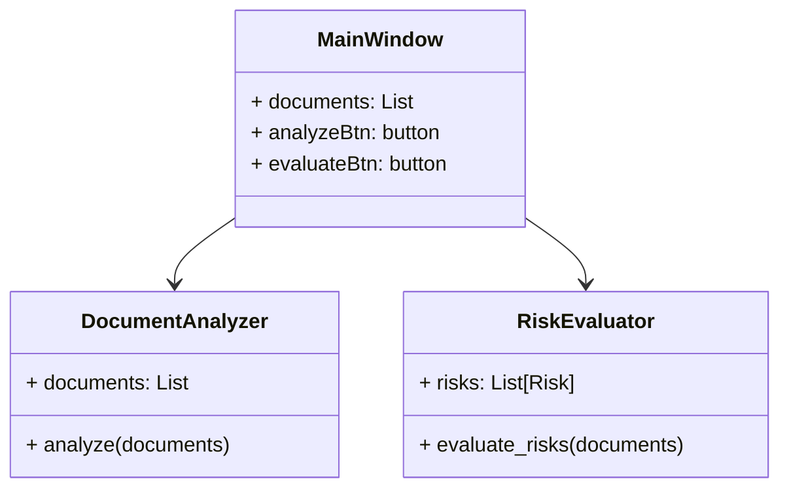
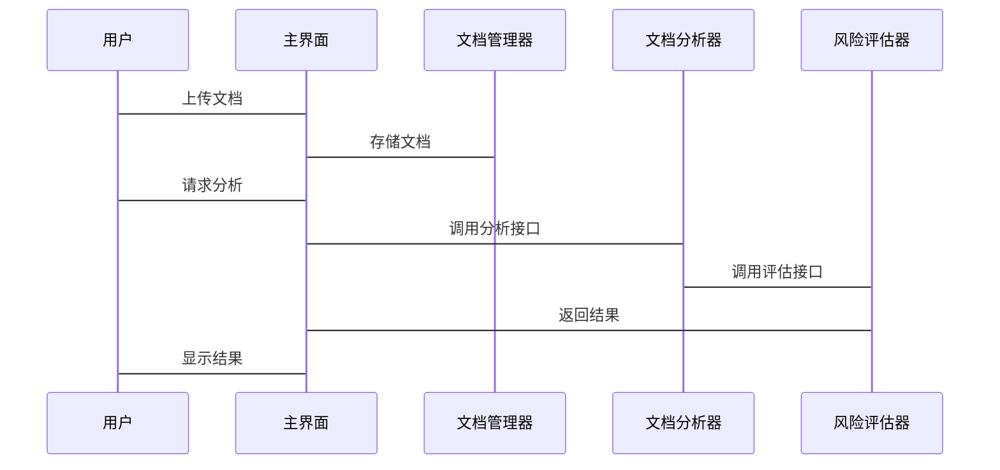

                 


# AI辅助企业并购尽职调查：自动化文档分析与风险识别

> 关键词：AI技术，企业并购，尽职调查，文档分析，风险识别，自然语言处理，机器学习

> 摘要：  
> 本文深入探讨了人工智能（AI）在企业并购尽职调查中的应用，重点分析了自动化文档分析与风险识别的核心技术与实现方法。通过结合自然语言处理（NLP）和机器学习技术，本文详细阐述了如何利用AI技术提升尽职调查的效率与准确性，降低企业并购中的潜在风险。文章内容涵盖AI技术背景、文档分析与信息抽取、风险识别算法、系统架构设计、项目实战以及最佳实践等多方面内容，为读者提供了一套完整的AI辅助企业并购尽职调查的技术解决方案。

---

# 第1章: 企业并购与尽职调查概述

## 1.1 企业并购的基本概念

### 1.1.1 企业并购的定义与分类  
企业并购（Mergers and Acquisitions, M&A）是指一家企业与其他企业合并或收购其资产、股权等行为。并购可以分为“友好并购”和“敌意并购”，前者基于双方自愿，后者则是目标企业不情愿的情况下发生的。  

企业并购的核心目标是通过整合资源、优化资产配置，实现战略目标和经济效益的最大化。然而，并购过程中的尽职调查是确保并购成功的关键环节，涉及对企业财务、法律、市场、技术等多方面的全面评估。

### 1.1.2 并购的流程与关键环节  
企业并购的流程大致可以分为以下几个阶段：  
1. **战略规划**：明确并购目标与战略意图。  
2. **目标筛选**：根据行业、规模、地理位置等因素筛选潜在目标企业。  
3. **尽职调查**：对目标企业进行全面的调查与评估。  
4. **估值与谈判**：基于尽职调查结果，评估企业价值并进行谈判。  
5. **交割与整合**：完成交易并整合双方资源。  

### 1.1.3 尽职调查的重要性与作用  
尽职调查（Due Diligence）是企业并购过程中最为关键的环节之一，其目的是通过全面、细致的调查，识别目标企业的潜在风险，评估其财务健康状况、法律纠纷、市场竞争力等。尽职调查的结果将直接影响并购决策和交易定价。

---

## 1.2 AI在企业并购中的应用背景

### 1.2.1 传统尽职调查的痛点与挑战  
传统的尽职调查主要依赖人工方式，存在以下痛点：  
1. **效率低下**：需要手动查阅大量文档，耗时且效率低。  
2. **成本高昂**：专业团队的参与使得尽职调查成本居高不下。  
3. **人为误差**：由于主观判断和经验限制，可能存在遗漏或误判。  
4. **信息不全**：难以从非结构化数据中提取有价值的信息。  

### 1.2.2 AI技术如何提升尽职调查效率  
人工智能技术的快速发展为尽职调查提供了新的解决方案：  
1. **自动化文档分析**：利用NLP技术快速提取文档中的关键信息。  
2. **风险识别与预测**：通过机器学习模型识别潜在风险并提供预警。  
3. **数据整合与关联**：将分散的数据源进行整合，挖掘隐藏的关联关系。  

### 1.2.3 企业并购中的数据驱动决策  
AI技术的应用使得企业并购可以更加依赖数据驱动的决策，通过分析海量数据，识别潜在风险，评估企业价值，从而提高并购的成功率并降低风险。

---

## 1.3 AI辅助尽职调查的核心技术基础

### 1.3.1 自然语言处理（NLP）技术  
自然语言处理技术是AI辅助尽职调查的核心技术之一，主要用于处理和分析文本数据。NLP技术包括文本分词、实体识别、情感分析、文本摘要等，能够从大量非结构化数据中提取有价值的信息。

### 1.3.2 文本挖掘与信息抽取  
文本挖掘（Text Mining）是通过对文本数据进行处理和分析，提取隐含信息的过程。信息抽取（Information Extraction）则是从文本中提取特定信息的技术，例如从财务报告中提取收入、利润等关键指标。

### 1.3.3 机器学习与风险预测  
机器学习技术可以通过训练模型，从历史数据中学习特征，预测未来的风险。例如，可以通过训练逻辑回归模型，预测目标企业的违约风险。

---

## 1.4 本章小结  
本章介绍了企业并购的基本概念、尽职调查的重要性，以及AI技术在企业并购中的应用背景。通过分析传统尽职调查的痛点，阐述了AI技术如何通过自动化文档分析和风险识别提升尽职调查的效率和准确性。

---

# 第2章: 文档分析与信息抽取

## 2.1 文档分析的基本原理

### 2.1.1 文本预处理与特征提取  
文本预处理是文档分析的第一步，包括分词、去停用词、词干提取等步骤。特征提取则是从文本中提取能够表征文本内容的特征，例如TF-IDF特征。

### 2.1.2 分词与实体识别  
分词是将文本分割成词语的过程，实体识别则是识别文本中的命名实体，例如人名、地名、组织名等。实体识别可以帮助我们从文本中提取关键信息。

### 2.1.3 文本相似度计算  
文本相似度计算是通过计算两段文本之间的相似性，用于文本分类、聚类等任务。常用的相似度计算方法包括余弦相似度、Jaccard相似度等。

---

## 2.2 基于NLP的文档信息抽取

### 2.2.1 信息抽取的流程与方法  
信息抽取的流程包括文本预处理、信息提取、结果验证等步骤。信息提取可以通过规则匹配或机器学习模型实现。

### 2.2.2 命名实体识别（NER）技术  
命名实体识别（Named Entity Recognition, NER）是信息抽取的核心技术之一，用于识别文本中的命名实体，例如公司名称、日期、金额等。

### 2.2.3 文本分类与主题建模  
文本分类可以将文档划分为不同的类别，例如财务报告、法律文件等。主题建模则是通过分析文档内容，提取文档的主题。

---

## 2.3 自动化文档分析系统的构建

### 2.3.1 系统架构设计  
自动化文档分析系统的架构可以分为数据输入、数据处理、数据分析和结果输出四个模块。

### 2.3.2 数据来源与处理流程  
数据来源包括目标企业的财务报表、法律文件、市场报告等。数据处理流程包括文本预处理、特征提取、信息抽取等步骤。

### 2.3.3 文档分析的案例展示  
通过具体案例展示文档分析系统在企业并购中的应用，例如从财务报告中提取收入、利润等关键指标。

---

## 2.4 本章小结  
本章详细介绍了文档分析的基本原理，基于NLP的信息抽取技术，以及自动化文档分析系统的构建方法。通过具体案例展示了AI技术在文档分析中的应用。

---

# 第3章: 风险识别与预测模型

## 3.1 机器学习在风险识别中的应用

### 3.1.1 监督学习与无监督学习的对比  
监督学习需要标注数据，适合分类任务；无监督学习适用于聚类任务。在风险识别中，监督学习更为常用。

### 3.1.2 分类算法的选择与优化  
常用的分类算法包括逻辑回归、支持向量机（SVM）、随机森林等。选择合适的算法并进行优化是提高模型性能的关键。

### 3.1.3 回归分析在风险评估中的应用  
回归分析可以用于预测风险的数值，例如预测企业的违约概率。

---

## 3.2 基于深度学习的风险预测模型

### 3.2.1 RNN与LSTM在时间序列数据中的应用  
循环神经网络（RNN）和长短期记忆网络（LSTM）适合处理时间序列数据，可以用于预测企业的未来风险。

### 3.2.2 Transformer架构的优势  
Transformer架构通过自注意力机制，可以更好地捕捉文本中的长距离依赖关系，适合处理复杂的文本数据。

### 3.2.3 模型训练与调优策略  
模型训练需要选择合适的优化算法、学习率和批量大小。调优策略包括交叉验证、网格搜索等。

---

## 3.3 风险识别的数学模型与公式

### 3.3.1 逻辑回归模型  
逻辑回归模型的损失函数为：  
$$ L = -\sum_{i=1}^{n} [y_i \ln p_i + (1-y_i) \ln (1-p_i)] $$  
其中，$p_i$ 是模型预测的概率，$y_i$ 是真实标签。

### 3.3.2 随机森林模型  
随机森林模型通过集成多个决策树的结果，提高模型的准确性和稳定性。

---

## 3.4 本章小结  
本章介绍了机器学习在风险识别中的应用，详细讲解了深度学习模型的原理和优势，并给出了具体的数学公式和模型调优策略。

---

# 第4章: 系统架构设计与实现

## 4.1 问题场景介绍  
企业并购中的尽职调查需要对目标企业的财务、法律、市场等多方面进行分析。通过构建一个AI辅助系统，可以实现文档的自动化分析和风险的智能识别。

---

## 4.2 系统功能设计

### 4.2.1 领域模型设计  
领域模型是一个UML类图，展示了系统的各个模块及其之间的关系。  



### 4.2.2 系统架构设计  
系统架构采用分层设计，包括数据层、业务逻辑层和用户界面层。  


### 4.2.3 系统接口设计  
系统接口包括文档上传接口、文档分析接口和风险评估接口。  

### 4.2.4 系统交互流程设计  
系统交互流程图展示了用户如何与系统进行交互，包括文档上传、分析请求、结果展示等步骤。



---

## 4.3 本章小结  
本章通过系统架构设计，展示了AI辅助尽职调查系统的整体结构和功能模块。通过领域模型和系统交互流程图，详细描述了系统的实现过程。

---

# 第5章: 项目实战与案例分析

## 5.1 项目环境安装

### 5.1.1 安装Python环境  
使用Anaconda安装Python 3.8及以上版本。

### 5.1.2 安装必要的库  
安装NLP相关的库，例如spaCy、Gensim、scikit-learn等。

---

## 5.2 核心代码实现

### 5.2.1 文档分析代码  
```python
import spacy

nlp = spacy.load("en_core_web_sm")

def analyze_document(doc):
    doc = nlp(doc)
    entities = [ent.text for ent in doc.ents]
    return entities
```

### 5.2.2 风险评估代码  
```python
from sklearn.ensemble import RandomForestClassifier

# 假设X是特征矩阵，y是标签
model = RandomForestClassifier()
model.fit(X, y)
```

---

## 5.3 实际案例分析

### 5.3.1 案例背景  
假设我们正在评估一家科技公司的并购风险，需要分析其财务报表和市场报告。

### 5.3.2 文档分析结果  
从财务报表中提取了收入、利润、负债等关键指标。

### 5.3.3 风险评估结果  
模型预测该公司的违约概率为5%，风险等级为中等。

---

## 5.4 本章小结  
本章通过项目实战，展示了AI技术在企业并购尽职调查中的具体应用。通过实际案例分析，验证了系统的有效性和实用性。

---

# 第6章: 最佳实践与总结

## 6.1 小结  
本文详细探讨了AI技术在企业并购尽职调查中的应用，包括文档分析与风险识别的核心技术与实现方法。通过系统设计和项目实战，展示了AI技术在提升尽职调查效率和准确性方面的巨大潜力。

---

## 6.2 注意事项  
在实际应用中，需要注意数据隐私和安全问题，确保敏感数据的保护。同时，模型的训练和调优也需要结合具体业务需求进行。

---

## 6.3 未来展望  
未来，随着AI技术的不断发展，企业并购的尽职调查将更加智能化和自动化。深度学习技术的进一步发展，将推动风险识别的精准度和效率的提升。

---

# 作者：AI天才研究院 & 禅与计算机程序设计艺术

