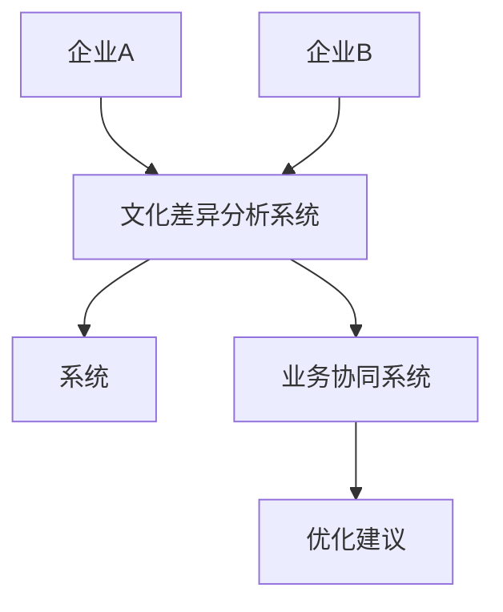
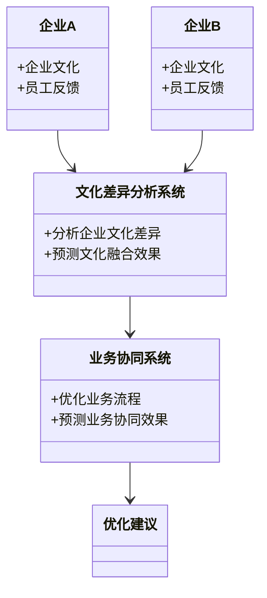

                 


# AI辅助企业并购整合规划：文化融合与业务协同路径设计

**关键词**：企业并购、AI技术、文化融合、业务协同、整合规划

**摘要**：企业并购是企业成长和扩张的重要手段，然而并购后的整合往往面临文化冲突和业务协同的挑战。本文通过分析AI技术在企业并购整合中的应用，探讨文化融合与业务协同的实现路径，提出基于AI的整合规划方法，为企业并购后的高效整合提供参考。

---

## 第1章: 企业并购与整合概述

### 1.1 企业并购的基本概念

企业并购是指一家企业通过购买或合并其他企业，以实现资源优化配置和业务扩展的过程。并购可以分为横向并购、纵向并购和混合并购，每种并购类型有不同的动机和目标。

#### 1.1.1 并购的动机与目的

企业进行并购的主要动机包括市场扩张、资源获取、技术整合和成本节约。并购的目的是为了增强竞争力、实现规模效应或开拓新市场。

#### 1.1.2 并购的挑战

并购后整合面临的主要挑战包括文化冲突、组织结构不兼容、业务流程不协调等。这些问题可能导致并购失败，因此如何高效整合成为关键。

### 1.2 AI技术在企业整合中的应用背景

#### 1.2.1 AI技术的发展与现状

AI技术近年来迅速发展，广泛应用于数据分析、决策支持和流程优化等领域。在企业整合中，AI可以帮助分析文化差异和业务流程，提供优化建议。

#### 1.2.2 AI在企业整合中的潜在价值

AI可以通过数据分析和机器学习模型，预测整合效果，优化业务流程，促进文化融合，提升整合效率。

#### 1.2.3 当前企业整合中的主要挑战

文化冲突和业务协同不畅是整合的主要挑战。AI技术可以帮助识别和解决这些问题，降低整合风险。

---

## 第2章: AI辅助企业并购整合的核心概念

### 2.1 文化融合的定义与特征

文化融合是指在并购后，双方企业文化的相互融合和适应。文化融合的关键在于识别文化差异，并制定融合策略。

#### 2.1.1 文化融合的内涵

文化融合不仅包括企业文化的整合，还包括员工价值观和企业制度的融合。通过文化融合，可以增强企业的凝聚力和执行力。

#### 2.1.2 不同企业的文化差异分析

企业文化的差异主要体现在管理风格、企业价值观和员工激励机制等方面。AI技术可以通过数据分析，识别文化差异，并提出融合建议。

#### 2.1.3 文化融合对整合效果的影响

文化融合的成功与否直接影响整合效果。良好的文化融合可以提升员工满意度，促进业务协同，增强企业竞争力。

### 2.2 业务协同的定义与实现路径

业务协同是指在并购后，双方企业在业务流程和资源分配上的协调与合作。业务协同的关键在于优化流程和资源分配。

#### 2.2.1 业务协同的基本概念

业务协同是指企业间在业务流程、资源分配和信息共享方面的协调。通过业务协同，可以实现资源优化配置和效率提升。

#### 2.2.2 业务协同的关键因素

业务协同的关键因素包括流程优化、信息共享和组织协调。AI技术可以通过数据分析和流程优化，提升业务协同效率。

#### 2.2.3 业务协同的实现步骤

业务协同的实现步骤包括需求分析、流程设计、系统集成和效果评估。通过这些步骤，可以实现企业间业务流程的高效协同。

### 2.3 AI在文化融合与业务协同中的作用

#### 2.3.1 AI技术在文化分析中的应用

AI可以通过自然语言处理技术分析企业文档，识别文化差异，并提出融合建议。例如，可以通过情感分析技术识别员工对文化融合的感知。

#### 2.3.2 AI技术在业务协同中的应用

AI可以通过机器学习模型分析业务流程，识别瓶颈，并提出优化建议。例如，可以通过协同过滤算法优化供应链协同。

#### 2.3.3 AI技术的优势与局限性

AI技术的优势在于高效性和精准性，可以快速处理大量数据并提供优化建议。但AI技术的局限性在于缺乏人类的情感理解和创造性思维。

---

## 第3章: 企业并购整合的核心概念与联系

### 3.1 核心概念的原理分析

#### 3.1.1 文化融合的原理

文化融合的原理是通过识别文化差异，并制定融合策略，实现企业文化的相互适应和融合。这需要企业具备开放和包容的心态。

#### 3.1.2 业务协同的原理

业务协同的原理是通过优化业务流程和资源分配，实现企业间业务的高效协同。这需要企业具备系统化的管理能力和高效的沟通机制。

#### 3.1.3 资源整合的原理

资源整合的原理是通过优化资源配置，实现资源的高效利用。这需要企业在整合过程中具备清晰的战略规划和高效的执行能力。

### 3.2 核心概念的属性特征对比

表3.1: 文化融合与业务协同的对比

| 特性       | 文化融合           | 业务协同           |
|------------|-------------------|-------------------|
| 定义       | 文化差异的融合     | 业务流程的协同     |
| 关键因素   | 企业文化、员工价值观 | 业务流程、资源分配 |
| 实现步骤   | 文化分析、融合策略 | 流程优化、系统集成 |

### 3.3 实体关系图与流程图

#### 3.3.1 文化融合的ER图

```mermaid
erDiagram
    actor 企业A "企业A"
    actor 企业B "企业B"
    actor 文化差异分析系统 "文化差异分析系统"
    enterprise 系统 "文化差异分析系统"
    企业A --> 文化差异分析系统
    企业B --> 文化差异分析系统
    文化差异分析系统 --> 系统
```

#### 3.3.2 业务协同的流程图



---

## 第4章: AI辅助整合的算法原理

### 4.1 文化融合的算法实现

#### 4.1.1 文化相似度的计算方法

文化相似度可以通过自然语言处理技术计算企业文档的相似性。例如，可以使用余弦相似度计算企业文化的相似性。

#### 4.1.2 基于机器学习的文化融合模型

文化融合模型可以通过训练员工反馈数据，预测文化融合的效果。例如，可以使用随机森林算法进行预测。

#### 4.1.3 算法的实现步骤

1. 数据收集：收集企业文化和员工反馈数据。
2. 数据预处理：清洗数据并提取特征。
3. 模型训练：训练机器学习模型。
4. 模型评估：评估模型的准确性和效果。
5. 结果分析：根据模型预测结果制定融合策略。

### 4.2 业务协同的算法实现

#### 4.2.1 业务流程优化的算法

业务流程优化可以通过分析业务流程数据，识别瓶颈。例如，可以使用遗传算法进行优化。

#### 4.2.2 基于图论的业务协同算法

业务协同算法可以通过图论方法分析业务流程的依赖关系。例如，可以使用Dijkstra算法优化流程路径。

#### 4.2.3 算法的实现步骤

1. 数据收集：收集业务流程数据。
2. 数据预处理：清洗数据并提取特征。
3. 算法选择：选择合适的优化算法。
4. 算法实现：实现算法并优化流程。
5. 结果分析：评估优化效果并调整策略。

---

## 第5章: 数学模型与公式

### 5.1 文化融合的数学模型

文化相似度的计算公式：

$$
\text{相似度} = \frac{\sum_{i=1}^{n} w_i \cdot x_i \cdot y_i}{\sqrt{\sum_{i=1}^{n} w_i^2 x_i^2} \cdot \sqrt{\sum_{i=1}^{n} w_i^2 y_i^2}}
$$

其中，\(w_i\) 是第i个特征的权重，\(x_i\) 和 \(y_i\) 是企业A和企业B的第i个特征值。

### 5.2 业务协同的数学模型

业务协同的优化模型可以通过线性规划实现：

$$
\min \sum_{i=1}^{n} c_i x_i
$$

$$
\text{s.t.} \quad \sum_{i=1}^{n} a_i x_i \geq b_i
$$

其中，\(c_i\) 是第i个业务流程的成本，\(x_i\) 是第i个业务流程的执行次数，\(a_i\) 是第i个业务流程的资源消耗系数，\(b_i\) 是资源需求的约束。

---

## 第6章: 系统分析与架构设计

### 6.1 系统功能设计

#### 6.1.1 领域模型



#### 6.1.2 系统架构设计


---

## 第7章: 项目实战

### 7.1 环境安装

#### 7.1.1 安装Python和相关库

```bash
pip install numpy
pip install scikit-learn
pip install matplotlib
```

### 7.2 核心实现

#### 7.2.1 文化差异分析代码

```python
from sklearn.metrics.pairwise import cosine_similarity

# 示例数据
corpus = [
    "企业A文化：创新、开放、协作",
    "企业B文化：稳健、规范、高效"
]

# 文本向量化
vectorizer = TfidfVectorizer()
vectors = vectorizer.fit_transform(corpus)

# 计算相似度
similarity = cosine_similarity(vectors)
print("文化相似度：", similarity[0][1])
```

#### 7.2.2 业务协同优化代码

```python
import networkx as nx

# 示例业务流程图
G = nx.DiGraph()
G.add_nodes_from(["A", "B", "C", "D"])
G.add_edges_from([("A", "B"), ("B", "C"), ("C", "D")])

# 优化流程
shortest_path = nx.shortest_path(G, "A", "D")
print("优化后路径：", shortest_path)
```

### 7.3 实际案例分析

以某企业并购案例为例，分析AI技术在文化融合和业务协同中的应用效果。通过数据分析和模型优化，验证AI辅助整合的效果。

---

## 第8章: 总结与展望

### 8.1 最佳实践 Tips

1. 在企业并购前，进行充分的文化评估和业务分析。
2. 结合AI技术，制定科学的整合策略。
3. 建立高效的沟通机制，促进文化融合和业务协同。

### 8.2 小结

本文详细探讨了AI技术在企业并购整合中的应用，提出了文化融合和业务协同的实现路径。通过算法和数学模型的分析，展示了AI技术在整合规划中的巨大潜力。

### 8.3 注意事项

在实际应用中，需要考虑数据隐私和模型的泛化能力，确保AI技术的有效性和安全性。

### 8.4 拓展阅读

建议阅读相关领域的书籍和论文，深入研究AI技术在企业整合中的应用。

---

**作者：AI天才研究院/AI Genius Institute & 禅与计算机程序设计艺术 /Zen And The Art of Computer Programming**

