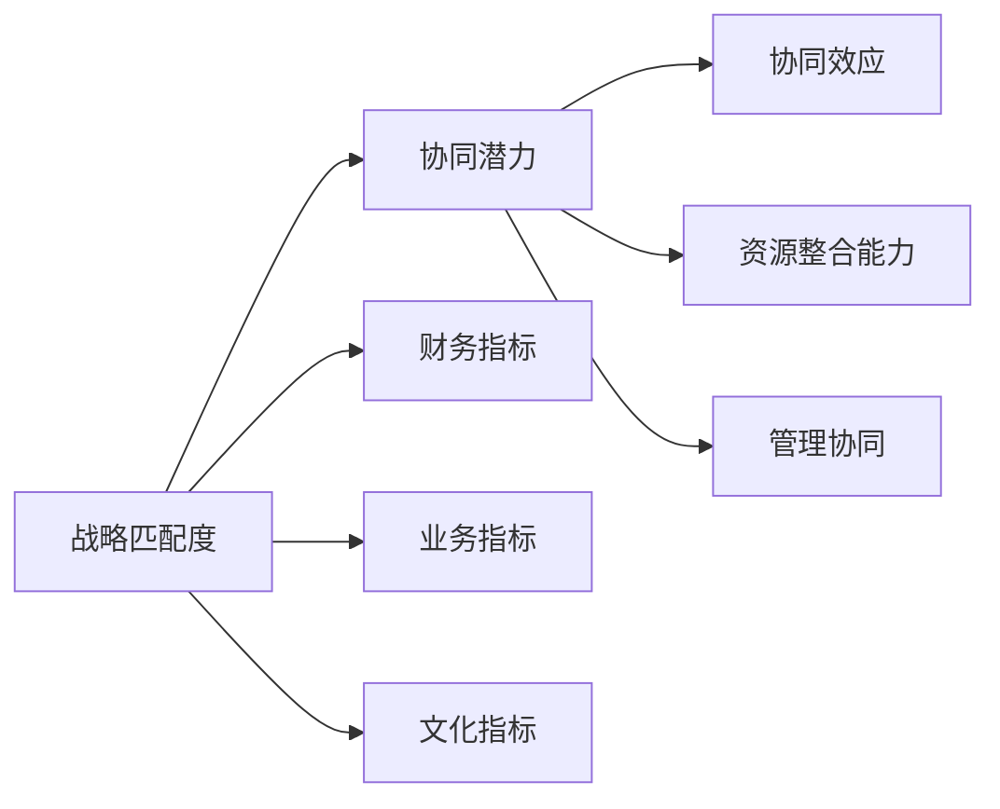
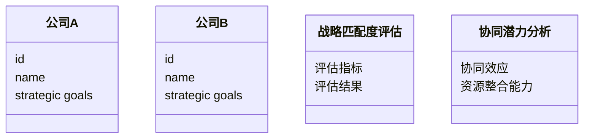
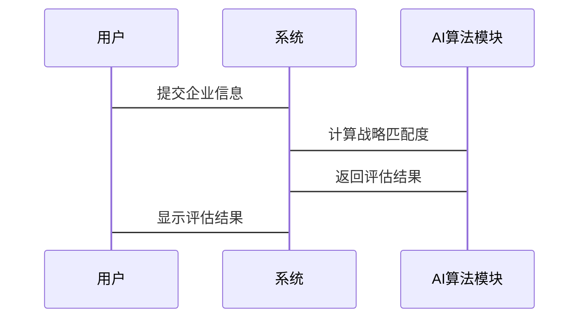

                 


# AI辅助企业并购目标筛选：战略匹配度评估与协同潜力分析

**关键词**：AI辅助企业并购，战略匹配度，协同潜力，企业并购目标筛选，人工智能技术，战略评估

**摘要**：  
随着企业并购活动的日益频繁，如何利用人工智能技术高效筛选目标企业、评估战略匹配度和协同潜力，已成为企业并购成功的关键。本文系统地介绍了AI在企业并购中的应用，详细分析了战略匹配度和协同潜力的核心概念、算法原理、系统架构设计及实际项目案例。通过本文，读者将深入了解如何利用AI技术优化企业并购决策过程，提升并购成功率。

---

# 第1章: 企业并购与AI技术的结合

## 1.1 企业并购的基本概念

### 1.1.1 企业并购的定义与类型  
企业并购是指企业之间通过合并、收购或重组等方式，整合资源、拓展市场或增强竞争力的过程。常见的企业并购类型包括横向并购、纵向并购和混合并购。  

### 1.1.2 企业并购的战略意义  
企业并购是企业实现快速扩张、优化资源配臵和提升竞争力的重要手段。通过并购，企业可以快速进入新市场、获取新技术或整合优秀团队。  

### 1.1.3 传统企业并购的挑战与局限性  
传统企业并购过程中存在信息不对称、评估不精准和决策风险高等问题，导致并购失败率较高。  

## 1.2 AI技术在企业并购中的应用价值  

### 1.2.1 AI技术对企业并购的赋能  
AI技术可以通过大数据分析、机器学习和自然语言处理等手段，帮助企业在并购目标筛选、估值和风险评估等方面实现智能化决策。  

### 1.2.2 数据驱动的并购决策优势  
AI技术能够从海量数据中提取有价值的信息，帮助企业在并购过程中做出更精准的决策。  

### 1.2.3 AI在并购目标筛选中的核心作用  
AI技术可以基于企业的财务数据、市场表现和管理团队等多维度信息，快速筛选出符合企业战略目标的并购对象。  

## 1.3 本书的核心目标与结构安排  

### 1.3.1 本书的核心目标  
本文旨在通过AI技术，系统地分析企业并购中的战略匹配度和协同潜力，为企业提供科学的并购目标筛选方法。  

### 1.3.2 本书的结构安排  
本文分为七章，涵盖企业并购背景、AI技术在并购中的应用、战略匹配度与协同潜力的核心概念、算法原理、系统架构设计、项目实战以及最佳实践等内容。  

### 1.3.3 本书的读者群体  
本文适合企业高管、投资经理、数据科学家以及对AI技术在企业并购中应用感兴趣的专业人士阅读。  

---

# 第2章: 战略匹配度与协同潜力的定义与分析

## 2.1 战略匹配度的定义与属性  

### 2.1.1 战略匹配度的定义  
战略匹配度是指并购双方在战略目标、核心业务和企业文化等方面的契合程度。  

### 2.1.2 战略匹配度的属性特征  
- **战略目标一致性**：并购双方的长期目标是否一致。  
- **核心业务互补性**：并购双方的业务是否能够互补。  
- **企业文化契合度**：并购双方的企业文化是否兼容。  

### 2.1.3 战略匹配度的评估维度  
- **财务指标**：如ROE、净利润率等。  
- **业务指标**：如市场份额、产品线互补性等。  
- **文化指标**：如企业价值观、管理风格等。  

## 2.2 协同潜力的定义与属性  

### 2.2.1 协同潜力的定义  
协同潜力是指并购后双方在资源整合、成本节约和价值创造方面的潜力。  

### 2.2.2 协同潜力的属性特征  
- **协同效应**：如成本协同、收入协同等。  
- **资源整合能力**：如技术共享、客户资源共享等。  
- **管理协同**：如管理经验共享、组织结构优化等。  

## 2.3 战略匹配度与协同潜力的关系  

### 2.3.1 战略匹配度是协同潜力的基础  
战略匹配度越高，双方的协同潜力越大。  

### 2.3.2 协同潜力是战略匹配度的体现  
协同潜力的实现需要双方在战略上高度匹配。  

### 2.3.3 两者的相互影响  
战略匹配度影响协同潜力的实现，而协同潜力又反过来推动战略匹配度的提升。  

---

# 第3章: 战略匹配度与协同潜力的核心概念模型

## 3.1 核心概念模型  



## 3.2 战略匹配度与协同潜力的属性对比  

| **属性**       | **战略匹配度**           | **协同潜力**           |
|-----------------|--------------------------|------------------------|
| **核心要素**    | 战略目标、核心业务、企业文化 | 协同效应、资源整合、管理协同 |
| **评估维度**    | 财务指标、业务指标、文化指标 | 协同效应、资源整合能力、管理协同 |
| **影响因素**    | 企业战略、业务模式、文化契合 | 资源整合、管理经验、协同效应 |

## 3.3 概念模型的ER图展示  

```mermaid
erDiagram
    公司A [id, name, strategic goals] {
    }  
    公司B [id, name, strategic goals] {
    }  
    战略匹配度 <--- 关联关系 --> 协同潜力
```

---

# 第4章: 战略匹配度与协同潜力的算法原理

## 4.1 协同过滤算法  

### 4.1.1 协同过滤的定义  
协同过滤是一种基于用户行为或物品属性的推荐算法，常用于个性化推荐系统。  

### 4.1.2 协同过滤的核心原理  
通过分析用户的历史行为数据，找到与目标用户行为相似的用户群体，推荐相似的物品。  

### 4.1.3 协同过滤的实现步骤  


## 4.2 聚类分析算法  

### 4.2.1 聚类分析的定义  
聚类分析是一种将数据点按照相似性自动分组的算法。  

### 4.2.2 聚类分析的核心原理  
通过计算数据点之间的相似性，将数据分成若干个簇，每个簇内的数据点具有较高的相似性。  

### 4.2.3 聚类分析的实现步骤  


## 4.3 神经网络模型  

### 4.3.1 神经网络的定义  
神经网络是一种模拟人脑神经网络结构的算法，常用于复杂模式识别。  

### 4.3.2 神经网络的核心原理  
通过多层神经元网络结构，学习输入数据的特征，实现对输出的预测或分类。  

### 4.3.3 神经网络的实现步骤  


---

# 第5章: 战略匹配度与协同潜力的系统架构设计

## 5.1 项目介绍  

### 5.1.1 项目目标  
构建一个基于AI的企业并购目标筛选系统，实现战略匹配度和协同潜力的自动化评估。  

### 5.1.2 项目范围  
涵盖企业并购目标筛选、战略匹配度评估、协同潜力分析等功能。  

## 5.2 系统功能设计  

### 5.2.1 领域模型设计  



### 5.2.2 系统功能模块  
- **数据输入模块**：录入企业信息和财务数据。  
- **评估计算模块**：计算战略匹配度和协同潜力。  
- **结果展示模块**：可视化评估结果。  

## 5.3 系统架构设计  

### 5.3.1 系统架构图  


### 5.3.2 模块交互设计  
- 前端界面接收用户输入，后端服务调用AI算法模块进行评估，数据库存储和管理数据。  

## 5.4 接口设计  

### 5.4.1 数据接口  
- **输入接口**：公司信息、财务数据等。  
- **输出接口**：战略匹配度和协同潜力评估结果。  

### 5.4.2 API设计  
- `/api/input`：接收企业信息。  
- `/api/output`：返回评估结果。  

## 5.5 交互设计  

### 5.5.1 用户与系统交互流程  



---

# 第6章: 项目实战——基于AI的企业并购目标筛选系统

## 6.1 环境安装  

### 6.1.1 安装Python  
```bash
pip install python
```

### 6.1.2 安装机器学习库  
```bash
pip install scikit-learn numpy pandas
```

## 6.2 系统核心实现  

### 6.2.1 数据预处理  

```python
import pandas as pd
data = pd.read_csv('company.csv')
```

### 6.2.2 战略匹配度计算  

```python
from sklearn.metrics.pairwise import cosine_similarity
similarity = cosine_similarity(data.embedding)
```

### 6.2.3 协同潜力分析  

```python
from sklearn.cluster import KMeans
clusters = KMeans(n_clusters=3).fit(data.embedding)
```

## 6.3 案例分析  

### 6.3.1 数据来源  
使用公开的企业数据集，包含企业的财务数据、业务信息和战略目标。  

### 6.3.2 实施步骤  
- 数据清洗与特征提取。  
- 战略匹配度计算。  
- 协同潜力分析。  

## 6.4 项目总结  

### 6.4.1 项目成果  
实现了基于AI的企业并购目标筛选系统，能够快速评估战略匹配度和协同潜力。  

### 6.4.2 项目经验  
数据质量对评估结果影响较大，建议在数据预处理阶段加强数据清洗。  

---

# 第7章: 最佳实践与总结

## 7.1 实际应用中的注意事项  

### 7.1.1 数据质量  
确保数据的完整性和准确性。  

### 7.1.2 算法选择  
根据具体场景选择合适的算法。  

### 7.1.3 业务理解  
结合企业实际需求进行定制化开发。  

## 7.2 经验分享  

### 7.2.1 数据驱动决策  
数据是AI技术的核心，数据质量直接影响评估结果。  

### 7.2.2 技术与业务结合  
AI技术的应用需要与企业实际业务结合，才能发挥最大价值。  

## 7.3 未来展望  

### 7.3.1 技术发展  
随着AI技术的不断进步，企业并购目标筛选将更加智能化和精准化。  

### 7.3.2 应用场景拓展  
AI技术在企业并购中的应用将拓展到更多领域，如风险管理、价值评估等。  

---

# 总结

本文系统地介绍了AI技术在企业并购目标筛选中的应用，详细分析了战略匹配度和协同潜力的核心概念、算法原理和系统架构设计。通过实际案例的分析和项目实战，读者可以掌握如何利用AI技术优化企业并购决策过程。未来，随着AI技术的不断发展，企业并购将更加智能化和数据驱动化。

---

**作者：AI天才研究院/AI Genius Institute & 禅与计算机程序设计艺术 /Zen And The Art of Computer Programming**

